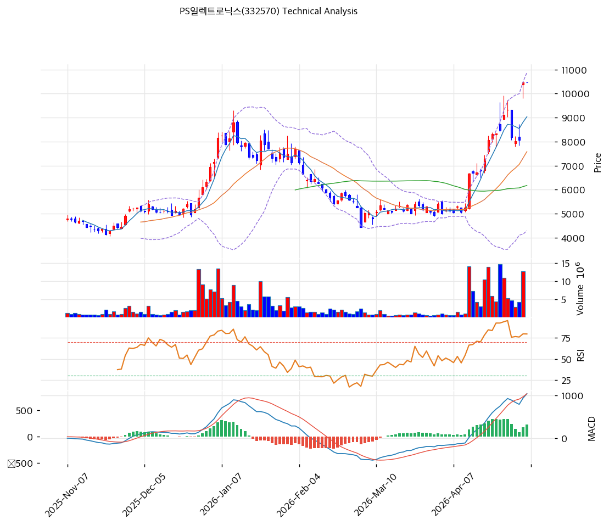

# PS일렉트로닉스(332570) 기술적 분석

2026-05-06 | T2 Technical Analysis

---

## 차트

---

## 1. 가격 현황

| 항목 | 값 |
|------|-----|
| 현재가 | 10,470원 (+0.00%) |
| 52주 고가 | 10,470원 |
| 52주 저가 | 2,650원 |
| 52주 범위 위치 | 100.0% |
| 거래량 | 20일 평균 대비 0.00x (※ 데이터 결손 가능성 — 당일 거래량 2주 미집계) |

> 1년 만에 저가 2,650원 → 현재 10,470원으로 +295% 상승, 52주 범위 정점에 위치한 신고가 돌파 단계. 거래량 0.00x는 일중 데이터 미수집으로 추정되며 신뢰성 낮음.

---

## 2. 차트 패턴 분석

### 2.1 캔들스틱 패턴

| 패턴 | 위치 | 신뢰도 | 해석 |
|------|------|--------|------|
| 적삼병(Three White Soldiers) | 2026-04 중순 (8,500→10,000원 구간) | 강 | 4월 강력한 매수 압력 — 폭등 추세 진입 시그널 |
| 장대양봉 + 신고가 갭상승 | 2026-04 말~05 초 (10,000원 돌파 시) | 강 | 박스권 상단 돌파, 매수 모멘텀 절정 |
| 유성형/긴 윗꼬리(Shooting Star 유사) | 직전 캔들 (11,000원 터치 후 10,470 마감) | 중 | 신고가 부근 매도 출회 — 단기 피로 신호 |
| 도지 직전 음봉 | 최근 1~2거래일 | 약 | 폭등 후 상승 정체, 단기 조정 가능성 |

※ 4월 폭등 구간의 적삼병/장대양봉은 추세의 강도를 입증하나, 직전 캔들의 윗꼬리는 신고가 돌파 직후 차익실현 출현을 시사함. 신고가 + 윗꼬리 + 과매수 조합은 단기 고점 형성 패턴의 전형.

### 2.2 가격 구조 패턴

- **상승 박스권 돌파 (Breakout)** (신뢰도: 강)
  2025-11~12 4,500~5,500원 박스권 → 2026-01 초 1차 폭등(8,800원) → 2026-01~03 4,800~6,500원 재박스권 → 2026-04 강한 V자 반등으로 직전 고점 8,810원 돌파 후 신고가 10,470원 형성. 단계적 상승 구조이나 마지막 상승 각도가 가팔라(폭등) 추세 피로 누적.

- **이중천정 후 재돌파(Double-Top Failure → Bullish Continuation)** (신뢰도: 중)
  2026-01 8,800원 1차 천정 → 02~03 5,000원 하락 후 V자 반등으로 천정 돌파. 일반적 이중천정 실패 후 강세 지속이나, 직전 천정 대비 +18% 신고가는 매물대 부담을 동반.

- **확장 쐐기형/Parabolic Move** (신뢰도: 중)
  2026-04 들어 가격 상승 각도가 가속화되며 BB 상단(10,875) 근접. 변동성 확장 단계로, 포물선 추세는 단기 청산 위험을 내포함. MA200 대비 +89% 괴리는 통상 단기 고점 영역.

### 2.3 다이버전스

- **RSI 하락 다이버전스 가능성** (신뢰도: 중)
  4월 초 V자 반등 시점 RSI는 이미 70대에 도달했고 신고가 10,470원 형성 시 RSI 76.1로 큰 추가 상승 없이 횡보. 가격은 신고가, RSI는 정점 대비 둔화 → 약한 하락 다이버전스 신호. 다만 RSI가 여전히 75 위에서 방향성 유지 중이라 즉시 반전을 단정하긴 어려움.

- **거래량 다이버전스** (신뢰도: 중)
  4월 폭등 초반(8,500→10,000) 거래량은 막대(monthly peak)였으나 직전 신고가 캔들에서 거래량 감소 추정. 가격↑ + 거래량↓ 조합은 마지막 매수세의 약화를 시사 (전형적인 분배 신호).

- **MACD 다이버전스 부재** (신뢰도: —)
  MACD(1044/815)가 빠르게 우상향 확장 중이며 시그널선과의 갭도 확대되고 있어, 모멘텀 측면에서는 다이버전스 미관찰. 추세 강도는 여전히 유효.

※ RSI·거래량 다이버전스는 약하게나마 상승 피로를 시사하지만 MACD가 강세를 유지해, 시그널 강도는 제한적.

### 2.4 패턴 종합 판단

직전 박스권을 강하게 돌파하며 적삼병·장대양봉 등 강세 캔들 패턴이 누적된 강한 상승 추세이나, **신고가 형성 직후 윗꼬리 출현 + 거래량 감소 + RSI 정체**가 동시에 관찰되어 단기 고점 신호가 켜져 있음. MACD는 강세 모멘텀을 유지해 즉각적인 추세 전환보다는 **단기 조정(고점 횡보 또는 5~10% 되돌림) 후 재시도** 가능성이 높음. 신고가 돌파 직후의 Parabolic 구간이라 변동성 확대에 유의해야 함.

---

## 3. 이동평균선 — 정배열 (강세 / 단기 극단적 과열)

| MA | 값 | 현재가 괴리율 | 위치 |
|----|-----|--------------|------|
| MA5 | 9,040원 | +15.8% | 위 |
| MA20 | 7,586원 | +38.0% | 위 |
| MA60 | 6,178원 | +69.5% | 위 |
| MA120 | 6,084원 | +72.1% | 위 |
| MA200 | 5,539원 | +89.0% | 위 |

**해석**: MA5<MA20<MA60<MA120<MA200 완전 정배열로 추세는 강력한 강세. 다만 모든 이평선이 현재가 대비 큰 폭으로 이격(MA20 +38%, MA200 +89%)되어 **극단적 과열 구간**. 통상 MA200 괴리 +50% 이상이면 평균회귀 압력이 누적되며, +89%는 단기 조정 위험이 매우 높은 수준. 지지선으로 의미 있는 첫 번째 MA는 MA20(7,586원)이며, 이탈 시 MA60(6,178원)까지 빠른 되돌림 가능.

---

## 4. 보조 지표

### RSI(14) — 76.1 (🔴 과매수)

70선을 상향 돌파해 과매수 영역에 진입한 상태로 강한 모멘텀이 입증되나, 70 이상 구간에서 횡보가 길어지면 단기 조정 또는 평균회귀 위험이 누적됨. 다이버전스 해석은 2.3 참조.

### MACD(12,26,9)

| 항목 | 값 |
|------|-----|
| MACD | 1044 |
| Signal | 815 |
| Histogram | +229 |
| 크로스 상태 | 매수 구간 (확대 중) |

**해석**: MACD가 시그널선을 큰 폭으로 상회하며 히스토그램이 양(+) 영역에서 확장 중 → 모멘텀이 가장 강한 단계. 다만 절대값이 1,000을 상회해 추가 확장 여력은 제한적이며, 히스토그램 축소 전환 시 단기 추세 약화 신호.

### 볼린저밴드(20, 2σ)

| 항목 | 값 |
|------|-----|
| 상단 | 10,875원 |
| 중단 (MA20) | 7,586원 |
| 하단 | 4,298원 |
| 밴드 폭 | 86.7% |
| 현재 위치 | 상단 근접 (시스템 분류: 중간) |

**해석**: 밴드 폭 86.7%는 극도의 변동성 확장(Expansion) 국면 — 평상시(20~30%) 대비 3배 이상. 현재가 10,470원은 BB 상단 10,875원에 근접해 단기 저항 부담 큼. 밴드 폭 정점 통과 시 변동성 수축으로 전환되며 통상 평균회귀(MA20 7,586 방향)가 발생함.

### 스토캐스틱(14, 3, 3)

| 항목 | 값 |
|------|-----|
| Slow %K | 87.0 |
| Slow %D | 74.3 |
| 크로스 상태 | 골든크로스 |
| 판단 | 과매수 |

K=87, D=74로 모두 80 부근의 과매수 영역. 골든크로스는 유효하나 K-D 갭이 13pt로 벌어져 있어 데드크로스 전환 시 단기 매도 신호로 작동할 가능성 높음.

---

## 5. 지지/저항 — 추세선 · 피보나치 · PRZ 통합

### 5.1 피보나치 되돌림/확장

| 구분 | 비율 | 가격 | 현재가 대비 |
|------|------|------|-----------|
| Swing High | — | 8,810원 | -15.9% |
| 되돌림 | 0.236 | 5,846원 | -44.2% |
| 되돌림 | 0.382 | 6,412원 | -38.8% |
| 되돌림 | 0.5 | 6,870원 | -34.4% |
| 되돌림 | 0.618 | 7,328원 | -30.0% |
| 되돌림 | 0.786 | 7,980원 | -23.8% |
| Swing Low | — | 4,930원 | -52.9% |
| 확장 | 1.272 | 3,875원 | -63.0% |
| 확장 | 1.382 | 3,448원 | -67.1% |
| 확장 | 1.618 | 2,532원 | -75.8% |
| 확장 | 2.0 | 1,050원 | -90.0% |

※ 피보나치 기준: 하락 추세 (Swing High 8,810원 → Swing Low 4,930원)
※ 현재가 10,470원은 직전 Swing High(8,810원)을 이미 +18.8% 돌파한 상태로, 표준 피보나치 되돌림은 향후 조정 시 첫 지지선 매핑에 활용. 되돌림 0.5(6,870원)는 MA60(6,178원)과 근접해 강한 지지대.

### 5.2 추세선

| 추세선 | 방향 | 현재 교차가 | 포인트 수 | 해석 |
|--------|------|-----------|---------|------|
| 지지선 | 상승 | 5,197원 | 6개 | 6개 저점이 우상향 연결, 강한 장기 지지선 — 이탈 전까지 추세 유효 |
| 저항선 | 상승 | 10,309원 | 5개 | 우상향 저항선이지만 현재가가 +1.6% 돌파한 상태, 돌파 유효 시 지지선으로 역할 전환 |

### 5.3 PRZ (Potential Reversal Zone)

| 방향 | 가격 범위 | 신뢰도 | 근거 |
|------|---------|--------|------|
| 지지 | 10,309~10,470원 | 강 | 추세선 저항(돌파 후 지지화) + 피봇 R1/R2/S1/S2 다중 겹침 |

※ 현재가가 PRZ 상단에 위치해 있어, 종가 기준 10,309원 이탈 시 단기 매도 시그널로 작동. PRZ 유지 시 단기 박스권 형성 가능.

### 5.4 종합 지지/저항 테이블

| 구분 | 가격 | 근거 |
|------|------|------|
| 저항 | 10,875원 | 볼린저밴드 상단 (단기 1차 저항) |
| 저항 | 10,470원 | 52주 고가 = 피봇 R1 (현재가와 동일, 즉각적 매물 출회 구간) |
| **현재가** | **10,470원** | — |
| 지지 | 10,309~10,438원 | PRZ (강) — 돌파 추세선 + 피봇 다중 |
| 지지 | 9,040원 | MA5 (단기 이평) |
| 지지 | 7,980원 | 피보나치 0.786 되돌림 |
| 지지 | 7,586원 | MA20 = BB 중단 (1차 핵심 지지) |
| 지지 | 7,328원 | 피보나치 0.618 되돌림 |
| 지지 | 6,178원 | MA60 (2차 핵심 지지) |
| 지지 | 5,197원 | 상승 추세선 지지 (장기) |

---

## 6. 시그널 종합

| 지표 | 내용 | 시그널 |
|------|------|--------|
| **차트 패턴** | 박스권 돌파 + 적삼병 강세, 그러나 신고가 윗꼬리 + 거래량 감소 + 약한 RSI 다이버전스 | ⚪ |
| 이동평균선 | 완전 정배열 (강세), MA200 괴리 +89% 극단 과열 | 🟢/🔴 (추세/과열) |
| RSI | 76.1 — 과매수 🔴 | 🔴 |
| MACD | 매수 구간, 히스토그램 +229 확장 중 | 🟢 |
| 볼린저밴드 | 밴드 폭 86.7% 극단 확장, 상단 10,875원 근접 | ⚪ |
| 스토캐스틱 | 골든크로스 유지, K=87 과매수 | 🔴 |
| 거래량 | 0.0x (※ 일중 데이터 결손 가능성, 신뢰도 낮음) | ⚪ |

**종합 판단**: 🟢 매수 2개 / 🔴 매도 3개 / ⚪ 중립 2개 → **매도우위**

> 정배열·MACD 확장은 추세의 강도를 입증하지만, RSI 76 과매수 + 스토캐스틱 K 87 + MA200 괴리 +89% + BB 폭 86.7% 등 **단기 과열 지표가 동시에 집중**되어 있다. 차트상 신고가 윗꼬리·거래량 감소 패턴까지 결합되어, 추세 자체는 살아 있으나 단기 5~15% 조정 위험이 높은 구간. 중기 추세 추종자라면 MA20(7,586원) 이탈 전까지 보유 가능하나, 단기 트레이더는 신고가 부근에서 분할 차익실현이 합리적.

---

## 7. 전략 제안

### 보유 중인 경우
- **비중축소** (현재 신고가 + 과열 지표 다중 점등)
- 익절 라인: **10,679원** (피봇 +2% / BB 상단 10,875원 직전 — 단기 1차 목표)
- 손절 라인: **10,470원** (PRZ 하단 10,309원 종가 이탈 시 즉시 손절 — 신고가 돌파 무효화)
- 리스크/리워드: TP +2.0% vs SL 0% (현재가에서) → **R/R 비율 매우 불리**, 따라서 신규 매수보다는 **분할 익절 우선** 전략 권고
- 손절 폭 확대 시: MA5(9,040원) 이탈 → 단기 추세 손상, MA20(7,586원) 이탈 → 중기 추세 손상

### 진입 대기인 경우
- **관망** (현재 가격대 신규 매수 비추천)
- 1차 진입가: **10,470원 부근 (현재가)** — PRZ 유지 + 거래량 동반 BB 상단 10,875원 돌파 확인 시 추세 추종 매수 가능, 다만 추격 매수 위험 높음
- 2차 진입가: **7,586원 (MA20)** — 단기 조정 시 핵심 지지대 도달 후 RSI 50 이하 정상화 + 양봉 반등 확인 시 매수 (안전한 평균회귀 진입점)
- 3차 진입가(보수): **6,178원 (MA60)** — 깊은 조정 발생 시 2차 매수, 피보나치 0.618(7,328) 및 0.5(6,870) 매물대 통과 후 안착 확인 필수
- 진입 조건 공통: 거래량 회복(20일 평균 대비 1.0x 이상), RSI 70 이하 정상화, 일봉 양봉 마감 — 3대 조건 동시 충족 시 진입

> ※ 단기 매수 신호 부재. 현재 차트는 **추세는 살아있으나 단기 과열 정점** 구간. 신규 매수자는 조정 후 진입이 위험 대비 수익 측면에서 우월.
