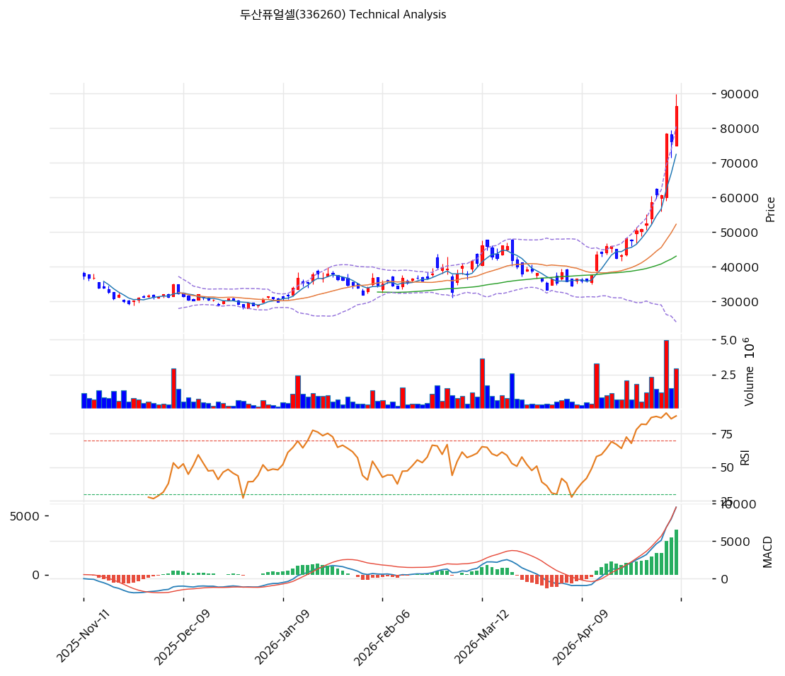

# 두산퓨얼셀(336260) 기술적 분석

2026-05-08 | T2 Technical Analysis

---

## 차트

---

## 1. 가격 현황

| 항목 | 값 |
|------|-----|
| 현재가 | 86,300원 (+13.25%) |
| 52주 고가 | 86,300원 (pykrx 기준) / 89,900원 (KIS 기준) |
| 52주 저가 | 14,940원 |
| 52주 범위 위치 | 100.0% (신고가 근접 — 1년간 +478% 급등) |
| 거래량 | 20일 평균 대비 2.15x |

---

## 2. 차트 패턴 분석

### 2.1 캔들스틱 패턴

| 패턴 | 위치 | 신뢰도 | 해석 |
|------|------|--------|------|
| 장대양봉 (신고가 갭상승) | 최근 1일 (2026-05-08) | 강 | +13.25% 상승하며 52주 신고가 근접 — 강한 매수세 분출, 단기 추격 매수 시그널이지만 과열 동반 |
| 적삼병 유사 패턴 | 최근 3~5일 | 중 | 4월 말~5월 초 양봉 연속 출현, 거래량 동반 상승 — 추세 가속 신호 |
| 유성형 가능성 (긴 윗꼬리) | 직전 1~2일 (89,900원 터치 후 되밀림) | 중 | 89,900원 부근 매물 저항으로 윗꼬리 발생 — 단기 고점 경고, 다음 캔들의 종가가 키 |
| 대량거래 양봉 | 최근 5일 평균 거래량 급증 | 강 | 20일 평균 대비 2.15배 거래량 — 신규 자금 대규모 유입의 증거 |

### 2.2 가격 구조 패턴

- **장기 박스권 이탈 후 추세 가속** (신뢰도: 강)
  2025-11 ~ 2026-04 초까지 30,000~45,000원 박스권에서 횡보하다가 4월 중순 저항선 50,000원대를 거래량 동반 돌파. 이후 단 3주 만에 86,300원까지 +70% 추가 상승하며 박스권 폭(15,000원)의 2배 이상 목표가 달성. 박스 이탈 후 강한 모멘텀 구간 진입.

- **상승 추세 가속 (Parabolic Move)** (신뢰도: 강)
  4월 중순 이후 일봉이 상단 볼린저밴드를 타고 올라가는 "밴드 워킹" 진행 중. MA5(72,440원)와 현재가(86,300원)의 괴리율이 +19.1%로 단기 과열 영역. MA200(34,349원) 대비 +151% 괴리는 통계적으로 극단치이며 평균회귀 압력 누적 단계.

- **컵앤핸들 가능성** (신뢰도: 중)
  2025-11~2026-02 컵 형성(저점 30,000원대), 2026-03~04 초 핸들 형성(40,000원대 박스 정체) 후 5월 핸들 돌파 → 측정 목표가는 약 80,000~90,000원대 (이미 도달). 추가 상승 시에는 피보나치 1.272 확장(110,406원)이 다음 측정 목표.

### 2.3 다이버전스

- **RSI 과매수 영역 진입 (Bearish 다이버전스 잠재)** (신뢰도: 중)
  RSI 85.5로 표준 과매수 임계치(70)를 큰 폭 상회. 차트상 RSI는 4월 중순 ~ 5월 8일까지 가격과 함께 75 → 85선까지 상승 추세 → 아직 명확한 하락 다이버전스(가격↑ RSI↓)는 미형성, 단지 극단 과매수 상태. 다만 다음 신고가에서 RSI가 86 미만으로 둔화될 경우 즉각 약세 다이버전스로 전환될 가능성 높음.

- **MACD 히스토그램 확대 (다이버전스 미형성)** (신뢰도: 중)
  MACD 9,532 / Signal 5,731 / Histogram +3,802으로 히스토그램이 계속 확대 중. 가격 신고가와 MACD 신고가가 동조 → 현 시점 다이버전스 부재. 추세는 여전히 강세이나 히스토그램 정점 이후 축소 시 첫 매도 시그널.

### 2.4 패턴 종합 판단

장기 박스권 이탈 + 컵앤핸들 패턴 완성 + 거래량 폭증 동반 신고가 갱신으로 추세 강도는 매우 강함(상승 가속 단계). 그러나 직전 1~2일 긴 윗꼬리 출현 + RSI 85.5 + MA200 대비 +151% 괴리는 통계적 극단 과열을 가리키며 단기 조정 임박 시그널. **결론: 중기 추세는 상방 유지(컵앤핸들 목표가 달성 후 1.272 확장 110,000원대 가능)이지만 단기 1~2주는 조정 위험이 보상보다 큰 구간**. 모멘텀 추격은 자제, 눌림목(MA5 ~ MA20 사이 60,000원대) 대기가 합리적.

---

## 3. 이동평균선 — 정배열 (강세, 단 극단 과열)

| MA | 값 | 현재가 괴리율 | 위치 |
|----|-----|--------------|------|
| MA5 | 72,440원 | +19.1% | 위 |
| MA20 | 52,290원 | +65.0% | 위 |
| MA60 | 43,093원 | +100.3% | 위 |
| MA120 | 37,919원 | +127.6% | 위 |
| MA200 | 34,349원 | +151.2% | 위 |

**해석**: 5선 모두 정배열(MA5 > MA20 > MA60 > MA120 > MA200)로 추세 강세 명확. 하지만 MA5 대비 +19%, MA20 대비 +65%, MA200 대비 +151%는 모든 시간 프레임에서 통계적 과열 영역. 일반적으로 MA20 괴리율 +20% 이상이면 단기 조정 빈도가 급증하는데 +65%는 극단 과열 그 자체. MA20(52,290원)이 1차 평균회귀 타깃이며 단기 강한 지지 후보.

---

## 4. 보조 지표

### RSI(14) — 85.5 (🔴 과매수)

70선을 큰 폭 상회한 85.5로 통계적 과매수 극단. 4월 중순 RSI 50선 → 현재 85.5로 단기간 30포인트 이상 급등 → 추세 강도는 매우 강하지만 단기 평균회귀 압력 누적. 80 이상 구간은 추세 지속 가능하나 첫 70 이탈 시 매도 전환 신호.

### MACD(12,26,9)

| 항목 | 값 |
|------|-----|
| MACD | 9,532 |
| Signal | 5,731 |
| Histogram | +3,802 |
| 크로스 상태 | 매수 구간 (확대 중) |

**해석**: 4월 초 골든크로스 후 히스토그램 지속 확대 중으로 추세 강세 유효. MACD 라인이 0선 위에서 가파른 기울기로 상승 → 모멘텀 정점이 임박했음을 시사. 히스토그램 축소 전환이 첫 모멘텀 둔화 신호.

### 볼린저밴드(20, 2σ)

| 항목 | 값 |
|------|-----|
| 상단 | 80,465원 |
| 중단 (MA20) | 52,290원 |
| 하단 | 24,115원 |
| 밴드 폭 | 107.8% |
| 현재 위치 | 상단 돌파 (밴드 워킹) |

**해석**: 현재가 86,300원이 상단 80,465원을 돌파하여 밴드 위에서 거래 중 — 통계적으로 5% 미만 확률의 극단 영역. 밴드 폭 107.8%는 변동성이 폭발적으로 확대된 상태로, 4월 초 박스권(밴드 폭 30%대) 대비 3배 이상 확대. 밴드 워킹은 추세 가속을 의미하나 첫 상단 이탈 후 종가가 밴드 안으로 복귀 시 단기 천장 시그널.

### 스토캐스틱(14, 3, 3)

| 항목 | 값 |
|------|-----|
| Slow %K | 94.5 |
| Slow %D | 94.4 |
| 크로스 상태 | 골든크로스 (K > D, 둘 다 95 근접) |
| 판단 | 과매수 극단 (80 상회 장기 체류) |

---

## 5. 지지/저항 — 추세선 · 피보나치 · PRZ 통합

### 5.1 피보나치 되돌림/확장

| 구분 | 비율 | 가격 | 현재가 대비 |
|------|------|------|-----------|
| Swing High | — | 89,900원 | +4.2% |
| 되돌림 | 0.236 | 72,108원 | -16.4% |
| 되돌림 | 0.382 | 61,101원 | -29.2% |
| 되돌림 | 0.5 | 52,205원 | -39.5% |
| 되돌림 | 0.618 | 43,309원 | -49.8% |
| 되돌림 | 0.786 | 30,643원 | -64.5% |
| Swing Low | — | 14,510원 | -83.2% |
| 확장 | 1.272 | 110,406원 | +28.0% |
| 확장 | 1.382 | 118,699원 | +37.5% |
| 확장 | 1.618 | 136,491원 | +58.2% |
| 확장 | 2.0 | 165,290원 | +91.5% |

※ 피보나치 기준: 상승 추세 (Swing Low 14,510원 → Swing High 89,900원)
※ 1년 +478% 폭등 구간이 베이스 → 0.236 되돌림(72,108원)이 1차 단기 지지, 0.382(61,101원)~0.5(52,205원)는 본격 조정 시 타깃

### 5.2 추세선

| 추세선 | 방향 | 현재 교차가 | 포인트 수 | 해석 |
|--------|------|-----------|---------|------|
| 지지선 | 상승 | 33,635원 | 6개 | 1년 상승 추세선 — 매우 멀어 무의미한 거리 (현재가 -61% 아래) |
| 저항선 | 상승 | 50,581원 | 6개 | 채널 상단 — 이미 큰 폭 이탈 (오버슛 상태) |

추세선이 모두 하단으로 멀어졌으며 현재가는 채널 위로 큰 폭 이탈 상태 → 역사적 평균회귀 시 채널 내부(45,000~55,000원) 복귀 가능성이 잠재.

### 5.3 PRZ (Potential Reversal Zone)

| 방향 | 가격 범위 | 신뢰도 | 근거 |
|------|---------|--------|------|
| 지지 | 72,108~72,440원 | 약 | 피보나치 0.236 되돌림 + MA5 |
| 저항 | 89,900~92,500원 | 강 | 52주 고가 + 피봇 R1 + 심리적 9만원 라운드 |
| 저항 | 110,000~118,700원 | 중 | 피보나치 1.272 + 1.382 확장 (다음 측정 목표) |

※ 단기 PRZ는 약하고, 가까운 강한 저항대는 89,900~92,500원 — 이 구간 돌파 여부가 추세 가속 vs 단기 천장 분기점.

### 5.4 종합 지지/저항 테이블

| 구분 | 가격 | 근거 |
|------|------|------|
| 저항 | 110,406원 | 피보나치 1.272 확장 (중기 측정 목표) |
| 저항 | 92,500원 | 피봇 R1 (1차 강한 저항) |
| 저항 | 89,900원 | 52주 고가 (KIS) — 직전 윗꼬리 매물대 |
| **현재가** | **86,300원** | — |
| 지지 | 77,500원 | 피봇 S1 (1차 단기 지지) |
| 지지 | 72,108~72,440원 | 피보나치 0.236 + MA5 (PRZ 약, 1차 눌림목) |
| 지지 | 68,700원 | 피봇 S2 (강한 매물대) |
| 지지 | 61,101원 | 피보나치 0.382 (중기 조정 타깃) |
| 지지 | 52,290원 | MA20 + 피보나치 0.5 (강한 평균회귀 타깃) |
| 지지 | 43,093원 | MA60 + 피보나치 0.618 (장기 추세 베이스) |

---

## 6. 시그널 종합

| 지표 | 내용 | 시그널 |
|------|------|--------|
| **차트 패턴** | 박스권 이탈 + 컵앤핸들 + 밴드 워킹, 단 윗꼬리 + 극단 과열 | ⚪ |
| 이동평균선 | 정배열 강세 BUT MA200 +151% 극단 괴리 | ⚪ (추세 🟢 / 과열 🔴) |
| RSI | 85.5 — 과매수 극단 | 🔴 |
| MACD | 매수 구간, 히스토그램 확대 | 🟢 |
| 볼린저밴드 | 상단 돌파 (밴드 워킹), 폭 107.8% | ⚪ |
| 스토캐스틱 | 골든크로스, K=94.5 (과매수 극단) | 🔴 |
| 거래량 | 2.15x — 강력 동반 | 🟢 |

**종합 판단**: 🟢 매수 2개 / 🔴 매도 2개 / ⚪ 중립 3개 → **중립 (모멘텀 강세 vs 단기 과열의 양극단 충돌)**

추세 모멘텀(MACD·거래량)은 매수 신호를 강하게 발신하지만, 가격 위치(MA200 +151%, RSI 85.5, 볼린저 상단 돌파)는 통계적 극단 과열 경고. 중기 5~10주 시계는 컵앤핸들 측정 목표 110,000원대 여지가 있어 강세이나, 단기 1~2주 시계에서는 평균회귀(MA5 → 72,000원, MA20 → 52,000원) 위험이 보상보다 우위. 신규 추격 매수보다 눌림목 대기가 합리적이며, 보유자는 일부 차익실현이 정석.

---

## 7. 전략 제안

### 보유 중인 경우
- **비중축소 (1/3 ~ 1/2 차익실현 권고)**
- 익절 라인: 89,900원 (1차, 52주 고가/직전 윗꼬리 매물대), 92,500원 (2차, 피봇 R1), 110,400원 (3차, 피보나치 1.272 확장 — 추세 지속 시)
- 손절 라인: 68,700원 (피봇 S2 이탈 시 — 단기 추세 훼손), 손절 멘탈은 77,500원 (피봇 S1) 첫 이탈 시 경계
- 리스크/리워드: 현 88,026원 TP / 68,700원 SL 기준 → 1.7원 손실당 1원 익절 (손익비 0.59 — 불리), 추가 매수 비추천

### 진입 대기인 경우
- **관망 권고 (현 가격 추격은 비효율)**
- 1차 진입가: 72,000~72,500원 (PRZ 약 — 피보나치 0.236 + MA5, 1차 눌림목, 분할 진입 30%)
- 2차 진입가: 61,000~62,000원 (피보나치 0.382 + 피봇 S2 부근, 정통 조정 타깃, 분할 진입 50%)
- 3차 진입가: 52,290원 (MA20 + 피보나치 0.5, 강한 평균회귀 타깃, 분할 진입 20%)
- 진입 조건: (1) 일봉 종가 기준 MA5 이탈 + 후속 양봉 출현, (2) RSI 70 하향 후 50대 안착, (3) 거래량 평균 회귀 후 재상승, (4) 89,900원 매물대 재돌파 시에만 신고가 추격 허용
