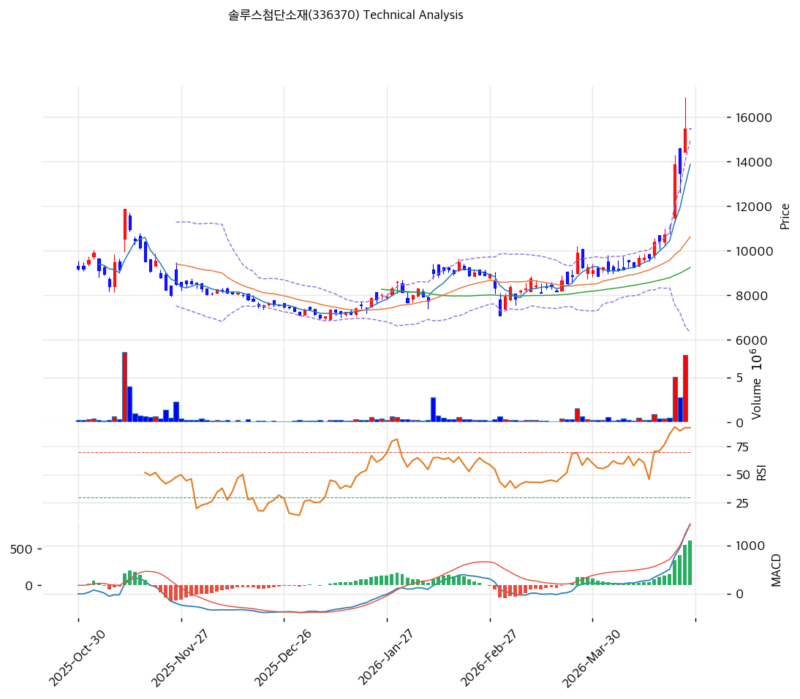

# 솔루스첨단소재(336370) 기술적 분석

2026-04-24 | T2 Technical Analysis

---

## 차트

---

## 1. 가격 현황

| 항목 | 값 |
|------|-----|
| 현재가 | 15,500원 (+0.00%) |
| 52주 고가 | 15,500원 |
| 52주 저가 | 6,980원 |
| 52주 범위 위치 | 100.0% |
| 거래량 | 20일 평균 대비 0.0x (데이터 미집계) |

---

## 2. 차트 패턴 분석

### 2.1 캔들스틱 패턴

| 패턴 | 위치 | 신뢰도 | 해석 |
|------|------|--------|------|
| 장대양봉 연속 (적삼병 유사) | 최근 2~3일 (2026-04 초~현재) | 강 | 강한 매수세 유입으로 단기 상승 추세 지속을 시사하나, 상단 저항 부재 구간에서의 과열 신호 |
| 위꼬리 장대양봉 | 최근 최고가 부근 | 중 | 장중 16,000원 이상 터치 후 15,500원 마감. 상단 매도 압력 존재를 나타내는 경계 신호 |
| 도지/소음봉 패턴 | 2025년 10~12월 중 | 중 | 6,980~8,000원 구간에서 바닥 다지기 과정. 매수·매도 균형 후 반등 시작 |

※ 주요 캔들 패턴: 2026년 4월 급등 구간에서 연속 양봉 후 위꼬리 발생이 핵심 관찰 포인트

### 2.2 가격 구조 패턴

- **V자형 바닥 반등 후 수직 상승** (신뢰도: 강)
  2025년 12월 저점(6,980원) 이후 완만한 U자 회복을 거쳐 2026년 4월 초부터 수직 급등이 나타났다. 차트상 2025-Dec~2026-Mar 구간은 베이스 형성(8,000~10,000원 박스권)이며, 이후 상방 돌파 시 거래량이 급증하며 모멘텀 장세로 전환된 패턴이다. 목표가는 피보나치 1.272 확장인 19,625원이나, 수직 상승 이후 단기 조정 가능성도 높다.

- **박스권 저항 돌파 후 모멘텀 장세** (신뢰도: 중)
  2026년 1~3월 9,000~10,500원 박스권에서 등락을 반복하다 4월 초 뉴스(AI 동박 메인벤더, 신규 배터리 셀 모멘텀) 촉발로 상방 돌파. 박스권 상단(10,500원)이 강한 지지선으로 전환될 가능성이 있다.

- **상승 쐐기형(Rising Wedge) 가능성** (신뢰도: 약)
  최근 2주간 고점과 저점이 모두 상승하는 쐐기형 패턴이 형성 중이다. 상승 쐐기는 종종 상승 추세 내 단기 과열 후 조정의 전조로 해석되므로 주의가 필요하다.

### 2.3 다이버전스

- **RSI 하락 다이버전스** (신뢰도: 중)
  주가는 최고가(15,500원) 근접이나 RSI는 84.9로 과매수 구간. 차트상 RSI가 최근 수직 상승 후 정점 부근에서 완만해지는 양상이 관찰된다. 가격이 추가 상승하더라도 RSI 모멘텀이 따라가지 못하는 하락 다이버전스 발생 시 단기 고점 신호가 된다.

- **MACD 히스토그램 확대 — 상승 모멘텀 지속** (신뢰도: 강)
  MACD 1,448 / Signal 836 / Histogram +612로 히스토그램이 빠르게 확대 중이다. 차트에서도 MACD 히스토그램이 2026년 4월 이후 가파르게 상승하며 추세 강도가 강함을 확인할 수 있다. 단기 모멘텀은 여전히 강한 상승 방향.

### 2.4 패턴 종합 판단

캔들스틱 측면에서는 연속 양봉과 위꼬리 발생이 혼재하며 단기 과열을 시사한다. 가격 구조적으로는 박스권 돌파 후 모멘텀 장세가 유효하지만, 52주 신고가 구간에서 저항선 부재로 추가 상승 여지와 급격한 차익실현 위험이 공존한다. MACD 히스토그램 확대로 단기 추세 강도는 강하나, RSI 84.9의 극단적 과매수와 스토캐스틱 데드크로스가 충돌하는 상충 시그널 상태다. **단기(1~2주): 과열 조정 가능성 높음 / 중기(1~3개월): 상승 추세 유효, 조정 시 재진입 기회**

---

## 3. 이동평균선 — 정배열 (강세)

| MA | 값 | 현재가 괴리율 | 위치 |
|----|-----|--------------|------|
| MA5 | 13,878원 | +11.7% | 위 |
| MA20 | 10,629원 | +45.8% | 위 |
| MA60 | 9,244원 | +67.7% | 위 |
| MA120 | 8,756원 | +77.0% | 위 |
| MA200 | 8,600원 | +80.2% | 위 |

**해석**: 5·20·60·120·200일 이동평균선이 완전 정배열 상태로, 강력한 중장기 상승 추세를 확인한다. 다만 현재가가 MA20 대비 +45.8%, MA200 대비 +80.2%로 과도하게 이격되어 있어 평균 회귀 압력이 매우 높다. MA5(13,878원)는 단기 조정 시 1차 지지선, MA20(10,629원)은 중기 핵심 지지선으로 기능한다. 차트에서도 2025년 12월 이후 MA20(청색선)이 가파르게 상승하며 주가를 하방 지지하는 모습이 확인된다.

---

## 4. 보조 지표

### RSI(14) — 84.9 (🔴 과매수)

RSI 84.9는 극단적 과매수 구간(기준: 70 이상)으로, 2025년 10월 이후 RSI가 저점(25 수준)에서 급등하여 현재 정점에 도달한 상태다. 단기 조정 없이 추가 상승 시 다이버전스 발생 가능성이 높으며, 통상 RSI 70 이하 복귀 시까지 신규 매수는 위험 구간이다.

### MACD(12,26,9)

| 항목 | 값 |
|------|-----|
| MACD | 1,448 |
| Signal | 836 |
| Histogram | +612 |
| 크로스 상태 | 매수 구간 (확대 중) |

**해석**: MACD가 Signal 위에서 매수 구간을 유지하며 히스토그램이 빠르게 확대 중이다. 단기 상승 모멘텀은 유효하나, 히스토그램 확대 속도가 둔화되거나 수축 전환 시 조정 신호로 해석해야 한다.

### 볼린저밴드(20, 2σ)

| 항목 | 값 |
|------|-----|
| 상단 | 14,945원 |
| 중단 (MA20) | 10,629원 |
| 하단 | 6,313원 |
| 밴드 폭 | 81.2% |
| 현재 위치 | 상단 초과 (밴드 이탈) |

**해석**: 현재가 15,500원이 볼린저밴드 상단(14,945원)을 돌파한 '밴드 이탈' 상태다. 밴드 폭이 81.2%로 이미 매우 넓게 확장된 상태에서 추가 확장이 이루어지고 있다. 밴드 이탈 후 중단(MA20, 10,629원)으로의 복귀 시도가 나타날 수 있으며, 이 경우 최대 -31% 조정 가능성이 있다.

### 스토캐스틱(14, 3, 3)

| 항목 | 값 |
|------|-----|
| Slow %K | 81.4 |
| Slow %D | 84.8 |
| 크로스 상태 | 데드크로스 |
| 판단 | 과매수 |

---

## 5. 지지/저항 — 추세선 · 피보나치 · PRZ 통합

### 5.1 피보나치 되돌림/확장

| 구분 | 비율 | 가격 | 현재가 대비 |
|------|------|------|-----------|
| Swing High | — | 16,900원 | — |
| 되돌림 | 0.236 | 14,535원 | -6.2% |
| 되돌림 | 0.382 | 13,072원 | -15.7% |
| 되돌림 | 0.500 | 11,890원 | -23.3% |
| 되돌림 | 0.618 | 10,708원 | -30.9% |
| 되돌림 | 0.786 | 9,024원 | -41.8% |
| Swing Low | — | 6,880원 | — |
| 확장 | 1.272 | 19,625원 | +26.6% |
| 확장 | 1.382 | 20,728원 | +33.7% |
| 확장 | 1.618 | 23,092원 | +49.0% |
| 확장 | 2.0 | 26,920원 | +73.7% |

※ 피보나치 기준: 상승 추세 (Swing Low 6,880원 → Swing High 16,900원)
※ 되돌림 = 상승 추세에서 되돌아온 비율, 확장 = 추세 방향 목표가

### 5.2 추세선

| 추세선 | 방향 | 현재 교차가 | 포인트 수 | 해석 |
|--------|------|-----------|---------|------|
| 지지선 | 하락 | 6,864원 | 6개 | 장기 하락 추세선. 현재가 대비 크게 하단에 위치, 중기 조정 시 지지 역할 |
| 저항선 | 하락 | 9,981원 | 6개 | 하락 추세 저항선 이미 돌파. 지지선으로 전환 가능 (10,000원 수준) |

### 5.3 PRZ (Potential Reversal Zone)

| 방향 | 가격 범위 | 신뢰도 | 근거 |
|------|---------|--------|------|
| 지지 | 15,500원 | 강 | 피봇 R1, R2, S1, S2, 52주 고가 동시 수렴 |

### 5.4 종합 지지/저항 테이블

| 구분 | 가격 | 근거 |
|------|------|------|
| 저항 | 19,625원 | 피보나치 1.272 확장 (상승 1차 목표) |
| 저항 | 16,900원 | 직전 스윙 고가 |
| **현재가** | **15,500원** | PRZ 강 (피봇 R1·S1, 52주 고가) |
| 지지 | 14,535원 | 피보나치 0.236 되돌림 |
| 지지 | 13,072원 | 피보나치 0.382 되돌림 |
| 지지 | 10,629원 | MA20 (핵심 중기 지지) |
| 지지 | 9,981원 | 하락 추세 저항선 → 지지 전환 |
| 지지 | 9,244원 | MA60 |

---

## 6. 시그널 종합

| 지표 | 내용 | 시그널 |
|------|------|--------|
| **차트 패턴** | 연속 양봉+위꼬리 혼재, 박스권 돌파 후 모멘텀, 상승 쐐기 가능성 | ⚪ |
| 이동평균선 | 완전 정배열, MA20 +45.8% 과도 이격 | 🟢 (추세) / 🔴 (과열) |
| RSI | 84.9 — 극단적 과매수 | 🔴 |
| MACD | 매수 구간, 히스토그램 +612 확대 중 | 🟢 |
| 볼린저밴드 | 상단 이탈, 밴드 폭 81.2% 과확장 | ⚪ |
| 스토캐스틱 | 데드크로스, K=81.4 과매수 구간 | 🔴 |
| 거래량 | 급등 시 거래량 급증(최근 2일 500만주 이상), 평소 대비 극단적 증가 | 🟢 |

**종합 판단**: 🟢 매수 3개 / 🔴 매도 3개 / ⚪ 중립 2개 → **중립 (단기 과열 경계)**

현재 기술적 구도는 강한 상승 추세 위에 단기 과열이 중첩된 상태다. MACD·이동평균선·거래량은 추세 지속을 지지하지만, RSI 84.9·스토캐스틱 데드크로스·볼린저밴드 이탈이 동시에 과열 경고를 발하고 있다. 52주 신고가 구간에서 저항선이 부재한 상황이므로, 추가 상승 가능성과 급격한 차익 실현 위험이 공존한다. 단기(1~2주) 조정 확률이 높으며, 피보나치 0.236(14,535원) 혹은 0.382(13,072원)까지의 되돌림 후 중기 추세 재확인이 권장된다.

---

## 7. 전략 제안

### 보유 중인 경우
- **비중 축소** (단기 과열 구간)
- 익절 라인: 15,810원 (현재가 기준 +2%, 피봇 저항 상단)
- 손절 라인: 15,500원 (52주 고가 이탈 시 — 현재 지지 = 저항 전환 판단)
- 리스크/리워드: 단기적으로 불리 (업사이드 제한, 다운사이드 크게 열려 있음)

### 진입 대기인 경우
- **관망** (현재 과매수 구간에서 신규 진입 비권장)
- 1차 진입가: 14,535원 (피보나치 0.236 되돌림, 볼린저밴드 상단 내 재진입)
- 2차 진입가: 10,629원 (MA20, 피보나치 0.618, 중기 핵심 지지)
- 진입 조건: RSI 70 이하 복귀 + 거래량 동반 양봉 확인 후 진입. 급락 시 패닉 매도 잦음 → 침착한 분할 매수 유효
