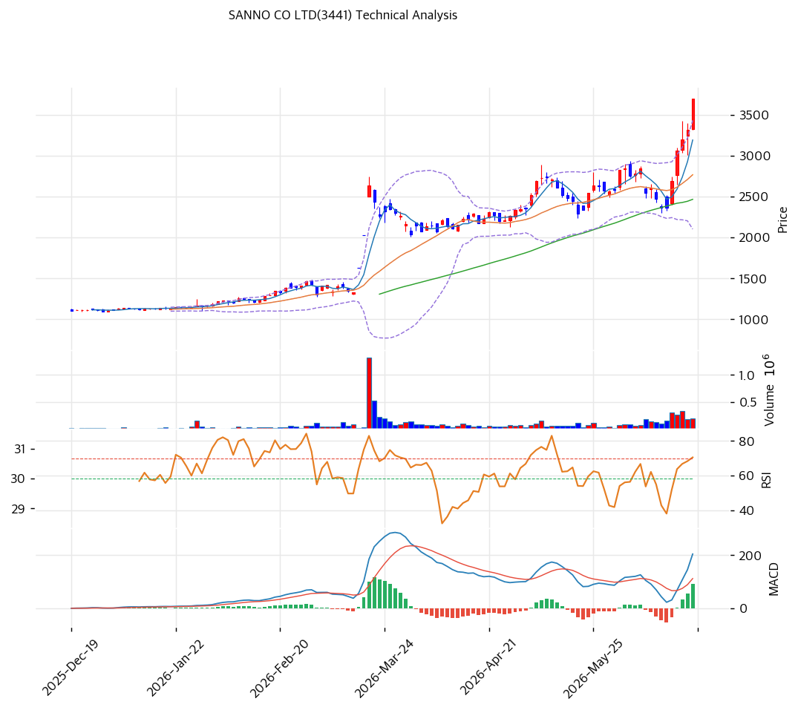

# 산노(3441) 기술적 분석

2026-06-20 | T2 Technical Analysis

---

## 차트

---

## 1. 가격 현황

| 항목 | 값 |
|------|-----|
| 현재가 | ¥3,700 (+11.61%) |
| 52주 고가 | ¥3,700 |
| 52주 저가 | ¥941 |
| 52주 범위 위치 | 100% (신고가) |
| 거래량비 | 1.51x |
| RSI | 76.3 (과매수 🔴) |

> 저점(¥941)에서 **3.9배 급등**, 당일 +11.61%로 52주 신고가. 모든 이평선 위 완전 정배열이나 **MA200 대비 +140%·MA120 +96%** 의 극단적 장기 과열. RSI 76.3·스토캐 89.8 모두 과매수. 실적 폭발이 견인했으나 차트는 과열 정점.

---

## 2. 차트 패턴 분석

### 2.1 구조·캔들

| 패턴 | 위치 | 신뢰도 | 해석 |
|------|------|--------|------|
| 포물선 급등·신고가 | ¥3,700 | 중상 | 실적發 모멘텀 |
| MA200 +140% 이격 | 극단 | 중상 | 강한 되돌림 압력 |
| 과매수 중첩 | RSI 76·stoch 90 | 중상 | 단기 조정 경계 |

- **포물선형 급등(parabolic)** (신뢰도: 중상): 3.9배·신고가. 위쪽 매물 저항 부재이나 극단 과열.
- **장기 정배열·극단 이격** (신뢰도: 중): MA200 +140%. 통계적으로 급격한 되돌림 위험.

### 2.2 다이버전스

- **과열 정점 경계** (신뢰도: 중상): RSI 76.3·스토캐 89.8 동반 과매수. MACD 매수이나 지표 과열로 단기 조정·횡보 가능.

---

## 3. 이동평균선 — 극단 정이격

| MA | 값 | 괴리율 | 위치 |
|----|-----|--------|------|
| MA5 | 3,194 | +15.9% | 위 |
| MA20 | 2,768 | +33.6% | 위 |
| MA60 | 2,468 | +49.9% | 위 |
| MA120 | 1,888 | +96.0% | 위 |
| MA200 | 1,541 | +140.1% | 위 |

**해석**: 완전 정배열이나 **MA200 대비 +140%·MA120 +96%** 로 극단적 과열. 본 세션에서 다룬 종목 중 가장 이격이 크다. 강한 되돌림(MA20 ¥2,768·MA60 ¥2,468) 압력. 추세는 강하나 이격 축소 불가피.

---

## 4. 보조 지표

### RSI(14) — 76.3 (과매수 🔴)
70 초과 강한 과매수. 포물선 정점.

### MACD(12,26,9)
매수 크로스 상태이나 급등 막바지 신호 가능.

### 볼린저밴드(20,2σ)
| 상단 | 중단 | 하단 | 밴드폭 |
|---|---|---|---|
| 3,433 | 2,768 | 2,104 | 48.0% |

현재가 ¥3,700은 상단(3,433) 큰 폭 돌파. 밴드폭 48% 초고변동. 복귀 시 중단(2,768) 되돌림.

### 스토캐스틱
| %K | 판단 |
|---|---|
| 89.8 | 과매수(심) |

심한 과매수권. 단기 조정 신호.

---

## 5. 지지/저항

| 구분 | 가격 | 근거 |
|------|------|------|
| 저항 | 3,957 | 피봇 R2 |
| 저항 | 3,828 | 피봇 R1 |
| **현재가** | **3,700** | 신고가 |
| 지지 | 3,572 | 피봇 |
| 지지 | 3,443 | 피봇 S1·볼린저 상단 |
| 지지 | 3,194 | MA5 |
| 지지 | 3,187 | 피봇 S2 |
| 지지 | 2,768 | MA20·볼린저 중단 |
| 지지 | 2,468 | MA60 |
| 지지 | 2,104 | 볼린저 하단 |

---

## 6. 시그널 종합

| 지표 | 내용 | 시그널 |
|------|------|--------|
| 차트 패턴 | 포물선 급등·신고가 | 🟢 |
| 이동평균선 | 극단 정배열(+140%) | 🔴 |
| RSI | 76.3 — 과매수 | 🔴 |
| MACD | 매수 | 🟢 |
| 볼린저밴드 | 상단 돌파 | 🔴 |
| 스토캐스틱 | 과매수 89.8 | ⚪ |
| 거래량 | 1.51x | ⚪ |

**종합 판단**: 🟢 매수 2개 / 🔴 매도 3개(과열) / ⚪ 중립 2개 → **매도 우위 (극단 과열)**

실적 폭발로 강한 모멘텀이나 MA200 +140%·RSI 76·stoch 90의 **극단 과열**이 다수 매도 신호를 만든다. ⚠️ **추격 매수 매우 위험**. 초소형·개인 73%라 급락 시 낙폭이 크다. 보유자는 분할 익절, 신규는 이격 축소(MA20 ¥2,768) 후 접근. 단 Fwd PER 12x의 펀더 매력이 있어 깊은 눌림은 매수 기회가 될 수 있다.

---

## 7. 전략 제안

### 보유 중인 경우
- **분할 익절 (극단 과열)**
- 익절: ¥3,828(R1)·¥3,957(R2) 분할, 음봉 전환 시 차익
- 손절: ¥3,187(S2) 이탈 / MA20(¥2,768) 이탈
- 초소형·고변동, 트레일링 스톱

### 진입 대기인 경우
- **관망 (추격 금지)·깊은 눌림 분할**
- 1차: ¥2,768(MA20) 회귀 시 소량
- 2차: ¥2,468(MA60)
- 진입 조건: 극단 과열 해소 필요. 단 Fwd PER 12x·가이던스 상향 여력으로 펀더는 매력적 → 이격 축소 시 분할. 금시세·환율·사이클 확인.
