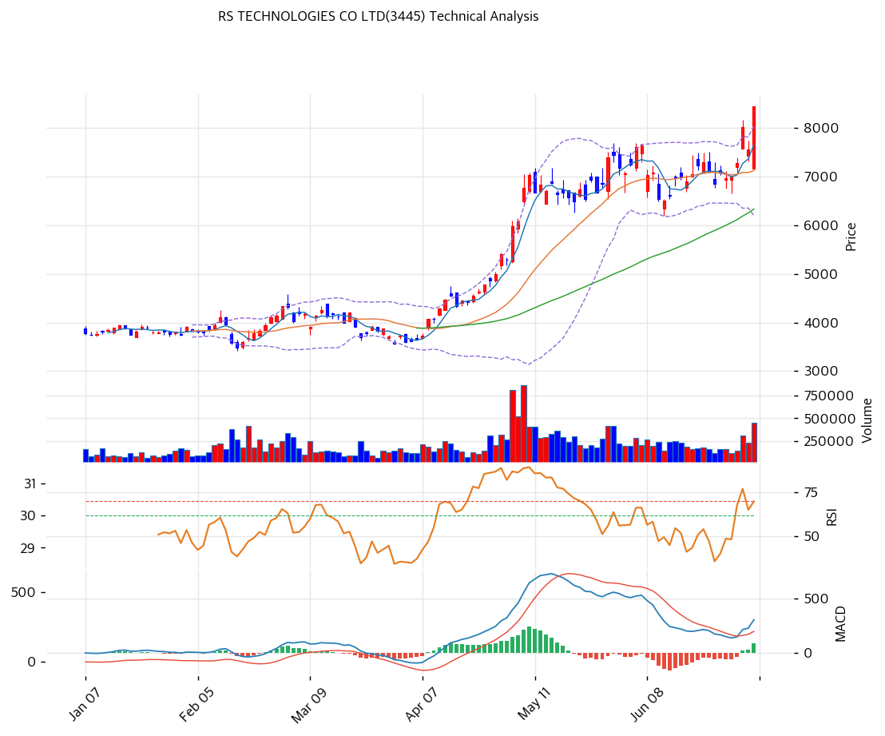

# RS TECHNOLOGIES(3445) 기술적 분석

## 차트

> 차트 직독 — 1\~3월 초 ¥3,800\~4,500 박스권 횡보(52주 저가 ¥2,868 대비 이미 반등한 구간) → 4월 초 골든크로스 동반 급등 개시, MA5·MA20·MA60이 순차 우상향 전환되며 5월 중순 ¥7,000\~7,500까지 단숨에 랠리 → 5월 말\~6월 ¥6,700\~7,800 박스권 눌림목(볼린저 밴드 수렴, 거래량 소강) → 6월 말\~7월 초 거래량 급증(2.32배) 동반 재차 돌파, 최근 봉에서 하루 +11.77% 급등하며 볼린저 상단(¥8,050)을 실제로 뚫고 ¥8,450 52주 신고가 경신. 52주 저점 대비 약 +193%(약 3배) 상승 후에도 추세 훼손 없이 상단 밴드워크가 이어지는 강한 모멘텀 국면.

## 가격 현황

| 항목 | 값 |
|---|---|
| 현재가 | **¥8,450** (+11.77%) |
| 52주 고/저 | ¥8,450 / ¥2,868 (1년 +194.7%, 약 3배) |
| 52주 위치 | **100%** (52주 신고가, 현재가=52주 고점) |
| RSI | **67.6** ⚪ 중립 (과매수 70 직전) |
| MACD | 306 / 219 / +86 (매수, 히스토그램 확대) |
| Stochastic | K=83.7 D=80.0 골든크로스 (과매수 영역) |
| 볼린저 | 폭 25.9%, 상단 밴드(¥8,050) 상향 돌파 |

## 이동평균선

| MA | 가격(¥) | 갭(%) | 위치 |
|---|--:|--:|---|
| MA5 | 7,664 | +10.3 | 상회 |
| MA20 | 7,127 | +18.6 | 상회 |
| MA60 | 6,336 | +33.4 | 상회 |
| MA120 | 5,110 | +65.4 | 상회 |
| MA200 | 4,544 | +86.0 | 상회 |

→ **완전 정배열**(MA5>MA20>MA60>MA120>MA200). MA20 괴리 +18.6%는 과열 경고 임계치(+20%)에 근접했고, MA200 괴리 +86.0%는 52주 저점 이후 리레이팅 폭이 이평선 전 구간에 고르게 누적됐음을 보여준다. 단기 조정 시 1차 회귀 목표는 MA5(¥7,664) → MA20(¥7,127).

## 시그널 종합

| 구분 | 카운트 |
|---|--:|
| 매수 | 3 (이동평균 정배열, MACD 매수·히스토그램 확대, 거래량 2.32배 강력 동반) |
| 매도 | 1 (스토캐스틱 과매수 영역, K=83.7) |
| 중립 | 2 (RSI 67.6, 볼린저 상단 밀착) |
| **결론** | **🟢 매수우위** (단, 단기 과열 신호 병존) |

## 지지·저항

| 구분 | 가격(¥) | 근거 |
|---|--:|---|
| 강 저항 | 10,595 | 피보나치 1.382 확장 |
| 저항 | 9,317 | 피봇 R2 |
| 저항 | 8,883 | 피봇 R1 |
| **현재가** | **¥8,450** | 52주 신고가, 볼린저 상단(¥8,050) 상향 돌파 |
| 지지 | 7,808 | 추세선 저항(상승) — 돌파 후 지지 전환 |
| 지지 | 7,685 | PRZ(중) — 피봇 S1·MA5·추세선 저항 |
| 지지 | 7,127 | MA20 / 피보나치 0.236 되돌림(7,125) 겹침 |
| 강 지지 | 6,717 | 피봇 S2 |
| 지지 | 6,336 | MA60 |

## 전략

| 시나리오 | 액션 |
|---|---|
| 보유자 | 홀드 (1차 TP ¥8,619, 초과 시 피봇 R1 ¥8,883·R2 ¥9,317 순차 목표 / SL ¥6,717) |
| 신규 진입 1차 | ¥7,583 (피봇 S1, 단기 눌림목) |
| 신규 진입 2차 | ¥7,127 (MA20 겸 피보나치 0.236 되돌림 지지) |
| 매도 트리거 | 종가 기준 ¥6,717(피봇 S2·강지지) 이탈 — 스토캐스틱 데드크로스 확정 동반 시 정배열 훼손 경계 |

## 핵심 판단

52주 저점(¥2,868) 대비 약 3배 상승해 52주 신고가(¥8,450)에서 거래되는 국면으로, MA5~MA200 전 구간 완전 정배열과 거래량 2.32배 동반 급등은 얇은 수급의 일시적 급등이 아니라 추세가 살아있는 실수요 매집임을 시사한다. 다만 RSI 67.6(70 임박), 스토캐스틱 과매수(K=83.7), 볼린저 상단 실제 돌파가 겹쳐 단기 과열 되돌림 가능성이 상존하므로 신규 진입은 눌림목(¥7,583·¥7,127)에서 분할 대응이 바람직하다. 반도체 웨이퍼 리클레임 업황 자체가 파운드리 capex 사이클에 연동되는 만큼, 엔저 기조 지속 여부와 TOPIX·닛케이 반도체 관련주 수급 흐름을 함께 점검하며 MA20(¥7,127) 이탈 여부를 추세 전환의 1차 신호로 삼아야 한다.
