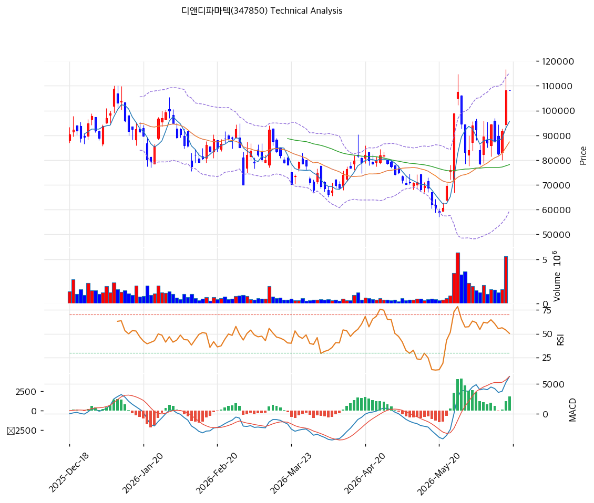

# 기술적분석

2026-06-18 | T2 Technical Analysis

> ⚠️ 임상 바이오 특성상 임상·기술이전 뉴스에 따른 갭·급변이 잦아 기술적 신호 신뢰도가 제한된다. 밴드폭 63.8%의 극단 변동성.

***

## 차트

***

## 1. 가격 현황

| 항목        | 값              |
| --------- | -------------- |
| 현재가       | 108,100원       |
| 52주 고가    | 110,000원       |
| 52주 저가    | 24,374원        |
| 52주 범위 위치 | 97.8% (신고가 근접) |
| 거래량       | (당일 데이터 미반영)   |

> 52주 저점(24,374원) 대비 약 4.5배 폭등, 52주 고점(110,000원) 근접. 모든 이평선 상회의 강세이나 밴드폭 63.8%의 극단 변동성(임상 뉴스 갭).

***

## 2. 차트 패턴 분석

### 2.1 캔들스틱 패턴

| 패턴        | 위치                    | 신뢰도 | 해석         |
| --------- | --------------------- | --- | ---------- |
| 신고가 근접    | 108,100 (52주 110,000) | 중   | 매수 — 강세 추세 |
| 모든 MA 상회  | 108,100 > MA5\~200    | 중   | 매수 — 추세 강세 |
| 밴드폭 63.8% | —                     | 중   | 극단 변동성 경계  |

※ 주요 캔들 패턴: 망치형, 역망치형, 장악형, 도지, 샛별/석별, 적삼병/흑삼병, 하라미, 유성형, 교수형 등

### 2.2 가격 구조 패턴

* **장기 급등 추세(저점 대비 4.5배)** (신뢰도: 중) 멧세라/화이자 비만·MASH 데이터 모멘텀으로 24,374→108,100원 폭등. 52주 고점(110,000원) 돌파 시 추세 가속.
* **고변동 바이오 추세** (신뢰도: 중) MA200(74,745원) 대비 +44.6%. 임상·딜 뉴스에 갭·급변이 잦아 추세 신뢰도 제한. 밴드폭 63.8%.

※ 주요 구조 패턴: 이중천정/바닥, 헤드앤숄더, 삼각수렴, 쐐기형, 깃발형, 페넌트, 컵앤핸들, 박스권 등

### 2.3 다이버전스

* **추세 추종 — 임상 뉴스 의존** (신뢰도: 낮음) RSI 62.7·MACD 매수 확대·스토캐스틱 69.3 상승. 다만 바이오는 임상·딜 발표에 갭이 커 기술적 다이버전스 해석의 의미가 작다.

※ RSI·MACD 기반 | 상승 다이버전스 = 가격↓ 지표↑, 하락 다이버전스 = 가격↑ 지표↓

### 2.4 패턴 종합 판단

저점 대비 4.5배 급등 후 52주 고점(110,000원)에 근접한 강세 추세다. 모든 MA 상회·MACD 매수로 모멘텀은 강하나, 임상 바이오 특성상 **펀더멘털(임상·기술이전 뉴스)이 기술적 신호를 압도**한다. 밴드폭 63.8%의 극단 변동성으로 갭·급변 위험. 추격보다 임상 일정·눌림목(MA20 87,345원·피보 0.236 94,203원) 확인이 안전하다.

***

## 3. 이동평균선 — 강세(고변동)

| MA    | 값       | 현재가 괴리율 | 위치 |
| ----- | ------- | ------- | -- |
| MA5   | 95,560원 | +13.1%  | 위  |
| MA20  | 87,345원 | +23.8%  | 위  |
| MA60  | 78,185원 | +38.3%  | 위  |
| MA120 | 83,432원 | +29.6%  | 위  |
| MA200 | 74,745원 | +44.6%  | 위  |

**해석**: 현재가가 모든 MA 위로 강세이나 MA120(83,432원)>MA60(78,185원)으로 완전 정배열은 아님(aligned False, 변동성 흔적). 단기선(MA20 87,345원)과 +23.8% 괴리. 조정 시 MA20(87,345원)·MA120(83,432원)·MA60(78,185원)이 지지대. 임상 뉴스에 따라 변동 폭 큼.

***

## 4. 보조 지표

### RSI(14) — 62.7 (중립)

신고가 근접에도 과매수(70) 미도달. 강한 모멘텀이나 바이오 변동성 유의.

### MACD(12,26,9)

| 항목        | 값                |
| --------- | ---------------- |
| MACD      | 6,193            |
| Signal    | 4,381            |
| Histogram | +1,812           |
| 크로스 상태    | 매수 구간 (히스토그램 확대) |

**해석**: MACD가 Signal 위에서 히스토그램을 확대하는 상승 모멘텀. 0선 위 강세.

### 볼린저밴드(20, 2σ)

| 항목        | 값         |
| --------- | --------- |
| 상단        | 115,205원  |
| 중단 (MA20) | 87,345원   |
| 하단        | 59,485원   |
| 밴드 폭      | **63.8%** |
| 현재 위치     | 중간 상단     |

**해석**: 밴드 폭 63.8%의 극단 변동성(임상 뉴스 갭). 현재가 108,100원은 중단(87,345원) 위·상단(115,205원) 아래. 변동성 매우 커 밴드 신호 신뢰도 낮음.

### 스토캐스틱(14, 3, 3)

| 항목      | 값      |
| ------- | ------ |
| Slow %K | 69.3   |
| Slow %D | 55.7   |
| 크로스 상태  | 골든크로스  |
| 판단      | 중립(상승) |

***

## 5. 지지/저항 — 추세선 · 피보나치 · PRZ 통합

### 5.1 종합 지지/저항 테이블

| 구분      | 가격           | 근거                  |
| ------- | ------------ | ------------------- |
| 저항      | 115,205원     | 볼린저 상단              |
| 저항      | 111,366원     | 추세선 저항              |
| 저항      | 110,000원     | 52주 고가              |
| **현재가** | **108,100원** | —                   |
| 지지      | 94,882원      | MA5·피보 0.236 (PRZ)  |
| 지지      | 87,345원      | MA20                |
| 지지      | 83,432원      | MA120               |
| 지지      | 79,266원      | MA60·피보 0.382 (PRZ) |
| 지지      | 69,148원      | 피보 0.5              |

***

## 6. 시그널 종합

| 지표    | 내용             | 시그널 |
| ----- | -------------- | --- |
| 차트 패턴 | 신고가 근접, 고변동    | ⚪   |
| 이동평균선 | 모든 MA 상회(비정배열) | 🟢  |
| RSI   | 62.7 — 중립      | ⚪   |
| MACD  | 매수구간, 히스토그램 확대 | 🟢  |
| 볼린저밴드 | 중간 상단, 밴드폭 64% | ⚪   |
| 스토캐스틱 | 골든크로스, K=69.3  | ⚪   |
| 거래량   | 데이터 미반영        | ⚪   |

**종합 판단**: 🟢 매수 1개(요약) / 🔴 매도 1개 / ⚪ 중립 5개 → **중립 (강세 추세 + 고변동)**

저점 대비 4.5배 급등 후 52주 고점 근접의 강세 추세이나, 임상 바이오 특성상 펀더멘털(임상·기술이전)이 기술 신호를 압도한다. 밴드폭 64%의 극단 변동성으로 갭·급변 위험이 크다. 추격보다 임상 일정·눌림목(MA20 87,345원·MA60 79,266원) 대응이 정석.

***

## 7. 전략 제안

### 보유 중인 경우

* **홀드 (임상 일정·변동성 관리)**
* 익절 라인: 110,000원(전고)·115,205원(볼린저 상단)
* 손절 라인: 83,432원(MA120)·79,266원(MA60) 이탈
* 리스크/리워드: 4.5배 급등·임상 바이너리로 변동성 극대. 분할·이벤트 대응

### 진입 대기인 경우

* **추격 자제, 임상 일정·눌림목 대기**
* 1차 진입가: 94,882원 (MA5·피보 0.236 PRZ)
* 2차 진입가: 87,345원 (MA20) / 79,266원 (MA60·피보 0.382)
* 진입 조건: 바이오 급등 추격은 위험. 임상·기술이전 일정 확인하며 눌림목 분할. 차트보다 멧세라/화이자 임상·MASH 딜 등 T1·T4 펀더멘털 근거로 판단. 임상 바이너리 전제 소액·분산.
