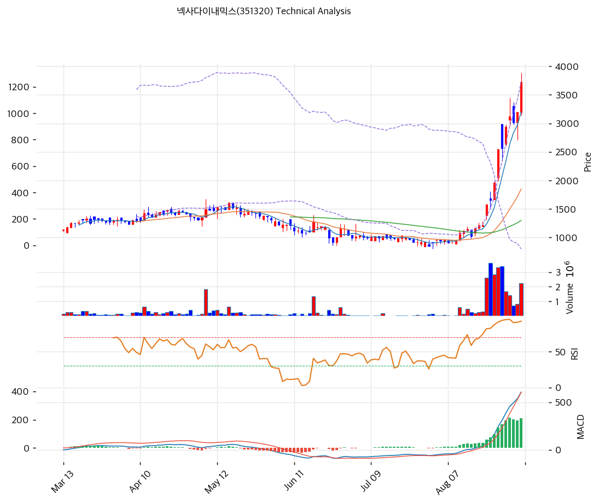

# 넥사다이내믹스(351320) 기술적 분석

---

## 현재 위치

| 항목 | 값 |
|------|-----|
| 현재가 | 3,725원 (+16.41%) |
| 52주 최고 / 최저 | 3,890원 / 852원 |
| 52주 위치 | 100% |
| 거래량 | 2,252,585주 (20일 평균 대비 1.97x) |
| 시가총액 | 1,106억원 |

9월 4일 종가 3,725원은 52주 신고가다. 장중 고가 3,890원을 찍고 165원 되밀린 자리다. 7월 31일 종가 852원에서 337% 오른 위치이며, 상승의 대부분은 최근 9거래일에 몰려 있다.

---

## 이동평균선

| 구분 | 값 | 현재가 대비 |
|------|-----:|------:|
| MA5 | 3,198원 | +16.5% |
| MA20 | 1,851원 | +101.2% |
| MA60 | 1,299원 | +186.8% |
| MA120 | 1,330원 | +180.1% |
| MA200 | 1,297원 | +187.2% |

현재가가 모든 이동평균선 위에 있지만 정배열은 아니다. MA120(1,330원)이 MA60(1,299원)보다 위에 있어 중장기선이 뒤엉킨 상태다. 하락 추세가 오래 이어지다 최근에야 단기선만 급하게 꺾여 올라온 형태다.

MA20 대비 괴리율 +101.2%는 정상 범위를 크게 벗어난다. 20일 평균가의 두 배가 넘는 가격이라는 뜻이다. MA60 대비로는 +186.8%다. 이 정도 괴리는 되돌림 없이 유지되기 어렵다.

---

## 모멘텀 지표

| 지표 | 값 | 판정 |
|------|-----|------|
| RSI(14) | 91.0 | 과매수 🔴 |
| MACD | 606 | 매수 구간 |
| Signal | 394 | |
| Histogram | +211 | 확대 중 |
| Stochastic %K | 88.9 | 과매수 |
| Stochastic %D | 88.1 | 골든크로스 |

RSI 91은 통상 과매수 기준선 70을 21포인트 넘어선 값이다. 지수가 80 이상에 머무는 구간은 통계적으로 짧고, 되돌림이 나올 때 폭이 크다.

MACD는 매수 구간에서 히스토그램이 확대 중이다. 상승 모멘텀 자체는 살아 있다는 뜻이지만, 이 지표는 후행 성격이라 급등 국면에서 고점을 잡아주지 못한다.

스토캐스틱은 K 88.9, D 88.1로 둘 다 과매수 영역에서 골든크로스를 만들었다. 과매수권 내 골든크로스는 매수 신호로 읽기 어렵다.

---

## 볼린저 밴드

| 구분 | 값 |
|------|-----:|
| 상단 | 3,730원 |
| 중심선 | 1,851원 |
| 하단 | -27원 |
| 밴드 폭 | 202.9% |
| 위치 | 상단 밀착 |

밴드 하단이 마이너스 27원으로 계산된다. 표준편차가 중심선보다 커져서 생긴 결과이며, 이 상태에서 볼린저 밴드는 해석 도구로 기능하지 못한다. 밴드 폭 202.9% 자체가 변동성이 통계 모형의 가정을 벗어났다는 신호다.

현재가 3,725원은 상단 3,730원에 밀착해 있다.

---

## 지지와 저항

| 구분 | 가격 | 근거 |
|------|-----:|------|
| 저항 | 4,738원 | 피보나치 1.272 확장 |
| 저항 | 4,030원 | 피봇 R1 |
| 저항 | 3,890원 | 52주 장중 고가 |
| **현재가** | **3,725원** | |
| 지지 | 3,280원 | 피봇 S1 |
| 지지 | 3,176원 | PRZ (피보나치 0.236 + MA5) |
| 지지 | 2,835원 | 피봇 S2 |
| 지지 | 2,699원 | 피보나치 0.382 되돌림 |
| 지지 | 2,330원 | 피보나치 0.5 되돌림 |
| 지지 | 1,962원 | 피보나치 0.618 되돌림 |
| 지지 | 1,851원 | MA20 |
| 지지 | 1,438원 | 피보나치 0.786 되돌림 |
| 지지 | 1,299원 | MA60 |

피봇 기준값은 3,585원이다.

지지선이 촘촘해 보이지만 착시다. 8월 24일부터 9월 4일까지 가격이 1,212원에서 3,725원까지 한 번에 올라온 구간에는 거래가 쌓인 매물대가 없다. 되밀릴 때 실질적으로 저항해줄 가격대는 급등 직전 구간인 1,200원대다.

PRZ는 3,154\~3,198원 구간(중심 3,176원)에 형성돼 있으나 신뢰도는 "약"이다. 피보나치 0.236 되돌림과 MA5 두 개만 겹친다.

---

## 추세선

| 구분 | 기울기 | 현재 수준 | 접점 | 추세 |
|------|------:|------:|----:|------|
| 지지선 | -1.09 | 837원 | 6개 | 하락 |
| 저항선 | -1.18 | 1,397원 | 6개 | 하락 |

두 추세선 모두 하락 방향이며 현재가 3,725원은 하락 저항선 1,397원을 크게 위로 이탈한 상태다. 기존 하락 채널이 완전히 무너진 형태이며, 이 경우 추세선은 더 이상 유효한 참조점이 아니다.

---

## 피보나치

스윙 고점 3,890원, 저점 771원 기준이다.

| 되돌림 | 가격 |
|------|-----:|
| 0.236 | 3,154원 |
| 0.382 | 2,699원 |
| 0.5 | 2,330원 |
| 0.618 | 1,962원 |
| 0.786 | 1,438원 |

| 확장 | 가격 |
|------|-----:|
| 1.272 | 4,738원 |
| 1.382 | 5,081원 |
| 1.618 | 5,818원 |
| 2.0 | 7,009원 |

---

## 캔들 흐름

최근 급등 구간의 일봉을 보면 성격이 분명하다.

| 일자 | 시가 | 고가 | 저가 | 종가 | 등락 | 거래량 |
|------|----:|----:|----:|----:|----:|----:|
| 08-21 | 1,200 | 1,279 | 1,191 | 1,212 | 0.0% | 312,000 |
| 08-24 | 1,386 | 1,575 | 1,314 | 1,575 | +30.0% | 2,599,000 |
| 08-25 | 1,688 | 1,810 | 1,499 | 1,655 | +5.1% | 3,606,000 |
| 08-26 | 1,667 | 1,990 | 1,667 | 1,963 | +18.6% | 2,822,000 |
| 08-27 | 2,050 | 2,550 | 1,986 | 2,550 | +29.9% | 3,310,000 |
| 08-28 | 2,990 | 2,990 | 2,345 | 2,565 | +0.6% | 3,378,000 |
| 08-31 | 2,640 | 2,975 | 2,600 | 2,935 | +14.4% | 1,686,000 |
| 09-01 | 3,060 | 3,445 | 2,955 | 3,120 | +6.3% | 1,408,000 |
| 09-02 | 3,300 | 3,370 | 2,980 | 3,010 | -3.5% | 701,000 |
| 09-03 | 3,010 | 3,200 | 2,710 | 3,200 | +6.3% | 840,000 |
| 09-04 | 3,200 | 3,890 | 3,140 | 3,725 | +16.4% | 2,245,000 |

**8월 24일과 8월 27일은 상한가다.** 각각 경영권 변경 계약과 제3자배정 유상증자 공시가 나온 직후 구간이다.

**8월 28일 캔들이 이 구간의 신호다.** 시가 2,990원으로 갭상승 출발해 그 가격이 그날 고가가 됐고 저가 2,345원까지 밀린 뒤 2,565원에 마감했다. 위꼬리 425원, 몸통 음봉이다. 거래량은 337만 주로 급등 구간 최대치다. 고점에서 물량이 넘어간 형태다.

**9월 1일과 9월 4일에도 긴 윗꼬리가 남았다.** 9월 1일은 장중 3,445원에서 3,120원으로 325원 되밀렸고, 9월 4일은 3,890원에서 3,725원으로 165원 되밀렸다. 장중 고점을 지키지 못하는 패턴이 반복된다.

**거래 회전이 비정상적이다.** 8월 24일부터 28일까지 5거래일 거래량 합계는 1,571만 주로 발행주식 2,970만 주의 52.9%다. 일주일 만에 발행주식의 절반이 손바뀜했다.

---

## 시그널 종합

| 지표 | 상태 | 시그널 |
|------|------|------|
| 이동평균선 | 비정배열, MA20 +101.2% | 🟢 (추세) / 🔴 (과열) |
| RSI | 91.0, 과매수 | 🔴 |
| MACD | 매수 구간, 히스토그램 확대 | 🟢 |
| 볼린저밴드 | 상단 밀착, 밴드 폭 202.9% | ⚪ |
| 스토캐스틱 | 골든크로스, K=88.9 | 🔴 |
| 거래량 | 1.97x | ⚪ |

**매수 1 / 매도 3 / 중립 3 → 매도우위**

상승 모멘텀을 보여주는 지표는 MACD 하나뿐이고, RSI·스토캐스틱·이동평균 괴리가 모두 과열을 가리킨다.

---

## 전략

| 구분 | 액션 | 가격 |
|------|------|------|
| 보유 시 | 비중축소 | 익절 3,800원 / 손절 2,835원 |
| 미보유 시 | 관망 | 1차 진입 3,280원 / 2차 진입 1,851원 |

**보유 중이라면 비중축소다.** RSI 91, MA20 괴리 +101.2%, 볼린저 상단 밀착이 동시에 나오는 구간에서 추가 상승을 기대한 보유는 위험 대비 보상이 맞지 않는다. 손절선 2,835원은 피봇 S2이며, 이 선이 깨지면 다음 지지는 2,699원(피보나치 0.382)이다.

**미보유라면 진입할 자리가 아니다.** 급등 구간에 매물대가 없어 되밀림이 시작되면 멈출 지점을 찾기 어렵다. 1차 관찰 지점 3,280원조차 근거가 피봇 계산값뿐이며 실제 거래가 쌓인 가격대가 아니다.

기술적 지표와 별개로 이 종목에는 확정된 희석 물량이 발행주식의 137% 있다. 9월 15일 제3자배정 유상증자 130억원 납입, 9월 18일과 10월 8일 신주 상장이 예정돼 있고, 전환가액 1,238\~1,775원의 전환사채 391.1억원이 현재가 대비 깊은 인-더-머니 상태다. 차트만 보고 판단할 종목이 아니다. T1과 T3를 함께 확인해야 한다.
