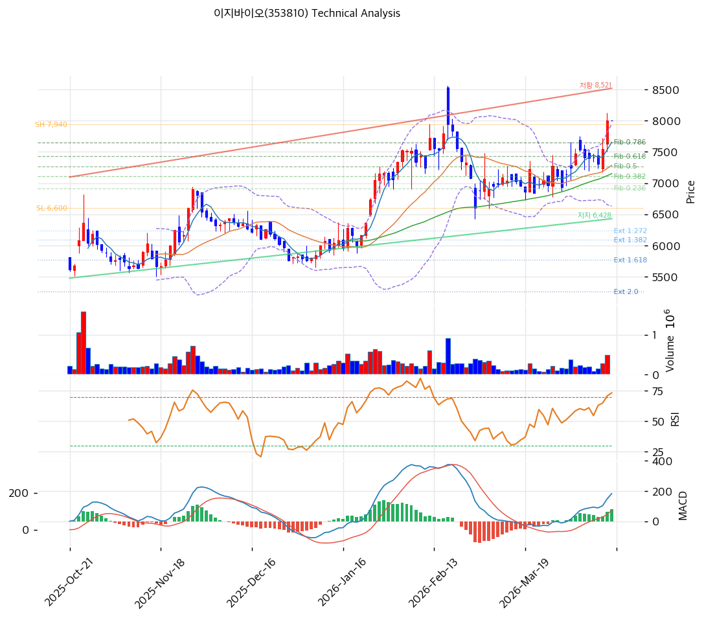

# 이지바이오(353810) 기술적 분석

2026-04-15 | T2 Technical Analysis

---

## 차트

---

## 1. 가격 현황

| 항목 | 값 |
|------|-----|
| 현재가 | 8,000원 (0.00%) |
| 52주 고가 | 8,000원 |
| 52주 저가 | 4,935원 |
| 52주 범위 위치 | 100.0% |
| 거래량 | 데이터 미수집 (0.0x) |

---

## 2. 차트 패턴 분석

### 2.1 캔들스틱 패턴

| 패턴 | 위치 | 신뢰도 | 해석 |
|------|------|--------|------|
| 신고가 도달 | 현재(2026-04-15) | 강 | 52주 고가 갱신. 강한 상승 모멘텀 유지 중이나 추가 상승 동력 확인 필요 |
| 볼린저 상단 밀착 | 현재 | 중 | 단기 과열 가능성. 상단 저항선(7,942원) 돌파 여부가 추가 상승의 분수령 |

※ 주요 캔들 패턴 확인에는 일봉 차트 직접 관찰 필요. 52주 고가 수준에서 거래 중.

### 2.2 가격 구조 패턴

- **상승 추세 지속** (신뢰도: 강)
  지지 추세선(기울기 +8.0, 현재 교차가 6,428원, 6개 포인트 연결)이 꾸준히 우상향하며 가격을 지지하고 있다. 현재가 8,000원은 추세선 대비 +24.5% 상승한 위치로, 장기 상승 추세가 견고하게 유지되고 있음을 시사한다.

- **저항 추세선 접근** (신뢰도: 중)
  저항 추세선 현재 교차가 8,521원으로, 현재가(8,000원)와의 괴리는 약 +6.5%다. 52주 고가이자 피봇 R1/R2와 겹치는 8,000원 구간이 강한 저항대로 작용할 수 있다.

- **피보나치 하락 되돌림 완전 소화** (신뢰도: 강)
  직전 하락 Swing(7,940원→6,600원) 기준 모든 되돌림 레벨(0.786: 7,653원 포함)을 상향 돌파하고 Swing High(7,940원)를 넘어서는 강한 상승 흐름이 확인된다.

### 2.3 다이버전스

- **RSI 히든 상승 다이버전스** (신뢰도: 중)
  RSI 67.0으로 과매수 영역 미진입. 가격 신고가 갱신 과정에서 RSI가 과매수(70 이상)에 못 미치는 점은 추세 지속 여력이 남아있음을 시사한다.

- **MACD 상승 모멘텀 확대** (신뢰도: 강)
  MACD(182) > Signal(104), 히스토그램 +79로 확대 중. 매수 추세 강화 국면으로 단기 조정 없이 추가 상승 가능성을 지지한다.

### 2.4 패턴 종합 판단

52주 고가(8,000원) 수준에서 이동평균선 완전 정배열, MACD 매수 신호 확대가 동반되고 있어 단기 상승 모멘텀은 강하다. 다만 볼린저밴드 상단(7,942원) 돌파 후 상단에 밀착 중이고, 스토캐스틱이 과매수 영역(K=86.7)에 진입해 있어 단기 조정 또는 횡보 가능성이 공존한다. 피봇 포인트와 52주 고가가 겹치는 8,000원을 유의미하게 돌파해 안착할 수 있는지 여부가 추가 상승 지속의 핵심 조건이다.

---

## 3. 이동평균선 — 정배열 (강세)

| MA | 값 | 현재가 괴리율 | 위치 |
|----|-----|--------------|------|
| MA5 | 7,654원 | +4.5% | 위 |
| MA20 | 7,286원 | +9.8% | 위 |
| MA60 | 7,151원 | +11.9% | 위 |
| MA120 | 6,604원 | +21.1% | 위 |
| MA200 | 6,217원 | +28.7% | 위 |

**해석**: MA5~MA200 완전 정배열 상태로 단기~장기 모든 추세가 상승 방향이다. 현재가는 MA20 대비 +9.8%, MA200 대비 +28.7% 위에 있어 단기 과열 신호가 있으나, 정배열 자체는 강세 추세가 훼손되지 않았음을 의미한다. MA20(7,286원)과 MA60(7,151원) 구간이 1차 지지대로 기능할 전망이다.

---

## 4. 보조 지표

### RSI(14) — 67.0 (중립)

RSI 67.0은 중립 상단 구간으로, 아직 과매수(70 이상) 영역에 진입하지 않았다. 가격이 52주 신고가를 경신했음에도 RSI가 과매수에 못 미치는 점은 상승 추세의 탄력이 아직 소진되지 않았음을 시사한다.

### MACD(12,26,9)

| 항목 | 값 |
|------|-----|
| MACD | 182 |
| Signal | 104 |
| Histogram | +79 |
| 크로스 상태 | 매수 구간 (확대 중) |

**해석**: MACD가 Signal을 상향 돌파한 매수 구간이며 히스토그램이 +79로 확대 중이다. 단기 매수 압력이 지속적으로 강화되고 있어 추세 추종 관점에서 긍정적 신호다.

### 볼린저밴드(20, 2σ)

| 항목 | 값 |
|------|-----|
| 상단 | 7,942원 |
| 중단 (MA20) | 7,286원 |
| 하단 | 6,630원 |
| 밴드 폭 | 18.0% |
| 현재 위치 | 상단 근접 (상단 돌파) |

**해석**: 현재가(8,000원)가 볼린저 상단(7,942원)을 소폭 상향 돌파한 상태다. 밴드 폭 18.0%는 중간 수준으로, 스퀴즈 해소 후 추세 방향(상승)으로 이탈 중인 국면이다. 단기적으로는 상단 돌파 후 조정 또는 과열 해소 가능성에 유의해야 한다.

### 스토캐스틱(14, 3, 3)

| 항목 | 값 |
|------|-----|
| Slow %K | 86.7 |
| Slow %D | 75.9 |
| 크로스 상태 | 골든크로스 |
| 판단 | 과매수 |

---

## 5. 지지/저항 — 추세선 · 피보나치 · PRZ 통합

### 5.1 피보나치 되돌림/확장

※ 피보나치 기준: 하락 추세 (Swing High 7,940원 → Swing Low 6,600원)

| 구분 | 비율 | 가격 | 현재가 대비 |
|------|------|------|-----------|
| Swing High | — | 7,940원 | -0.8% |
| 되돌림 | 0.236 | 6,916원 | -13.6% |
| 되돌림 | 0.382 | 7,112원 | -11.1% |
| 되돌림 | 0.5 | 7,270원 | -9.1% |
| 되돌림 | 0.618 | 7,428원 | -7.2% |
| 되돌림 | 0.786 | 7,653원 | -4.3% |
| Swing Low | — | 6,600원 | -17.5% |
| 확장 | 1.272 | 6,236원 | -22.1% |
| 확장 | 1.382 | 6,088원 | -23.9% |
| 확장 | 1.618 | 5,772원 | -27.9% |
| 확장 | 2.0 | 5,260원 | -34.3% |

### 5.2 추세선

| 추세선 | 방향 | 현재 교차가 | 포인트 수 | 해석 |
|--------|------|-----------|---------|------|
| 지지선 | 상승 | 6,428원 | 6개 | 장기 상승 지지선. 현재 가격에서 멀리 떨어져 있어 급락 시 최후 방어선 |
| 저항선 | 상승 | 8,521원 | 6개 | 상승 저항선. 현재가(8,000원) 대비 +6.5% 위치. 단기 목표가로 활용 가능 |

### 5.3 PRZ (Potential Reversal Zone)

| 방향 | 가격 범위 | 신뢰도 | 근거 |
|------|---------|--------|------|
| 지지 | 8,000원 | 강 | 피봇 R1, R2, S1, S2 복수 피봇 집중 |
| 지지 | 7,653~7,654원 | 약 | 피보나치 0.786 되돌림, MA5 |
| 지지 | 7,112~7,428원 | 강 | 피보나치 0.382·0.5·0.618 되돌림, MA60, MA20 |
| 지지 | 6,088~6,236원 | 중 | 피보나치 1.382·1.272 확장, MA200 |

### 5.4 종합 지지/저항 테이블

| 구분 | 가격 | 근거 |
|------|------|------|
| 저항 | 8,521원 | 추세선 저항(상승) |
| 저항 | 8,000원 | 52주 고가 / 피봇 R1·R2 / PRZ(강) |
| **현재가** | **8,000원** | — |
| 지지 | 7,654원 | PRZ(약) — 피보나치 0.786, MA5 |
| 지지 | 7,249원 | PRZ(강) — 피보나치 0.382~0.618, MA20, MA60 |
| 지지 | 6,428원 | 추세선 지지(상승) |
| 지지 | 6,180원 | PRZ(중) — 피보나치 1.272~1.382, MA200 |

---

## 6. 시그널 종합

| 지표 | 내용 | 시그널 |
|------|------|--------|
| **차트 패턴** | 정배열 완성, 52주 고가 / 볼린저 상단 밀착 | 🟢 |
| 이동평균선 | 정배열, MA20 +9.8% | 🟢 |
| RSI | 67.0 — 중립 (과매수 미진입) | ⚪ |
| MACD | 매수 구간, 히스토그램 +79 확대 | 🟢 |
| 볼린저밴드 | 상단 돌파, 밴드 폭 18.0% | ⚪ |
| 스토캐스틱 | 골든크로스, K=86.7 과매수 | 🔴 |
| 거래량 | 0.0x — 데이터 미확인 | ⚪ |

**종합 판단**: 🟢 매수 3개 / 🔴 매도 1개 / ⚪ 중립 3개 → **매수우위**

이동평균선 완전 정배열과 MACD 매수 신호 확대로 중기 상승 추세가 견고하다. 다만 52주 신고가·볼린저 상단 동시 도달·스토캐스틱 과매수 진입으로 단기 과열 신호가 혼재하고 있어, 추가 상승 지속을 위해서는 거래량을 동반한 8,000원 이상의 안착이 필수다.

---

## 7. 전략 제안

### 보유 중인 경우
- **홀드**
- 익절 라인: 8,521원 (추세선 저항선 목표)
- 손절 라인: 7,654원 (PRZ 약 지지 이탈 시)
- 리스크/리워드: 약 1 : 1.7

### 진입 대기인 경우
- **관망 후 눌림목 진입**
- 1차 진입가: 7,654원 (피보나치 0.786 + MA5 PRZ 지지)
- 2차 진입가: 7,286원 (MA20, PRZ 강 지지 구간 하단)
- 진입 조건: 거래량 동반 반등 확인 후 진입. 단순 가격 도달만으로는 진입 신호 불충분.
