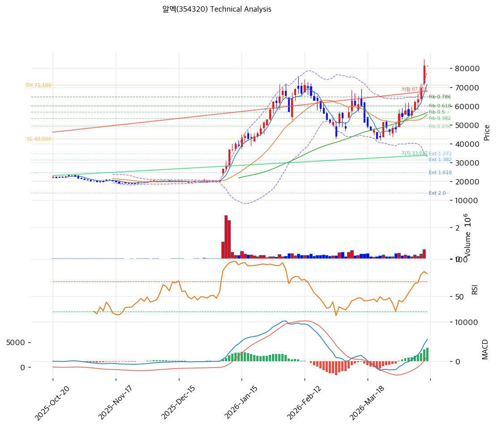

# 알멕(354320) 기술적 분석

2026-04-14 | T2 Technical Analysis

---

## 차트

---

## 1. 가격 현황

| 항목 | 값 |
|------|-----|
| 현재가 | 81,300원 (0.00%) |
| 52주 고가 | 81,300원 |
| 52주 저가 | 19,000원 |
| 52주 범위 위치 | 100.0% |
| 거래량 | 20일 평균 대비 0.0x (데이터 미수집) |

---

## 2. 차트 패턴 분석

### 2.1 캔들스틱 패턴

| 패턴 | 위치 | 신뢰도 | 해석 |
|------|------|--------|------|
| 52주 신고가 도달 | 최근 (2026-04-14) | 강 | 강세 신호 — 상단 저항 부재, 추가 상승 여력 존재하나 단기 과열 경계 필요 |
| 상단 밀착 | 볼린저밴드 상단 근접 | 중 | 밴드 상단 초과 유지 시 추세 강도 강하나, 되돌림 시 20,000원대 중단까지 급락 가능 |

※ 캔들 데이터 상세 미수집 — 52주 고가 도달 및 기술 지표 기반 판단

### 2.2 가격 구조 패턴

- **강세 추세 돌파** (신뢰도: 강)
  2025년 하반기부터 19,000원 저점을 기점으로 가파른 상승 추세를 형성하며 81,300원까지 약 328% 급등했다. 추세선 지지선(현재 교차가 33,937원)에서 6회 이상 반등한 신뢰도 높은 상승 채널이 형성돼 있으나, 현재가는 추세선 지지 대비 139% 괴리된 극단적 과열 구간이다.

- **박스권 부재 — 수직 상승 구조** (신뢰도: 중)
  조정 없는 수직 상승으로 인해 의미 있는 지지 박스권이 형성되지 않았다. 저항선 돌파 후 지지 전환 확인 가능한 구간은 67,825원(저항선 상승 교차가), 56,800원(피보나치 0.5 되돌림), 55,518원(MA20) 등이다.

### 2.3 다이버전스

- **RSI 하락 다이버전스** (신뢰도: 중)
  RSI 73.3으로 과매수권에 진입한 상태에서, 추가 가격 상승 시 RSI 추가 상승이 둔화될 경우 하락 다이버전스 형성 가능. 현재 확정은 아니나 모니터링 필요.

- **MACD 히든 상승 다이버전스** (신뢰도: 중)
  MACD 히스토그램 3,396으로 확대 중이며 매수 구간 유지. 단기 모멘텀 지속 시사하나, 히스토그램 수축 전환 시 추세 약화 신호.

### 2.4 패턴 종합 판단

현재 차트는 **강력한 상승 추세** 유지 중이나, RSI 73.3(과매수), 스토캐스틱 K=91.7(과매수), 볼린저밴드 상단 밀착이 동시에 나타나는 **단기 과열 구간**이다. 52주 신고가(81,300원)에서의 저항 여부와 거래량 동반 여부가 추가 상승 지속의 핵심 조건이다. 상충 시그널: MACD는 매수 지속을 가리키나 RSI·스토캐스틱은 매도 경고를 발령 중이다.

---

## 3. 이동평균선 — 비정배열 (단기 급등)

| MA | 값 | 현재가 괴리율 | 위치 |
|----|-----|--------------|------|
| MA5 | 71,520원 | +13.7% | 위 |
| MA20 | 55,518원 | +46.4% | 위 |
| MA60 | 56,500원 | +43.9% | 위 |
| MA120 | 39,199원 | +107.4% | 위 |
| MA200 | 32,725원 | +148.4% | 위 |

**해석**: 전 이동평균선 위에 위치하여 전반적 강세 구조이나, MA5 < MA20 < MA60 역전(비정배열)이 나타나고 있다. 이는 단기 급등으로 인해 단기 MA가 중장기 MA를 역전하지 못한 구조로, 정상적인 정배열(MA5>MA20>MA60>MA120>MA200)이 아닌 단기 수직 상승 후 단기 MA만 급등한 결과다. MA200(32,725원) 대비 148% 괴리는 역사적으로 평균 회귀 압력이 강한 구간이다.

---

## 4. 보조 지표

### RSI(14) — 73.3 (과매수 🔴)

RSI 73.3으로 과매수 임계선(70)을 상향 돌파한 상태이며, 단기 조정 압력이 누적되고 있다. 추가 상승 시 80 이상 과열 구간 진입 여부 모니터링 필요.

### MACD(12,26,9)

| 항목 | 값 |
|------|-----|
| MACD | 5,514 |
| Signal | 2,118 |
| Histogram | +3,396 |
| 크로스 상태 | 매수 구간 (확대 중) |

**해석**: MACD가 Signal을 상회하며 매수 구간 유지 중이고 히스토그램이 확대되고 있어 단기 모멘텀은 강하게 지속 중이다. 히스토그램 수축 전환 시 추세 약화의 선행 신호.

### 볼린저밴드(20, 2σ)

| 항목 | 값 |
|------|-----|
| 상단 | 77,942원 |
| 중단 (MA20) | 55,518원 |
| 하단 | 33,093원 |
| 밴드 폭 | 80.8% |
| 현재 위치 | 상단 근접 (상단 초과) |

**해석**: 현재가 81,300원이 볼린저밴드 상단(77,942원)을 초과한 밴드 이탈 구간이다. 밴드 폭 80.8%는 광폭으로, 강한 추세 확장 국면임을 시사한다. 밴드 상단 이탈이 지속되면 추세 강도가 매우 강한 것이나, 밴드 내부 복귀 시 중단(55,518원) 방향 조정 가능성 존재.

### 스토캐스틱(14, 3, 3)

| 항목 | 값 |
|------|-----|
| Slow %K | 91.7 |
| Slow %D | 91.2 |
| 크로스 상태 | 골든크로스 |
| 판단 | 과매수 |

---

## 5. 지지/저항 — 추세선 · 피보나치 · PRZ 통합

### 5.1 피보나치 되돌림/확장

※ 피보나치 기준: **하락** 추세 (Swing High 71,100원 → Swing Low 42,500원)

| 구분 | 비율 | 가격 | 현재가 대비 |
|------|------|------|-----------|
| Swing High | — | 71,100원 | -12.5% |
| 되돌림 | 0.236 | 49,250원 | -39.4% |
| 되돌림 | 0.382 | 53,425원 | -34.3% |
| 되돌림 | 0.5 | 56,800원 | -30.1% |
| 되돌림 | 0.618 | 60,175원 | -26.0% |
| 되돌림 | 0.786 | 64,980원 | -20.1% |
| Swing Low | — | 42,500원 | -47.7% |
| 확장 | 1.272 | 34,721원 | -57.3% |
| 확장 | 1.382 | 31,575원 | -61.2% |
| 확장 | 1.618 | 24,825원 | -69.5% |
| 확장 | 2.0 | 13,900원 | -82.9% |

※ 현재가(81,300원)는 Swing High(71,100원)를 상향 돌파한 상태로, 피보나치 되돌림 구간 전체가 하방 지지선으로 작동한다. 가장 유의미한 지지는 0.786(64,980원), 0.618(60,175원), 0.5(56,800원) 순서.

### 5.2 추세선

| 추세선 | 방향 | 현재 교차가 | 포인트 수 | 해석 |
|--------|------|-----------|---------|------|
| 지지선 | 상승 | 33,937원 | 6개 | 장기 상승 추세선으로 6회 지지 — 현재가 대비 큰 괴리(+139%), 급격한 조정 시 최종 지지대 |
| 저항선 | 상승 | 67,825원 | 6개 | 상승 저항선 — 현재가가 이미 상향 돌파, 이제 지지 전환 가능 구간 |

### 5.3 PRZ (Potential Reversal Zone)

| 방향 | 가격 범위 | 신뢰도 | 근거 |
|------|---------|--------|------|
| 지지 | 81,300원 | 강 | 52주 고가, 피봇 R1/R2/S1/S2 집중 구간 (동일 가격) |
| 지지 | 64,980~67,825원 | 중 | 피보나치 0.786 되돌림 + 추세선 저항 전환 지지 |
| 지지 | 55,518~56,800원 | 강 | MA20 + MA60 + 피보나치 0.5 되돌림 삼중 수렴 |

### 5.4 종합 지지/저항 테이블

| 구분 | 가격 | 근거 |
|------|------|------|
| 저항 | 81,300원 | 52주 고가 / 피봇 집중 (현재 전고점 돌파 시도 구간) |
| **현재가** | **81,300원** | — |
| 지지 | 67,825원 | 추세선 저항 → 지지 전환 (상승 추세선, 6포인트) |
| 지지 | 64,980원 | 피보나치 0.786 되돌림 |
| 지지 | 60,175원 | 피보나치 0.618 되돌림 |
| 지지 | 55,518~56,800원 | PRZ 강 — MA20 + MA60 + 피보나치 0.5 삼중 수렴 |
| 지지 | 33,937원 | 장기 상승 추세선 (최종 지지) |

---

## 6. 시그널 종합

| 지표 | 내용 | 시그널 |
|------|------|--------|
| **차트 패턴** | 강세 추세 유지, 52주 고가 도달, 단기 과열 | ⚪ |
| 이동평균선 | 비정배열, 전 MA 상회, MA20 +46.4% 괴리 | 🟢 |
| RSI | 73.3 — 과매수 🔴 | 🔴 |
| MACD | 매수 구간, 히스토그램 확대 (+3,396) | 🟢 |
| 볼린저밴드 | 상단 이탈, 밴드폭 80.8% — 추세 강하나 과열 | ⚪ |
| 스토캐스틱 | K=91.7, 과매수 구간 | 🔴 |
| 거래량 | 데이터 미수집 (0.0x) | ⚪ |

**종합 판단**: 🟢 매수 2개 / 🔴 매도 2개 / ⚪ 중립 3개 → **중립 (단기 과열 경계)**

단기적으로 MACD·이동평균 정렬은 강세를 지지하나 RSI·스토캐스틱의 동반 과매수 신호가 조정 가능성을 경고한다. 52주 신고가(81,300원)에서 볼린저밴드 상단을 이탈한 채 유지 중으로, 거래량 동반 여부가 추가 상승의 핵심 조건이다. 단기(1~2주) 조정 후 67,825~56,800원 지지 구간 확인 시 중기 매수 기회가 될 수 있다.

---

## 7. 전략 제안

### 보유 중인 경우
- **비중축소** (단기 과열 구간)
- 익절 라인: 82,926원 (볼린저밴드 상단 +2σ 연장 기준, 추세 지속 시 목표)
- 손절 라인: 67,825원 (추세선 저항 → 지지 이탈 시)
- 리스크/리워드: 약 1:2 (상단 여지 제한, 하방 리스크 더 큼)

### 진입 대기인 경우
- **관망** (현재 과매수 구간에서 신규 진입 비권장)
- 1차 진입가: 67,825~64,980원 (추세선 지지 + 피보나치 0.786 수렴 구간)
- 2차 진입가: 55,518~56,800원 (MA20+MA60+피보나치 0.5 PRZ 강 구간)
- 진입 조건: 해당 지지 구간 도달 후 거래량 동반 양봉 확인 시
