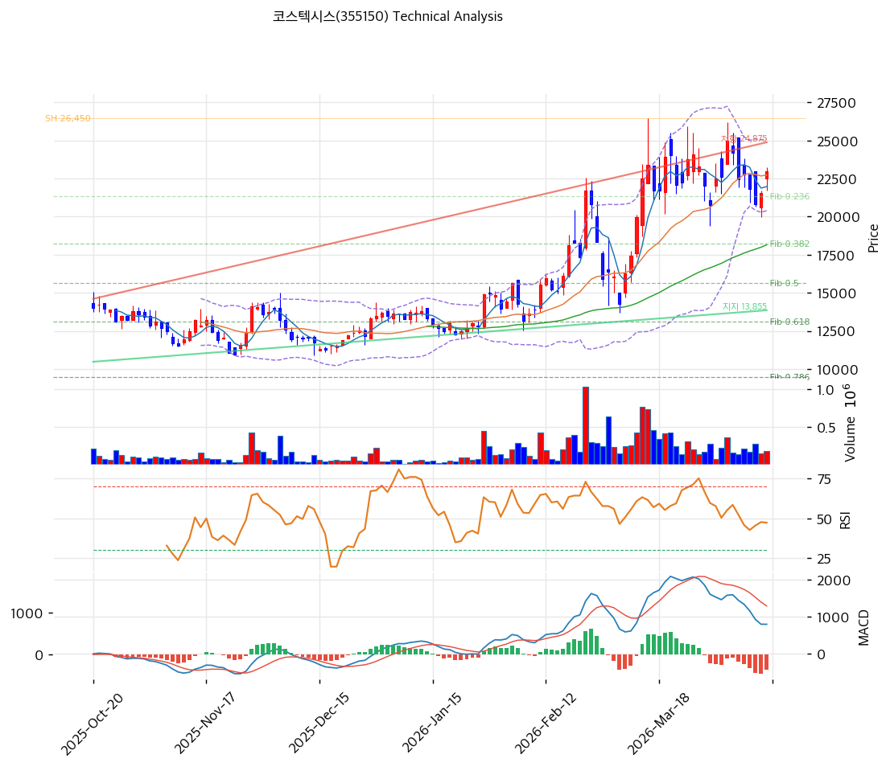

# 코스텍시스(355150) 기술적 분석

2026-04-14 | T2 Technical Analysis

---

## 차트

---

## 1. 가격 현황

| 항목 | 값 |
|------|-----|
| 현재가 | 22,700원 (+5.34%) |
| 52주 고가 | 25,000원 |
| 52주 저가 | 5,030원 |
| 52주 범위 위치 | 88.5% |
| 거래량 | 20일 평균 대비 0.72x |

---

## 2. 차트 패턴 분석

### 2.1 캔들스틱 패턴

| 패턴 | 위치 | 신뢰도 | 해석 |
|------|------|--------|------|
| 장대양봉 | 당일 (2026-04-14) | 강 | +5.34% 단일 세션 급등 — 단기 매수세 유입 확인, 단 거래량 0.72x로 수반되지 않아 지속성 의문 |
| 저점 대비 회복 양봉 연속 | 최근 5거래일 | 중 | 5,030원 저점 이후 22,700원까지 350% 이상 회복, 상승 추세 유지 중 |

### 2.2 가격 구조 패턴

- **52주 고가 근접 박스권 상단 테스트** (신뢰도: 중)
  현재가 22,700원은 52주 고가 25,000원 대비 -9.2% 수준으로 고가 저항권에 근접해 있다. 지난 고점(25,000원) 돌파 여부가 다음 방향성 결정의 핵심이며, 돌파 실패 시 이중천정 형성 가능성이 있다.

- **상승 추세 채널 내 위치** (신뢰도: 중)
  저점 5,030원 → 고점 25,000원의 대형 상승 사이클 내에서 현재가는 피보나치 0.236 되돌림(21,357원)과 52주 고가(25,000원) 사이의 중간 지점에 위치해 있다. 단기적으로 볼린저밴드 중단(MA20: 22,718원)과 피봇 포인트(22,550원) 부근에서 등락 중이다.

### 2.3 다이버전스

- **RSI 중립 — 다이버전스 미형성** (신뢰도: 중)
  RSI(14) 54.4는 중립 구간으로 뚜렷한 상승/하락 다이버전스가 관찰되지 않는다. 가격이 고점 인근에 있음에도 RSI가 70을 하회하여 직전 고점 대비 RSI 하락(하락 다이버전스)의 징후는 경계가 필요하다.

- **MACD 히스토그램 수축 — 하락 다이버전스 경계** (신뢰도: 중)
  가격이 고가 근접하는 상황에서 MACD 히스토그램이 -383으로 음전환하고 수축 중이다. 이는 모멘텀이 가격 상승을 따라가지 못하는 약한 하락 다이버전스 신호로, 단기 조정 가능성을 시사한다.

### 2.4 패턴 종합 판단

캔들스틱 측면에서는 장대양봉이 확인되나 거래량이 평균 이하(0.72x)로 매수 에너지가 부족하다. 가격 구조상 52주 고가(25,000원) 저항권에 근접하여 상단 돌파 전까지 단기 저항이 강하게 작용할 수 있다. MACD 히스토그램이 음전환하여 모멘텀 약화 신호를 보내는 반면 스토캐스틱은 골든크로스를 형성 중이어서 단기 반등 여지를 남기고 있다. **전반적으로 중립~약세 기조** 속에서 25,000원 저항 돌파 여부가 단기 방향성의 분기점이다.

---

## 3. 이동평균선 — 비정배열 (중립)

| MA | 값 | 현재가 괴리율 | 위치 |
|----|-----|--------------|------|
| MA5 | 21,920원 | +3.6% | 위 |
| MA20 | 22,718원 | -0.1% | 아래 |
| MA60 | 18,145원 | +25.1% | 위 |
| MA120 | 15,472원 | +46.7% | 위 |
| MA200 | 13,928원 | +63.0% | 위 |

**해석**: 현재가는 MA5·MA60·MA120·MA200 위에 있지만 MA20(22,718원)을 소폭 하회하고 있어 완전한 정배열 상태가 아니다. 장기선(MA200: 13,928원)과의 괴리율이 +63%로 중장기 상승 추세는 강력하게 유지 중이나, 단기 과열 해소 구간에 위치해 있다. MA20이 직접 지지선 역할을 하며 이를 이탈 시 MA60(18,145원)이 다음 지지대가 된다.

---

## 4. 보조 지표

### RSI(14) — 54.4 (중립)

RSI 54.4는 과매수(70 이상)도 과매도(30 이하)도 아닌 중립 구간으로, 추세 방향성에 대한 명확한 시그널을 제공하지 않는다. 당일 +5.34% 급등 이후에도 RSI가 70을 하회하는 점은 이전 고점 형성 시 RSI가 더 높았을 가능성을 시사하며, 잠재적 하락 다이버전스를 점검해야 한다.

### MACD(12,26,9)

| 항목 | 값 |
|------|-----|
| MACD | 778 |
| Signal | 1,161 |
| Histogram | -383 |
| 크로스 상태 | 매도 구간 (수축 중) |

**해석**: MACD(778)가 Signal(1,161)을 하회하여 매도 구간에 있으며, 히스토그램 -383은 음전환 상태다. 히스토그램이 수축(절댓값 감소) 중이라면 매도 압력이 약해지는 과정이나, 여전히 매도 구간에 머물러 있어 추세 반전 확인 전까지는 신중한 접근이 필요하다.

### 볼린저밴드(20, 2σ)

| 항목 | 값 |
|------|-----|
| 상단 | 25,056원 |
| 중단 (MA20) | 22,718원 |
| 하단 | 20,379원 |
| 밴드 폭 | 20.6% |
| 현재 위치 | 중간 |

**해석**: 현재가(22,700원)는 볼린저밴드 중단(22,718원) 바로 하단에 위치해 중간 포지션이다. 밴드 폭 20.6%는 스퀴즈 상태가 아니어서 변동성 확대 직전 신호는 아니다. 상단 25,056원이 강한 저항으로 작용하며, 돌파 시 단기 상승 목표가가 된다.

### 스토캐스틱(14, 3, 3)

| 항목 | 값 |
|------|-----|
| Slow %K | 33.9 |
| Slow %D | 32.9 |
| 크로스 상태 | 골든크로스 |
| 판단 | 중립 |

---

## 5. 지지/저항 — 추세선 · 피보나치 · PRZ 통합

### 5.1 피보나치 되돌림/확장

| 구분 | 비율 | 가격 | 현재가 대비 |
|------|------|------|-----------|
| Swing High | — | 26,450원 | — |
| 되돌림 | 0.236 | 21,357원 | -5.9% |
| 되돌림 | 0.382 | 18,206원 | -19.7% |
| 되돌림 | 0.500 | 15,660원 | -31.0% |
| 되돌림 | 0.618 | 13,114원 | -42.2% |
| 되돌림 | 0.786 | 9,488원 | -58.2% |
| Swing Low | — | 4,870원 | — |
| 확장 | 1.272 | 32,320원 | +42.4% |
| 확장 | 1.382 | 34,694원 | +52.8% |
| 확장 | 1.618 | 39,786원 | +75.4% |
| 확장 | 2.000 | 48,030원 | +111.5% |

※ 피보나치 기준: 상승 추세 (Swing Low 4,870원 → Swing High 26,450원)
※ 되돌림 = 직전 추세에서 되돌아온 비율, 확장 = 추세 방향 목표가

### 5.2 추세선

| 추세선 | 방향 | 현재 교차가 | 포인트 수 | 해석 |
|--------|------|-----------|---------|------|
| 지지선 | 상승 | 13,855원 | 6 | 저점을 연결한 장기 상승 지지선. 현재가 대비 -39%로 멀리 위치하나 중장기 하방을 방어하는 핵심선 |
| 저항선 | 상승 | 24,875원 | 6 | 고점을 연결한 상승 저항선. 현재가 대비 +9.6%로 단기 저항으로 작용 중이며 돌파 시 추세 가속 기대 |

### 5.3 PRZ (Potential Reversal Zone)

| 방향 | 가격 범위 | 신뢰도 | 근거 |
|------|---------|--------|------|
| 지지 | 21,850~21,920원 | 약 | 피봇 S1(21,850원) + MA5(21,920원) |
| 지지 | 21,000~21,357원 | 약 | 피봇 S2(21,000원) + 피보나치 0.236 되돌림(21,357원) |
| 지지 | 18,145~18,206원 | 약 | MA60(18,145원) + 피보나치 0.382 되돌림(18,206원) |

※ PRZ = 추세선·피보나치·피봇·MA 등 복수 지표가 겹치는 가격 구간. 현재 PRZ는 모두 지지 방향으로, 하방 지지층이 3개 구간에 걸쳐 분포

### 5.4 종합 지지/저항 테이블

| 구분 | 가격 | 근거 |
|------|------|------|
| 저항 | 25,000원 | 52주 고가 |
| 저항 | 24,875원 | 상승 추세선 저항 (포인트 6개) |
| 저항 | 23,400원 | 피봇 R1 |
| **현재가** | **22,700원** | — |
| 지지 | 22,718원 | MA20 (근접) |
| 지지 | 21,885원 | PRZ (약) — 피봇 S1 + MA5 |
| 지지 | 21,178원 | PRZ (약) — 피봇 S2 + 피보나치 0.236 |
| 지지 | 18,176원 | PRZ (약) — MA60 + 피보나치 0.382 |
| 지지 | 13,855원 | 장기 상승 추세선 지지 |

---

## 6. 시그널 종합

| 지표 | 내용 | 시그널 |
|------|------|--------|
| **차트 패턴** | 52주 고가 근접, 장대양봉이나 거래량 미동반 | ⚪ |
| 이동평균선 | 비정배열, MA20 -0.1% (중립) | ⚪ |
| RSI | 54.4 — 중립 | ⚪ |
| MACD | 매도구간, 히스토그램 -383 수축 중 | 🔴 |
| 볼린저밴드 | 중간 위치, 밴드 폭 20.6% | ⚪ |
| 스토캐스틱 | 골든크로스, K=33.9 중립 | ⚪ |
| 거래량 | 0.72x — 약함 | ⚪ |

**종합 판단**: 🟢 매수 0개 / 🔴 매도 1개 / ⚪ 중립 6개 → **중립 (매도 경계)**

당일 +5.34% 급등에도 불구하고 기술적 지표 대부분이 중립을 가리키고 있다. MACD만 매도 신호를 발신 중이며, 거래량이 평균 이하(0.72x)여서 상승의 신뢰도가 낮다. 52주 고가(25,000원)와 추세선 저항(24,875원)이 근접한 이중 저항 구간으로, 이 구간을 거래량 동반하여 돌파하면 1.272 확장 목표가(32,320원)까지 시야가 열리나, 이탈 시 MA20(22,718원) → 피봇 S1(21,850원) 순으로 지지선을 점검해야 한다.

---

## 7. 전략 제안

### 보유 중인 경우
- **비중축소**
- 익절 라인: 25,500원 (52주 고가 25,000원 돌파 + 상승 추세선 저항 24,875원 상단)
- 손절 라인: 21,000원 (피봇 S2 + 피보나치 0.236 되돌림 하단)
- 리스크/리워드: (25,500 - 22,700) : (22,700 - 21,000) = 2,800 : 1,700 ≈ **1.65:1**

### 진입 대기인 경우
- **관망 우선 (조건부 진입 가능)**
- 1차 진입가: 21,850원 (PRZ 지지 — 피봇 S1 + MA5 수렴 구간)
- 2차 진입가: 21,000원 (피봇 S2 + 피보나치 0.236 되돌림 하단 PRZ)
- 진입 조건: MA20(22,718원) 위에서 거래량 동반 양봉 확인, 또는 상기 PRZ 구간 도달 후 반등 캔들 확인
