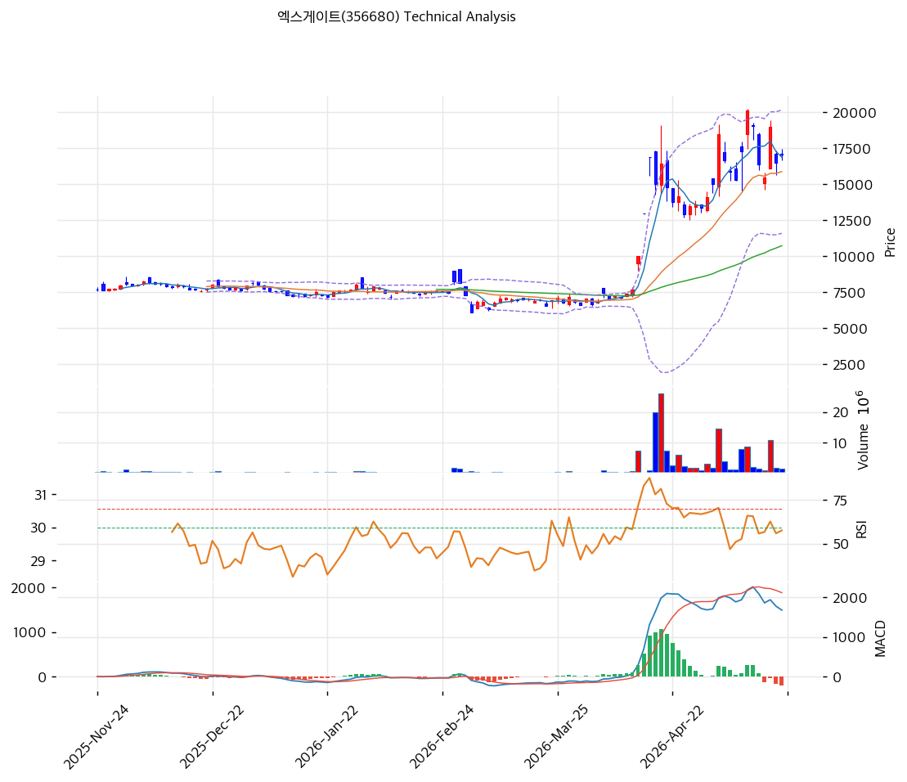

# 엑스게이트(356680) 기술적 분석

## 차트

## 1. 가격 현황

- 현재가 **17,070원** (52주 78%, 정점 20,100원 대비 -15%)
- 52주: 20,100 / 6,120원

## 2. 차트 패턴

- 7,000원 박스 → 2026-03~04 20,000원 정점 → 박스권 형성
- 박스권 (15,000~20,000원) 통합 단계

## 3. 이동평균선

- MA20 +7.6% / MA200 +96.2%
- 정배열 + MA200 +96% 일부 과열

## 4. 보조 지표

- RSI 55.6 (중립)
- 시그널: 매수 1 / 매도 1 / 중립 4 → 중립

## 5. 전략

- 진입 대기: MA20 또는 MA60 영역 분할
- **펀더멘털 부담**: PBR 10.96x 극단 프리미엄 — 포지션 사이즈 제한
