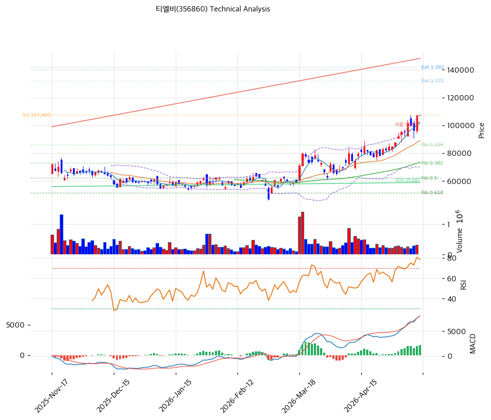

# 티엘비(356860) 기술적 분석

2026-05-14 | T2 Technical Analysis

---

## 차트

---

## 1. 가격 현황

| 항목 | 값 |
|------|---|
| 현재가 | 107,300원 (0.0%) |
| 52주 고가 | 107,300원 (당일 갱신) |
| 52주 저가 | 17,220원 (6.2배 상승) |
| 52주 범위 위치 | 100.0% |

---

## 2. 차트 패턴 분석

- **장기 박스 상향 폭증**: 17,220 → 107,300 +523% 6개월
- 신고가 갱신, MACD 매수 지속
- RSI 72.4 과매수 + MA200 +84.3% 누적

### 종합 판단

박스 돌파 + 가속 + 신고가의 강력 매수 시그널. RSI 72 + MA200 +84% 누적의 과열 동반. 단기 평균회귀 가능성.

---

## 3. 이동평균선 — 정배열

| MA | 괴리율 |
|---|---:|
| MA5 | +4.6% |
| MA20 | +20.4% |
| MA60 | +45.7% |
| MA120 | +59.1% |
| MA200 | **+84.3%** |

---

## 4. 보조 지표

- **RSI 72.4** 🔴 과매수
- MA200 +84.3% 누적 상승

---

## 5. 지지/저항

| 구분 | 가격 | 근거 |
|---|---:|---|
| **현재가** | **107,300** | 52주 신고가 |
| 지지 | 102,624 | MA5 |
| 지지 | 89,135 | MA20 (1차 매수) |
| 지지 | 73,662 | MA60 |

---

## 6. 시그널 종합

**🟢 매수 2 / 🔴 매도 3 / ⚪ 중립 2 → 매도우위 (과열)**

---

## 7. 전략 제안

### 보유 중인 경우
- **비중축소 권장**
- 익절: 109,446원
- 손절: 107,300 직하

### 진입 대기인 경우
- 1차 진입: 107,300원 직하
- 2차 진입: 89,135원 (MA20, -16.9%)
- 펀더멘털 (DDR5·CXL·SSD 트리플) 양호로 조정 시 매수 기회
