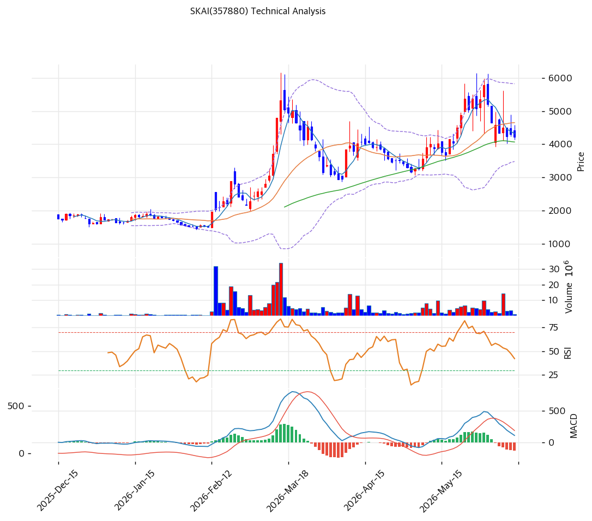

# SKAI worldwide(357880) 기술적 분석

2026-06-15 | T2 Technical Analysis

> ⚠️ 본 종목은 자본잠식·유동성 위기의 고위험 종목으로, 기술적 지표는 펀더멘털 리스크(관리종목·상폐 가능성)에 우선하지 못한다. 차트는 참고용.

---

## 차트

---

## 1. 가격 현황

| 항목 | 값 |
|------|-----|
| 현재가 | 4,235원 (-1.63%) |
| 52주 고가 | 5,790원 |
| 52주 저가 | 1,462원 |
| 52주 범위 위치 | 63.8% |
| 거래량 | 20일 평균 대비 0.2x (관망) |

> 52주 저점(1,462원) 대비 반등했으나 고점(5,790원)에서 조정. MA20 하회·MACD 매도로 단기 약세, 거래량도 위축(0.2x).

---

## 2. 차트 패턴 분석

### 2.1 캔들스틱 패턴

| 패턴 | 위치 | 신뢰도 | 해석 |
|------|------|--------|------|
| MA20 하회 | 현재 4,235 < MA20 4,652 | 중 | 매도 — 단기선 이탈 |
| MA60 지지 시도 | 4,235 > MA60 4,067 | 중 | 중기 지지 부근 |
| 거래량 위축 | 0.2x | 중 | 관망·에너지 부족 |

※ 주요 캔들 패턴: 망치형, 역망치형, 장악형, 도지, 샛별/석별, 적삼병/흑삼병, 하라미, 유성형, 교수형 등

### 2.2 가격 구조 패턴

- **고점 대비 조정 박스권** (신뢰도: 중)
  52주 고점(5,790원)에서 4,200원대로 조정 후 MA60(4,067원)~MA20(4,652원) 사이 박스. 방향성 모색 국면.

- **장기 추세선 위** (신뢰도: 중)
  MA200(2,643원) 대비 +59.9%로 1년 저점 대비 추세는 상방이나, 펀더멘털 악재로 추세 신뢰도 제한.

※ 주요 구조 패턴: 이중천정/바닥, 헤드앤숄더, 삼각수렴, 쐐기형, 깃발형, 페넌트, 컵앤핸들, 박스권 등

### 2.3 다이버전스

- **단기 약세 — 과매도 반등 여지** (신뢰도: 중)
  MACD 매도(히스토그램 -132 확대)로 하락 모멘텀. 다만 스토캐스틱 과매도(K=14.7)로 단기 기술적 반등 가능성 혼재.

※ RSI·MACD 기반 | 상승 다이버전스 = 가격↓ 지표↑, 하락 다이버전스 = 가격↑ 지표↓

### 2.4 패턴 종합 판단

MA20 하회·MACD 매도의 **단기 약세** 국면이나 스토캐스틱 과매도로 기술적 반등 여지가 공존하는 혼조 구간이다. 거래량 위축(0.2x)으로 방향성 에너지가 부족하다. **기술적 신호와 무관하게 자본잠식·유동성·관리종목 리스크가 가격을 지배**하므로, 차트 기반 진입은 권하지 않는다.

---

## 3. 이동평균선 — 비정배열 (혼조)

| MA | 값 | 현재가 괴리율 | 위치 |
|----|-----|--------------|------|
| MA5 | 4,318원 | -2.2% | 아래 |
| MA20 | 4,652원 | -9.2% | 아래 |
| MA60 | 4,067원 | +3.9% | 위 |
| MA120 | 3,086원 | +36.9% | 위 |
| MA200 | 2,643원 | +59.9% | 위 |

**해석**: 현재가가 MA5·MA20 아래, MA60·MA120·MA200 위의 **비정배열 혼조**. 단기선(MA20 4,652원) 하회로 단기 약세, 중기선(MA60 4,067원)이 지지선. MA200 대비 +60%는 1년 저점 대비 큰 폭 상승이나 펀더멘털이 받치지 못한다. MA60(4,067원) 이탈 시 추가 조정 위험.

---

## 4. 보조 지표

### RSI(14) — 47.0 (중립)

중립권에서 방향성 모색. 과매수·과매도 아님.

### MACD(12,26,9)

| 항목 | 값 |
|------|-----|
| MACD | 108.0 |
| Signal | 240.0 |
| Histogram | -132.0 |
| 크로스 상태 | 매도 (데드크로스) |

**해석**: MACD가 Signal 아래의 매도 구간, 히스토그램 음(-132) 확대로 하락 모멘텀 우위.

### 볼린저밴드(20, 2σ)

| 항목 | 값 |
|------|-----|
| 상단 | 5,824원 |
| 중단 (MA20) | 4,652원 |
| 하단 | 3,479원 |
| 밴드 폭 | 50.4% |
| 현재 위치 | 중간(중단 하회) |

**해석**: 현재가 4,235원은 중단(4,652원) 아래·하단(3,479원) 위 중간. 밴드 폭 50%로 변동성 큼. 추가 조정 시 하단(3,479원) 여지.

### 스토캐스틱(14, 3, 3)

| 항목 | 값 |
|------|-----|
| Slow %K | 14.7 |
| Slow %D | 19.0 |
| 크로스 상태 | 데드크로스 |
| 판단 | 과매도권 |

---

## 5. 지지/저항 — 추세선 · 피보나치 · PRZ 통합

### 5.1 피보나치 되돌림

| 구분 | 비율 | 가격 | 현재가 대비 |
|------|------|------|-----------|
| 저항 | 0.786 | 4,861원 | +14.8% |
| 저항 | 0.618 | 4,501원 | +6.3% |
| 저항 | 0.5 | 4,248원 | +0.3% |
| 지지 | 0.382 | 3,994원 | -5.7% |
| 지지 | 0.236 | 3,681원 | -13.1% |

### 5.2 종합 지지/저항 테이블

| 구분 | 가격 | 근거 |
|------|------|------|
| 저항 | 5,790원 | 52주 고가 |
| 저항 | 5,098원 | 추세선 저항 |
| 저항 | 4,652원 | MA20 |
| 저항 | 4,496원 | 피봇 R1·피보 0.618 (PRZ) |
| **현재가** | **4,235원** | — |
| 지지 | 4,067원 | MA60 |
| 지지 | 4,035원 | 피보 0.382·피봇 S1·MA60 (PRZ) |
| 지지 | 3,865원 | 피봇 S2 |
| 지지 | 3,681원 | 피보 0.236 |
| 지지 | 2,581원 | 추세선 지지 |

---

## 6. 시그널 종합

| 지표 | 내용 | 시그널 |
|------|------|--------|
| 차트 패턴 | MA20 하회·박스권 조정 | 🔴 |
| 이동평균선 | 비정배열, MA20 하회 | ⚪ |
| RSI | 47.0 — 중립 | ⚪ |
| MACD | 매도(데드크로스) | 🔴 |
| 볼린저밴드 | 중단 하회 | ⚪ |
| 스토캐스틱 | 과매도(14.7), 데드크로스 | 🟢 |
| 거래량 | 0.2x — 위축 | ⚪ |

**종합 판단**: 🟢 매수 1개 / 🔴 매도 1개 / ⚪ 중립 4개 (요약 시그널 기준 buy1/sell1/neutral4) → **중립 (단기 약세 + 과매도 반등 혼재)**

MA20 하회·MACD 매도의 단기 약세에 스토캐스틱 과매도 반등 여지가 섞인 혼조 구간이다. 거래량 위축으로 추세 에너지가 약하다. **무엇보다 자본잠식·유동성·관리종목 리스크가 기술적 신호를 압도**하므로, 차트 기반 매수는 부적절하다.

---

## 7. 전략 제안

### 보유 중인 경우
- **리스크 관리 우선 (비중축소 검토)**
- 손절 라인: 4,067원(MA60) / 3,865원(피봇 S2) 이탈 시
- 펀더멘털(자본잠식·자금조달) 악화 시 기술적 지지 무력 — 손절 우선

### 진입 대기인 경우
- **신규 진입 비권장**
- 본 종목은 자본잠식·유동성 위기로 기술적 반등을 노린 진입조차 원금 손실·상폐 리스크가 크다. 진입 고려 시 ① 유상증자 성사·자본잠식 해소 ② 분기 흑자 등 펀더멘털 개선 확인이 선결. 차트만으로 진입 금지.
