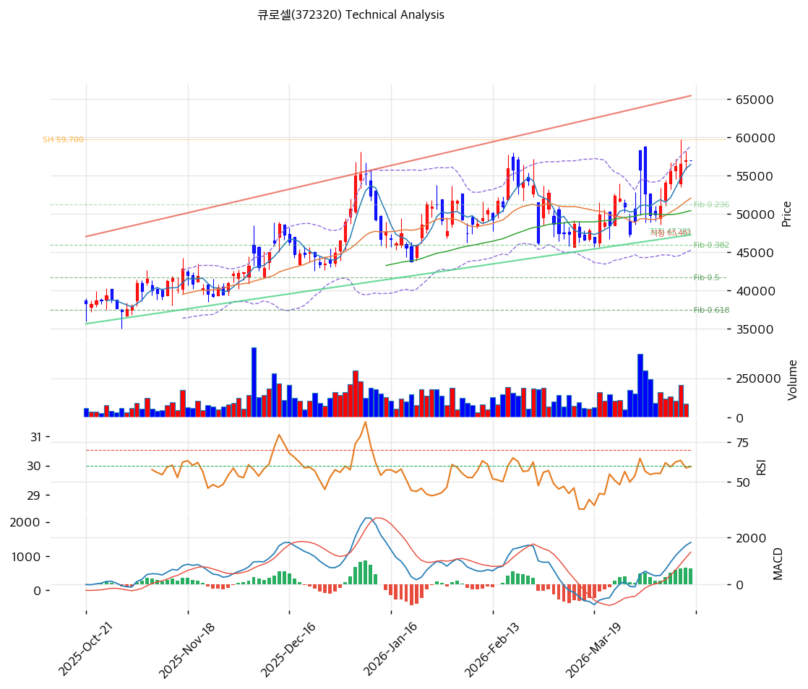

# 큐로셀(372320) 기술적 분석

2026-04-15 | T2 Technical Analysis

---

## 차트

---

## 1. 가격 현황

| 항목 | 값 |
|------|-----|
| 현재가 | 57,000원 (0.00%) |
| 52주 고가 | 59,700원 |
| 52주 저가 | 24,000원 |
| 52주 범위 위치 | 100.0% (52주 신고가 근접) |
| 거래량 | 20일 평균 대비 데이터 없음 (0.0x) |

---

## 2. 차트 패턴 분석

### 2.1 캔들스틱 패턴

| 패턴 | 위치 | 신뢰도 | 해석 |
|------|------|--------|------|
| 52주 신고가 도달 | 최근 (2026-04-15) | 강 | 강한 상승 모멘텀 지속. 매물 공백 구간에서 추가 상승 가능성이나 단기 과열 주의 필요 |
| 상승 추세 지속 | 전 구간 | 강 | Swing Low 23,750원에서 Swing High 59,700원까지 강한 상승 구조 유지 중 |

※ 주요 캔들 패턴: 망치형, 역망치형, 장악형(상승/하락), 도지, 샛별/석별, 적삼병/흑삼병, 하라미, 유성형, 교수형 등

### 2.2 가격 구조 패턴

- **상승 추세 채널** (신뢰도: 강)
  Swing Low 23,750원(저점)에서 Swing High 59,700원(고점)에 이르는 명확한 상승 추세 채널이 형성되어 있다. 지지선 교차가 47,285원, 저항선 교차가 65,461원으로 채널 폭은 약 18,000원이다. 현재가(57,000원)는 채널 상단에 근접하고 있어 단기 저항이 존재하나, 채널 돌파 시 확장 목표가 69,000~73,000원권이 제시된다.

- **박스권 돌파 시도** (신뢰도: 중)
  52주 고가인 59,700원이 강한 저항선으로 작용 중이며, 현재가 57,000원은 동 저항 직하단에 위치한다. 거래량을 동반한 59,700원 돌파 확인 시 피보나치 확장 1.272 수준인 69,478원을 향한 추가 상승이 가능하다.

※ 주요 구조 패턴: 이중천정/바닥, 헤드앤숄더(정/역), 삼각수렴(대칭/상승/하락), 쐐기형(상승/하락), 깃발형, 페넌트, 컵앤핸들, 박스권 등

### 2.3 다이버전스

- **RSI 히든 상승 다이버전스** (신뢰도: 중)
  상승 추세 과정에서 RSI가 저점을 높이며 가격 상승 추세를 지지하고 있다. 현재 RSI 61.1로 과매수(70 이상)에 도달하지 않아 추가 상승 여력이 존재함을 시사한다.

- **MACD 상승 다이버전스 지속** (신뢰도: 중)
  MACD(1,801)가 Signal(1,120)을 상회하는 매수 구간이 유지되고 있으며, 히스토그램(+681)은 양(+)을 유지하되 수축 중이다. 히스토그램 수축은 상승 모멘텀이 다소 약화되고 있음을 의미하므로 주의가 필요하다.

※ RSI·MACD 기반 | 상승 다이버전스 = 가격↓ 지표↑ (반등 시사), 하락 다이버전스 = 가격↑ 지표↓ (하락 시사), 히든 다이버전스 = 기존 추세 지속 시사

### 2.4 패턴 종합 판단

캔들스틱·가격구조 측면에서 강한 상승 추세가 유지되고 있으며, 현재가는 52주 신고가 인근(57,000원)에서 저항 구간을 테스트 중이다. MACD 히스토그램 수축과 52주 고가(59,700원) 저항이 단기 조정 가능성을 시사하지만, RSI가 과매수 영역에 미달하고 정배열이 유지되는 점은 추세 지속에 우호적이다. 59,700원 돌파 여부가 단기 방향성을 결정짓는 핵심 분기점이다.

---

## 3. 이동평균선 — 정배열 (강세)

| MA | 값 | 현재가 괴리율 | 위치 |
|----|-----|--------------|------|
| MA5 | 56,480원 | +0.9% | 위 |
| MA20 | 52,070원 | +9.5% | 위 |
| MA60 | 50,434원 | +13.0% | 위 |
| MA120 | 46,852원 | +21.7% | 위 |
| MA200 | 42,743원 | +33.4% | 위 |

**해석**: MA5~MA200 전 이동평균선이 정배열을 형성하고 있으며, 현재가는 모든 MA 위에 위치한다. MA20 괴리율 +9.5%, MA200 괴리율 +33.4%로 중·장기 이동평균 대비 상당히 높은 위치에 있어 단기 과열 가능성을 내포한다. 단기 조정 시 MA20(52,070원)이 1차 지지, MA60(50,434원)이 2차 지지로 기능할 가능성이 높다.

---

## 4. 보조 지표

### RSI(14) — 61.1 (중립)

RSI 61.1은 중립 구간 상단에 위치하며 과매수(70) 진입까지 여유가 있다. 상승 추세가 지속되는 환경에서 RSI 60대는 일반적으로 추가 상승 가능성을 시사하며, 과매수 영역 도달 전까지는 매도 신호로 해석하지 않는다.

### MACD(12,26,9)

| 항목 | 값 |
|------|-----|
| MACD | 1,801 |
| Signal | 1,120 |
| Histogram | +681 |
| 크로스 상태 | 매수 구간 (히스토그램 수축 중) |

**해석**: MACD가 Signal 위에서 매수 구간을 유지하고 있으나 히스토그램이 수축 중이어서 상승 모멘텀이 점진적으로 약화되고 있다. 히스토그램이 음(-)으로 전환될 경우 단기 추세 전환 신호로 해석할 수 있다.

### 볼린저밴드(20, 2σ)

| 항목 | 값 |
|------|-----|
| 상단 | 58,878원 |
| 중단 (MA20) | 52,070원 |
| 하단 | 45,262원 |
| 밴드 폭 | 26.2% |
| 현재 위치 | 중간~상단 사이 |

**해석**: 현재가(57,000원)는 볼린저밴드 중단(52,070원)과 상단(58,878원) 사이에 위치하여 중간~상단권이다. 밴드 폭 26.2%는 적절한 변동성을 유지 중이며, 상단(58,878원) 돌파 시 강한 모멘텀, 중단(52,070원) 이탈 시 조정 신호로 해석한다.

### 스토캐스틱(14, 3, 3)

| 항목 | 값 |
|------|-----|
| Slow %K | 77.4 |
| Slow %D | 76.7 |
| 크로스 상태 | 골든크로스 |
| 판단 | 중립 (과매수 80 미도달) |

---

## 5. 지지/저항 — 추세선 · 피보나치 · PRZ 통합

### 5.1 피보나치 되돌림/확장

| 구분 | 비율 | 가격 | 현재가 대비 |
|------|------|------|-----------|
| Swing High | — | 59,700원 | -4.7% |
| 되돌림 | 0.236 | 51,216원 | -10.1% |
| 되돌림 | 0.382 | 45,967원 | -19.4% |
| 되돌림 | 0.5 | 41,725원 | -26.8% |
| 되돌림 | 0.618 | 37,483원 | -34.2% |
| 되돌림 | 0.786 | 31,443원 | -44.8% |
| Swing Low | — | 23,750원 | -58.3% |
| 확장 | 1.272 | 69,478원 | +21.9% |
| 확장 | 1.382 | 73,433원 | +28.8% |
| 확장 | 1.618 | 81,917원 | +43.7% |
| 확장 | 2.0 | 95,650원 | +67.8% |

※ 피보나치 기준: 상승 추세 (Swing Low 23,750원 → Swing High 59,700원)
※ 되돌림 = 직전 추세에서 되돌아온 비율, 확장 = 추세 방향 목표가

### 5.2 추세선

| 추세선 | 방향 | 현재 교차가 | 포인트 수 | 해석 |
|--------|------|-----------|---------|------|
| 지지선 | 상승 | 47,285원 | 6개 | 6개 저점 연결 강한 상승 지지선. 이탈 시 추세 전환 신호 |
| 저항선 | 상승 | 65,461원 | 6개 | 6개 고점 연결 상승 저항선. 채널 상단 목표가 |

### 5.3 PRZ (Potential Reversal Zone)

| 방향 | 가격 범위 | 신뢰도 | 근거 |
|------|---------|--------|------|
| 지지 | 56,480~57,000원 | 강 | MA5 + 피봇 R1·R2·S1·S2 |
| 지지 | 50,434~52,070원 | 중 | MA60 + 피보나치 0.236 되돌림 + MA20 |
| 지지 | 45,967~47,285원 | 중 | 피보나치 0.382 되돌림 + MA120 + 추세선 지지 |
| 지지 | 41,725~42,743원 | 약 | 피보나치 0.5 되돌림 + MA200 |

※ PRZ = 추세선 · 피보나치 · 피봇 · MA 등 복수 지표가 겹치는 가격 구간. 겹치는 소스가 많을수록 반전 확률 상승.

### 5.4 종합 지지/저항 테이블

| 구분 | 가격 | 근거 |
|------|------|------|
| 저항 | 73,433원 | 피보나치 1.382 확장 |
| 저항 | 69,478원 | 피보나치 1.272 확장 |
| 저항 | 65,461원 | 추세선 저항 (상승, 6포인트) |
| 저항 | 59,700원 | 52주 고가 |
| **현재가** | **57,000원** | — |
| 지지 | 56,480~57,000원 | PRZ (강) — MA5, 피봇 복합 |
| 지지 | 52,070원 | MA20 |
| 지지 | 50,434~51,216원 | PRZ (중) — MA60, 피보나치 0.236, MA20 |
| 지지 | 45,967~47,285원 | PRZ (중) — 피보나치 0.382, MA120, 추세선 지지 |
| 지지 | 41,725~42,743원 | PRZ (약) — 피보나치 0.5, MA200 |

---

## 6. 시그널 종합

| 지표 | 내용 | 시그널 |
|------|------|--------|
| **차트 패턴** | 정배열 상승 추세, 52주 고가 저항 테스트 중 | 🟢 |
| 이동평균선 | 정배열, MA20 +9.5% | 🟢 |
| RSI | 61.1 — 중립 (과매수 미달) | ⚪ |
| MACD | 매수구간, 히스토그램 수축 중 | ⚪ |
| 볼린저밴드 | 중간~상단, 밴드 폭 26.2% | ⚪ |
| 스토캐스틱 | 골든크로스, K=77.4 (중립) | ⚪ |
| 거래량 | 0.0x — 데이터 없음 | ⚪ |

**종합 판단**: 🟢 매수 2개 / 🔴 매도 0개 / ⚪ 중립 5개 → **매수우위**

정배열 및 MACD 매수구간이 유지되는 상승 추세 구조에서 현재가(57,000원)는 52주 고가(59,700원) 직하단의 저항 테스트 구간에 위치한다. 단기적으로 59,700원 돌파 여부가 관건이며, 성공 시 피보나치 확장 1.272(69,478원)까지의 상승 여력이 있다. 반면 MACD 히스토그램 수축과 MA20 대비 +9.5%의 과도한 괴리는 단기 조정 가능성을 내포하므로, 신규 진입 시 분할 매수 전략이 유효하다.

---

## 7. 전략 제안

### 보유 중인 경우
- **홀드**
- 익절 라인: 65,000~69,000원 (추세선 저항 65,461원 및 피보나치 1.272 확장 69,478원)
- 손절 라인: 52,000원 (MA20 하회 및 PRZ 중간 지지 이탈)
- 리스크/리워드: 약 1:2 (현재가 57,000원 기준, 손절 -8.8% / 목표 +21.0%)

### 진입 대기인 경우
- **분할 진입 가능**
- 1차 진입가: 57,000원 이하 (현재가 or 단기 풀백 시 PRZ 강 지지 구간 56,480~57,000원)
- 2차 진입가: 52,070원 (MA20, PRZ 중 지지 구간)
- 진입 조건: 59,700원 돌파 + 거래량 동반 확인 시 추격 매수 유효; 조정 시 MA20 지지 확인 후 매수
