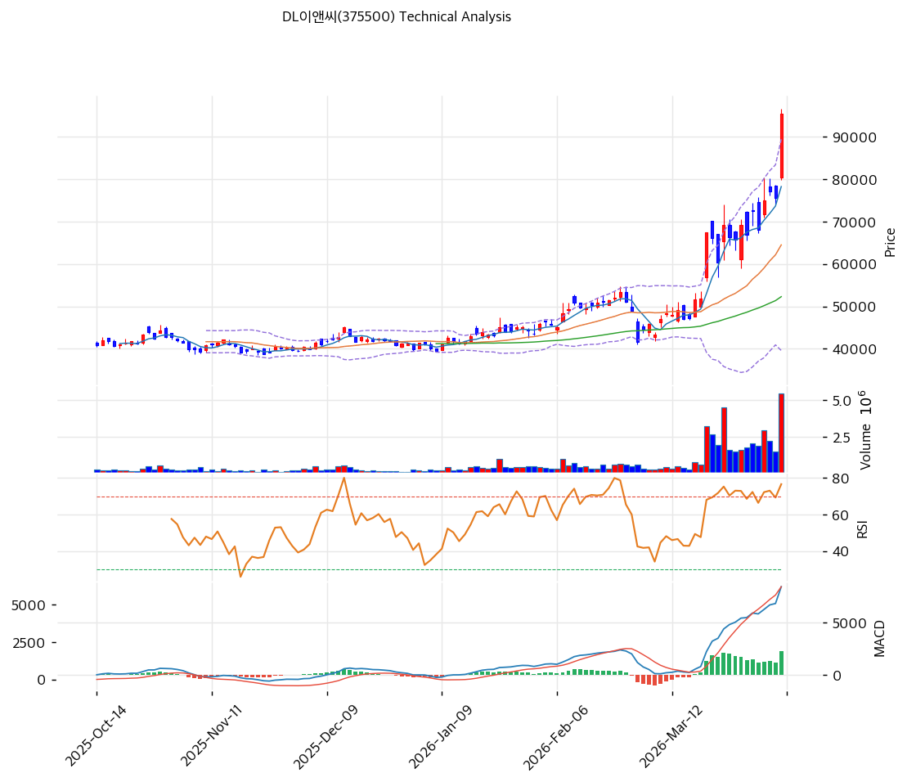

# DL이앤씨(375500) 기술적 분석

2026-04-08 | T2 Technical Analysis

---

## 차트

---

## 1. 가격 현황

| 항목 | 값 |
|------|-----|
| 현재가 | 95,400원 (+26.19%) |
| 52주 고가 | 95,400원 |
| 52주 저가 | 38,000원 |
| 52주 범위 위치 | 100.0% |
| 거래량 | 20일 평균 대비 3.36x |

---

## 2. 차트 패턴 분석

### 2.1 캔들스틱 패턴

| 패턴 | 위치 | 신뢰도 | 해석 |
|------|------|--------|------|
| 장대양봉 | 2026-04-08 (당일) | 강 | 전일 대비 +26.19%의 폭발적 상승 캔들. 수급 불균형이 매수 쪽으로 극단적으로 쏠린 강세 시그널이나, 단기 과열 후 되돌림 가능성도 공존 |
| 갭 상승 | 2026-04-08 (당일) | 강 | 52주 고가 돌파와 동반된 갭 상승. 상단 저항 없이 신고가 구간 진입으로 추가 상승 여력 존재하나, 갭 메우기 되돌림 경계 |

※ 주요 캔들 패턴: 당일 장대양봉이 지배적 시그널이며 이전 캔들 패턴은 신고가 돌파로 무력화됨

### 2.2 가격 구조 패턴

- **V자 반등 / 52주 저점 대비 151% 급등** (신뢰도: 강)
  52주 저가 38,000원(2025년 중 기록)에서 현재 95,400원까지 약 151% 상승. 단기간의 급격한 V자형 반등으로, 추세 전환이 완성된 국면. 다만 MA5(78,260) 대비도 +21.9% 이격된 상태로 단기 과열 구간 진입이 명확하다. 이격 조정 후 78,000~84,000원대 지지 확인 시 다음 상승 파동의 매수 기회.

- **52주 고가 돌파 — 신고가 돌파 구간** (신뢰도: 강)
  현재가 95,400원이 52주 고가(95,400원)와 일치하는 신고가 돌파 상황. 상단에 차트상 저항이 없는 구간으로, 피봇 R1(101,467원)이 다음 목표이나 심리적 저항인 100,000원이 선행 관문. 신고가 구간에서는 거래량 동반 여부가 추세 지속의 핵심 조건.

### 2.3 다이버전스

- **RSI 과매수 경고** (신뢰도: 강)
  RSI(14) 76.8로 과매수 임계(70)를 상회. 가격은 신고가를 기록하고 있으나 RSI가 이미 극단적 구간에 진입해 있어, 추가 상승 시 **하락 다이버전스** 형성 가능성이 높다. 단기(1~2주) 내 가격 조정 또는 횡보 국면에서 RSI 해소가 선행될 가능성.

- **스토캐스틱 과매수 확인** (신뢰도: 중)
  %K=90.7, %D=86.6으로 과매수 영역(80 이상). 골든크로스 상태이나 두 지표 모두 상한에 근접해 있어 크로스 전환(데드크로스) 시 단기 되돌림 신호로 해석 가능.

### 2.4 패턴 종합 판단

장대양봉 + 52주 신고가 돌파 + 3.36배 거래량 동반은 명백한 **강세 모멘텀**을 확인해 준다. 그러나 RSI 76.8, 스토캐스틱 90.7/86.6의 이중 과매수 구간 진입과 MA5 대비 +21.9%, MA20 대비 +47.9%의 극단적 이격률이 공존하는 구간이다. 상충 시그널 요약: 추세 방향은 강세(상승), 단기 타이밍은 과열(조정 경계). **신규 매수는 1차 조정 후 재진입이 유리하며, 보유 포지션은 홀드 유지가 적절.**

---

## 3. 이동평균선 — 완전 정배열 (극단적 강세)

| MA | 값 | 현재가 괴리율 | 위치 |
|----|-----|--------------|------|
| MA5 | 78,260원 | +21.9% | 위 |
| MA20 | 64,502원 | +47.9% | 위 |
| MA60 | 52,288원 | +82.4% | 위 |
| MA120 | 46,744원 | +104.1% | 위 |
| MA200 | 46,397원 | +105.6% | 위 |

**해석**: MA5~MA200 전 구간 완전 정배열 달성. 현재가가 모든 이동평균선 위에서 거래 중이며, 중·장기 추세 전환이 완성된 상태다. 다만 MA20 대비 +47.9%, MA200 대비 +105.6%의 극단적 이격은 역사적으로 단기 조정(MA20 회귀)이 뒤따른 경우가 많았다. MA20(64,502원)이 중기 지지선, MA5(78,260원)가 단기 지지선으로 기능할 전망.

---

## 4. 보조 지표

### RSI(14) — 76.8 (🔴 과매수)

RSI 76.8은 과매수 임계(70)를 명확히 상회하는 과열 구간으로, 단기적으로 가격이 수렴하거나 RSI가 하강할 때까지 신규 매수 리스크가 높다. 다이버전스 해석은 2.3 참조.

### MACD(12,26,9)

| 항목 | 값 |
|------|-----|
| MACD | 8,440 |
| Signal | 6,206 |
| Histogram | +2,234 |
| 크로스 상태 | 매수 구간 (히스토그램 확대 중) |

**해석**: MACD가 Signal 위에 있고 히스토그램이 확대 중으로, 중기 추세 모멘텀은 여전히 상향 방향. 히스토그램 확대 지속 여부가 다음 파동 상승의 확인 조건. 다이버전스 해석은 2.3 참조.

### 볼린저밴드(20, 2σ)

| 항목 | 값 |
|------|-----|
| 상단 | 89,421원 |
| 중단 (MA20) | 64,502원 |
| 하단 | 39,584원 |
| 밴드 폭 | 77.3% |
| 현재 위치 | 상단 초과 |

**해석**: 현재가 95,400원이 볼린저밴드 상단(89,421원)을 **초과**한 상태. 밴드 폭이 77.3%로 이미 넓게 확장돼 있으며, 이는 변동성이 극도로 높은 국면을 시사. 상단 초과 상태는 강세 추세 지속 신호이기도 하나, 평균 회귀(중단 64,502원) 압력도 동시에 존재.

### 스토캐스틱(14, 3, 3)

| 항목 | 값 |
|------|-----|
| Slow %K | 90.7 |
| Slow %D | 86.6 |
| 크로스 상태 | 골든크로스 |
| 판단 | 과매수 |

---

## 5. 지지/저항

| 구분 | 가격 | 근거 |
|------|------|------|
| 저항 | 101,467원 | 피봇 R1 |
| 저항 | 107,533원 | 피봇 R2 |
| **현재가** | **95,400원** | — |
| 지지 | 84,567원 | 피봇 S1 |
| 지지 | 78,260원 | MA5 |
| 지지 | 73,733원 | 피봇 S2 |
| 지지 | 64,502원 | MA20 / 볼린저 중단 |
| 지지 | 52,288원 | MA60 |

---

## 6. 시그널 종합

| 지표 | 내용 | 시그널 |
|------|------|--------|
| **차트 패턴** | 장대양봉 + 52주 신고가 돌파, V자 반등 완성 | 🟢 |
| 이동평균선 | 완전 정배열, MA20 +47.9% 극단 이격 | 🟢 (추세) / 🔴 (과열) |
| RSI | 76.8 — 과매수 | 🔴 |
| MACD | 매수구간, 히스토그램 +2,234 확대 중 | 🟢 |
| 볼린저밴드 | 상단(89,421) 초과, 밴드 폭 77.3% 확장 | ⚪ |
| 스토캐스틱 | 골든크로스, K=90.7 과매수 | 🔴 |
| 거래량 | 3.36x — 강력 동반 | 🟢 |

**종합 판단**: 🟢 매수 4개 / 🔴 매도 3개 / ⚪ 중립 1개 → **매수 우위 (단기 과열 병존)**

당일 +26.19%의 폭발적 급등은 명확한 추세 전환 시그널이자, 동시에 단기 과열을 동반한 국면이다. MACD와 거래량은 상승 추세 지속을 지지하나, RSI(76.8)·스토캐스틱(90.7)의 이중 과매수가 단기 조정 압력을 형성하고 있다. 중기(1~3개월) 관점에서는 MA20 회귀 조정 후 재상승 패턴이 유력하며, 피봇 R1(101,467원)이 다음 목표가로 유효하다.

---

## 7. 전략 제안

### 보유 중인 경우
- **홀드**
- 익절 라인: 101,467원 (피봇 R1, 심리적 저항 100,000원 돌파 확인 후)
- 손절 라인: 73,733원 (피봇 S2 이탈 시 — 추세 전환 실패 확인)
- 리스크/리워드: (101,467 - 95,400) / (95,400 - 73,733) = 6,067 / 21,667 ≈ 1:3.6 (매도에 불리)

### 진입 대기인 경우
- **관망 후 조정 시 진입**
- 1차 진입가: 84,567원 (피봇 S1 — 단기 이격 해소 후 반등 확인)
- 2차 진입가: 78,260원 (MA5 지지 — 보다 깊은 조정 시)
- 진입 조건: RSI 70 이하 복귀 + 거래량 축소 후 재확장 동반 양봉 확인. 현재가 기준 신규 추격 매수는 단기 조정 리스크를 감수해야 하므로 비추. 84,500~85,000원대 분할 매수 대기가 유리.
