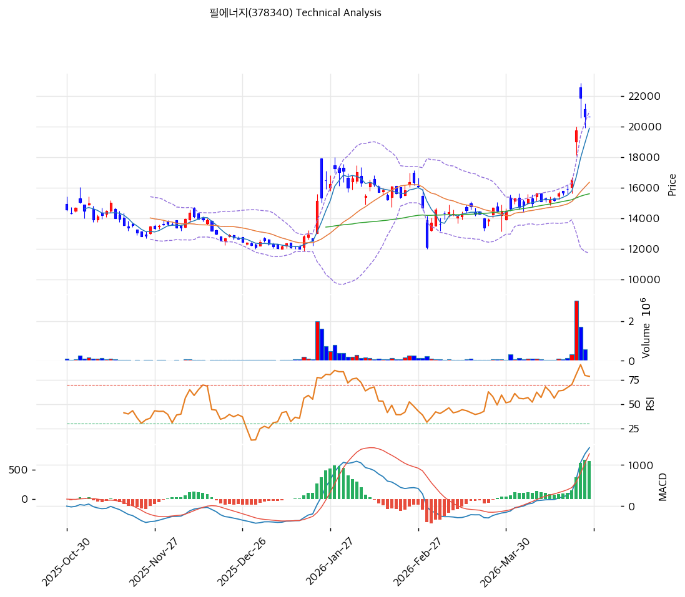

# 필에너지(378340) 기술적 분석

2026-04-24 | T2 Technical Analysis

---

## 차트

---

## 1. 가격 현황

| 항목 | 값 |
|------|-----|
| 현재가 | 20,650원 (+0.00%) |
| 52주 고가 | 21,850원 |
| 52주 저가 | 11,990원 |
| 52주 범위 위치 | 87.8% |
| 거래량 | 20일 평균 대비 0.0x (당일 거래 없음) |

---

## 2. 차트 패턴 분석

### 2.1 캔들스틱 패턴

| 패턴 | 위치 | 신뢰도 | 해석 |
|------|------|--------|------|
| 고점 인근 도지형 | 최근 1일 (2026-04-24) | 중 | 거래량 0으로 방향성 미결정 — 52주 고가(21,850원) 아래서 방향 탐색 중 |
| 상승 후 눌림목 | 최근 5~10일 | 중 | 4월 초 11,990원 저점 대비 +72% 급등 후 20,650원에서 숨 고르기. 조정 폭 미확대 = 매도 압력 제한적 |
| 적삼병 유사 | 4월 중순~현재 | 중 | MA5(19,886원) 위에서 연속 양봉 흐름 유지, 단기 모멘텀 지속 |

### 2.2 가격 구조 패턴

- **52주 고가 부근 횡보** (신뢰도: 중)
  20,650원은 52주 고가(21,850원) 대비 5.5% 하단에 위치하며, 3월 이후 급등세 이후 20,000~21,000원 구간에서 횡보 중. 이 구간은 피봇 밀집대(R1·R2·S1·S2 모두 20,650원)로 강한 PRZ 성격을 띤다. 21,850원 돌파 시 추가 상승 여력, 이탈 시 MA20(16,352원)까지 되돌림 경로.

- **이동평균 정배열 유지** (신뢰도: 강)
  MA5(19,886원) > MA20(16,352원) > MA60(15,599원) > MA120(14,509원) > MA200(13,986원) 완전 정배열. 중장기 상승 추세 구조 확인. MA5와 현재가의 괴리율 3.8%는 단기 과열 해소 중임을 시사.

### 2.3 다이버전스

- **RSI 하락 다이버전스 경계** (신뢰도: 약)
  RSI 73.7로 과매수 영역 유지 중. 현재가가 고점 근처이나 RSI가 완만히 하락하는 패턴이 형성될 경우 하락 다이버전스 발생 가능. 현 시점에서는 확정되지 않아 추적 필요.

- **MACD 히스토그램 수축 경계** (신뢰도: 중)
  MACD 1,423 / Signal 772 / Histogram +651로 매수 구간이나 히스토그램이 확대되지 않고(expand: false) 수축 전환 가능성 있음. 히스토그램이 축소 전환되면 단기 모멘텀 약화 신호.

### 2.4 패턴 종합 판단

52주 고가(21,850원)에서 5% 아래 위치하며 이동평균 완전 정배열 상태에서 숨 고르기 중. 상충 시그널: RSI 73.7 과매수(단기 부담)와 정배열 유지·MACD 매수 구간(중기 추세 우호)이 혼재. 21,850원 돌파 거래량 동반 여부가 다음 방향성의 핵심 확인 변수이며, 돌파 실패 시 16,352원(MA20) 구간까지 되돌림을 배제할 수 없다.

---

## 3. 이동평균선 — 정배열 (강세)

| MA | 값 | 현재가 괴리율 | 위치 |
|----|-----|--------------|------|
| MA5 | 19,886원 | +3.8% | 아래 |
| MA20 | 16,352원 | +26.3% | 아래 |
| MA60 | 15,599원 | +32.4% | 아래 |
| MA120 | 14,509원 | +42.3% | 아래 |
| MA200 | 13,986원 | +47.6% | 아래 |

**해석**: 모든 이동평균선이 현재가 하단에 위치한 완전 정배열로 중장기 상승 추세 확인. MA20 대비 괴리율 +26.3%, MA200 대비 +47.6%는 단기 과열 수준으로, 조정 발생 시 MA5(19,886원) → MA20(16,352원) 순으로 지지 기대. MA20과 MA60이 15,600~16,400원 대에 수렴 중으로 이 구간이 중기 핵심 지지대.

---

## 4. 보조 지표

### RSI(14) — 73.7 (🔴과매수)

RSI 73.7은 과매수 경계 구간으로 단기 조정 압력이 내재. 그러나 대세 상승 초기에는 RSI가 수 주간 70~85 구간에서 유지되는 것이 일반적이므로, 추세 강도 지표로 해석하는 것이 타당. 히스토그램 수축 전환과 함께 RSI가 60 이하로 내려오면 단기 추세 약화로 판단.

### MACD(12,26,9)

| 항목 | 값 |
|------|-----|
| MACD | 1,423 |
| Signal | 772 |
| Histogram | +651 |
| 크로스 상태 | 매수 구간 (수축 중) |

**해석**: 골든크로스 이후 MACD-Signal 격차(+651)는 양호하나, 히스토그램이 확대되지 않는 것(expand: false)은 모멘텀 둔화 신호. 히스토그램이 플러스를 유지하는 동안은 상승 추세 유효하나, 매도 전환 시 단기 조정 확인 필요.

### 볼린저밴드(20, 2σ)

| 항목 | 값 |
|------|-----|
| 상단 | 20,985원 |
| 중단 (MA20) | 16,352원 |
| 하단 | 11,720원 |
| 밴드 폭 | 56.7% |
| 현재 위치 | 상단 근접 |

**해석**: 현재가 20,650원이 BB 상단(20,985원)에 근접. 밴드 폭 56.7%는 이미 상당히 확장된 상태. 상단 이탈 or 접근 후 되돌림은 일반적 패턴이며, 중단(MA20=16,352원)까지의 되돌림 폭이 잠재적 조정 범위.

### 스토캐스틱(14, 3, 3)

| 항목 | 값 |
|------|-----|
| Slow %K | 77.9 |
| Slow %D | 85.1 |
| 크로스 상태 | 데드크로스 |
| 판단 | 중립 |

데드크로스 상태(K < D)는 단기 모멘텀 약화를 시사하나, K=77.9 중립 영역으로 강한 매도 신호는 아님. K가 D를 다시 상향 돌파(골든크로스)하면 단기 반등 확인.

---

## 5. 지지/저항 — 추세선 · 피보나치 · PRZ 통합

### 5.1 피보나치 되돌림/확장

| 구분 | 비율 | 가격 | 현재가 대비 |
|------|------|------|-----------|
| Swing High | — | 17,250원 | — |
| 되돌림 | 0.236 | 13,331원 | -35.4% |
| 되돌림 | 0.382 | 14,080원 | -31.8% |
| 되돌림 | 0.5 | 14,685원 | -28.9% |
| 되돌림 | 0.618 | 15,290원 | -25.9% |
| 되돌림 | 0.786 | 16,152원 | -21.8% |
| Swing Low | — | 12,120원 | — |
| 확장 | 1.272 | 10,725원 | -48.1% |
| 확장 | 1.382 | 10,160원 | -50.8% |
| 확장 | 1.618 | 8,950원 | -56.7% |
| 확장 | 2.0 | 6,990원 | -66.1% |

※ 피보나치 기준: 하락 추세 (Swing High 17,250원 → Swing Low 12,120원). 현재가는 Swing High를 상향 돌파한 상태로 되돌림 수준은 하방 지지 참고용.

### 5.2 추세선

| 추세선 | 방향 | 현재 교차가 | 포인트 수 | 해석 |
|--------|------|-----------|---------|------|
| 지지선 | 상승 | 12,541원 | 6 | 2025년 저점 연결 장기 상승 지지선 |
| 저항선 | 상승 | 17,340원 | 6 | 기존 저항선 → 현재는 지지로 전환 |

### 5.3 PRZ (Potential Reversal Zone)

| 방향 | 가격 범위 | 신뢰도 | 근거 |
|------|---------|--------|------|
| 지지 | 20,650원 | 강 | 피봇 R1·R2·S1·S2 4중 겹침 |
| 지지 | 16,152~16,352원 | 약 | 피보나치 0.786 되돌림, MA20 |
| 지지 | 15,290~15,599원 | 약 | 피보나치 0.618 되돌림, MA60 |
| 지지 | 14,509~14,685원 | 약 | MA120, 피보나치 0.5 되돌림 |

### 5.4 종합 지지/저항 테이블

| 구분 | 가격 | 근거 |
|------|------|------|
| 저항 | 21,850원 | 52주 고가 |
| **현재가** | **20,650원** | PRZ (강) — 피봇 R1·R2·S1·S2 |
| 지지 | 19,886원 | MA5 |
| 지지 | 17,340원 | 추세선 저항 → 지지 전환 |
| 지지 | 16,252원 | PRZ (약) — 피보나치 0.786, MA20 |
| 지지 | 15,444원 | PRZ (약) — 피보나치 0.618, MA60 |
| 지지 | 14,597원 | PRZ (약) — MA120, 피보나치 0.5 |

---

## 6. 시그널 종합

| 지표 | 내용 | 시그널 |
|------|------|--------|
| **차트 패턴** | 52주 고가 근접 횡보, 이평 정배열 유지 | 🟢 |
| 이동평균선 | 완전 정배열, MA20 괴리 +26.3% | 🟢 |
| RSI | 73.7 — 과매수 | 🔴 |
| MACD | 1,423/772/+651, 매수 구간 (히스토그램 수축 중) | ⚪ |
| 볼린저밴드 | 상단 근접 (20,985원), 폭 56.7% 확장 | ⚪ |
| 스토캐스틱 | K=77.9 D=85.1, 데드크로스 중립 | ⚪ |
| 거래량 | 0.0x — 당일 거래 없음 (판단 불가) | ⚪ |

**종합 판단**: 🟢 매수 2개 / 🔴 매도 1개 / ⚪ 중립 4개 → **매도우위 (단기 경계)**

현재가 20,650원은 완전 정배열 속 52주 고가 아래 횡보 구간. 중기 상승 추세는 유효하나, RSI 과매수·MACD 히스토그램 수축·스토캐스틱 데드크로스가 동시에 나타나 단기 조정 압력이 내재. 거래량이 동반되지 않으면 21,850원 돌파는 어려우며, 단기적으로 MA5(19,886원) → 17,340원(추세선 지지 전환) 구간이 핵심 지지대.

---

## 7. 전략 제안

### 보유 중인 경우
- **비중축소 (단기 경계)**
- 익절 라인: 22,287원 (52주 고가 21,850원 돌파 확인 후)
- 손절 라인: 20,650원 (현재가 = 피봇 강 지지선. 이탈 시 MA20까지 되돌림)
- 리스크/리워드: (22,287-20,650):(20,650-16,352) = 1,637:4,298 ≈ 1:2.6 → 리워드 불리, 비중축소 유효

### 진입 대기인 경우
- **관망 (추세 재확인 후 진입)**
- 1차 진입가: 20,650원 (피봇 강 지지 유지 시, 거래량 확인 후)
- 2차 진입가: 16,352원 (MA20, PRZ 약 구간 — 조정 시 저가매수 기회)
- 진입 조건: ① 21,850원 이상 거래량 동반 돌파 확인 후 추격 매수, 또는 ② MA20(16,352원) 접근 후 양봉 반등 시 분할 매수. 16,352원 하회 + 추세선(17,340원) 이탈 시 진입 취소 후 MA60(15,599원) 대기.
