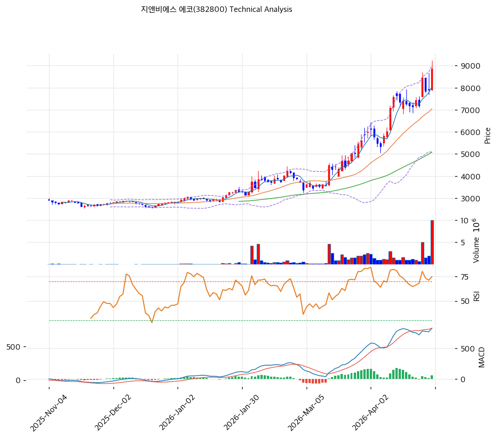

# 지앤비에스 에코(382800) 기술적 분석

2026-04-29 | T2 Technical Analysis

---

## 차트

---

## 1. 가격 현황

| 항목 | 값 |
|------|-----|
| 현재가 | 8,860원 (+11.87%) |
| 52주 고가 | 9,230원 |
| 52주 저가 | 2,600원 |
| 52주 범위 위치 | 100.0% |
| 거래량 | 20일 평균 대비 6.13x |

---

## 2. 차트 패턴 분석

### 2.1 캔들스틱 패턴

| 패턴 | 위치 | 신뢰도 | 해석 |
|------|------|--------|------|
| 대형 양봉 (장대양봉) | 2026-04-29 (당일) | 강 | 단일 세션 +11.87% 급등 — 강한 매수 시그널이나 동시에 과열 경고 |
| 52주 고가 근접 | 9,230원 저항 | 중 | 현재가 8,860원이 52주 고가(9,230원)에 근접, 돌파 시 추세 확장 |
| 전형적 과매수 캔들 | 최근 5일 | 중 | MA5 대비 +10% 이격, 단기 조정 압력 내재 |

※ 주요 캔들 패턴: 장대양봉, 52주 고가 근접 저항

### 2.2 가격 구조 패턴

- **V자 반등 추세** (신뢰도: 강)
  2025년 저점(2,600원)에서 현재(8,860원)까지 약 6개월 만에 +241% 급등하는 V자 반등 구조. 2024년 반도체 업황 조정으로 2,600원까지 하락한 후 2026년 AI 반도체 투자 재개 기대에 급반등. 단기 과열이나 중기 추세 전환 완성 국면.

- **52주 고가 돌파 임박** (신뢰도: 중)
  현재가 8,860원은 52주 고가(9,230원) 대비 4% 하단. 돌파 성공 시 피보나치 1.272 확장(11,047원)이 다음 목표. 돌파 실패 시 8,077원(피봇 S1)까지 조정 가능.

- **박스권 이탈 후 추세 상승** (신뢰도: 중)
  약 4년(2021~2025년) 동안 2,600~9,230원 박스권 형성 후 현재 박스 상단 테스트 중. 박스 상단 돌파 확인 시 신고가 추세 진입.

### 2.3 다이버전스

- **RSI 고점 미확인 다이버전스 가능성** (신뢰도: 약)
  RSI 72.8로 과매수 진입. 주가가 직전 고점(9,230원) 돌파 시도 중이나 RSI가 이전 과매수 구간 대비 낮을 경우 하락 다이버전스 경고 가능 — 현 단계에서는 확인 불가, 모니터링 필요.

- **MACD 상승 히든 다이버전스** (신뢰도: 중)
  MACD 833, Signal 772, 히스토그램 +61로 매수 크로스 후 확대 중. 이전 조정 저점 대비 MACD 고점이 상승하는 히든 다이버전스 구조 — 상승 추세 지속 시사.

### 2.4 패턴 종합 판단

V자 반등 구조와 MACD 히든 다이버전스는 중기 상승 추세 지속을 지지하지만, RSI 72.8의 과매수와 52주 고가(9,230원) 저항이 단기 조정 가능성을 높인다. 당일 +11.87% 급등 후 거래량 6.13x 폭발은 강한 추세 전환 신호이나, 이격 과대로 즉시 추격 매수보다 눌림목 대기가 유리하다. 52주 고가 돌파 확인 후 추세 추종 전략이 최선.

---

## 3. 이동평균선 — 정배열 (강세)

| MA | 값 | 현재가 괴리율 | 위치 |
|----|-----|--------------|------|
| MA5 | 8,054원 | +10.0% | 위 |
| MA20 | 7,048원 | +25.7% | 위 |
| MA60 | 5,085원 | +74.2% | 위 |
| MA120 | 3,971원 | +123.1% | 위 |
| MA200 | 3,712원 | +138.7% | 위 |

**해석**: 모든 이동평균선이 정배열로 강세 구조 완성. 그러나 MA20 대비 +25.7%, MA60 대비 +74.2%로 이격이 극단적으로 크다. 역사적으로 이 수준의 이격은 단기 평균 회귀 압력(조정)을 동반. MA20(7,048원)이 1차 지지이며, 조정 시 MA5(8,054원)→피봇 S1(8,077원) 구간이 단기 지지선.

---

## 4. 보조 지표

### RSI(14) — 72.8 (🔴과매수)

RSI 72.8로 과매수 영역 진입, 단기 조정 또는 횡보 소화 필요. 추세가 강한 경우 RSI 70~80 유지 후 재상승 가능하나 80 이상 진입 시 단기 매도 신호로 전환.

### MACD(12,26,9)

| 항목 | 값 |
|------|-----|
| MACD | 833.0 |
| Signal | 772.0 |
| Histogram | +61.0 |
| 크로스 상태 | 매수 구간 (확대 중) |

**해석**: MACD가 Signal 위에 있고 히스토그램이 확대 중으로 상승 모멘텀 유지. 히스토그램 축소 전환 시 단기 조정 경고.

### 볼린저밴드(20, 2σ)

| 항목 | 값 |
|------|-----|
| 상단 | 9,003원 |
| 중단 (MA20) | 7,048원 |
| 하단 | 5,092원 |
| 밴드 폭 | 55.5% |
| 현재 위치 | 상단 근접 |

**해석**: 밴드 폭 55.5%로 매우 확장된 상태 — 강한 추세 진행 중임을 확인. 현재가 8,860원은 상단(9,003원) 바로 아래에 위치, 상단 돌파 시 추세 가속 또는 단기 과열 후 중단(7,048원)으로의 수렴 가능.

### 스토캐스틱(14, 3, 3)

| 항목 | 값 |
|------|-----|
| Slow %K | 79.0 |
| Slow %D | 80.1 |
| 크로스 상태 | 데드크로스 |
| 판단 | 중립 |

---

## 5. 지지/저항 — 추세선 · 피보나치 · PRZ 통합

### 5.1 피보나치 되돌림/확장

| 구분 | 비율 | 가격 | 현재가 대비 |
|------|------|------|-----------|
| Swing High | — | 9,230원 | — |
| 되돌림 | 0.236 | 7,654원 | -13.6% |
| 되돌림 | 0.382 | 6,678원 | -24.6% |
| 되돌림 | 0.5 | 5,890원 | -33.5% |
| 되돌림 | 0.618 | 5,102원 | -42.4% |
| 되돌림 | 0.786 | 3,980원 | -55.1% |
| Swing Low | — | 2,550원 | — |
| 확장 | 1.272 | 11,047원 | +24.7% |
| 확장 | 1.382 | 11,782원 | +33.0% |
| 확장 | 1.618 | 13,358원 | +50.8% |
| 확장 | 2.0 | 15,910원 | +79.6% |

※ 피보나치 기준: 상승 추세 (Swing Low 2,550원 → Swing High 9,230원)
※ 되돌림 = 직전 추세에서 되돌아온 비율, 확장 = 추세 방향 목표가

### 5.2 추세선

| 추세선 | 방향 | 현재 교차가 | 포인트 수 | 해석 |
|--------|------|-----------|---------|------|
| 지지선 | 하락 | 2,570원 | 6개 | 장기 하락 추세선 — 현재 주가는 이미 상방 이탈 완료 |
| 저항선 | 하락 | 3,215원 | 6개 | 장기 하락 저항선 — 이미 상방 돌파 완료 |

### 5.3 PRZ (Potential Reversal Zone)

| 방향 | 가격 범위 | 신뢰도 | 근거 |
|------|---------|--------|------|
| 지지 | 8,054~8,077원 | 약 | MA5 + 피봇 S1 |

### 5.4 종합 지지/저항 테이블

| 구분 | 가격 | 근거 |
|------|------|------|
| 저항 | 9,230원 | 52주 고가 (돌파 시 신고가 진입) |
| 저항 | 9,437원 | 피봇 R1 |
| **현재가** | **8,860원** | — |
| 지지 | 8,054~8,077원 | PRZ (MA5 + 피봇 S1) |
| 지지 | 7,293원 | 피봇 S2 |
| 지지 | 7,048원 | MA20 |
| 지지 | 7,654원 | 피보나치 0.236 되돌림 |
| 지지 | 5,085원 | MA60 |

---

## 6. 시그널 종합

| 지표 | 내용 | 시그널 |
|------|------|--------|
| **차트 패턴** | V자 반등 + MACD 히든 다이버전스 (상승 추세 지속) | 🟢 |
| 이동평균선 | 완전 정배열, MA20 괴리 +25.7% 극단적 과열 | 🟢 |
| RSI | 72.8 — 과매수 구간 진입 | 🔴 |
| MACD | 매수 크로스 + 히스토그램 확대 | 🟢 |
| 볼린저밴드 | 상단 근접, 밴드 폭 55.5% (강한 추세) | ⚪ |
| 스토캐스틱 | K=79.0, D=80.1, 데드크로스 | 🔴 |
| 거래량 | 6.13x — 강력한 거래량 폭발 | 🟢 |

**종합 판단**: 🟢 매수 4개 / 🔴 매도 2개 / ⚪ 중립 1개 → **매수우위 (과열 경고)**

당일 +11.87% 급등과 거래량 6.13x 폭발은 추세 전환 신호로 긍정적이나, RSI 72.8 과매수·MA20 괴리 25.7%·스토캐스틱 데드크로스는 단기 조정 가능성을 경고한다. 52주 고가(9,230원) 돌파 여부가 핵심 분기점 — 돌파 시 피봇 R1(9,437원)→피보나치 1.272(11,047원)까지 목표, 돌파 실패 시 8,054원~7,293원 구간 조정.

---

## 7. 전략 제안

### 보유 중인 경우
- **홀드**
- 익절 라인: 9,230원 (52주 고가 / 돌파 전 부분 익절 고려)
- 손절 라인: 7,293원 (피봇 S2 / 추세 이탈 기준)
- 리스크/리워드: (9,230-8,860) / (8,860-7,293) = 0.24 / 1.57 = 1:6.5 (비대칭 유리)

### 진입 대기인 경우
- **관망 후 눌림목 진입**
- 1차 진입가: 8,077원 (PRZ 하단 / 피봇 S1)
- 2차 진입가: 7,048원 (MA20 / 20일 이동평균 지지)
- 진입 조건: RSI 60 이하로 냉각 후 재상승 확인, 또는 9,230원 돌파 시 추세 추종 진입 (거래량 동반 필수)
