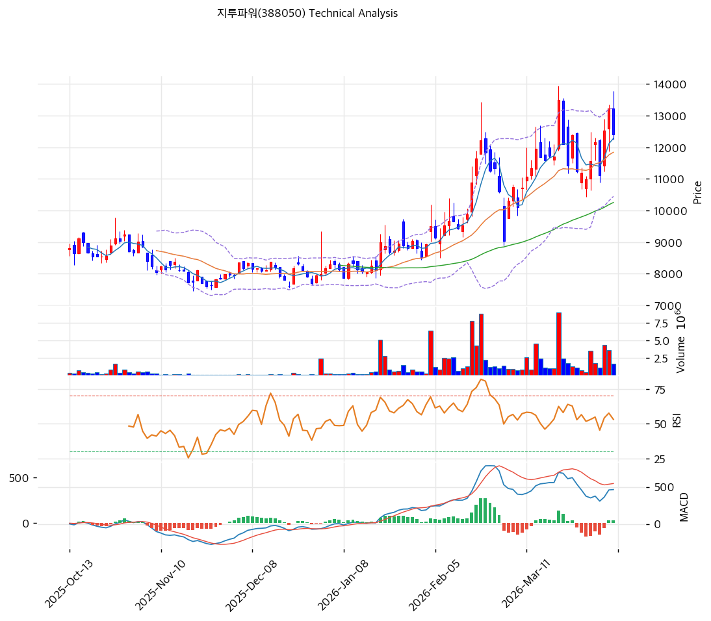

# 지투파워(388050) 기술적 분석

2026-04-07 | T2 Technical Analysis

---

## 차트

---

## 1. 가격 현황

| 항목 | 값 |
|------|-----|
| 현재가 | 12,410원 (-6.13%) |
| 52주 고가 | 13,500원 |
| 52주 저가 | 5,680원 |
| 52주 범위 위치 | 86.1% |
| 거래량 | 20일 평균 대비 0.73x |

---

## 2. 차트 패턴 분석

### 2.1 캔들스틱 패턴

| 패턴 | 위치 | 신뢰도 | 해석 |
|------|------|--------|------|
| 음봉 (장대음봉) | 최근 1일 (2026-04-07) | 중 | 당일 -6.13% 급락 캔들. 단기 매도 압력 출현이나 52주 저가(5,680원) 대비 86% 위치에서 발생해 추세 전환보다 차익실현 성격이 강함 |
| 단기 상승 후 조정 | 최근 5~10일 | 중 | 52주 고가(13,500원) 근방에서 저항 확인 후 단기 되돌림 진행 중. 추세 전환보다 건강한 조정 국면으로 해석 |

※ 주요 캔들 패턴: 망치형, 역망치형, 장악형(상승/하락), 도지, 샛별/석별, 적삼병/흑삼병, 하라미, 유성형, 교수형 등

### 2.2 가격 구조 패턴

- **고점 근방 조정 (신뢰도: 중)**
  현재가 12,410원은 52주 고가 13,500원 대비 -8.1% 수준으로, 신고가 돌파 직전 저항 구간에서 조정을 받고 있다. MA20(11,840원)을 지지선으로 유지하는 한 상승 추세의 정배열이 아닌 비정배열 상태이지만 단기 지지는 확인된 상황이다. MA20 이탈 여부가 향후 방향성의 핵심 분기점이 된다.

- **52주 저가 대비 118% 반등 구조 (신뢰도: 강)**
  5,680원(52주 저가)에서 13,500원(52주 고가)까지 약 138% 급등한 후 현재 12,410원에서 숨고르기 중이다. 저점 대비 여전히 상승률이 높아 단기 차익 매물이 지속 출회할 수 있으며, 새로운 상승 모멘텀이 나타나기 전까지 12,000~13,500원 박스권 가능성이 있다.

### 2.3 다이버전스

- **RSI 중립 수렴 (신뢰도: 약)**
  RSI(14) 값이 55.2로 과매수(70)에 이르지 못한 채 가격이 52주 고가에 근접했다는 점은 미약한 하락 다이버전스 성격을 띤다. 가격 상승 속도에 비해 RSI 모멘텀이 둔화된 상태로, 추가 상승 여력이 제한될 수 있음을 시사한다.

- **MACD 히스토그램 수축 (신뢰도: 중)**
  MACD(463) > Signal(434)로 매수 구간이나 히스토그램(+29)이 확장하지 않고 수축 중이다. 모멘텀은 매수 방향이나 힘이 약화되고 있어 단기 추가 상승보다 횡보·조정 가능성이 높음을 시사하는 히든 다이버전스 성격이다.

### 2.4 패턴 종합 판단

52주 고가(13,500원) 근방에서 -6.13% 급락이 발생하며 단기 저항을 확인했다. 캔들스틱은 단기 매도 압력을 나타내고, RSI·MACD 모두 모멘텀 약화를 시사하고 있다. 그러나 MA20(11,840원) 이상을 유지하는 한 중기 상승 추세가 훼손된 것은 아니며, 11,840~12,410원 구간에서 단기 지지력을 확인하는 과정으로 해석된다. 상충 시그널(MA 위치는 지지, 캔들·다이버전스는 조정 경고)이 혼재하므로 추격 매수보다 지지 확인 후 진입이 적절하다.

---

## 3. 이동평균선 — 비정배열 (단기 강세)

| MA | 값 | 현재가 괴리율 | 위치 |
|----|-----|--------------|------|
| MA5 | 12,280원 | +1.1% | 위 |
| MA20 | 11,840원 | +4.8% | 위 |
| MA60 | 10,252원 | +21.0% | 위 |
| MA120 | 9,260원 | +34.0% | 위 |
| MA200 | 9,277원 | +33.8% | 위 |

**해석**: 현재가가 5개 이동평균선 전부를 상회하는 강세 구조다. 그러나 MA5(12,280) > MA20(11,840) 순서이지만 MA60(10,252) > MA120(9,260) ≈ MA200(9,277) 배열에서 MA120과 MA200이 역전되지 않아 완전한 정배열은 아니다. MA120·MA200이 9,260~9,277원에서 강력한 장기 지지선 역할을 하며, 현재가는 장기 MA 대비 33~34% 위에 위치해 단기적으로 과열 가능성도 존재한다. MA20(11,840원)이 1차 지지이며, MA60(10,252원)은 중기 지지로 기능할 것이다.

---

## 4. 보조 지표

### RSI(14) — 55.2 (중립)

RSI 55.2는 중립 구간(40~60)에 위치해 과매수·과매도 어느 쪽도 아니며, 당일 -6.13% 급락 이후에도 즉각적인 매수 신호는 발생하지 않았다. 추가 조정 시 RSI 40~45 구간 진입 여부가 단기 매수 타이밍의 참고 지표가 될 수 있다.

### MACD(12,26,9)

| 항목 | 값 |
|------|-----|
| MACD | 463 |
| Signal | 434 |
| Histogram | +29 |
| 크로스 상태 | 매수 구간 (수축 중) |

**해석**: MACD가 Signal선 위에 있어 매수 구간이나, 히스토그램이 수축(확장하지 않음)하고 있어 상승 모멘텀이 약화 중이다. 히스토그램이 0선 아래로 전환되지 않는 한 추세 자체가 반전됐다고 보기는 어려우며, 현재는 모멘텀 둔화에 따른 조정 국면으로 해석된다.

### 볼린저밴드(20, 2σ)

| 항목 | 값 |
|------|-----|
| 상단 | 13,236원 |
| 중단 (MA20) | 11,840원 |
| 하단 | 10,445원 |
| 밴드 폭 | 23.6% |
| 현재 위치 | 중간 |

**해석**: 현재가(12,410원)가 밴드 중단(11,840원)과 상단(13,236원) 사이에 위치해 중간 구간이다. 밴드 폭 23.6%는 변동성이 확장된 상태로, 스퀴즈(수축) 이후 방향 돌파 국면은 이미 진행 완료됐다. 상단(13,236원)은 저항, 중단(11,840원)은 지지로 작동하며, 중단 이탈 시 하단(10,445원)까지 하락 가능성을 배제할 수 없다.

### 스토캐스틱(14, 3, 3)

| 항목 | 값 |
|------|-----|
| Slow %K | 65.1 |
| Slow %D | 53.5 |
| 크로스 상태 | 골든크로스 |
| 판단 | 중립 |

---

## 5. 지지/저항

| 구분 | 가격 | 근거 |
|------|------|------|
| 저항 | 13,500원 | 52주 고가 |
| 저항 | 13,387원 | 피봇 R1 |
| 저항 | 13,236원 | 볼린저밴드 상단 |
| **현재가** | **12,410원** | — |
| 지지 | 11,840원 | MA20 / 볼린저밴드 중단 |
| 지지 | 11,837원 | 피봇 S1 |
| 지지 | 11,263원 | 피봇 S2 |
| 지지 | 10,445원 | 볼린저밴드 하단 |
| 지지 | 10,252원 | MA60 |

---

## 6. 시그널 종합

| 지표 | 내용 | 시그널 |
|------|------|--------|
| **차트 패턴** | 52주 고가 근방 조정, 캔들 단기 매도 압력 + 다이버전스 약화 | ⚪ |
| 이동평균선 | 비정배열, MA20 +4.8% (모든 MA 상회) | ⚪ |
| RSI | 55.2 — 중립 | ⚪ |
| MACD | 매수 구간, 히스토그램 수축 중 | ⚪ |
| 볼린저밴드 | 중간 위치, 밴드 폭 23.6% 확장 | ⚪ |
| 스토캐스틱 | 골든크로스, K=65.1 중립 | ⚪ |
| 거래량 | 0.73x — 약함 | ⚪ |

**종합 판단**: 🟢 매수 0개 / 🔴 매도 0개 / ⚪ 중립 7개 → **중립**

모든 보조지표가 중립 신호를 내고 있는 가운데, 당일 -6.13% 급락으로 단기 조정이 시작됐다. 현재가는 MA20(11,840원)을 지지선으로 둔 강세 구조는 유지 중이나, 52주 고가(13,500원) 근방에서 저항을 확인한 만큼 추격 매수는 자제해야 한다. 거래량이 20일 평균의 0.73배로 약해 방향성 돌파보다 단기 변동성 구간으로 해석된다. 단기적으로 11,840~12,400원 박스권에서 지지 확인 후 방향성을 결정하는 것이 적절하며, MA20 이탈 시 11,263원(피봇 S2)까지 추가 하락 가능성에 유의해야 한다.

---

## 7. 전략 제안

### 보유 중인 경우
- **홀드**
- 익절 라인: 13,387원 (피봇 R1 / 52주 고가 13,500원 직전 저항)
- 손절 라인: 11,263원 (피봇 S2 이탈 시 중기 지지 붕괴)
- 리스크/리워드: 약 1:1.0 (12,410 기준, 상승폭 977 vs 하락폭 1,147)

### 진입 대기인 경우
- **진입가능 (조건부)**
- 1차 진입가: 11,837원 (피봇 S1 / MA20 11,840원 근방 지지 확인 시)
- 2차 진입가: 11,263원 (피봇 S2 — 추가 하락 시 저가 매수 구간)
- 진입 조건: MA20(11,840원) 지지 확인 후 거래량 동반 반등 캔들 출현 시 진입. 단, MA20 이탈 후 재차 하락하면 MA60(10,252원)까지 추격 매수 금지. 스토캐스틱 %K > %D 골든크로스 유지와 RSI 50선 회복을 함께 확인 후 진입하는 것이 안전하다.
