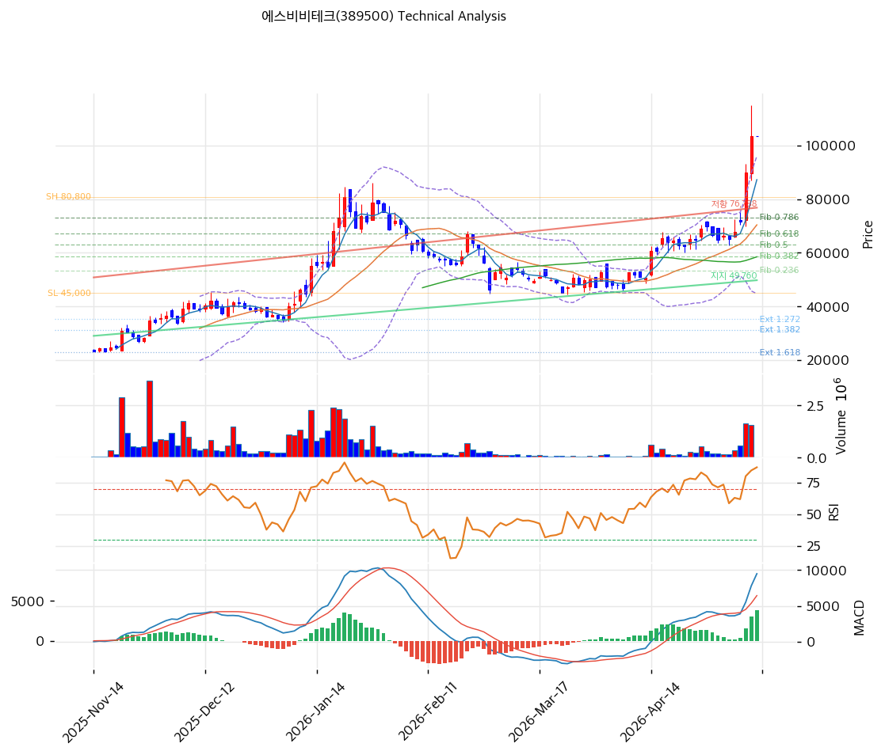

# 에스비비테크(389500) 기술적 분석

2026-05-13 | T2 Technical Analysis

---

## 차트

---

## 1. 가격 현황

| 항목 | 값 |
|------|---|
| 현재가 | 103,300원 (0.0%) |
| 52주 고가 | 103,300원 |
| 52주 저가 | 18,800원 (5.5배) |
| 52주 범위 위치 | 100.0% (신고가) |
| 거래량 | 차트 폭증 동반 |

---

## 2. 차트 패턴

- **장기 박스 상향 가속**: 18,800→103,300원 +449% 폭등
- **거래량 동반 양봉 + 적삼병**
- **단기 윗꼬리 출현** — 차익실현 압력

---

## 3. 이동평균선 — 극단 과열

| MA | 값 | 괴리율 |
|---|---:|---:|
| MA5 | 87,220 | +18.4% |
| MA20 | 70,375 | **+46.8%** |
| MA60 | 58,475 | +76.7% |
| MA120 | 52,718 | +96.0% |
| MA200 | 40,833 | **+153.0%** |

**평균회귀 1차 MA5 (87,220원, -15.6%), 2차 MA20 (70,375원, -31.9%)**

---

## 4. 보조 지표

- **RSI 83.8** 🔴 극단 과매수
- **MACD 9,492 > 5,666** 매수 폭발 (hist +3,826)
- **BB 상단 +7.6% 이탈, 폭 72.9% 극단 확장**
- **스토캐스틱 K=82.7** 과매수

---

## 5. 지지/저항

| 구분 | 가격 | 근거 |
|---|---:|---|
| **현재가** | **103,300원** | 52주 신고가 |
| 지지 | 87,220 | MA5 |
| 지지 | 80,800 | 직전 Swing High |
| 지지 | 73,139 | 피보 0.786 |
| 지지 | 70,375 | MA20 (1차 매수) |
| 지지 | 67,124 | 피보 0.618 |
| 지지 | 62,900 | 피보 0.5 |
| 지지 | 58,475 | MA60 |

---

## 6. 시그널 종합

| 지표 | 시그널 |
|---|---|
| MA | 🟢/🔴 (극단 과열) |
| RSI 83.8 | 🔴 |
| MACD | 🟢 |
| BB 폭 72.9% | ⚪ |
| 스토캐스틱 82.7 | 🔴 |
| 거래량 | 🟢 |

**종합**: 🟢 2 / 🔴 3 / ⚪ 2 → **매도우위 (극단 과열)**

펀더멘털 (5년 적자·PBR 55x·자본 침식) + 단기 극단 과열의 양면 리스크.

---

## 7. 전략

### 보유
- **비중축소 강력 권장**
- 익절: 105,366원 (1차)
- 손절: MA5 이탈 시 단계적 — 87,220원
- 평균회귀 압력 매우 강함

### 진입 대기
- **신규 진입 매우 신중**
- 1차: 70,375원 (MA20, -31.9%)
- 2차: 58,475원 (MA60, -43.4%)
- **펀더멘털 리스크 압도** — 휴머노이드 옵션 가치 베팅, 포지션 사이즈 매우 제한
