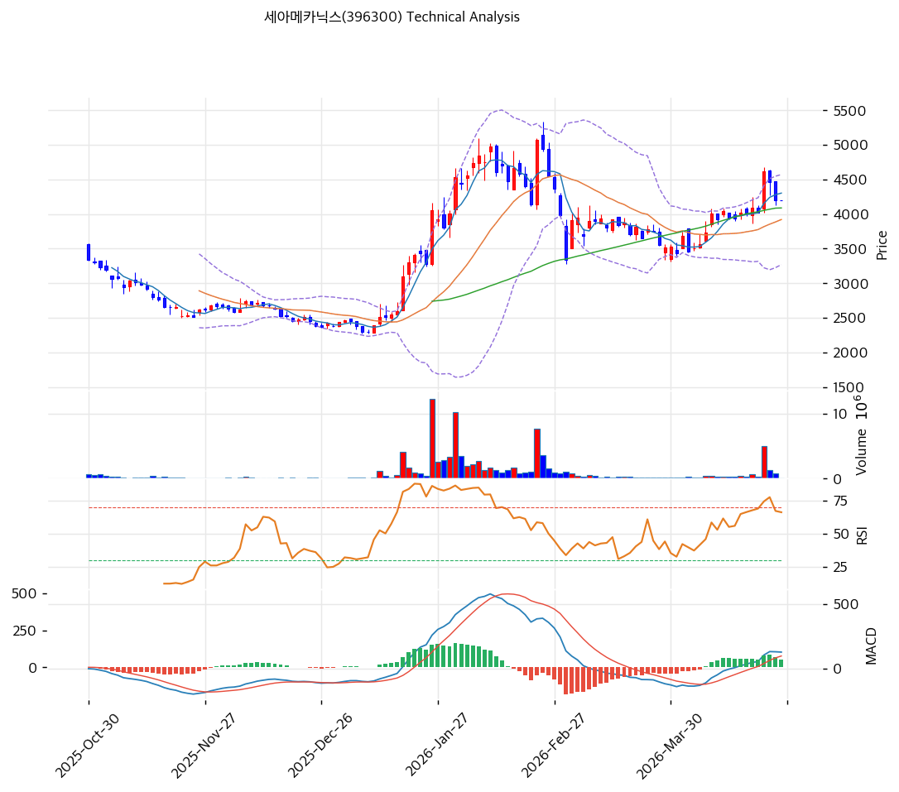

# 세아메카닉스(396300) 기술적 분석

2026-04-24 | T2 Technical Analysis

---

## 차트

---

## 1. 가격 현황

| 항목 | 값 |
|------|-----|
| 현재가 | 4,205원 (+0.00%) |
| 52주 고가 | 5,070원 |
| 52주 저가 | 2,135원 |
| 52주 범위 위치 | 70.5% |
| 거래량 | 20일 평균 대비 0.0x (거래 없음) |

---

## 2. 차트 패턴 분석

### 2.1 캔들스틱 패턴

| 패턴 | 위치 | 신뢰도 | 해석 |
|------|------|--------|------|
| 특이 패턴 없음 | — | — | 당일 거래량 0, 전일 종가 그대로 유지. 변동성 부재 구간 |

※ 거래량 0으로 당일 캔들 형성 없음. 직전 거래일 기준 캔들 분석 적용.

### 2.2 가격 구조 패턴

- **상승 추세 채널 내 중간 구간** (신뢰도: 중)
  추세선 분석 결과 상승 지지선(기울기 +6.74/일, 현재 교차가 3,208원)과 상승 저항선(기울기 +9.78/일, 현재 교차가 5,610원) 사이의 채널이 형성되어 있다. 현재가 4,205원은 이 채널 중간부에 위치하며, 채널 상단(5,610원)까지 약 33% 업사이드가 존재한다. 6개 접점으로 검증된 추세선으로 신뢰도가 높다.

- **피보나치 되돌림 0.5 수준에서의 저항 구간** (신뢰도: 중)
  52주 Swing High(5,070원)→Swing Low(3,430원) 기준 하락 되돌림 0.5 레벨(4,250원) 근접에서 현재가가 형성 중이다. 이 구간(4,205~4,303원)은 피봇 R1·R2·S1·S2와 MA5가 집중된 PRZ(강) 구간으로, 이 구간을 상향 돌파하면 다음 저항은 0.618(4,444원)→0.786(4,719원) 순이다.

- **52주 저점(2,135원) 대비 약 97% 상승 후 조정·소화 국면** (신뢰도: 중)
  2025년 초반 급등(2,135원→5,070원) 후 현재 조정 및 재상승 시도 중. 52주 포지션 70.5%는 고점권이 아닌 중간권으로, 추가 상승 여력이 있는 구간이다.

### 2.3 다이버전스

- **RSI 히든 상승 다이버전스 가능성** (신뢰도: 약)
  RSI 55.5(중립)로 명확한 다이버전스는 미형성. 가격이 저점을 높이는 과정에서 RSI가 유사 수준을 유지하는 히든 상승 패턴이 관찰될 수 있으나, 추세 확인 필요.

- **MACD 상승 모멘텀 유지** (신뢰도: 중)
  MACD(128) > Signal(76), Histogram +52로 매수 구간을 유지 중. 히스토그램이 수축 중(expand=False)이나 아직 음전환하지 않아 단기 매수 우위 구조가 살아 있다.

### 2.4 패턴 종합 판단

상승 추세 채널 내에서 피보나치 0.5 되돌림(4,250원) 저항 구간에 진입한 상태다. MACD 매수 구간 유지와 MA20·MA60 상향 위치는 긍정적이나, 스토캐스틱 데드크로스(K=66.1, D=76.2)와 MA5 하향 이탈(-2.3%)이 단기 조정 압력을 시사한다. 피봇-피보나치-MA5가 겹친 PRZ(강) 구간(4,205~4,303원)이 핵심 관문으로, 이 구간 안착 후 거래량 동반 돌파 여부가 단기 방향성을 결정한다.

---

## 3. 이동평균선 — 비정배열 (혼조)

| MA | 값 | 현재가 괴리율 | 위치 |
|----|---:|------------:|------|
| MA5 | 4,303원 | -2.3% | 아래 |
| MA20 | 3,921원 | +7.2% | 위 |
| MA60 | 4,088원 | +2.9% | 위 |
| MA120 | 3,414원 | +23.2% | 위 |
| MA200 | 3,358원 | +25.2% | 위 |

**해석**: MA20·MA60·MA120·MA200 모두 현재가 아래에 위치해 중장기 상승 추세를 지지하고 있다. 다만 MA5가 현재가(4,205원) 위(4,303원)에 있어 단기적으로 하방 압력이 존재하는 비정배열 상태다. MA20(3,921원)과 MA60(4,088원)이 강력한 동적 지지선으로 작동 중이며, MA120(3,414원)·MA200(3,358원)은 중장기 하방 경계선이다.

---

## 4. 보조 지표

### RSI(14) — 55.5 (중립)

RSI 55.5는 과매수(70 이상)·과매도(30 이하)의 중간 구간으로, 추세적 방향성보다는 관망 국면을 시사한다. 상승 추세 내 눌림목 후 재상승 시 RSI 55~65 구간에서 자주 확인되는 패턴이다.

### MACD(12,26,9)

| 항목 | 값 |
|------|---:|
| MACD | 128.0 |
| Signal | 76.0 |
| Histogram | +52.0 |
| 크로스 상태 | 매수 구간 (수축 중) |

**해석**: MACD(128) > Signal(76)로 매수 구간을 유지 중이나 히스토그램이 수축(+52, 직전 대비 감소)하며 모멘텀이 약화되고 있다. 히스토그램이 음전환하기 전까지는 추세 유효.

### 볼린저밴드(20, 2σ)

| 항목 | 값 |
|------|---:|
| 상단 | 4,572원 |
| 중단 (MA20) | 3,921원 |
| 하단 | 3,270원 |
| 밴드 폭 | 33.2% |
| 현재 위치 | 중간 |

**해석**: 밴드 폭 33.2%로 확장 국면이며 스퀴즈(수축) 상태가 아니다. 현재가가 중단(3,921원)과 상단(4,572원) 사이 중간부에 위치해 단기 추가 상승 여지가 있다. 상단(4,572원) 도달이 단기 목표.

### 스토캐스틱(14, 3, 3)

| 항목 | 값 |
|------|---:|
| Slow %K | 66.1 |
| Slow %D | 76.2 |
| 크로스 상태 | 데드크로스 |
| 판단 | 중립 |

---

## 5. 지지/저항 — 추세선 · 피보나치 · PRZ 통합

### 5.1 피보나치 되돌림/확장

| 구분 | 비율 | 가격 | 현재가 대비 |
|------|------|-----:|----------:|
| Swing High | — | 5,070원 | +20.6% |
| 되돌림 | 0.236 | 3,817원 | -9.2% |
| 되돌림 | 0.382 | 4,056원 | -3.5% |
| 되돌림 | 0.5 | 4,250원 | +1.1% |
| 되돌림 | 0.618 | 4,444원 | +5.7% |
| 되돌림 | 0.786 | 4,719원 | +12.2% |
| Swing Low | — | 3,430원 | -18.4% |
| 확장 | 1.272 | 2,984원 | -29.0% |
| 확장 | 1.382 | 2,804원 | -33.3% |
| 확장 | 1.618 | 2,416원 | -42.5% |
| 확장 | 2.0 | 1,790원 | -57.4% |

※ 피보나치 기준: 하락 추세 되돌림 (Swing High 5,070원 → Swing Low 3,430원)

### 5.2 추세선

| 추세선 | 방향 | 현재 교차가 | 포인트 수 | 해석 |
|--------|------|----------:|-------:|------|
| 지지선 | 상승 | 3,208원 | 6개 | 중장기 상승 추세 유지. 현재가 대비 -23.7% 하방. |
| 저항선 | 상승 | 5,610원 | 6개 | 상승 채널 상단. 현재가 대비 +33.4% 상방. |

### 5.3 PRZ (Potential Reversal Zone)

| 방향 | 가격 범위 | 신뢰도 | 근거 |
|------|--------:|--------|------|
| 저항 | 4,205~4,303원 | 강 | 피봇 R1·R2·S1·S2, 피보나치 0.5 되돌림, MA5 집중 |
| 지지 | 4,056~4,088원 | 약 | 피보나치 0.382 되돌림, MA60 |
| 지지 | 3,358~3,414원 | 약 | MA200, MA120 |

### 5.4 종합 지지/저항 테이블

| 구분 | 가격 | 근거 |
|------|-----:|------|
| 저항 | 5,610원 | 추세선 저항 (상승 채널 상단) |
| 저항 | 5,070원 | 52주 고가 |
| 저항 | 4,719원 | 피보나치 0.786 되돌림 |
| 저항 | 4,444원 | 피보나치 0.618 되돌림 |
| 저항 | 4,303원 | MA5, PRZ(강) 상단 |
| **현재가** | **4,205원** | — |
| 지지 | 4,088원 | MA60, PRZ(약) |
| 지지 | 4,056원 | 피보나치 0.382 되돌림 |
| 지지 | 3,921원 | MA20 |
| 지지 | 3,817원 | 피보나치 0.236 되돌림 |
| 지지 | 3,208원 | 추세선 지지 (상승 채널 하단) |

---

## 6. 시그널 종합

| 지표 | 내용 | 시그널 |
|------|------|--------|
| **차트 패턴** | 상승 채널 중간, 피보나치 0.5 저항 구간, 스토캐스틱 데드크로스 혼재 | ⚪ |
| 이동평균선 | 비정배열, MA5 -2.3% / MA20 +7.2% — 중장기 지지, 단기 약세 | ⚪ |
| RSI | 55.5 — 중립 | ⚪ |
| MACD | 매수 구간, 히스토그램 수축 중 | ⚪ |
| 볼린저밴드 | 중간 위치, 밴드폭 33.2% 확장 | ⚪ |
| 스토캐스틱 | 데드크로스, K=66.1 — 단기 모멘텀 약화 | ⚪ |
| 거래량 | 0.0x — 당일 거래 없음 | ⚪ |

**종합 판단**: 🟢 매수 0개 / 🔴 매도 0개 / ⚪ 중립 7개 → **중립**

PRZ(강) 구간(4,205~4,303원)에서 방향성을 탐색 중이다. MACD 매수 구간과 MA20·MA60·MA120·MA200 지지는 중장기 상승 추세를 유지하고 있으나, 스토캐스틱 데드크로스와 MA5 이탈, 거래량 부재가 단기 불확실성을 높인다. 거래량 동반 4,303원 이탈 성공 시 다음 저항은 피보나치 0.618(4,444원)이며, 반대로 4,088원(MA60·PRZ 약) 이탈 시 MA20(3,921원)이 주요 지지선이다.

---

## 7. 전략 제안

### 보유 중인 경우
- **홀드**
- 익절 라인: 5,171원 (추세선 저항 및 52주 고가 상향 돌파 구간)
- 손절 라인: 4,205원 (PRZ 강 구간 하단 이탈 시 재검토; 3,921원 MA20 이탈 시 청산)
- 리스크/리워드: 익절(5,171원) 기준 +22.9% vs 손절(3,921원) 기준 -6.8% ≈ 3.4:1

### 진입 대기인 경우
- **진입가능**
- 1차 진입가: 4,205원 (현재가, PRZ 강 구간 하단)
- 2차 진입가: 3,921원 (MA20 지지 확인)
- 진입 조건: 거래량 동반 4,303원 상향 돌파 확인 시 적극 매수; 또는 MA20(3,921원) 터치 후 반등 캔들 확인 시 2차 진입
