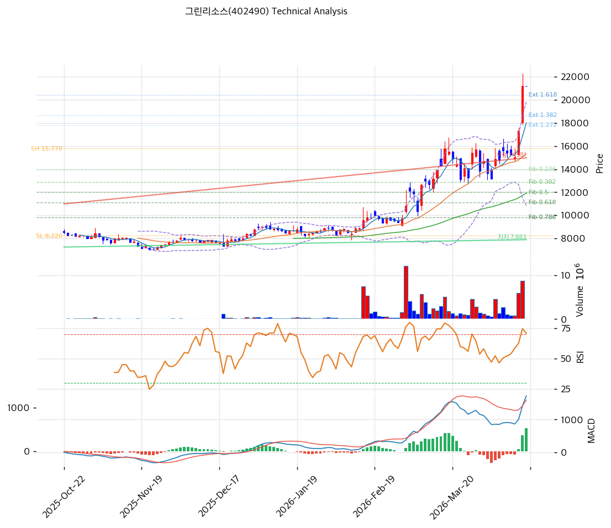

# 그린리소스(402490) 기술적 분석

2026-04-16 | T2 Technical Analysis

---

## 차트

---

## 1. 가격 현황

| 항목 | 값 |
|------|-----|
| 현재가 | 21,200원 (+0.00%) |
| 52주 고가 | 21,200원 |
| 52주 저가 | 6,253원 |
| 52주 범위 위치 | 100.0% |
| 거래량 | 20일 평균 대비 0.0x (데이터 미확인) |

---

## 2. 차트 패턴 분석

### 2.1 캔들스틱 패턴

| 패턴 | 위치 | 신뢰도 | 해석 |
|------|------|--------|------|
| 52주 신고가 안착 | 최근 | 강 | 현재가가 52주 고가인 21,200원에 위치하여 신고가 형성 국면. 추가 상승 모멘텀 유지 여부가 관건 |
| 과매수 구간 진입 | 최근 | 중 | RSI 74.8, 스토캐스틱 K=89.9로 과매수 영역 진입. 단기 조정 또는 횡보 가능성 상존 |

※ 주요 캔들 패턴: 52주 신고가 갱신 이후 추가 거래량 확인이 필요하나 거래량 데이터 미확인

### 2.2 가격 구조 패턴

- **상승 추세 지속** (신뢰도: 강)
  6,253원 저점에서 21,200원까지 약 239% 상승한 강력한 상승 추세가 진행 중이다. MA5(18,006원)~MA200(9,342원)까지 모든 이동평균선이 정배열을 형성하고 있어 추세의 건전성이 확인된다. 현재가가 52주 고가인 21,200원과 일치하므로 신고가 돌파 이후 추가 상승 목표는 피보나치 2.0 확장선인 23,320원이 다음 주요 목표가다.

- **과매수 조정 가능성** (신뢰도: 중)
  현재가가 MA20(15,341원)으로부터 +38.2% 이격, MA200(9,342원)으로부터 +126.9% 이격된 상태는 역사적으로 단기 조정이 선행되는 수준이다. 볼린저밴드 상단(19,835원)을 이미 상향 돌파한 상태로 밴드 폭 58.6%의 넓은 확장 구간에 위치한다.

### 2.3 다이버전스

- **RSI 과매수 경고** (신뢰도: 중)
  RSI 74.8로 과매수 영역(70 이상)에 진입. 현재가가 신고가를 갱신하는 동시에 RSI도 동반 상승하여 하락 다이버전스는 미발생 상태이나, 과매수 구간 자체가 단기 차익실현 압력으로 작용할 수 있다.

- **MACD 히스토그램 확대 지속** (신뢰도: 중)
  MACD(1,717)가 시그널(1,179)을 상회하며 히스토그램이 +538로 확대 중이다. 히든 상승 다이버전스에 가까운 구조로 단기 상승 추세 지속을 지지하나, 히스토그램 수축 전환 시점이 단기 고점 신호가 된다.

### 2.4 패턴 종합 판단

현재 그린리소스는 강력한 상승 추세 속에 52주 신고가(21,200원)를 갱신한 상태다. MACD 매수 신호와 정배열 이동평균이 추세 지속을 지지하는 반면, RSI 74.8과 스토캐스틱 K=89.9의 과매수 신호는 단기 조정 가능성을 경고한다. 상충하는 시그널 중 단기적으로는 과매수 해소를 위한 조정 압력이 우세하며, 중기 추세는 여전히 상승 기조를 유지하고 있다.

---

## 3. 이동평균선 — 정배열 (강세)

| MA | 값 | 현재가 괴리율 | 위치 |
|----|-----|--------------|------|
| MA5 | 18,006원 | +17.7% | 위 |
| MA20 | 15,341원 | +38.2% | 위 |
| MA60 | 11,926원 | +77.8% | 위 |
| MA120 | 9,966원 | +112.7% | 위 |
| MA200 | 9,342원 | +126.9% | 위 |

**해석**: MA5 → MA20 → MA60 → MA120 → MA200 순서로 완전한 정배열을 형성하고 있어 중장기 추세가 강하게 상승 중이다. 다만 모든 이동평균선으로부터의 이격이 역사적으로 매우 큰 수준(MA200 대비 +126.9%)이므로, 단기적으로 MA5(18,006원)~MA20(15,341원) 사이로의 되돌림 조정이 발생할 수 있다. MA20(15,341원)은 강력한 중기 지지선으로 기능한다.

---

## 4. 보조 지표

### RSI(14) — 74.8 (🔴 과매수)

RSI 74.8은 과매수 기준선(70)을 상회하며 강력한 상승 모멘텀을 반영하나, 과매수 구간에서의 차익실현 압력이 단기 주가 상방을 제한할 수 있다.

### MACD(12,26,9)

| 항목 | 값 |
|------|-----|
| MACD | 1,717 |
| Signal | 1,179 |
| Histogram | +538 |
| 크로스 상태 | 매수 구간 (확대 중) |

**해석**: MACD가 시그널을 상회하는 매수 구간에 있으며 히스토그램이 +538로 확대되고 있어 단기 상승 모멘텀이 강하게 지속 중이다. 히스토그램 수축 전환이 추세 약화의 초기 신호가 될 것이다.

### 볼린저밴드(20, 2σ)

| 항목 | 값 |
|------|-----|
| 상단 | 19,835원 |
| 중단 (MA20) | 15,341원 |
| 하단 | 10,847원 |
| 밴드 폭 | 58.6% |
| 현재 위치 | 상단 근접 (상단 돌파) |

**해석**: 현재가(21,200원)가 볼린저밴드 상단(19,835원)을 상향 돌파한 상태로, 밴드 폭이 58.6%로 크게 확장되어 있다. 밴드 돌파는 강한 추세의 지속을 의미하기도 하지만, 밴드 내로의 회귀 압력도 상존한다. 중단선(MA20=15,341원)이 1차 지지 기준선이다.

### 스토캐스틱(14, 3, 3)

| 항목 | 값 |
|------|-----|
| Slow %K | 89.9 |
| Slow %D | 80.7 |
| 크로스 상태 | 골든크로스 |
| 판단 | 과매수 |

---

## 5. 지지/저항 — 추세선 · 피보나치 · PRZ 통합

### 5.1 피보나치 되돌림/확장

| 구분 | 비율 | 가격 | 현재가 대비 |
|------|------|------|-----------|
| Swing High | — | 15,770원 | — |
| 되돌림 | 0.236 | 13,988원 | -34.0% |
| 되돌림 | 0.382 | 12,886원 | -39.2% |
| 되돌림 | 0.5 | 11,995원 | -43.4% |
| 되돌림 | 0.618 | 11,104원 | -47.6% |
| 되돌림 | 0.786 | 9,836원 | -53.6% |
| Swing Low | — | 8,220원 | — |
| 확장 | 1.272 | 17,824원 | -15.9% |
| 확장 | 1.382 | 18,654원 | -12.0% |
| 확장 | 1.618 | 20,436원 | -3.6% |
| 확장 | 2.0 | 23,320원 | +10.0% |

※ 피보나치 기준: 상승 추세 (Swing Low 8,220원 → Swing High 15,770원)
※ 현재가(21,200원)는 1.618 확장(20,436원)을 상향 돌파하여 2.0 확장(23,320원)이 다음 목표

### 5.2 추세선

| 추세선 | 방향 | 현재 교차가 | 포인트 수 | 해석 |
|--------|------|-----------|---------|------|
| 지지선 | 상승 | 7,883원 | 6개 | 6개 접점을 갖는 강력한 장기 상승 지지선. 현재가에서 크게 하락해 있어 즉각적 지지 역할보다는 중장기 추세 기준선 |
| 저항선 | 상승 | 14,981원 | 6개 | 상승 추세 내 저항선이 14,981원에 위치하며 현재는 이미 상향 돌파. 향후 되돌림 시 지지선으로 전환 가능 |

### 5.3 PRZ (Potential Reversal Zone)

| 방향 | 가격 범위 | 신뢰도 | 근거 |
|------|---------|--------|------|
| 지지 | 21,200원 | 강 | 피봇 R1, 피봇 R2, 피봇 S1, 피봇 S2 — 52주 신고가이자 피봇 포인트 집중 구간 |
| 지지 | 17,824~18,006원 | 약 | 피보나치 1.272 확장(17,824원) + MA5(18,006원) 중첩 |
| 지지 | 14,981~15,341원 | 약 | 추세선 저항 전환 지지(14,981원) + MA20(15,341원) 중첩 |

※ PRZ = 추세선 · 피보나치 · 피봇 · MA 등 복수 지표가 겹치는 가격 구간.

### 5.4 종합 지지/저항 테이블

| 구분 | 가격 | 근거 |
|------|------|------|
| 저항 | 23,320원 | 피보나치 2.0 확장선 — 다음 주요 목표가 |
| 저항 | 21,200원 | 52주 고가 / 피봇 R1·R2 집중 — 현재가 = 신고가 돌파 저항선 |
| **현재가** | **21,200원** | — |
| 지지 | 20,436원 | 피보나치 1.618 확장 — 직전 돌파 기준선 |
| 지지 | 17,824~18,006원 | PRZ (약) — 피보나치 1.272 확장 + MA5 |
| 지지 | 14,981~15,341원 | PRZ (약) — 추세선 저항→지지 전환 + MA20 |
| 지지 | 11,926원 | MA60 — 중기 추세 지지선 |
| 지지 | 7,883원 | 추세선 지지 (상승, 6개 접점) — 장기 지지 |

---

## 6. 시그널 종합

| 지표 | 내용 | 시그널 |
|------|------|--------|
| **차트 패턴** | 52주 신고가 갱신, 정배열 강세 추세 / 과매수 경고 상충 | ⚪ |
| 이동평균선 | 완전 정배열, MA20 +38.2% 이격 — 강세이나 과열 | 🟢 |
| RSI | 74.8 — 과매수 🔴 | 🔴 |
| MACD | 매수 구간, 히스토그램 +538 확대 중 | 🟢 |
| 볼린저밴드 | 상단 돌파, 밴드 폭 58.6% 확장 — 중립 | ⚪ |
| 스토캐스틱 | 골든크로스, K=89.9 과매수 | 🔴 |
| 거래량 | 0.0x — 데이터 미확인 | ⚪ |

**종합 판단**: 🟢 매수 2개 / 🔴 매도 2개 / ⚪ 중립 3개 → **중립 (단기 과열 경고)**

중장기 추세는 정배열·MACD 매수 신호로 여전히 상승 기조를 유지하고 있으나, RSI 74.8과 스토캐스틱 89.9의 과매수 신호, 52주 신고가 도달이라는 구조적 저항이 단기적으로 상방을 제한하고 있다. 현재가가 52주 고가인 21,200원에 위치해 있어 신고가 돌파 시 다음 목표는 피보나치 2.0 확장(23,320원)이나, 단기 조정 발생 시 MA5(18,006원)~MA20(15,341원) 구간이 핵심 지지선으로 기능할 것이다.

---

## 7. 전략 제안

### 보유 중인 경우
- **비중축소**
- 익절 라인: 23,320원 (피보나치 2.0 확장선)
- 손절 라인: 18,006원 (MA5 이탈 기준 — 단기 추세 훼손 신호)
- 리스크/리워드: 약 2.1x (상승 여력 +10.0% vs 하락 위험 -15.1%)

### 진입 대기인 경우
- **관망**
- 1차 진입가: 18,006~17,824원 (MA5 + 피보나치 1.272 확장 PRZ 구간)
- 2차 진입가: 15,341~14,981원 (MA20 + 추세선 지지 전환 PRZ 구간)
- 진입 조건: 과매수 지표 해소 후 거래량 동반 반등 확인. RSI 60 이하 조정 또는 MACD 히스토그램 수축 후 재확대 시 진입 검토
