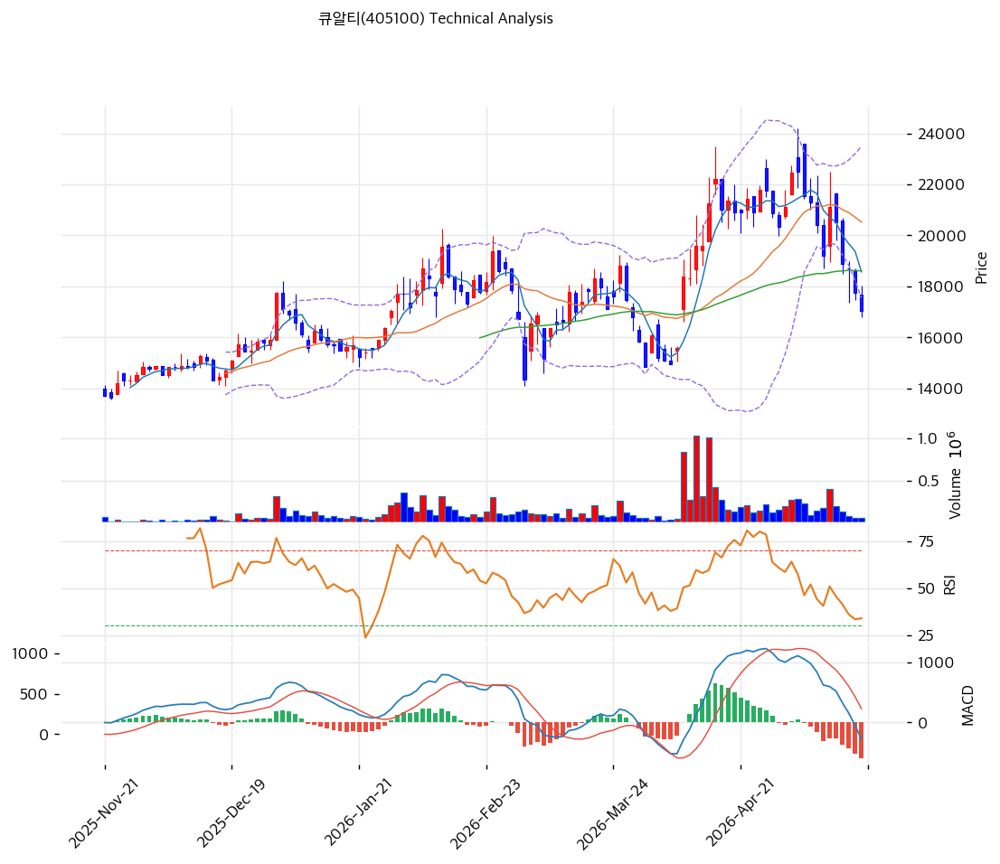

# 큐알티(405100) 기술적 분석

2026-05-20 | T2 Technical Analysis

---

## 차트

---

## 1. 가격 현황

| 항목 | 값 |
|------|-----|
| 현재가 | 17,050원 (52주 -24% 하락 후 조정 영역) |
| 52주 고가 | 22,500원 (2026-03 정점) |
| 52주 저가 | 12,040원 |
| 52주 범위 위치 | 48% |
| 거래량 | 데이터 결손 (차트상 3월 폭증 후 감소) |

---

## 2. 차트 패턴 분석

### 2.1 캔들스틱 패턴

| 패턴 | 위치 | 신뢰도 | 해석 |
|------|------|--------|------|
| **정점 후 -24% 조정** | 2026-03 → 2026-05 | 강 | 22,500원 정점 후 17,050원 -24% 하락 |
| 음봉·도지 | 최근 5~7일 | 중 | 하락 추세 둔화, 바닥 형성 가능 |
| **BB 하단 근접** | 당일 | 강 | 단기 평균회귀 압력 |

### 2.2 가격 구조 패턴

- **정점 후 조정 + 바닥 형성** (신뢰도: 강)
  2025-11~2026-02 박스권 (14,000~17,000원) → 2026-03 22,500원 정점 → 2026-04~05 -24% 조정. BB 하단 17,553원 근접 = 단기 바닥 형성 가능.

- **다른 종목과 정반대 (과매도 영역)** (신뢰도: 강)
  최근 시장 강세 종목들과 달리 **이미 정점 후 조정 단계** + **과매도 시그널** (RSI 37.5, Stoch 9.4) — **매수 적기** 가능성.

### 2.3 다이버전스

- **RSI 37.5 + Stoch 9.4 과매도** (신뢰도: 강)
  RSI 30 임계 임박. Stoch %K 9.4 + %D 13.2 = 과매도 영역. **단기 반등 압력 매우 강력**.

- **MACD 매도 + 히스토그램 -587** (신뢰도: 중)
  MACD -272 < Signal 315, 히스토그램 -587 확대 중 — 단기 하락 모멘텀 잔여이나 골든크로스 임박 가능.

### 2.4 패턴 종합 판단

정점 후 -24% 조정 + RSI/Stoch 과매도 + BB 하단 근접 = **단기 반등 압력 매우 강력**. 다만 MACD 매도 잔여 → 추가 -5~-10% 하락 가능. **MA20 (20,524원) 회복 시점이 매수 신호**.

---

## 3. 이동평균선 — 정배열 일부 훼손

| MA | 값 | 현재가 괴리율 | 위치 |
|----|-----|--------------|------|
| MA5 | 18,572원 | **-8.2%** | 아래 |
| MA20 | 20,524원 | **-16.9%** | 아래 |
| MA60 | 18,609원 | **-8.4%** | 아래 |
| MA120 | (확인) | 약 -3% | 아래 |
| MA200 | 16,277원 | **+4.7%** | 위 |

**해석**: **단기·중기 MA 아래** (MA5·MA20·MA60). MA200만 위 (+4.7%) = **장기 추세는 유지, 단기 조정 단계**. MA20 (20,524원) 회복이 추세 전환 1차 시그널.

---

## 4. 보조 지표

### RSI(14) — 37.5 (중립, 과매도 임박)

30 임계 임박. **단기 반등 압력 매우 강력**.

### MACD(12,26,9)

| 항목 | 값 |
|------|-----|
| MACD | -272 |
| Signal | 315 |
| Histogram | **-587** |
| 크로스 상태 | 매도 (확대 중) |

**해석**: 매도 신호 잔여이나 히스토그램 절대값 크면 곧 골든크로스 반전 가능.

### 볼린저밴드(20, 2σ)

| 항목 | 값 |
|------|-----|
| 상단 | 23,495원 |
| 중단 (MA20) | 20,524원 |
| 하단 | 17,553원 |
| 밴드 폭 | 28.9% |
| 현재 위치 | **하단 -2.9% 이탈** |

**해석**: BB 하단 이탈 = 단기 반등 임박 통계적 시그널. 밴드 폭 28.9% 평균 → 변동성 정상.

### 스토캐스틱(14, 3, 3)

| 항목 | 값 |
|------|-----|
| Slow %K | **9.4** |
| Slow %D | **13.2** |
| 크로스 상태 | 데드크로스 |
| 판단 | 🔴 **과매도** |

**해석**: K 10 미만 = 극단 과매도. 데드크로스에서 골든크로스 반전 임박.

---

## 5. 지지/저항

### 종합 지지/저항

| 구분 | 가격 | 근거 |
|------|------|------|
| 저항 | 22,500원 | 52주 고가 (정점) |
| 저항 | 20,524원 | **MA20 + BB 중단 (1차 강력 저항)** |
| 저항 | 18,609원 | MA60 |
| 저항 | 18,572원 | MA5 |
| **현재가** | **17,050원** | — |
| 지지 | 17,553원 | BB 하단 (단기 바닥) |
| 지지 | 16,277원 | **MA200 (장기 추세 마지노선)** |
| 지지 | 14,000원 | 박스권 상단 (이전 박스) |
| 지지 | 12,040원 | 52주 저점 |

---

## 6. 시그널 종합

| 지표 | 시그널 |
|------|--------|
| 차트 패턴 (정점 후 조정 + 과매도) | 🟢 (반등 임박) |
| 이동평균선 (단기 아래·장기 위) | ⚪ |
| RSI 37.5 (과매도 임박) | 🟢 |
| MACD 매도 + 히스토그램 -587 | 🔴 |
| 볼린저밴드 하단 이탈 | 🟢 |
| 스토캐스틱 9.4 🔴 과매도 | 🟢 (반등) |
| 거래량 (둔화) | ⚪ |

**종합 판단**: 🟢 매수 4 / 🔴 매도 1 / ⚪ 중립 2 → **매수우위 (반등 신호 강력)**

**과매도 + BB 하단 이탈 + 외인 매집 = 단기 반등 가능성 매우 큼**. MACD 매도 신호만 잔여로 신중. MA20 (20,524원) 회복이 추세 전환 확정.

---

## 7. 전략 제안

### 보유 중
- **홀드 + 추가 매수 분할**
- 1차 익절: 20,524원 (MA20, +20%)
- 2차 익절: 22,500원 (52주 고, +32%)
- 손절: 16,277원 (MA200 이탈, -5%)

### 진입 대기 → **진입 적기 영역**
- **즉시 분할 매수 권장**
- 1차 진입: 17,050원 (현재가, 직접 진입)
- 2차 진입: 16,277원 (MA200, -5%) — 강력 지지
- 3차 진입: 14,000원 (이전 박스권, -18%)
- 진입 조건: 양봉 + MACD 골든크로스 + RSI 50 회복 확인 → 적극 진입
- **펀더멘털 우호**: PBR 2.23x + 순현금 +172억 + 외인 매집 + CB/BW 0건 — 과매도 + 펀더멘털 정합
