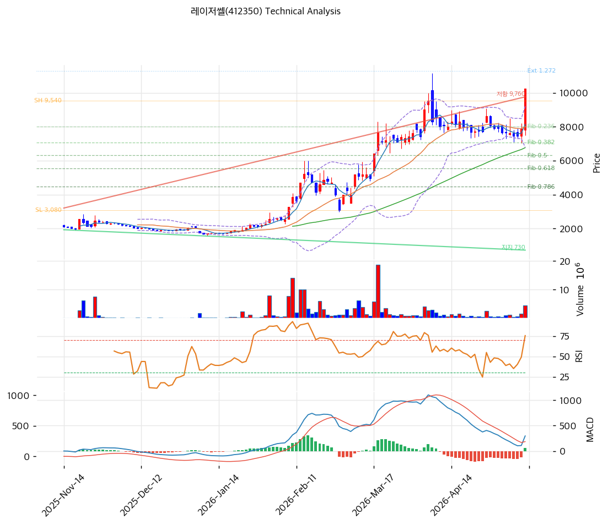

# 레이저쎌(412350) 기술적 분석

2026-05-13 | T2 Technical Analysis

---

## 차트

---

## 1. 가격 현황

| 항목 | 값 |
|------|---|
| 현재가 | 10,240원 (+29.95%, 상한가) |
| 52주 고가 | 10,240원 |
| 52주 저가 | 1,692원 (6.1배 상승) |
| 52주 범위 위치 | 100.0% |
| 거래량 | 20일 평균 대비 **4.99x** 강력 동반 |

---

## 2. 차트 패턴 분석

### 2.1 캔들스틱

| 패턴 | 위치 | 신뢰도 | 해석 |
|---|---|---|---|
| 상한가 (+29.95%) | 당일 | 강 | CPO 양산 첫 수주 호재 |
| 거래량 5x 동반 | 당일 | 강 | 강력 매수세 |
| 박스권 상향 돌파 | 2~3월 | 강 | 2,000~6,000원 박스 → 9,000원대 폭증 |

### 2.2 가격 구조

- **장기 박스권 상향 돌파 + 가속**
- 25-11 약 1,700~3,000원 박스 → 26-02 박스 돌파 + 9,540원 1차 고점 → 5월 10,240원 상한가
- 채널 상단 +10% 이탈 영역

### 2.3 다이버전스

- RSI 73 과매수
- MACD 매수 (297 > 241, hist +56) — 모멘텀 둔화

### 2.4 종합 판단

상한가 + 거래량 5x + CPO 양산 첫 수주 호재의 단기 폭증. **RSI 73 + MA20 +28% 과열 신호** 동반. 추세 강세이나 단기 평균회귀 압력.

---

## 3. 이동평균선 — 정배열 (극단 누적)

| MA | 값 | 괴리율 |
|---|---:|---:|
| MA5 | 8,134 | +25.9% |
| MA20 | 8,000 | **+28.0%** |
| MA60 | 6,764 | +51.4% |
| MA120 | 4,450 | +130.1% |
| MA200 | 3,695 | **+177.1%** |

**해석**: 정배열, MA200 +177.1% 6개월 누적 폭등. MA20 +28.0% 임계 초과. 평균회귀 1차 MA5 (8,134, -20.6%), 2차 MA20 (8,000, -21.9%).

---

## 4. 보조 지표

### RSI(14) — 73.0 🔴 과매수

70 임계 초과.

### MACD(12,26,9)

| 항목 | 값 |
|---|---:|
| MACD | 297 |
| Signal | 241 |
| Histogram | +56 (확대 둔화) |
| 크로스 | 매수 |

매수 유지이나 모멘텀 확대 둔화.

### 볼린저밴드

| 항목 | 값 |
|---|---:|
| 상단 | 9,207 |
| 중단 | 8,000 |
| 하단 | 6,794 |
| 폭 | 30.2% |
| 위치 | 상단 +11.2% 이탈 |

상단 +11% 이탈, 폭 확장.

### 스토캐스틱

| 항목 | 값 |
|---|---:|
| %K | 53.2 |
| %D | 32.3 |
| 크로스 | 골든크로스 |
| 판단 | 중립 |

K/D 모두 80 미만 — 추가 상승 여지.

---

## 5. 지지/저항

### 피보나치

| 구분 | 비율 | 가격 | 현재가 대비 |
|---|---|---:|---:|
| Swing High | — | 9,540 | -6.8% |
| 되돌림 | 0.236 | 8,015 | -21.7% |
| 되돌림 | 0.382 | 7,072 | -30.9% |
| 되돌림 | 0.5 | 6,310 | -38.4% |
| 되돌림 | 0.618 | 5,548 | -45.8% |
| 되돌림 | 0.786 | 4,462 | -56.4% |
| Swing Low | — | 3,080 | -69.9% |
| 확장 | 1.272 | 11,297 | +10.3% |
| 확장 | 1.382 | 12,008 | +17.3% |
| 확장 | 1.618 | 13,532 | +32.1% |
| 확장 | 2.0 | 16,000 | +56.3% |

### 종합

| 구분 | 가격 | 근거 |
|---|---:|---|
| 저항 | 12,008 | 피보 1.382 |
| 저항 | 11,297 | 피보 1.272 |
| **현재가** | **10,240** | — |
| 지지 | 8,134 | MA5 |
| 지지 | 8,015 | 피보 0.236 |
| 지지 | 8,000 | MA20 |
| 지지 | 7,072 | 피보 0.382 |
| 지지 | 6,764 | MA60 |
| 지지 | 6,310 | 피보 0.5 |

---

## 6. 시그널 종합

| 지표 | 시그널 |
|---|---|
| MA 정배열 | 🟢/🔴 (과열) |
| RSI 73 | 🔴 |
| MACD | ⚪ (확대 둔화) |
| BB +11% 이탈 | ⚪ |
| 스토캐스틱 K=53 | ⚪ |
| 거래량 5x | 🟢 |

**종합**: 🟢 2 / 🔴 2 / ⚪ 3 → **중립 (상한가 모멘텀)**

상한가 + 거래량 5x의 강력 모멘텀이나 펀더멘털 (5년 적자·자본 침식) 리스크 압도.

---

## 7. 전략

### 보유
- **부분 차익실현**
- 익절: 10,445원 (Swing High +α)
- 손절: 6,587원 (-35.6%)

### 진입 대기
- **신규 진입 매우 신중** (펀더멘털 리스크)
- 1차 진입: 8,413원 (MA5+α, -17.8%)
- 2차 진입: 8,000원 (MA20, -21.9%)
- 펀더멘털 트리거 (2026 Q1 흑전·감사 회복) 확인 후 권장
