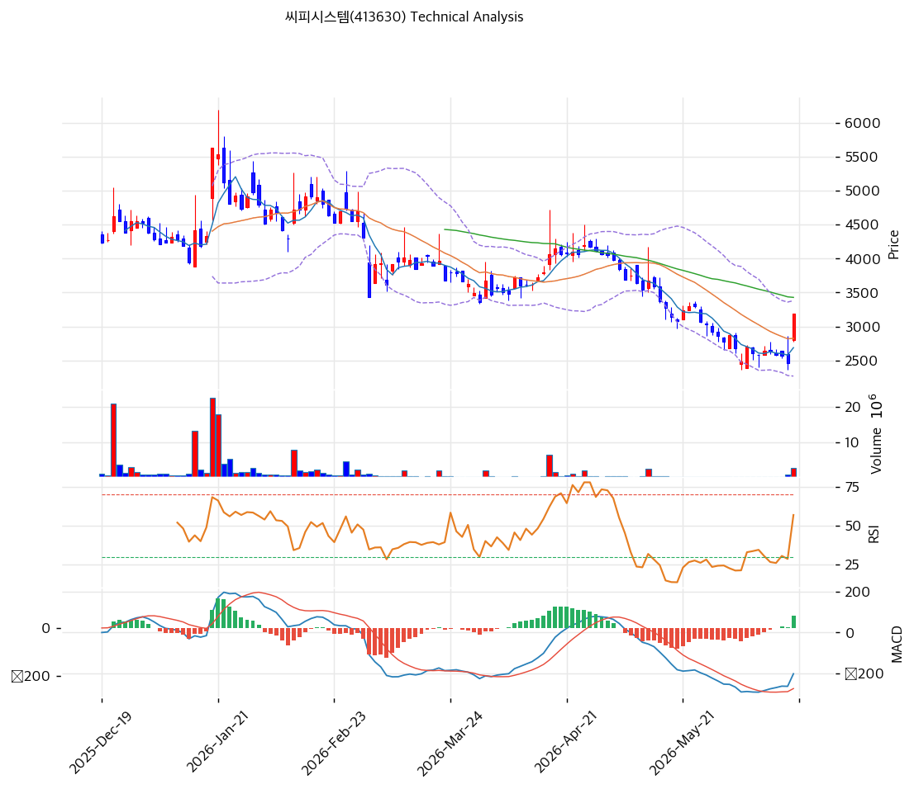

# 씨피시스템(413630) 기술적 분석

2026-06-20 | T2 Technical Analysis

---

## 차트

---

## 1. 가격 현황

| 항목 | 값 |
|------|-----|
| 현재가 | 3,195원 (+29.88%, 상한가) |
| 52주 고가 | 5,630원 |
| 52주 저가 | 1,234원 |
| 52주 범위 위치 | 44.6% (중단) |
| 거래량비 | **14.34x** (폭증) |
| RSI | 56.2 (중립) |

> 52주 고가(5,630원)에서 조정받아 저점권까지 밀렸다가 인텔 공급 호재로 상한가(거래량 14.3x 폭증). 현재 단기선(MA5 2,689·MA20 2,826) 위로 반등했으나 **중장기선(MA60 3,429·MA120 3,928·MA200 3,737) 아래**로 아직 큰 하락 추세 내 반등 국면. RSI 56.2 중립으로 과매수 아님(추가 여력). 한울반도체와 달리 신고가가 아닌 **저점 반등** 성격.

---

## 2. 차트 패턴 분석

### 2.1 캔들스틱 패턴

| 패턴 | 위치 | 신뢰도 | 해석 |
|------|------|--------|------|
| 거래량 폭증 상한가 | 3,195원 | 중상 | 강한 매수 유입(반전 시도) |
| 단기선 회복 | MA5·MA20 상향 돌파 | 중 | 단기 반등 |
| MA60 저항 시험 | 3,195 → MA60 3,429 | 중 | 추세 전환 분수령 |

※ 주요 캔들 패턴: 망치형, 역망치형, 장악형, 도지, 샛별/석별, 적삼병/흑삼병, 하라미, 유성형, 교수형 등

### 2.2 가격 구조 패턴

- **하락 추세 내 강한 반등 시도** (신뢰도: 중상)
  5,630→저점 후 인텔 호재로 거래량 14.3x 폭증 반등. MA60(3,429) 돌파 시 추세 전환, 실패 시 박스 회귀.

- **저점 대비 회복 초기** (신뢰도: 중)
  52주 범위 44.6%로 중단. 과매수 아님(RSI 56)이라 추가 상승 여력 존재하나 중장기선 저항 다수.

※ 주요 구조 패턴: 이중천정/바닥, 삼각수렴, 쐐기형, 깃발형, 페넌트, 컵앤핸들, 박스권 등

### 2.3 다이버전스

- **반등 모멘텀 회복** (신뢰도: 중상)
  MACD 매수 전환(히스토그램 +)·스토캐 골든크로스(K=47.8)로 모멘텀 회복. RSI 56 중립으로 과열 부담 적어 반등 지속 여지.

※ RSI·MACD 기반 | 상승 다이버전스 = 가격↓ 지표↑, 하락 다이버전스 = 가격↑ 지표↓

### 2.4 패턴 종합 판단

52주 고가(5,630원)에서 조정받은 뒤 인텔 공급 호재로 거래량 14.3x 폭증하며 상한가를 친 **하락 추세 내 강한 반등** 국면이다. 단기선(MA5·MA20)을 회복했고 MACD 매수 전환·스토캐 골든크로스로 모멘텀이 살아났으며, RSI 56.2로 과매수가 아니라 추가 상승 여력이 있다. 다만 **중장기선(MA60 3,429·MA200 3,737)이 위에서 저항**으로 버티고 있어, MA60(3,429) 돌파·안착 여부가 단기 추세 전환의 분수령이다. 돌파 시 피보 0.5(3,706)·52주 고가(5,630) 방향, 실패 시 MA20(2,826)·피봇 S1(2,918)으로 되돌림. 우량 재무가 하방을 받치나 테마성 변동(거래량 14x)이 커 분할 대응이 유효.

---

## 3. 이동평균선 — 단기 반등·중장기 저항

| MA | 값 | 현재가 괴리율 | 위치 |
|----|-----|--------------|------|
| MA5 | 2,689 | +18.8% | 위 |
| MA20 | 2,826 | +13.1% | 위 |
| MA60 | 3,429 | -6.8% | 아래 |
| MA120 | 3,928 | -18.7% | 아래 |
| MA200 | 3,737 | -14.5% | 아래 |

**해석**: 현재가가 단기선(MA5·MA20) 위로 **단기 반등**이나, 중장기선(MA60 3,429·MA120 3,928·MA200 3,737) 아래로 **여전히 큰 하락 추세 내**에 있다(정배열 아님). MA60(3,429) 돌파가 추세 전환의 1차 관문이며, 돌파 시 MA200(3,737)이 다음 저항. 단기선과 중장기선 사이의 갭이 향후 방향을 결정.

---

## 4. 보조 지표

### RSI(14) — 56.2 (중립)

급등에도 중립권. 과매수(70) 아래라 추가 상승 여력 존재 — 한울반도체(RSI 75)와 대조적.

### MACD(12,26,9)

| 항목 | 값 |
|------|-----|
| MACD | ~-201 |
| Signal | ~-253 |
| Histogram | ~+52 |
| 크로스 상태 | 매수 전환(확산) |

**해석**: MACD가 Signal 상향 돌파(매수 전환), 히스토그램 양(+) 전환으로 하락 모멘텀 소멸·반등 시작. 0선(영선) 아래라 추세 전환 초기 단계.

### 볼린저밴드(20, 2σ)

| 항목 | 값 |
|------|-----|
| 상단 | 3,380 |
| 중단 (MA20) | 2,826 |
| 하단 | 2,271 |
| 밴드 폭 | 39.3% (고변동) |
| 현재 위치 | 중간~상단 |

**해석**: 현재가 3,195원은 중단(2,826)과 상단(3,380) 사이. 상단(3,380) 돌파 시 추가 상승, 중단(2,826) 지지 시 반등 유지. 밴드폭 39.3% 변동성 큼.

### 스토캐스틱(14, 3, 3)

| 항목 | 값 |
|------|-----|
| Slow %K | 47.8 |
| Slow %D | 32.0 |
| 크로스 상태 | 골든크로스 |
| 판단 | 중립(상승) |

**해석**: K=47.8 중립권 상향, 골든크로스로 단기 상승 모멘텀. 80 아래라 추가 여력.

---

## 5. 지지/저항

### 5.1 종합 지지/저항 테이블

| 구분 | 가격 | 근거 |
|------|------|------|
| 저항 | 5,630 | 52주 고가 |
| 저항 | 5,127 | 피보 0.786 |
| 저항 | 4,292 | 피보 0.618 |
| 저항 | 3,737 | MA200·피보 0.5(약) |
| 저항 | 3,706 | 피보 0.5·PRZ(약) |
| 저항 | 3,429 | MA60 (1차 관문) |
| 저항 | 3,380 | 볼린저 상단 |
| 저항 | 3,333 | 피봇 R1 |
| **현재가** | **3,195** | 상한가 |
| 지지 | 3,120 | 피보 0.382 |
| 지지 | 2,918 | 피봇 S1 |
| 지지 | 2,826 | MA20·볼린저 중단 |
| 지지 | 2,666 | PRZ(약)·MA5 |
| 지지 | 2,642 | 피봇 S2·전략 SL |
| 지지 | 2,394 | 피보 0.236 |

---

## 6. 시그널 종합

| 지표 | 내용 | 시그널 |
|------|------|--------|
| 차트 패턴 | 하락 추세 내 강한 반등 | 🟢 |
| 이동평균선 | 단기 반등·중장기 저항 | ⚪ |
| RSI | 56.2 — 중립(여력) | ⚪ |
| MACD | 매수 전환(확산) | 🟢 |
| 볼린저밴드 | 중간~상단, 밴드폭 39% | ⚪ |
| 스토캐스틱 | 골든크로스, K=47.8 | ⚪ |
| 거래량 | 14.34x 폭증 | ⚪ |

**종합 판단**: 🟢 매수 2개 / 🔴 매도 0개 / ⚪ 중립 4개 → **매수 우위 (반등 초기)**

52주 고가 조정 후 인텔 호재로 거래량 14.3x 폭증하며 강하게 반등. MACD 매수 전환·스토캐 골든크로스로 모멘텀이 회복됐고, RSI 56.2로 과매수가 아니라 한울반도체(RSI 75 과열)와 달리 **추가 상승 여력**이 있다. 단 **MA60(3,429)·MA200(3,737) 중장기선이 저항**으로, MA60 돌파·안착이 추세 전환의 관건. 돌파 시 3,706\~5,630 방향, 실패 시 MA20(2,826) 되돌림. 우량 재무·외국인 순매수가 우호적이나 테마 변동성(거래량 14x) 큼 — 분할 접근.

---

## 7. 전략 제안

### 보유 중인 경우
- **홀드 (MA60 돌파 주시)**
- 익절: 3,429(MA60)·3,706(피보 0.5)·3,737(MA200) 단계 분할
- 손절: 2,826(MA20) 이탈 / 2,642(피봇 S2) 이탈
- 리스크/리워드: 테마 변동성 크나 우량 재무·외국인 매수 우호적

### 진입 대기인 경우
- **분할 (눌림·돌파 확인)**
- 1차 진입가: 2,826\~2,918 (MA20·피봇 S1 눌림)
- 2차/추격: 3,429(MA60) 돌파 안착 확인 후
- 진입 조건: RSI 중립으로 과열 부담 적음. MA60 돌파 시 추세 전환 신뢰. 단 인텔·반도체 수주의 실제 매출 전환·조선/인도 모멘텀 확인 권장. 테마 소멸 시 MA20 회귀 가능.
