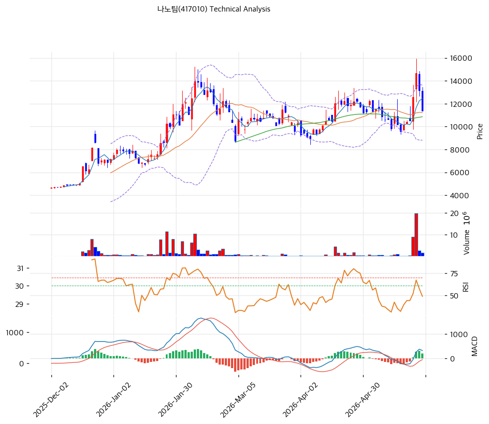

# 기술적분석

***

## 가격 위치

현재가 **11,370원** (-13.54%) — 52주 위치 **68.3%** (고가 14,650 / 저가 4,305). 1년 +164% (4,305→14,650 고가) 폭등 후 **오늘 -13.54% 급락**. 52주 고가 -22% 조정. **외국인 20일 +288,493주 매수** vs 기관 +75주. 2026Q1 적자 전환 실망 + 차익 실현 매물. EV 소재 변동성 종목.

## 이동평균선 / 모멘텀

MA5 12,446 / MA20 11,222 / MA60 10,857 / MA120 9,740 / MA200 7,817 — **MA5 < MA20 < MA60 < MA120 < MA200 완전 정배열 True**. MA200 대비 **+45.5%**, MA20 대비 +1.3%. 단기 급락으로 MA5(12,446) 아래(-8.6%)로 이탈, MA20(11,222) 근접. 중장기 상승 추세 유지하나 단기 조정.

**RSI 50.3 (중립)** — 급락으로 중립 회귀. MACD 328 / 시그널 117 / 히스토 211 = **매수 시그널** 유지(확장 둔화). 스토캐 K=56.7 / D=64.2 **데드크로스** = 단기 조정 신호. BB 중간 (폭 43.0%). 거래량 0.84배 — 급락이나 패닉 거래는 아님.

## 시그널 종합 / S\&R

매수 1 / 매도 0 / 중립 5 → **매수우위(약)**. 급락이나 추세선 유지, 신호 약함.

* 저항: **11,461원(피보 0.382)** / 12,770원(피봇 R1) / 13,169원(피보 0.236) / 14,650원(52주 고가)
* 지지: **11,222원(MA20)** / 10,857원(MA60) / 10,764원(PRZ 약: 피봇 S1·MA60) / 10,080원(피보 0.5) / 9,970원(피봇 S2)
* 깊은 조정 지지: 9,258원(추세선) / 8,699원(피보 0.618)

전략: **HOLD(홀드) — TP 14,943원 / SL 9,970원**. WAIT(진입가능) e1=10,670원 / e2=11,222원. 급락으로 MA20·MA60 근접 → **MA20 11,222원 \~ MA60 10,857원 지지 확인 후 분할 매수**, 이탈 시 피보 0.5(10,080원) 추가 진입. CB 행사가 5,500원 깊은 ITM은 중장기 매물. 2026Q2 실적 흑전 + 열폭주방지패드 매출이 반등 트리거.
