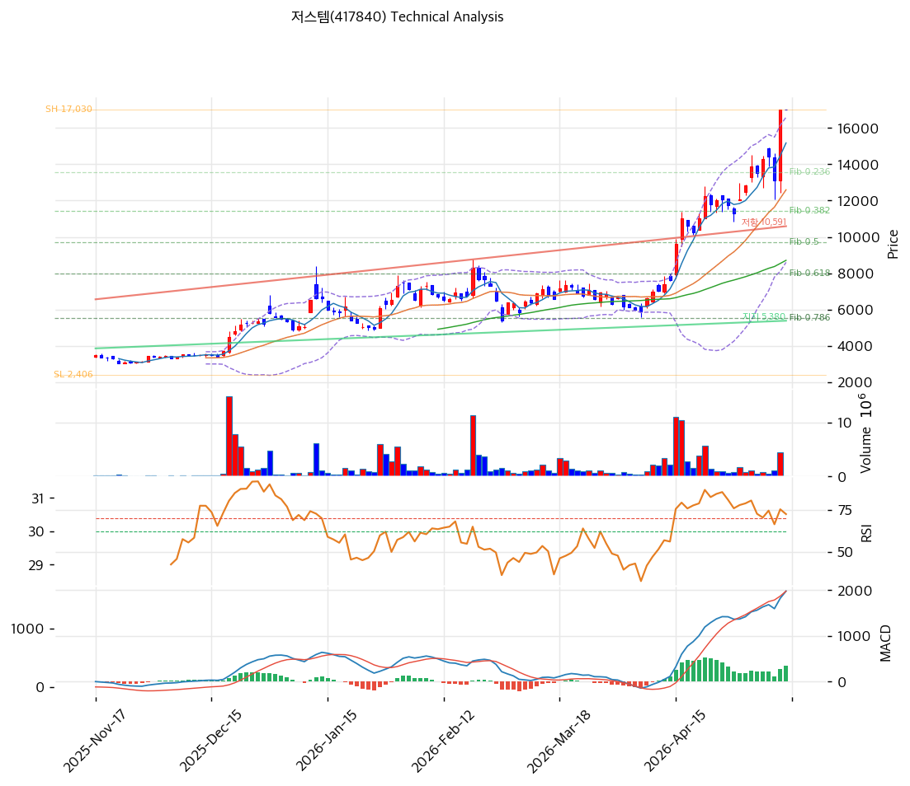

# 기술적분석

2026-05-14 | T2 Technical Analysis

***

## 차트

***

## 1. 가격 현황

| 항목        | 값                |
| --------- | ---------------- |
| 현재가       | 17,030원 (0.0%)   |
| 52주 고가    | 17,030원 (당일 갱신)  |
| 52주 저가    | 2,508원 (6.8배 상승) |
| 52주 범위 위치 | 100.0%           |

***

## 2. 차트 패턴 분석

* **장기 박스 극단 폭증**: 2,508 → 17,030 +579% 6개월
* **신고가 갱신** + MACD 매수 지속
* **MA200 +200.4%** 6개월 누적 폭증

### 종합 판단

박스 돌파 + 극단 가속 + 신고가의 매수 모멘텀. **RSI 75.9 + MA20 +35.2% + MA200 +200.4% 극단 과열 3중 점등**. 펀더멘털 (N₂ 퍼지 85%·흑전) 양호이나 단기 평균회귀 압력 매우 강함.

***

## 3. 이동평균선 — 정배열 (극단 누적)

| MA    |         괴리율 |
| ----- | ----------: |
| MA5   |      +12.2% |
| MA20  |  **+35.2%** |
| MA60  |      +95.6% |
| MA120 |     +150.1% |
| MA200 | **+200.4%** |

**평균회귀 1차 MA5 (-11%), 2차 MA20 (-26%), 3차 MA60 (-49%)**.

***

## 4. 보조 지표

* **RSI 75.9** 🔴 과매수
* MA200 +200.4% 극단 누적

***

## 5. 지지/저항

| 구분      |         가격 | 근거           |
| ------- | ---------: | ------------ |
| **현재가** | **17,030** | 52주 신고가      |
| 지지      |     15,159 | MA5          |
| 지지      |     12,596 | MA20 (1차 매수) |
| 지지      |      8,705 | MA60         |

***

## 6. 시그널 종합

**🟢 매수 2 / 🔴 매도 3 / ⚪ 중립 2 → 매도우위 (극단 누적)**

펀더멘털 양호 + 단기 극단 과열의 cross. 신규 진입은 평균회귀 후 권장.

***

## 7. 전략 제안

### 보유 중인 경우

* **부분 차익실현**
* 익절: 17,371원
* 손절: 17,030 직하

### 진입 대기인 경우

* 1차 진입: 17,030원 직하 (펀더 양호)
* 2차 진입: 12,596원 (MA20, -26%)
* 펀더멘털 (JDS 출시·OPM 회복) 강력 — 조정은 매수 기회
