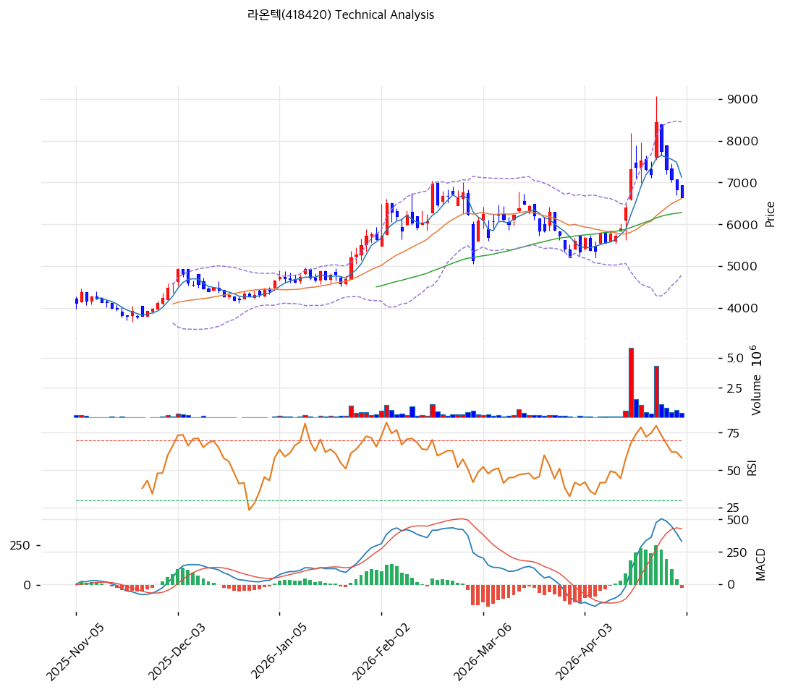

# 라온텍(418420) 기술적 분석

2026-04-30 | T2 Technical Analysis

---

## 차트

---

## 1. 가격 현황

| 항목 | 값 |
|------|-----|
| 현재가 | 6,650원 (-2.64%) |
| 52주 고가 | 8,450원 |
| 52주 저가 | 2,630원 |
| 52주 범위 위치 | 69.1% |
| 거래량 | 20일 평균 대비 0.44x |

---

## 2. 차트 패턴 분석

### 2.1 캔들스틱 패턴

| 패턴 | 위치 | 신뢰도 | 해석 |
|------|------|--------|------|
| 장대 위꼬리(유성형) | 2026-04 중순 (8,450원 부근) | 강 | 거래량 폭발(평소 5~10배)과 함께 위꼬리 출현 → 매수세 소진·고점 반전 시그널 |
| 장악형 하락(Bearish Engulfing) | 2026-04 중순 유성형 직후 | 중 | 직전 장대양봉을 음봉이 완전히 덮음 → 단기 추세 전환 확인 |
| 연속 음봉(소형 흑삼병) | 최근 5거래일 (7,500→6,650) | 중 | MA5(7,124원) 이탈 + 거래량 감소 동반 → 조정 진행형 |

### 2.2 가격 구조 패턴

- **블로우오프 톱(Blow-off Top)** (신뢰도: 강)
  2026-04-15~17 구간에서 4월 초 5,500원대에서 단 7거래일만에 +60% 급등(8,450~9,070원 터치) 후 거래량 동반 장대 위꼬리 출현. 직전 4개월 횡보 박스(5,000~7,500원) 상단을 돌파했으나 종가 기반 정착 실패 → **클라이맥스 상승 후 되돌림 진행 중**. 1차 되돌림 목표는 박스 상단(7,000~7,500원), 2차는 박스 중앙(6,200~6,500원).

- **상승 채널(Rising Channel) 상단 이탈 후 복귀** (신뢰도: 중)
  2025-12부터 형성된 상승 추세선(저점 4,000→4,800→5,200→5,400)의 채널 상단을 4월 중순 강하게 오버슈트한 뒤 채널 내부로 복귀. MA60(6,281원)이 추세선 역할 수행 중이며 이탈 시 박스 패턴 붕괴 위험.

- **갭(상승 갭) 미메움 상태** (신뢰도: 중)
  4월 중순 7,000→8,000원대 갭 상승은 **소진 갭(Exhaustion Gap)** 성격이 강해 향후 6,800~7,000원대 갭 메우기(gap fill) 시도 가능성 존재.

### 2.3 다이버전스

- **MACD 단기 약세 시그널 형성 중** (신뢰도: 중)
  4월 중순 가격 고점(8,450원)에서 MACD 히스토그램이 정점(+250 부근) 도달 후 빠르게 축소되어 현 시점 -20으로 데드크로스 진입. 가격이 추가 고점을 시도할 경우 MACD가 이를 따라가지 못하면 **정규 하락 다이버전스 완성** 가능성. 현재는 다이버전스 발생 직전의 경계 구간.

- **RSI 모멘텀 쇠퇴(Hidden 약세)** (신뢰도: 약)
  2월 초 직전 고점(~7,500원) RSI ~70 → 4월 중순 신고점(8,450원) RSI ~80으로 동반 상승했기 때문에 정규 다이버전스는 아니나, 4월 말 RSI가 50으로 빠르게 회귀하면서 모멘텀 둔화는 명확. 추세 전환 단계가 아닌 **상승 후 정상 조정** 구간으로 판단.

### 2.4 패턴 종합 판단

4월 중순 거래량 폭발과 함께 형성된 **장대 위꼬리·블로우오프 톱**은 단기 고점을 시사하는 강한 시그널이며, 이후 5거래일 연속 음봉으로 MA5를 이탈하는 등 **단기 조정 국면**이 진행 중이다. 다만 MA20(6,618원)·MA60(6,281원)·MA120(5,392원) 정배열은 유지되고 있어 **중장기 상승 추세는 아직 훼손되지 않음**. RSI 50·MACD 데드크로스 직전 상태는 **단기 약세 ↔ 중기 강세의 상충 시그널**이며, 박스 상단(7,500원) 회복 또는 MA60(6,281원) 이탈 여부가 다음 방향을 결정한다.

시그널: ⚪중립 (단기 약세 / 중기 강세 혼재)

---

## 3. 이동평균선 — 정배열 (강세)

| MA | 값 | 현재가 괴리율 | 위치 |
|----|-----|--------------|------|
| MA5 | 7,124원 | -6.7% | 아래 |
| MA20 | 6,618원 | +0.5% | 위 |
| MA60 | 6,281원 | +5.9% | 위 |
| MA120 | 5,392원 | +23.3% | 위 |
| MA200 | 5,245원 | +26.8% | 위 |

**해석**: MA5 < MA20 < MA60 < MA120 < MA200 의 완벽한 정배열로 중장기 상승 추세는 견고. 다만 현재가가 MA5를 -6.7% 하회하며 단기 모멘텀은 꺾인 상태이고, MA20(6,618원)이 거의 현재가와 일치하는 1차 지지선으로 작동 중. MA200 대비 +26.8% 괴리는 중기 과열 영역은 아니지만 4월 중순 9,070원 터치 시점(MA200 +73%)은 명백한 과열이었음을 방증.

---

## 4. 보조 지표

### RSI(14) — 50.0 (중립)

4월 중순 80에 근접했던 RSI가 단 8거래일만에 50까지 빠르게 회귀하며 모멘텀이 완전히 식음. 과매수 해소는 끝났으나 추가 하락 모멘텀은 아직 약함. 다이버전스 해석은 2.3 참조.

### MACD(12,26,9)

| 항목 | 값 |
|------|-----|
| MACD | 332 |
| Signal | 352 |
| Histogram | -20 |
| 크로스 상태 | 매도 구간 (히스토그램 수축 후 음전환) |

**해석**: 4월 초 골든크로스 후 히스토그램이 +250 부근까지 확대되었으나 4월 후반 빠르게 수축해 현재 -20으로 데드크로스 진입. MACD·Signal 모두 절대값은 여전히 +300대로 0선 위에 있어 중기 추세는 살아있으나 단기 매도 모멘텀이 우세.

### 볼린저밴드(20, 2σ)

| 항목 | 값 |
|------|-----|
| 상단 | 8,450원 |
| 중단 (MA20) | 6,618원 |
| 하단 | 4,786원 |
| 밴드 폭 | 55.4% |
| 현재 위치 | 중간 (MA20 직상) |

**해석**: 밴드 폭 55.4%는 직전 횡보 구간(20~25%) 대비 2배 이상 확장된 상태로, 4월 중순 변동성 폭발의 잔흔. 현재가가 BB 중단(6,618원) 부근에서 지지받고 있으며, 이 구간을 이탈할 경우 BB 하단(4,786원)까지 추가 조정 여지. 반대로 하단 이탈 없이 횡보 시 밴드 폭이 점진적으로 좁혀지는 **스퀴즈 회복** 국면 진입 가능.

### 스토캐스틱(14, 3, 3)

| 항목 | 값 |
|------|-----|
| Slow %K | 37.2 |
| Slow %D | 44.6 |
| 크로스 상태 | 데드크로스 |
| 판단 | 중립 (과매도 근접) |

---

## 5. 지지/저항 — 추세선 · 피보나치 · PRZ 통합

### 5.1 피보나치 되돌림/확장

기준: 직전 상승 스윙 (Swing Low 4,786원 BB 하단 → Swing High 8,450원 52주 고가)

| 구분 | 비율 | 가격 | 현재가 대비 |
|------|------|------|-----------|
| Swing High | — | 8,450원 | +27.1% |
| 되돌림 | 0.236 | 7,585원 | +14.1% |
| 되돌림 | 0.382 | 7,051원 | +6.0% |
| 되돌림 | 0.5 | 6,618원 | -0.5% |
| 되돌림 | 0.618 | 6,185원 | -7.0% |
| 되돌림 | 0.786 | 5,572원 | -16.2% |
| Swing Low | — | 4,786원 | -28.0% |
| 확장 | 1.272 | 9,448원 | +42.1% |
| 확장 | 1.382 | 9,851원 | +48.1% |
| 확장 | 1.618 | 10,716원 | +61.1% |

※ 현재가 6,650원은 **0.5 되돌림(6,618원)** 직상에 위치 — 정상 조정 구간의 표준 분기점.
※ 0.5 이탈 시 0.618(6,185원, MA60 인근)이 핵심 방어선.

### 5.2 추세선

| 추세선 | 방향 | 현재 교차가 | 포인트 수 | 해석 |
|--------|------|-----------|---------|------|
| 지지선 | 상승 | 6,200~6,300원 | 4개 | 2025-12 저점부터 4개 저점 연결, MA60과 일치 |
| 저항선 | 하락 | 7,200~7,500원 | 3개 | 4월 중순 고점 → 4월 말 음봉 고점, 직전 박스 상단 |

### 5.3 PRZ (Potential Reversal Zone)

| 방향 | 가격 범위 | 신뢰도 | 근거 |
|------|---------|--------|------|
| 지지 | 6,500~6,650원 | 강 | 피봇 S1(6,533) + MA20(6,618) + 0.5 피보(6,618) + 현재가 — **3중 지지** |
| 지지 | 6,200~6,300원 | 강 | MA60(6,281) + 0.618 피보(6,185) + 상승 추세선(~6,250) — **3중 지지** |
| 저항 | 7,050~7,200원 | 중 | MA5(7,124) + 0.382 피보(7,051) + 갭 메우기 구간 |
| 저항 | 8,450~8,500원 | 강 | 52주 고가 + BB 상단 + 4월 위꼬리 고점 — **결정적 저항** |

### 5.4 종합 지지/저항 테이블

| 구분 | 가격 | 근거 |
|------|------|------|
| 저항 | 8,450원 | 52주 고가 + BB 상단 + 4월 블로우오프 톱 (강) |
| 저항 | 7,500원 | 직전 박스 상단 + 하락 추세선 + 0.236 피보(7,585) |
| 저항 | 7,124원 | MA5 + 0.382 피보(7,051) + 단기 매물대 |
| 저항 | 6,853원 | 피봇 R1 |
| **현재가** | **6,650원** | — |
| 지지 | 6,618원 | MA20 + BB 중단 + 0.5 피보 (강) |
| 지지 | 6,533원 | 피봇 S1 |
| 지지 | 6,417원 | 피봇 S2 |
| 지지 | 6,281원 | MA60 + 상승 추세선 + 0.618 피보(6,185) (강) |
| 지지 | 5,392원 | MA120 (중기 마지노선) |

---

## 6. 시그널 종합

| 지표 | 내용 | 시그널 |
|------|------|--------|
| **차트 패턴** | 블로우오프 톱 + 유성형 후 단기 조정, MA20 지지 시도 | 🔴 |
| 이동평균선 | 정배열 유지 (MA20~MA200), 단 MA5 이탈 | 🟢 |
| RSI | 50.0 — 중립, 모멘텀 식음 | ⚪ |
| MACD | 332/352/-20 — 매도 구간, 0선 위 | 🔴 |
| 볼린저밴드 | BB 중단 부근, 폭 55.4% (확장 상태) | ⚪ |
| 스토캐스틱 | 데드크로스, K=37.2 | ⚪ |
| 거래량 | 0.44x — 약함 (조정 국면 매도세 약화) | ⚪ |

**종합 판단**: 🟢 매수 1개 / 🔴 매도 2개 / ⚪ 중립 4개 → **중립(약매도 우위)**

4월 중순 거래량 폭발과 함께 형성된 블로우오프 톱과 유성형 캔들은 명확한 **단기 고점 신호**였고, 이후 RSI·MACD가 모두 상승 모멘텀을 잃으며 조정이 진행 중이다. 다만 거래량이 0.44x로 매도세 자체가 약하고, MA20(6,618원)·MA60(6,281원)이 정배열로 다층 지지를 형성하고 있어 **추세 전환이 아닌 정상 되돌림** 국면으로 해석된다. 단기 추가 조정 여지는 6,200~6,300원 구간이며, 이 구간을 거래량 동반 이탈하지 않으면 박스권 형성 후 재상승 시도가 유효하다.

---

## 7. 전략 제안

### 보유 중인 경우

- **홀드** (조정 진행 중이나 중기 추세 미훼손)
- 익절 라인: 8,619원 (52주 고가 8,450원 + BB 상단 돌파 시 신고가 영역)
- 손절 라인: 6,417원 (피봇 S2, MA60 직전 — 이탈 시 단기 추세 붕괴)
- 리스크/리워드: (8,619-6,650) ÷ (6,650-6,417) = 1,969 ÷ 233 = **약 8.5 : 1** (양호)

### 진입 대기인 경우

- **진입가능** (단계적 분할 진입 권장)
- 1차 진입가: 6,533원 (피봇 S1 + MA20 직하 — 1차 PRZ)
- 2차 진입가: 6,200~6,300원 (MA60 + 0.618 피보 + 상승 추세선 — **3중 지지 PRZ**)
- 진입 조건: ① MA60(6,281원) 일봉 종가 사수 확인, ② 6,200원대 도달 시 거래량 0.6x 이하(투매 부재) + 양봉 출현, ③ 박스 상단(7,500원) 거래량 동반 돌파 시 추격매수 가능. 6,200원 이탈 시 MA120(5,392원)까지 관망.
