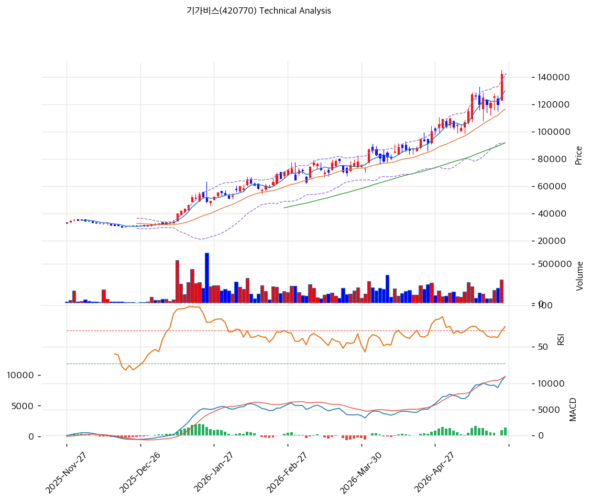

# 기가비스(420770) 기술적 분석

2026-05-27 | T2 Technical Analysis

## 1. 가격 현황

| 항목 | 값 |
|------|-----|
| 현재가 | 142,200원 (+0.00%) — 52주 신고가 |
| 52주 범위 | 23,700\~142,200원 (위치 100.0%, 1년 +500%) |
| 거래량 | 20일 평균 대비 0.0x (직전 세션 데이터 결측) |

## 2. 차트 패턴

- **신고가 갭상승 장대양봉** (강): 130k 박스 돌파 후 142k 마감 — 추세 가속.
- **장기 Parabolic 상승** (강): 2025-12 30k → 2026-05 142k, 5개월 +370%. MA200 +166% 괴리 = 포물선 후기 국면.
- **이중바닥 W형 돌파** (중): 2\~3월 110k 박스 → 5월 신고가. 측정치 145\~150k 도달, 확장 시 178k(피보 1.272).
- **RSI 약세 다이버전스** (중): 1월 RSI 90 vs 5월 71.9 — 가격 +30% 상승 중 RSI 고점 하락 = 추세 약화 경고. MACD는 여전히 확장 중이라 즉각 반전 강도 제한적.

**종합**: 추세 강세(돌파+정배열) ↔ 과열(RSI·BB·스토캐 + 이격 극단) 상충 → ⚪중립.

## 3. 이동평균선 — 완전 정배열 (극단 강세)

| MA | 값 | 괴리율 |
|----|-----|--------|
| MA5 | 130,160원 | +9.3% |
| MA20 | 116,480원 | +22.1% |
| MA60 | 91,788원 | +54.9% |
| MA120 | 67,925원 | +109.3% |
| MA200 | 53,445원 | +166.1% |

5\~200일 완전 정배열 = 교과서적 강세. 단 MA200 +166% 통계적 극단 → 평균회귀 압력 누적. MA20(116k)·MA60(91k)가 1·2차 지지.

## 4. 보조 지표

- **RSI 71.9** 🔴 과매수 — 강세장 RSI 70\~80 지속 가능, 60 이탈이 추세 약화 1차 확인선.
- **MACD 11,334 / Sig 9,792 / Hist +1,542** — 매수 확장, 단 절대치 사상 최대로 추가 확장 여력 제한.
- **BB 141,431 / 116,480 / 91,529 (폭 42.8%)** — 현재가 142,200원 상단 이탈, walking the band. 회귀 시 MA20까지 -18%.
- **Stoch K 82.7 / D 76.3** — 골든크로스, 과매수 영역.

## 5. 지지/저항

| 구분 | 가격 | 근거 |
|------|------|------|
| 저항 | 178,625원 | 피보 1.272 확장 |
| **저항/현재가** | **142,200원** | 52주 고가 + PRZ 강 (피봇 R1·R2·S1 중첩) |
| 지지 | 116,480원 | MA20 + 피보 0.236 PRZ 약 |
| 지지 | 98,739원 | 피보 0.382 |
| 지지 | 91,788원 | MA60 |
| 지지 | 84,325원 | 피보 0.5 |

## 6. 시그널 종합

| 지표 | 시그널 |
|------|--------|
| 차트 패턴 (돌파 vs 다이버전스) | ⚪ |
| 이동평균선 (정배열 극단) | 🟢 |
| RSI 71.9 | 🔴 |
| MACD +1,542 확장 | 🟢 |
| BB 상단 이탈 | 🔴 |
| Stoch K 82.7 | 🔴 |
| 거래량 0.0x | ⚪ |

🟢 매수 2 / 🔴 매도 3 / ⚪ 중립 2 → **매도우위 (과열 신호 우세)**. 추세는 살아있으나 다중 지표 동시 과매수 + 컨센 +73% 오버슈팅 → 단기 평균회귀 압력 누적.

## 7. 전략

**보유**: 비중축소(1/3\~1/2 익절). 익절 142\~145k 1차 / 178k 2차. 손절 116,480원(MA20 이탈). R/R 1:0.2 — 현시점 진입은 불리.

**대기**: 관망. 1차 진입 116,480원(MA20·피보 0.236 PRZ) / 2차 91,788원(MA60). 조건: RSI 60 하회 + 거래량 동반 양봉 + MA20 지지 확인.
