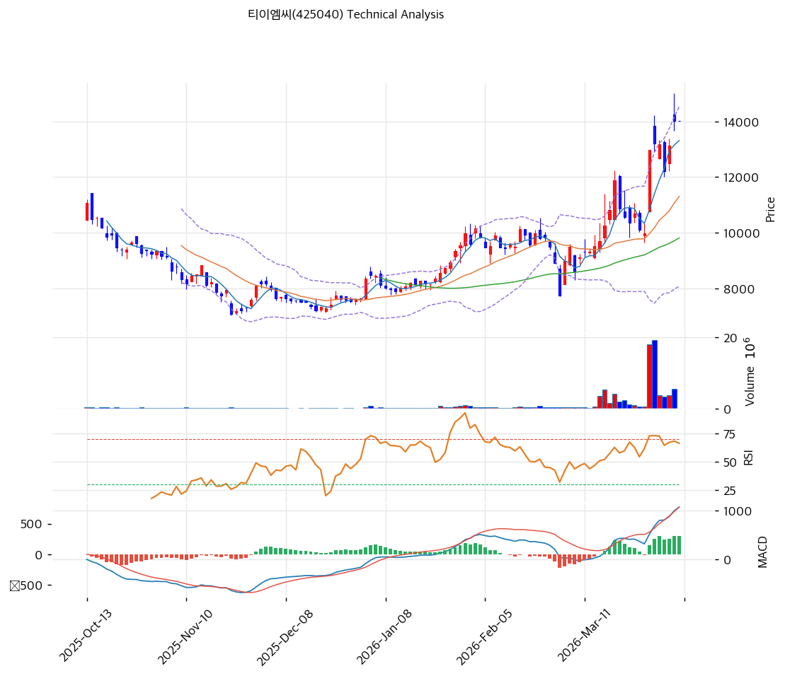

# 티이엠씨(425040) 기술적 분석

2026-04-04 | T2 Technical Analysis

---

## 차트

---

## 1. 가격 현황

| 항목 | 값 |
|------|-----|
| 현재가 | 13,140원 (+7.62%) |
| 52주 고가 | 13,200원 |
| 52주 저가 | 5,970원 |
| 52주 범위 위치 | 99.2% |
| 거래량 | 20일 평균 대비 1.07x |

---

## 2. 차트 패턴 분석

### 2.1 캔들스틱 패턴

| 패턴 | 위치 | 신뢰도 | 해석 |
|------|------|--------|------|
| 상승장악형(Bullish Engulfing) | 최근 1~2일 | 강 | 매수 시그널 — 직전 음봉을 완전히 감싸는 대양봉 출현, 강한 매수세 유입 확인 |
| 적삼병(Three White Soldiers) | 최근 3~5일 | 중 | 매수 시그널 — 3월 하순 이후 연속 양봉 출현으로 상승 추세 지속 시사 |
| 대양봉(Large Bullish Candle) | 당일(4/4) | 강 | 매수 시그널 — 7.62% 급등 대양봉, 52주 고가 돌파 시도와 함께 강한 모멘텀 확인 |

※ 주요 캔들 패턴: 망치형, 역망치형, 장악형(상승/하락), 도지, 샛별/석별, 적삼병/흑삼병, 하라미, 유성형, 교수형 등

### 2.2 가격 구조 패턴

- **V자 반등(V-Bottom Reversal)** (신뢰도: 강)
  2025년 11월 약 7,500원대 저점에서 V자 형태의 급반등이 진행됨. 이후 1~2월 조정 구간(8,500~10,000원)을 거친 뒤 3월부터 본격 상승 전환. 저점 대비 약 75% 상승하며 52주 고가권 도달. 전형적인 추세 전환 후 본격 상승 구간으로 판단.

- **이동평균선 정배열 돌파** (신뢰도: 강)
  MA5 > MA20 > MA60 > MA120 > MA200 완전 정배열 상태. 3월 중순 MA20 돌파 이후 급격한 상승 가속화. 모든 이동평균선이 상승 방향으로 기울어져 있어 중기 상승 추세 확인.

- **52주 고가 돌파 시도** (신뢰도: 중)
  당일 종가 13,140원으로 52주 고가(13,200원)에 근접. 장중 신고가 갱신 가능성. 돌파 시 새로운 상승 추세 구간 진입, 실패 시 단기 저항으로 작용할 수 있음.

※ 주요 구조 패턴: 이중천정/바닥, 헤드앤숄더(정/역), 삼각수렴(대칭/상승/하락), 쐐기형(상승/하락), 깃발형, 페넌트, 컵앤핸들, 박스권 등

### 2.3 다이버전스

- **MACD 상승 다이버전스 해소** (신뢰도: 강)
  2025년 11~12월 가격 저점 형성 시기에 MACD가 이미 바닥을 찍고 상승 전환. 이후 가격과 MACD가 동반 상승하며 상승 다이버전스가 해소됨. 현재 MACD 876, Signal 624로 히스토그램 확대 중이며 가격 상승과 동행 — 추세 강도 유지 중.

- **RSI 동행 확인 (다이버전스 미발생)** (신뢰도: 중)
  RSI 64.7로 가격 상승과 함께 RSI도 상승 구간에 위치. 가격 고점과 RSI 고점이 동행하고 있어 하락 다이버전스는 현재 미발생. 다만 RSI가 70 이상 과매수 진입 시 주의 필요.

※ RSI·MACD 기반 | 상승 다이버전스 = 가격↓ 지표↑ (반등 시사), 하락 다이버전스 = 가격↑ 지표↓ (하락 시사), 히든 다이버전스 = 기존 추세 지속 시사

### 2.4 패턴 종합 판단

캔들스틱, 가격구조, 다이버전스 3개 카테고리 모두 강세 방향을 지시하고 있다. 적삼병+대양봉의 캔들 패턴은 단기 매수세 우위를 확인하며, V자 반등 후 정배열 완성이라는 가격구조는 중기 상승 추세를 뒷받침한다. MACD와 RSI 모두 가격과 동행 상승하여 다이버전스가 발생하지 않아 추세 신뢰도가 높다. 다만 52주 고가 근접(99.2%)과 MA20 대비 21.7% 괴리율은 단기 과열 리스크를 시사하며, 되돌림 가능성에 대한 경계가 필요하다.

---

## 3. 이동평균선 — 정배열 (강세)

| MA | 값 | 현재가 괴리율 | 위치 |
|----|-----|--------------|------|
| MA5 | 12,938원 | +1.6% | 위 |
| MA20 | 10,793원 | +21.7% | 위 |
| MA60 | 9,623원 | +36.6% | 위 |
| MA120 | 9,039원 | +45.4% | 위 |
| MA200 | 8,371원 | +57.0% | 위 |

**해석**: 완전 정배열 상태로 강한 중기 상승 추세 확인. 현재가가 모든 이동평균선 위에 위치하며 단기(MA5)부터 장기(MA200)까지 순차적으로 벌어져 있다. 다만 MA20 대비 +21.7%, MA60 대비 +36.6%의 높은 괴리율은 단기 과열 구간 진입을 시사하며, 이평선 수렴을 위한 조정 또는 횡보 가능성이 있다. 당장의 1차 지지선은 MA5(12,938원)이며, 본격 조정 시 MA20(10,793원)이 핵심 지지선으로 기능할 것이다.

---

## 4. 보조 지표

### RSI(14) — 64.7 (중립)

RSI 64.7로 중립 상단에 위치. 아직 과매수(70 이상) 구간에는 진입하지 않았으나 상승 추세를 반영하며 점진적으로 상승 중. 추가 상승 여력은 있으나 70선 돌파 시 단기 과열 경계 필요.

### MACD(12,26,9)

| 항목 | 값 |
|------|-----|
| MACD | 876 |
| Signal | 624 |
| Histogram | +253 |
| 크로스 상태 | 매수 구간 (확대 중) |

**해석**: MACD가 Signal선 위에서 양의 히스토그램이 확대되고 있어 상승 모멘텀이 강화되는 구간. 차트에서도 3월 중순 골든크로스 이후 MACD 라인이 가파르게 상승하며 Signal과의 괴리가 커지고 있다.

### 볼린저밴드(20, 2σ)

| 항목 | 값 |
|------|-----|
| 상단 | 13,740원 |
| 중단 (MA20) | 10,793원 |
| 하단 | 7,846원 |
| 밴드 폭 | 54.6% |
| 현재 위치 | 중간 |

**해석**: 밴드 폭 54.6%로 매우 넓게 확장된 상태. 최근 급등으로 볼린저밴드 상단(13,740원)에 근접해 있으며, 밴드 워킹(band walking) 가능성이 있다. 상단 돌파 시 추가 상승 가능하나, 밴드 내 회귀 시 중단(MA20, 10,793원)까지 되돌림 가능.

### 스토캐스틱(14, 3, 3)

| 항목 | 값 |
|------|-----|
| Slow %K | 71.9 |
| Slow %D | 77.3 |
| 크로스 상태 | 데드크로스 |
| 판단 | 중립 |

---

## 5. 지지/저항

| 구분 | 가격 | 근거 |
|------|------|------|
| 저항 | 13,610원 | 피봇 R1 |
| 저항 | 13,200원 | 52주 고가 |
| **현재가** | **13,140원** | — |
| 지지 | 12,440원 | 피봇 S1 |
| 지지 | 11,740원 | 피봇 S2 |
| 지지 | 10,793원 | MA20 |
| 지지 | 9,623원 | MA60 |

---

## 6. 시그널 종합

| 지표 | 내용 | 시그널 |
|------|------|--------|
| **차트 패턴** | 적삼병+대양봉, V자 반등 정배열, 다이버전스 미발생 | 🟢 |
| 이동평균선 | 정배열, MA20 +21.7% | 🟢 (추세) / 🔴 (과열) |
| RSI | 64.7 — 중립 | ⚪ |
| MACD | 매수구간, 히스토그램 확대 | 🟢 |
| 볼린저밴드 | 중간, 밴드 폭 54.6% | ⚪ |
| 스토캐스틱 | 데드크로스, K=71.9 | ⚪ |
| 거래량 | 1.07x — 약함 | ⚪ |

**종합 판단**: 🟢 매수 2개 / 🔴 매도 1개 / ⚪ 중립 4개 → **매수우위**

차트 패턴과 MACD가 강한 매수 시그널을 보내고 있으며, 완전 정배열 구조가 중기 상승 추세를 확인해준다. 그러나 52주 고가 근접(99.2%), MA20 대비 21.7% 괴리율, 스토캐스틱 데드크로스는 단기 과열 경고 신호다. 현재는 추세 강도가 유지되는 매수 우위 국면이나, 52주 고가(13,200원) 돌파 여부가 단기 방향성의 핵심 분기점이 될 것이다. 돌파 시 신고가 랠리 가능, 실패 시 이평선 수렴 조정 예상.

---

## 7. 전략 제안

### 보유 중인 경우
- **홀드**
- 익절 라인: 13,464원 (피봇 R1 근처, 현재가 대비 +2.5% — 52주 고가 돌파 후 단기 목표)
- 손절 라인: 11,740원 (피봇 S2 — 이탈 시 중기 추세 훼손 우려)
- 리스크/리워드: 1:0.23 (고가권 진입으로 리워드 제한적)

### 진입 대기인 경우
- **관망**
- 1차 진입가: 12,440원 (피봇 S1 — 단기 조정 시 지지 확인 후 진입)
- 2차 진입가: 10,793원 (MA20 — 본격 조정 시 핵심 지지선에서 분할 매수)
- 진입 조건: 52주 고가(13,200원) 돌파 후 거래량 동반 확인 시 추격 매수 가능. 또는 피봇 S1(12,440원) 지지 확인 후 반등 시 진입. 현 수준 신규 진입은 과열 리스크로 비추천.
