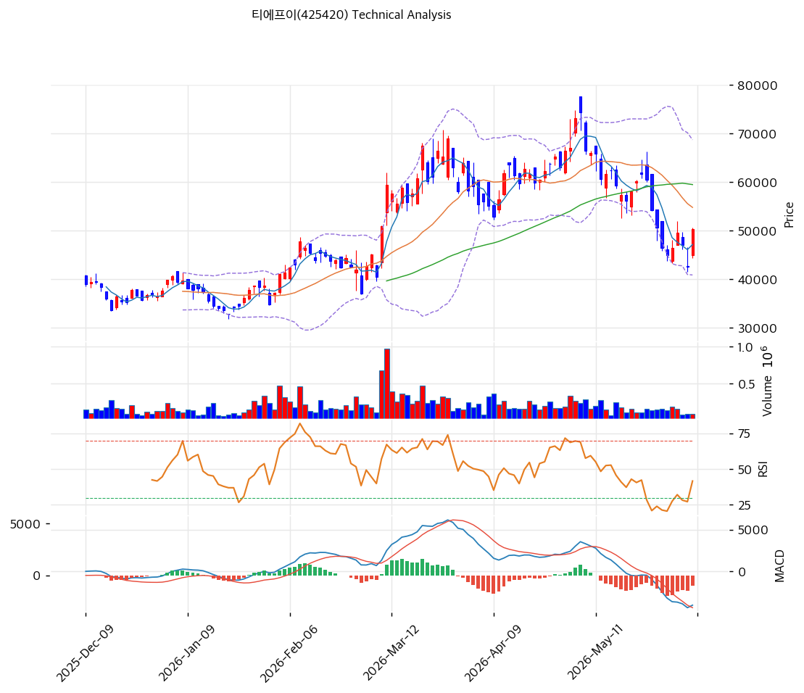

# 티에프이(425420) 기술적 분석 보고서

---

## 가격 위치

현재가 **50,300원** (**당일 +18.35%**) — 1년 위치 52.5%(고점 74,400원 대비 -32%, 저점 23,650원). 고점 후 조정·과매도(스토캐 18.5)에서 당일 +18.35% 급반등. RSI 44.4 중립. AI·HBM·CPO 테스트 수요·폭발 실적 기대. 거래량비 0.58x. MA120·MA200 위에서 반등.

## 이동평균선

| 이평선 | 값 | 이격도 | 위치 |
|------|---:|----:|:---:|
| MA5 | 47,150원 | +6.7% | 위 |
| MA20 | 54,788원 | -8.2% | 아래 |
| MA60 | 59,481원 | -15.4% | 아래 |
| MA120 | 49,569원 | +1.5% | 위 |
| MA200 | 45,768원 | +9.9% | 위 |

**혼조(aligned False)** — 당일 급등으로 MA5(47,150)·MA120(49,569)·MA200(45,768) 위로 회복, 단 MA20(54,788)·MA60(59,481)은 아래. 중기 조정 속 단기 반등 국면. MA20 54,788원 돌파가 추세 전환 관건.

## 모멘텀 지표

- **RSI 44.4 (중립)** — 침체~중립. 당일 급등으로 회복 시작
- **MACD -4,073 / 시그널 -3,105 / 히스토 -969** — 매도이나 당일 급등으로 반전 시도
- **스토캐스틱 K=18.5 / D=17.7** — **과매도 골든크로스** — 반등 신호
- **볼린저밴드** — 상단 68,691 / 중심 54,788 / 하단 40,884, 폭 50.8%, **중간**. 변동성 큼
- **거래량비 0.58x** — 급등 대비 거래 보통

## 피보나치 되돌림 (52주 스윙 23,650 / 74,400)

| 레벨 | 가격 | 성격 |
|------|---:|------|
| 0.236 | 62,423원 | 반등 시 저항 |
| 0.382 | 55,013원 | 2차 저항 (MA20 근접) |
| 0.5 | 49,025원 | 현재가 부근 (MA120 근접) |
| 0.618 | 43,036원 | 지지 (전략 SL 근접) |
| 0.786 | 34,510원 | 깊은 조정 |

## 지지/저항 (S&R)

- **저항**: 54,788원(MA20·피보 0.382) / 59,481원(MA60) / 62,423원(피보 0.236) / 74,400원(52주 고가) |
- **지지**: **49,569원(MA120)·49,025원(피보 0.5)** / 47,150원(MA5) / 45,768원(MA200) / 43,036원(피보 0.618) |

## 종합 시그널 & 전략

**시그널: 매수 1 / 매도 1 / 중립 4 → 중립** (과매도 반등 vs 중기 조정)

- **전략**: HOLD(홀드) — **TP 75,888원 / SL 42,100원**. WAIT(진입가능) e1 46,200원 / e2 54,788원
- **눌림목 매수**: 당일 +18% 급등 직후로 추격 신중. **MA120·피보 0.5 49,000\~49,600원 ~ MA200 45,768원 눌림목 분할 매수**, 손절 42,100원
- **상방**: MA20 54,788원 돌파 시 MA60 59,481원 → 피보 0.236 62,423원 → 전고점 74,400원. AI·CPO 테스트 수주·실적 모멘텀이 동력
- **하방**: MA120 49,569원·MA200 45,768원 이탈 시 피보 0.618 43,036원. 당일 급등 되돌림 가능
- **변곡점**: AI·HBM·CPO 테스트 수주 + SLT 확대가 추세 핵심. 과매도 골든크로스 반등 시작, MA20 돌파 시 추세 전환 확인
