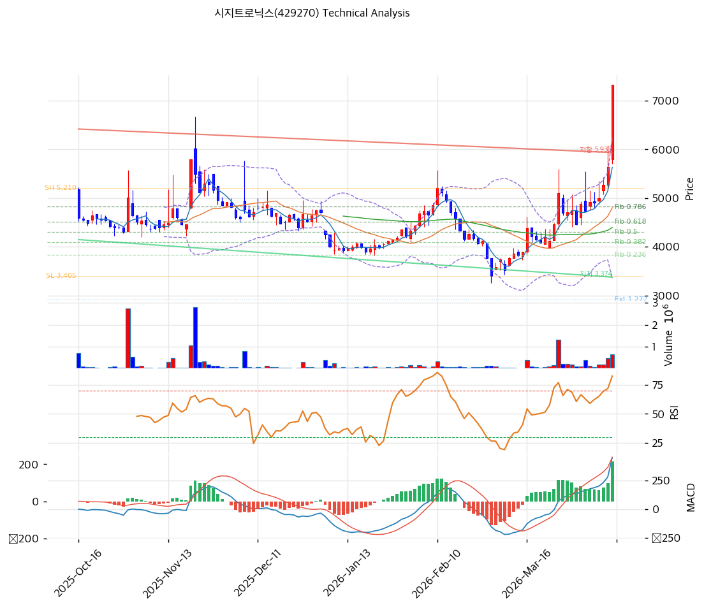

# 시지트로닉스(429270) 기술적 분석

2026-04-11 | T2 Technical Analysis

---

## 차트

---

## 1. 가격 현황

| 항목 | 값 |
|------|-----|
| 현재가 | 7,330원 (+29.96%) |
| 52주 고가 | 7,429원 |
| 52주 저가 | 3,405원 |
| 52주 범위 위치 | 97.5% |
| 거래량 | 20일 평균 대비 2.86x |

---

## 2. 차트 패턴 분석

### 2.1 캔들스틱 패턴

| 패턴 | 위치 | 신뢰도 | 해석 |
|------|------|--------|------|
| 상한가 장대양봉 | 2026-04-11 (당일) | 강 | 강력한 매수세 유입 시그널. 단, 상한가 도달은 단기 과열을 동반하며 다음 거래일 차익 실현 매물 출회 가능성 높음 |
| 연속 양봉 (적삼병 추정) | 최근 3~5일 | 중 | 단기 상승 추세 강화. 52주 고가(7,429원) 근접 국면에서 돌파 여부가 핵심 |

※ 당일 상한가(+29.96%) 도달로 캔들 형태가 장대양봉. 상한가 봉 이후 패턴은 익일 거래에서 확인 필요.

### 2.2 가격 구조 패턴

- **52주 신고가 도전** (신뢰도: 강)
  52주 고가 7,429원에 현재가 7,330원으로 99.1% 수준 접근. 52주 고가 돌파 시 추세적 상승 모멘텀 강화 신호이나, 현재가가 이미 볼린저밴드 상단(6,253원)을 대폭 상회하는 극단적 과열 구간임을 유의. 상한가 도달 다음 거래일 갭다운 또는 조정 가능성을 내포한다.

- **박스권 상단 돌파** (신뢰도: 중)
  MA5(5,629원)·MA20(4,801원)·MA60(4,396원) 전 이동평균선을 일시에 상회하는 수직 상승 구조. 정상적인 추세 돌파보다는 단발성 급등에 가까우며, 거래량 2.86x 동반으로 수급 이벤트(공시, 테마 유입 등) 가능성이 크다.

### 2.3 다이버전스

- **RSI 히든 다이버전스 (상승)** (신뢰도: 약)
  RSI가 81.1로 과매수 구간 진입. 단기 급등 시 RSI 과매수가 선행하며 이후 조정 시 RSI 하락 다이버전스로 전환될 수 있음. 현 시점에서 하락 다이버전스 형성 징후를 추적할 필요가 있다.

- **MACD 상승 확장** (신뢰도: 중)
  MACD 453, Signal 237, Histogram +216으로 히스토그램 확대 중. 단기 강세 모멘텀은 유지되나, 극단적 RSI 과매수 구간에서는 MACD 확장이 천장 근처 신호일 수 있다.

### 2.4 패턴 종합 판단

당일 상한가 도달로 캔들·거래량 측면에서 단기 매수 강도는 극대화되어 있으나, RSI 81.1 과매수·볼린저밴드 상단 대폭 이탈·스토캐스틱 과매수 등 모든 단기 지표가 과열을 경고하고 있다. 52주 고가(7,429원) 돌파 시 추가 상승 여력이 있으나, 상충하는 과열 시그널이 우세하여 단기 차익 실현 구간 진입 가능성이 높다.

---

## 3. 이동평균선 — 비정배열 (단기 강세)

| MA | 값 | 현재가 괴리율 | 위치 |
|----|-----|--------------|------|
| MA5 | 5,629원 | +30.2% | 위 |
| MA20 | 4,801원 | +52.7% | 위 |
| MA60 | 4,396원 | +66.7% | 위 |
| MA120 | 4,513원 | +62.4% | 위 |
| MA200 | 4,940원 | +48.4% | 위 |

**해석**: 현재가가 모든 이동평균선 위에 위치하지만, MA5(5,629원)~MA200(4,940원)이 비정배열(단기 MA가 장기 MA 아래) 상태로 중장기 추세는 여전히 약세다. 당일 상한가로 현재가와 MA20 간 괴리율이 +52.7%에 달해 극단적 단기 과열 상태. 조정 시 MA20(4,801원)과 MA5(5,629원)가 1차·2차 지지선으로 기능할 것으로 예상된다.

---

## 4. 보조 지표

### RSI(14) — 81.1 (🔴 과매수)

RSI 81.1로 일반적 과매수 기준(70)을 크게 상회하는 극단적 과열 구간이며, 단기 급등에 따른 조정 압력이 높아지고 있다.

### MACD(12,26,9)

| 항목 | 값 |
|------|-----|
| MACD | 453 |
| Signal | 237 |
| Histogram | +216 |
| 크로스 상태 | 매수 구간 (확대 중) |

**해석**: MACD가 매수 구간에서 히스토그램이 확대되고 있어 단기 모멘텀은 긍정적이나, 과매수 RSI와 상충하는 신호다.

### 볼린저밴드(20, 2σ)

| 항목 | 값 |
|------|-----|
| 상단 | 6,253원 |
| 중단 (MA20) | 4,801원 |
| 하단 | 3,348원 |
| 밴드 폭 | 60.5% |
| 현재 위치 | 상단 초과 |

**해석**: 현재가(7,330원)가 볼린저밴드 상단(6,253원)을 17.2%나 상회하는 극단적 이탈 상태다. 밴드 폭 60.5%로 이미 확장 국면이며, 상단 이탈 이후 평균 회귀(중단 4,801원) 압력이 강하게 작용할 수 있다.

### 스토캐스틱(14, 3, 3)

| 항목 | 값 |
|------|-----|
| Slow %K | 86.2 |
| Slow %D | 75.6 |
| 크로스 상태 | 골든크로스 |
| 판단 | 과매수 |

---

## 5. 지지/저항 — 추세선 · 피보나치 · PRZ 통합

### 5.1 피보나치 되돌림/확장

※ 피보나치 기준: **하락** 추세 (Swing High 5,210원 → Swing Low 3,405원)
※ 되돌림 = 하락 추세에서 반등한 비율, 확장 = 하락 방향 목표가

| 구분 | 비율 | 가격 | 현재가 대비 |
|------|------|------|-----------|
| Swing High | — | 5,210원 | -28.9% |
| 되돌림 | 0.236 | 3,831원 | -47.7% |
| 되돌림 | 0.382 | 4,095원 | -44.1% |
| 되돌림 | 0.5 | 4,308원 | -41.2% |
| 되돌림 | 0.618 | 4,520원 | -38.3% |
| 되돌림 | 0.786 | 4,824원 | -34.2% |
| Swing Low | — | 3,405원 | -53.5% |
| 확장 | 1.272 | 2,914원 | -60.2% |
| 확장 | 1.382 | 2,715원 | -62.9% |
| 확장 | 1.618 | 2,290원 | -68.8% |
| 확장 | 2.0 | 1,600원 | -78.2% |

※ 현재가(7,330원)가 Swing High(5,210원)를 40.7% 상회 — 피보나치 되돌림 레벨 전체가 현재가 아래에 위치하며, 조정 시 4,824원(0.786)~4,520원(0.618) 구간이 1차 지지대로 작용할 전망.

### 5.2 추세선

| 추세선 | 방향 | 현재 교차가 | 포인트 수 | 해석 |
|--------|------|-----------|---------|------|
| 지지 추세선 | 하락 | 3,374원 | 6개 | 하락 지지선. 현재가(7,330원) 대비 -54.0% 하방에 위치. 중장기 하락 채널의 하단 경계선으로, 급락 시 최종 방어선 |
| 저항 추세선 | 하락 | 5,933원 | 6개 | 하락 저항선. 현재가 대비 -19.1% 하방에 위치. 현재가가 이미 이 선을 상향 돌파한 상태 — 과거 저항에서 지지로 전환 가능성 있으나 단기 급등으로 신뢰도 낮음 |

### 5.3 PRZ (Potential Reversal Zone)

| 방향 | 가격 범위 | 신뢰도 | 근거 |
|------|---------|--------|------|
| 지지 | 4,801~4,824원 | 강 | MA20(4,801원) + 피보나치 0.786(4,824원) 이중 겹침 — 조정 시 강한 반등 지지대 |
| 지지 | 4,396~4,520원 | 중 | MA60(4,396원) + 피보나치 0.618(4,520원) + 피봇 S2(5,170원) 근접 구간 |
| 저항 | 7,429~7,870원 | 중 | 52주 고가(7,429원) + 피봇 R1(7,870원) 구간 — 현재가 인근 강한 저항 |

※ PRZ = 추세선·피보나치·피봇·MA 등 복수 지표가 겹치는 가격 구간. 겹치는 소스가 많을수록 반전 확률 상승.

### 5.4 종합 지지/저항 테이블

| 구분 | 가격 | 근거 |
|------|------|------|
| 저항 | 7,870원 | 피봇 R1 |
| 저항 | 7,429원 | 52주 고가 (현재가 인근) |
| **현재가** | **7,330원** | — |
| 지지 | 5,933원 | 추세선 저항 → 지지 전환 (하락 추세선 교차가) |
| 지지 | 5,629원 | MA5 |
| 지지 | 5,170원 | 피봇 S2 |
| 지지 | 4,824원 | 피보나치 0.786 + MA20 PRZ (강) |
| 지지 | 4,396~4,520원 | MA60 + 피보나치 0.618 PRZ (중) |
| 지지 | 3,374원 | 하락 지지 추세선 교차가 (최후 지지선) |

---

## 6. 시그널 종합

| 지표 | 내용 | 시그널 |
|------|------|--------|
| **차트 패턴** | 상한가 장대양봉, 52주 고가 근접, 볼린저밴드 상단 초과 | ⚪ |
| 이동평균선 | 비정배열 — 전 MA 위, MA20 괴리 +52.7% (극단적 과열) | 🔴 |
| RSI | 81.1 — 과매수 | 🔴 |
| MACD | 매수구간, 히스토그램 +216 확대 중 | 🟢 |
| 볼린저밴드 | 상단(6,253원) 17.2% 초과 — 극단적 이탈 | ⚪ |
| 스토캐스틱 | 골든크로스, K=86.2 — 과매수 | 🔴 |
| 거래량 | 2.86x — 강력 동반 | 🟢 |

**종합 판단**: 🟢 매수 2개 / 🔴 매도 3개 / ⚪ 중립 2개 → **매도우위**

현재 시지트로닉스는 상한가 도달로 단기 모멘텀이 극대화되어 있으나, RSI 81.1·스토캐스틱 과매수·볼린저밴드 상단 대폭 이탈이 동시에 발생하는 단기 극단적 과열 상태다. MACD와 거래량은 긍정적이지만, 과열 지표 3개가 조정을 경고하고 있다. 52주 고가(7,429원) 돌파 시 추가 상승 여력이 있으나, 중장기 이동평균선 비정배열 구조와 피보나치 전 레벨이 현재가 아래에 있다는 점에서 조정 폭이 클 수 있다. 단기 전략은 차익 실현 우선, 재진입은 MA5(5,629원)~MA20(4,801원) PRZ 구간 확인 후 판단이 적절하다.

---

## 7. 전략 제안

### 보유 중인 경우
- **비중축소**
- 익절 라인: 7,578원 (피봇 R1 7,870원의 중간 수준, 52주 고가 근접 구간 단계적 매도)
- 손절 라인: 5,170원 (피봇 S2, 심리적 지지선)
- 리스크/리워드: 현재가 기준 상방 +3.4% vs 하방 -29.5% — 비대칭 불리

### 진입 대기인 경우
- **관망**
- 1차 진입가: 6,250원 (피봇 S1 — 조정 후 단기 지지 확인 시)
- 2차 진입가: 4,801원 (MA20 + 피보나치 0.786 PRZ 구간)
- 진입 조건: 급등 후 조정 완료 확인 (RSI 50~60 구간 복귀, 거래량 정상화, MA5 이상 안착) + 52주 고가 재돌파 시도 시 거래량 동반 여부 확인
