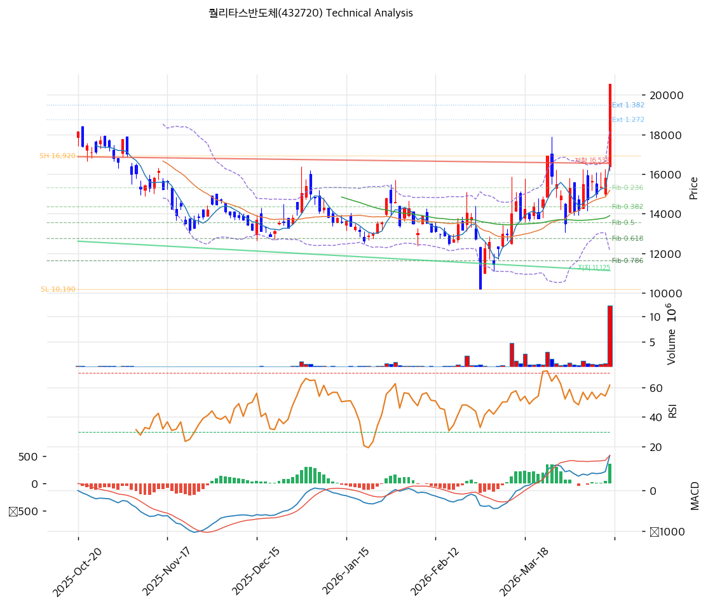

# 퀄리타스반도체(432720) 기술적 분석

2026-04-14 | T2 Technical Analysis

---

## 차트

---

## 1. 가격 현황

| 항목 | 값 |
|------|-----|
| 현재가 | 20,550원 (+29.98%) |
| 52주 고가 | 20,550원 |
| 52주 저가 | 10,190원 |
| 52주 범위 위치 | 100.0% |
| 거래량 | 20일 평균 대비 13.77x |

---

## 2. 차트 패턴 분석

### 2.1 캔들스틱 패턴

| 패턴 | 위치 | 신뢰도 | 해석 |
|------|------|--------|------|
| 상한가 장대양봉 | 2026-04-14 (당일) | 강 | 당일 상한가(+29.98%) 도달. 강한 매수세 집중을 의미하나, 상한가 직후 단기 변동성 확대 및 차익실현 압력 경계 필요 |
| 거래량 폭발 동반 양봉 | 최근 5일 누적 | 중 | 20일 평균 대비 13.77배 거래량은 강력한 관심 집중 신호. 단, 상한가 이후 다음날 거래 패턴(갭 하락 또는 연속 상승)이 추세 지속 여부를 판단하는 핵심 캔들 |

※ 주요 캔들 패턴: 당일 상한가 장대양봉. 다음 캔들(2026-04-15) 형성 전까지 패턴 완성 판단 보류

### 2.2 가격 구조 패턴

- **52주 신고가 돌파 — 박스권 상단 이탈** (신뢰도: 강)
  52주 저가(10,190원)에서 52주 고가(20,550원)까지 약 102% 상승 후 당일 상한가로 52주 고가를 경신했다. 기존 저항이었던 전 고가가 지지로 전환될 가능성이 있으며, 구조적 상승 추세 유지 조건은 이전 저항선(19,491원~19,610원 구간) 위에서 종가가 유지되는 것이다. 상한가 이후 되돌림 폭이 작을수록 추세 지속 신뢰도가 높아진다.

- **가파른 단기 상승 후 과열 경계** (신뢰도: 중)
  최근 MA5(16,476원) 대비 현재가 괴리율이 +24.7%, MA20 대비 +35.4%로 단기 과열 구간에 진입해 있다. 피보나치 확장 1.618 레벨(21,079원)이 단기 목표가이자 저항선으로 작동하며, 확장 2.0 레벨(23,650원)이 중기 목표가다. 단기 고점 형성 후 피보나치 되돌림 구간으로의 조정이 올 경우 0.236 레벨(15,332원) 또는 MA20(15,180원)이 핵심 지지 구간이 된다.

### 2.3 다이버전스

- **MACD 상승 추세 확인 — 다이버전스 없음** (신뢰도: 중)
  MACD(873) > Signal(516)이고 히스토그램(358)이 양수 확대 중으로, 가격 상승과 MACD 방향이 일치한다. 현재는 다이버전스가 관찰되지 않으나, 상한가 이후 추가 상승 시 가격 신고가 대비 MACD 히스토그램이 축소된다면 **하락 다이버전스** 형성 여부를 경계해야 한다.

- **RSI 하락 다이버전스 잠재 경고** (신뢰도: 약)
  RSI(14) 69.8은 과매수 직전(70 미만)으로, 현재가가 52주 신고가를 경신했음에도 RSI가 70 미만에 머물고 있다면 소폭의 하락 다이버전스 신호로 해석할 수 있다. 상한가 이후 추가 상승 랠리가 진행될 경우 RSI 70 이상 돌파 여부가 과매수 구간 진입의 확인 신호가 된다.

### 2.4 패턴 종합 판단

당일 상한가 장대양봉과 13.77배 거래량 폭발은 강력한 단기 매수 시그널이다. 그러나 MA20 대비 +35.4% 괴리, 피보나치 확장 1.272(18,751원)~1.382(19,491원) 이미 돌파 후 1.618(21,079원) 접근 구간은 기술적 과열 경계선이다. 상충 시그널로는 MACD·스토캐스틱 골든크로스(매수)와 볼린저밴드 상단 밀착(중립·과열 경고)이 공존한다. 상한가 익일 장 초반 가격 안착 구간과 거래량 추이가 단기 추세 지속 여부의 핵심 판단 지점이다.

---

## 3. 이동평균선 — 비정배열 (단기 강세)

| MA | 값 | 현재가 괴리율 | 위치 |
|----|-----|--------------|------|
| MA5 | 16,476원 | +24.7% | 위 |
| MA20 | 15,180원 | +35.4% | 위 |
| MA60 | 13,898원 | +47.9% | 위 |
| MA120 | 14,370원 | +43.0% | 위 |
| MA200 | 14,390원 | +42.8% | 위 |

**해석**: 현재가가 5개 이동평균선 모두 위에 위치하여 강한 단기 상승 추세를 확인할 수 있다. 그러나 MA5~MA200이 16,476원~13,898원 범위에 밀집되어 있어 **정배열(MA5>MA20>MA60)이 완성되지 않은 비정배열** 상태다. MA60(13,898원)이 MA120(14,370원)보다 아래에 있어 중기 하락 추세의 흔적이 남아 있다. 현재가 20,550원은 모든 MA 대비 +25~48% 수준으로 과열 구간이며, 조정 시 MA5(16,476원)와 MA20(15,180원)이 1·2차 지지선으로 작동한다.

---

## 4. 보조 지표

### RSI(14) — 69.8 (중립~과매수 임박)

RSI 69.8은 과매수 기준선(70) 바로 아래로, 당일 상한가 급등에도 불구하고 아직 과매수 구간에 진입하지 않은 상태다. 추가 상승 시 70 돌파 여부가 과매수 확인 신호가 되며, RSI 70 돌파 이후 재하향이 발생하면 단기 고점 형성의 기술적 신호로 해석할 수 있다.

### MACD(12,26,9)

| 항목 | 값 |
|------|-----|
| MACD | 873 |
| Signal | 516 |
| Histogram | +358 |
| 크로스 상태 | 매수 구간 (확대 중) |

**해석**: MACD가 Signal 위에 있고 히스토그램이 양수 확대 중으로, 단기 상승 모멘텀이 살아 있음을 확인한다. 히스토그램 확대 추세가 유지되는 한 매수 구간이며, 히스토그램이 축소로 반전될 경우 상승 모멘텀 둔화의 조기 경고 신호다.

### 볼린저밴드(20, 2σ)

| 항목 | 값 |
|------|-----|
| 상단 | 18,240원 |
| 중단 (MA20) | 15,180원 |
| 하단 | 12,121원 |
| 밴드 폭 | 40.3% |
| 현재 위치 | 상단 초과 |

**해석**: 현재가 20,550원이 볼린저밴드 상단(18,240원)을 상향 이탈한 상태다. 밴드 폭 40.3%는 이미 상당히 확장된 수준으로, 주가 변동성이 높아져 있음을 시사한다. 볼린저밴드 상단 초과는 강한 상승 모멘텀의 신호이기도 하지만, 통상 밴드 상단 이탈 후 중단(MA20=15,180원)으로의 복귀 압력이 존재한다.

### 스토캐스틱(14, 3, 3)

| 항목 | 값 |
|------|-----|
| Slow %K | 68.3 |
| Slow %D | 54.7 |
| 크로스 상태 | 골든크로스 |
| 판단 | 중립 (과매수 임박) |

---

## 5. 지지/저항 — 추세선 · 피보나치 · PRZ 통합

### 5.1 피보나치 되돌림/확장

| 구분 | 비율 | 가격 | 현재가 대비 |
|------|------|------|-----------|
| Swing High | — | 16,920원 | — |
| 되돌림 | 0.236 | 15,332원 | -25.4% |
| 되돌림 | 0.382 | 14,349원 | -30.2% |
| 되돌림 | 0.5 | 13,555원 | -34.0% |
| 되돌림 | 0.618 | 12,761원 | -37.9% |
| 되돌림 | 0.786 | 11,630원 | -43.4% |
| Swing Low | — | 10,190원 | — |
| 확장 | 1.272 | 18,751원 | -8.8% |
| 확장 | 1.382 | 19,491원 | -5.2% |
| 확장 | 1.618 | 21,079원 | +2.6% |
| 확장 | 2.0 | 23,650원 | +15.1% |

※ 피보나치 기준: 상승 추세 (Swing Low 10,190원 → Swing High 16,920원)
※ 현재가(20,550원)는 Swing High(16,920원)를 상향 돌파하여 확장 구간에 진입한 상태
※ 되돌림 = 직전 추세에서 되돌아온 비율, 확장 = 추세 방향 목표가

### 5.2 추세선

| 추세선 | 방향 | 현재 교차가 | 포인트 수 | 해석 |
|--------|------|-----------|---------|------|
| 지지선 | 하락 | 11,125원 | 6개 | 하락 추세선 지지. 현재가 대비 -45.9% 수준으로 원거리. 현재 가격 구조에서 유효 지지 역할 미미 |
| 저항선 | 하락 | 16,538원 | 6개 | 하락 추세선 저항. 현재가 20,550원이 이미 상향 돌파. 돌파 성공 시 지지로 전환 가능 (16,476~16,538원 구간) |

### 5.3 PRZ (Potential Reversal Zone)

| 방향 | 가격 범위 | 신뢰도 | 근거 |
|------|---------|--------|------|
| 저항 | 23,477~23,650원 | 약 | 피봇 R2(23,477원), 피보나치 2.0 확장(23,650원) |
| 지지 | 16,476~16,538원 | 약 | MA5(16,476원), 추세선 저항 하향 전환(16,538원) |
| 지지 | 15,180~15,332원 | 약 | MA20(15,180원), 피보나치 0.236 되돌림(15,332원) |
| 지지 | 14,390~14,697원 | 약 | MA200(14,390원), 피봇 S2(14,697원) |

※ PRZ = 추세선 · 피보나치 · 피봇 · MA 등 복수 지표가 겹치는 가격 구간. 겹치는 소스가 많을수록 반전 확률 상승.

### 5.4 종합 지지/저항 테이블

| 구분 | 가격 | 근거 |
|------|------|------|
| 저항 | 23,564원 | PRZ — 피봇 R2(23,477원) + 피보나치 2.0 확장(23,650원) |
| 저항 | 22,013원 | 피봇 R1 |
| 저항 | 21,079원 | 피보나치 1.618 확장 (단기 목표가) |
| **현재가** | **20,550원** | — (52주 신고가·상한가) |
| 지지 | 19,491원 | 피보나치 1.382 확장 |
| 지지 | 18,751원 | 피보나치 1.272 확장 |
| 지지 | 17,623원 | 피봇 S1 |
| 지지 | 16,476~16,538원 | PRZ — MA5(16,476원) + 추세선 저항 전환(16,538원) |
| 지지 | 15,180~15,332원 | PRZ — MA20(15,180원) + 피보나치 0.236 되돌림(15,332원) |
| 지지 | 14,390~14,697원 | PRZ — MA200(14,390원) + 피봇 S2(14,697원) |

---

## 6. 시그널 종합

| 지표 | 내용 | 시그널 |
|------|------|--------|
| **차트 패턴** | 52주 신고가 상한가 돌파, 피보나치 확장 구간 진입 | 🟢 |
| 이동평균선 | 비정배열, 전 MA 상회 (+24.7~47.9%) — 단기 강세·중장기 과열 | 🟢 (단기) / 🔴 (과열) |
| RSI | 69.8 — 과매수 임박, 70 미돌파 | ⚪ |
| MACD | 매수 구간, 히스토그램 +358 확대 중 | 🟢 |
| 볼린저밴드 | 상단(18,240원) 초과 이탈, 밴드 폭 40.3% — 과열 경고 | ⚪ |
| 스토캐스틱 | 골든크로스, K=68.3 — 중립 (과매수 임박) | ⚪ |
| 거래량 | 13.77x — 강력 동반 | 🟢 |

**종합 판단**: 🟢 매수 3개 / 🔴 매도 0개 / ⚪ 중립 4개 → **매수우위 (단기 과열 경계)**

단기 모멘텀은 매수 우위가 명확하다. MACD 매수 구간 유지, 거래량 13.77배 폭발, 전 이동평균선 상회는 강한 매수 압력을 확인한다. 그러나 MA20 대비 +35.4% 괴리, 볼린저밴드 상단 초과, RSI 70 임박은 기술적 과열 구간임을 경고한다. 중기적으로는 MA60(13,898원)이 MA120(14,370원) 아래에 위치한 비정배열 구조가 완전히 해소되지 않았으며, 추세 전환 확인을 위해서는 MA60이 MA120을 상향 돌파하는 정배열 완성이 필요하다.

---

## 7. 전략 제안

### 보유 중인 경우
- **홀드 (단기 과열 경계, 분할 익절 검토)**
- 익절 라인: 21,079원 (피보나치 1.618 확장 — 단기 목표가)
- 손절 라인: 14,697원 (피봇 S2 — 주요 지지선 붕괴 시)
- 리스크/리워드: 목표 +2.6% vs 손절 -28.5% — 현 시점 신규 매수 리스크/리워드 비율 비대칭

### 진입 대기인 경우
- **관망 (상한가 직후 진입 비추천)**
- 1차 진입가: 17,623원 (피봇 S1 — 조정 후 지지 확인)
- 2차 진입가: 15,180원 (MA20 + 피보나치 0.236 되돌림 PRZ 구간)
- 진입 조건: 상한가 이후 조정 시 피봇 S1(17,623원) 지지 확인 + 거래량 감소 후 재반등 캔들 형성. 또는 MA20(15,180원) PRZ 구간에서 거래량 동반 반등 캔들 확인 후 진입
