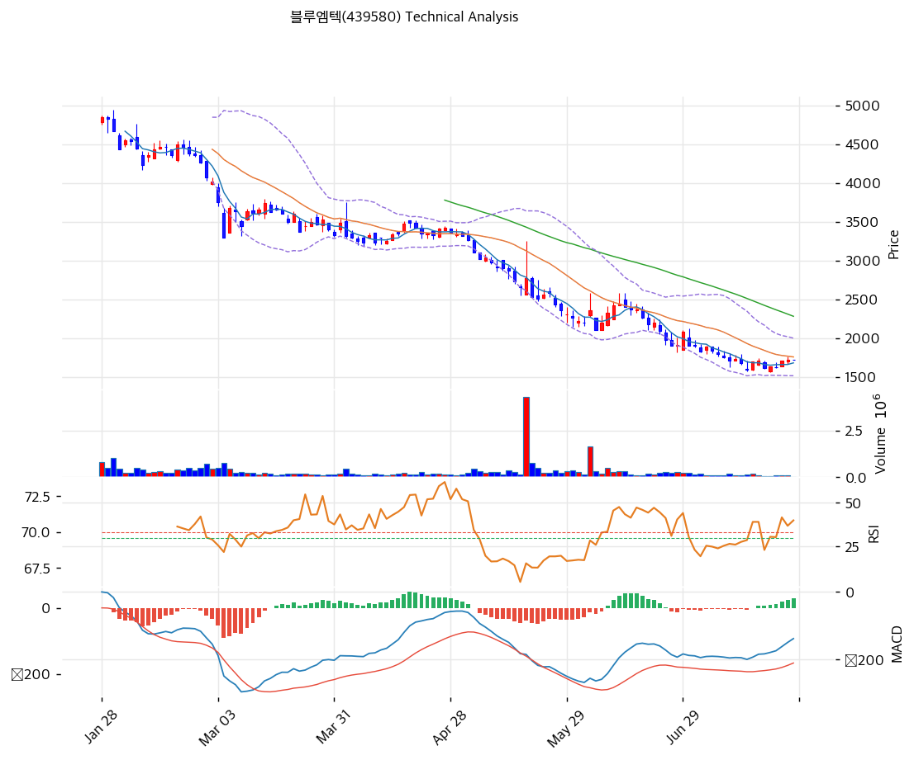

# 블루엠텍(439580) 기술적 분석

2026-07-27 | T2 Technical Analysis

---

## 차트

---

## 1. 가격 현황

| 항목 | 값 |
|------|-----|
| 현재가 | 1,719원 (0.00% — 장 시작 전 기준) |
| 52주 고가 | 6,420원 |
| 52주 저가 | 1,595원 |
| 52주 범위 위치 | **2.6%** (바닥권) |
| 거래량 | 20일 평균 대비 0.00x (장전 집계 — 최근 거래 매우 한산) |

---

## 2. 차트 패턴 분석

### 2.1 캔들스틱 패턴

| 패턴 | 위치 | 신뢰도 | 해석 |
|------|------|--------|------|
| 소실체 캔들 군집 (도지성) | 최근 3주, 1,600\~1,750원 | 중 | 매도 압력 소진 + 매수 부재의 균형 — 바닥 다지기 초기 |
| 장대음봉 후 거래량 급감 | 5월 말\~6월 초 | 강 | 대량 거래(250만·150만주) 동반 급락 후 거래 실종 — 투매 종료 신호 |

### 2.2 가격 구조 패턴

- **6개월 계단식 하락 추세** (신뢰도: 강)
  1월 5,000원대 → 7월 1,700원대까지 반등다운 반등 없이 하락. 하락 추세선 저항이 현재 약 2,105원으로, 이 선을 넘기 전까지 추세 전환을 논하기 어렵다.

- **1,595\~1,750원 바닥권 횡보** (신뢰도: 중)
  6월 하순 저점(1,595원) 이후 3주째 좁은 박스. 저점을 낮추지 않고 버티는 중이나 거래량이 마른 상태라 '지지'라기보다 '무관심'에 가깝다.

- **볼린저밴드 수축 진행** (신뢰도: 중)
  폭 27.5%로 하락기(4\~6월) 대비 좁아지는 중 — 변동성 응축 후 방향 분출의 전 단계.

### 2.3 다이버전스

- **MACD 상승 다이버전스 (진행형)** (신뢰도: 중)
  5\~6월 가격이 저점을 낮추는 동안 MACD 저점은 높아졌고, 7월 들어 시그널 상향 돌파(-138 vs -167, 히스토그램 +29 확대) — 깊은 음수 영역에서의 매수 전환은 하락 모멘텀 소진의 초기 신호다.

- **RSI 39.5 — 침체권 탈출 시도** (신뢰도: 약)
  6월 저점(RSI 20대)에서 회복했으나 중립선(50)에도 못 미침 — 반등 동력이 약하다는 반증.

### 2.4 패턴 종합 판단

**하락 추세의 끝자락에서 바닥을 다지는 국면**이다. 투매(5\~6월 대량 거래)는 끝났고 MACD는 매수로 전환했으며 저점은 3주째 유지되고 있다 — 여기까지는 긍정적이다. 그러나 거래량이 실종돼 반등을 만들 매수 주체가 보이지 않고, 모든 중장기 이평(MA60·120·200)이 -25~-54%로 머리 위에 있다. **바닥은 만들어지는 중이나 추세 전환은 아직 아니며**, 8월 반기 실적(영업흑자 여부)이 방향의 방아쇠가 될 가능성이 높다.

---

## 3. 이동평균선 — 완전 역배열 (깊은 침체)

| MA | 값 | 현재가 괴리율 | 위치 |
|----|-----|--------------|------|
| MA5 | 1,681원 | +2.2% | 위 |
| MA20 | 1,758원 | -2.2% | 아래 |
| MA60 | 2,282원 | -24.7% | 아래 |
| MA120 | 3,031원 | -43.3% | 아래 |
| MA200 | 3,753원 | **-54.2%** | 아래 |

**해석**: MA5만 겨우 상회하는 완전 역배열이며, MA200 대비 -54.2%는 1년 평균 매입단가의 절반 이하라는 뜻이다. 이런 구간에서 이평은 저항으로만 작동한다 — 1차 관문은 MA20(1,758원), 그 다음이 MA60(2,282원)이며, 각각 +2.3%·+32.8% 위에 있다. **MA20 회복조차 아직 못한 상태**라는 점이 현 국면의 냉정한 좌표다.

---

## 4. 보조 지표

### RSI(14) — 39.5 (중립 하단)

침체권(30)에서 벗어났으나 중립선(50) 아래 — 반등 시도는 있으나 힘이 실리지 않은 상태.

### MACD(12,26,9)

| 항목 | 값 |
|------|-----|
| MACD | -138.0 |
| Signal | -167.0 |
| Histogram | **+29.0** (확대 중) |
| 크로스 상태 | 매수 구간 (음수 영역 골든크로스) |

**해석**: 깊은 마이너스 영역에서의 골든크로스 + 히스토그램 확대 — '하락이 멈췄다'는 신호이지 '상승이 시작됐다'는 신호는 아니다. MACD가 0선에 접근하는지가 다음 확인점.

### 볼린저밴드(20, 2σ)

| 항목 | 값 |
|------|-----|
| 상단 | 2,000원 |
| 중단 (MA20) | 1,758원 |
| 하단 | 1,516원 |
| 밴드 폭 | 27.5% |
| 현재 위치 | 중간 (하단→중단 사이) |

**해석**: 하단(1,516원)에서 반등해 중단(1,758원)을 향하는 위치. 밴드가 수축 중이라 상단 돌파 시 변동성 분출 가능성이 있으나, 현재는 중단조차 넘지 못했다.

### 스토캐스틱(14, 3, 3)

| 항목 | 값 |
|------|-----|
| Slow %K | 46.6 |
| Slow %D | 36.6 |
| 크로스 상태 | 골든크로스 |
| 판단 | 중립 (과매도 탈출) |

---

## 5. 지지/저항 — 추세선 · 피보나치 · PRZ 통합

### 5.1 피보나치 되돌림

| 구분 | 비율 | 가격 | 현재가 대비 |
|------|------|------|-----------|
| Swing High | — | 6,870원 | +299.7% |
| 되돌림 | 0.786 | 5,734원 | +233.6% |
| 되돌림 | 0.618 | 4,842원 | +181.7% |
| 되돌림 | 0.5 | 4,216원 | +145.3% |
| 되돌림 | 0.382 | 3,589원 | +108.8% |
| 되돌림 | 0.236 | 2,814원 | +63.7% |
| Swing Low | — | 1,561원 | -9.2% |

※ 피보나치 기준: 하락 추세(6,870 → 1,561원) — 되돌림 레벨이 전부 상방 저항이며, **가장 가까운 0.236(2,814원)도 현재가보다 64% 위**에 있다. 하락의 깊이를 보여주는 표

### 5.2 추세선

| 추세선 | 방향 | 현재 교차가 | 포인트 수 | 해석 |
|--------|------|-----------|---------|------|
| 지지선 | 하락 | 2,869원 | 6개 | 이미 하향 이탈 — 저항으로 반전 |
| 저항선 | 하락 | **2,105원** | 6개 | 1월 고점발 하락 추세선 — **추세 전환의 1차 관문** |

### 5.3 PRZ (Potential Reversal Zone)

| 방향 | 가격 범위 | 신뢰도 | 근거 |
|------|---------|--------|------|
| 지지 | 1,719원 | 강 | 피봇 R1·R2·S1·S2 수렴 (거래 한산으로 피봇 밀집) |
| 지지 | 1,516\~1,595원 | 참고 | 볼린저 하단 + 52주 저가 |
| 저항 | 1,758원 | 참고 | MA20 + 볼린저 중단 |
| 저항 | 2,105\~2,282원 | 참고 | 하락 추세선 + MA60 |

※ PRZ = 추세선 · 피보나치 · 피봇 · MA 등 복수 지표가 겹치는 가격 구간. 금일 피봇이 한 점에 수렴한 것은 전일 거래가 극히 한산했다는 뜻

### 5.4 종합 지지/저항 테이블

| 구분 | 가격 | 근거 |
|------|------|------|
| 저항 | 2,814원 | 피보나치 0.236 되돌림 |
| 저항 | 2,282원 | MA60 |
| 저항 | 2,105원 | **하락 추세선 — 추세 전환 관문** |
| 저항 | 2,000원 | 볼린저 상단 |
| 저항 | 1,758원 | MA20 + 볼린저 중단 (1차 관문) |
| **현재가** | **1,719원** | — |
| 지지 | 1,681원 | MA5 |
| 지지 | 1,595원 | 52주 저가 |
| 지지 | 1,516원 | 볼린저 하단 |

---

## 6. 시그널 종합

| 지표 | 내용 | 시그널 |
|------|------|--------|
| **차트 패턴** | 하락 추세 속 바닥 횡보 + 투매 종료 | ⚪ |
| 이동평균선 | 완전 역배열, MA200 -54.2% | ⚪ (침체) |
| RSI | 39.5 — 중립 하단 | ⚪ |
| MACD | 음수 영역 골든크로스, 히스토그램 확대 | 🟢 |
| 볼린저밴드 | 중간, 폭 27.5% 수축 중 | ⚪ |
| 스토캐스틱 | 골든크로스, K=46.6 | ⚪ |
| 거래량 | 0.0x — 장전 집계 (최근 한산) | ⚪ |

**종합 판단**: 🟢 매수 1개 / 🔴 매도 0개 / ⚪ 중립 5개 → **중립 (바닥 다지기 — 촉매 대기)**

'매도 신호가 없다'는 것이 유일한 위안이다. 투매는 끝났고 MACD는 전환했지만, 완전 역배열(MA200 -54.2%)과 거래 실종은 아직 매수 주체가 없음을 보여준다. **이 구간의 규율은 명확하다 — MA20(1,758원) 회복도 못한 종목을 미리 사지 말고, 실적(8월 반기)이나 거래량 회복 중 하나를 확인한 뒤 움직인다.** 1,595원(52주 저가) 이탈 시 신저가 경로가 열리므로 손절 기준도 함께 정해야 한다.

---

## 7. 전략 제안

### 보유 중인 경우
- **홀드 (손절선 엄수)**
- 익절 라인: 2,105원 (하락 추세선 — 1차 반등 목표), 돌파 시 2,282원(MA60)
- 손절 라인: 1,570원 (52주 저가 1,595원 종가 이탈 = 바닥 붕괴)
- 리스크/리워드: 약 2.6 (+386 / -149) — 손절선이 가까워 손익비는 우호적이나, 반등 확률 자체가 낮은 구간

### 진입 대기인 경우
- **관망 (바닥 확인 전 진입 금지)**
- 1차 진입가: 1,758원 이상 종가 안착 + 거래량 20일 평균 회복 (MA20 회복 = 최소 조건)
- 2차 진입가: 2,105원 거래량 동반 돌파 시 추세 전환 추종 (하락 추세선 상향 돌파)
- 진입 조건: 이 종목은 3년째 영업적자이며 최대주주 지분이 7.25%로 취약하다 — **기술적 반등만으로 진입하지 말고 8월 반기 실적의 영업이익 방향을 먼저 확인할 것.** 진입하더라도 포지션 규모를 제한하고, 1,570원 손절을 기계적으로 집행해야 한다
