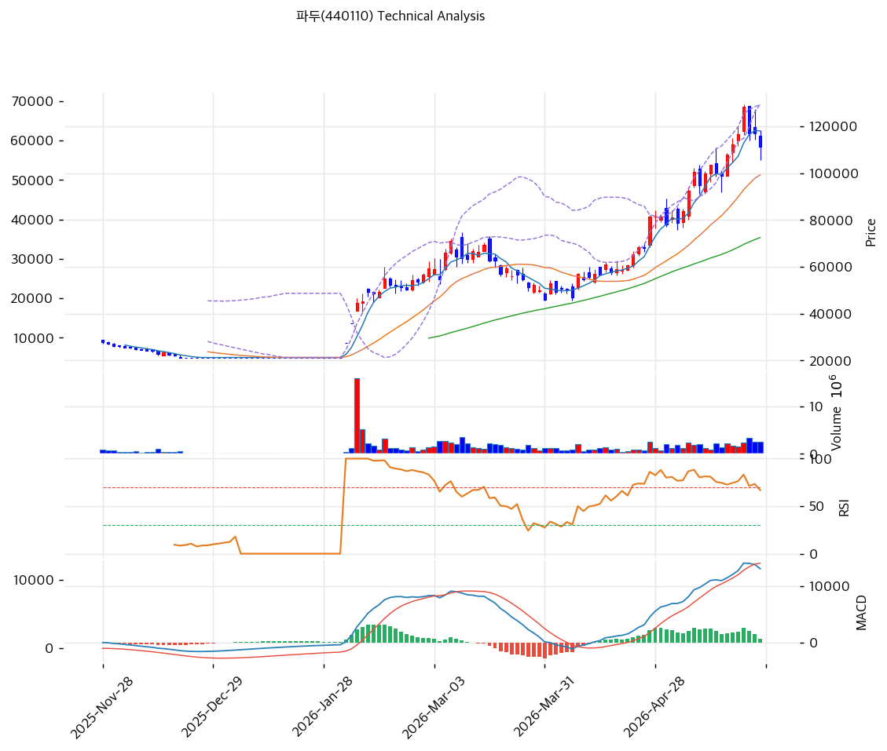

# 기술적분석

***

## 가격 위치

현재가 **111,400원** (-4.70%) — 52주 위치 **85.7%**, 52주 고가 128,300원 -13% 단기 조정 진행. 1년 **+1,003%** (10,100→111,400) 사상 최대 폭등. **외국인 20일 +4,815,235주 폭매수** (시총의 8.6% = 사상 최대 매수 규모) + 기관 -2,190,439 매도. 외국인 단독 매수가 V자 랠리의 핵심 동력.

## 이동평균선 / 모멘텀

MA5 118,020 / MA20 99,270 / MA60 72,482 / MA120 50,981 / MA200 38,391 — **MA5 > MA20 > MA60 > MA120 > MA200 완전 정배열 True**. MA200 대비 **+190.2%**, MA120 대비 +118.5%, MA20 대비 +12.2% 강한 우상향. MA5는 단기 -5.6% 이격 (단기 조정 진입).

**RSI 63.4 (중립)** — 70 미만 안정 영역, 추가 모멘텀 여지. MACD 13,084 / 시그널 12,478 / 히스토 605 = **매수 시그널 유지, 확장 둔화** (단기 모멘텀 약화). 스토캐 K=72.1 / D=81.6 **데드크로스** + 중립 영역 = 단기 조정 신호. 볼륨비 1.37x로 거래량 평균 상회 — **매수세 + 매도세 동시 활발**.

## 시그널 종합 / S\&R

매수 1 / 매도 0 / 중립 5 → **매수우위(약)**. 신호는 강하지 않으나 정배열 + 외국인 매수 결합으로 추세 유지.

* 저항: **117,944원(PRZ 약: 피봇 R1·MA5)** / 128,300원(52주 고가) / 추정 추가 저항 135,000\~140,000원
* 지지: 105,267원(피봇 S1) / **99,880원(PRZ 중: 피봇 S2·MA20·피보 0.236)** / 83,812원(피보 0.382) / **72,482원(MA60)** / 67,172원(추세선 지지)
* 깊은 조정 지지: 50,981원(MA120) / 38,391원(MA200) — 50% 조정 시 진입 가능 영역

전략: **HOLD(홀드) — TP 130,866원 / SL 99,133원**. WAIT(진입가능) e1=105,267원 / e2=99,270원. **MA20 99,270원 지지 사수 시 분할 매수**, MA60 72,482원까지 깊은 조정 시 추가 진입. 52주 고가 128,300원 돌파 시 신한 TP 130,000원 도달 + 추가 모멘텀 가능. CB 행사가 10,735원 + 깊은 ITM은 단기 매물 부담이나 희석 2.21%로 충격 작음.
