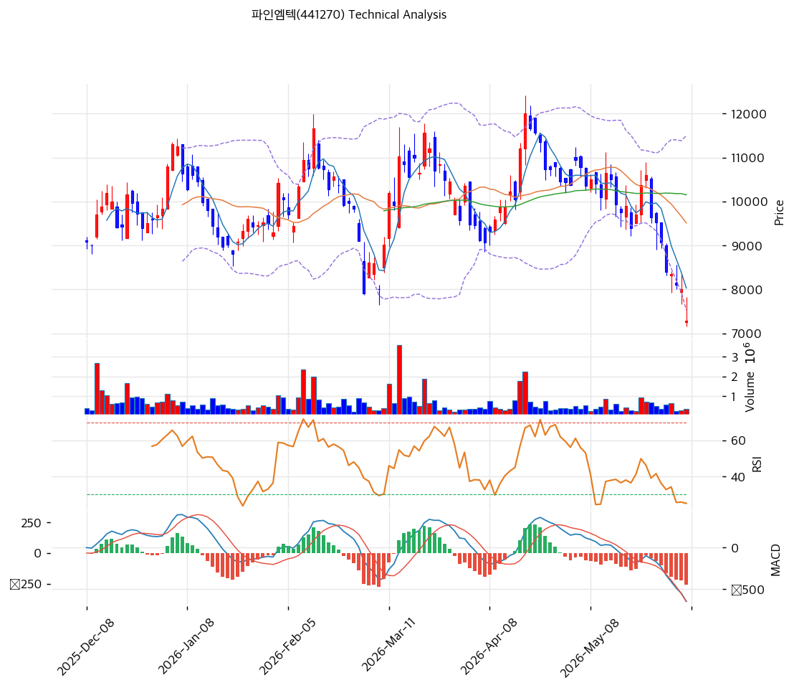

# 파인엠텍(441270) 기술적 분석 보고서

---

## 가격 위치

현재가 **7,320원** (-8.50%) — 1년 위치 24.3%(고점 13,840원 대비 **-47%**, 저점 5,190원 대비 +41%). 2025 폴더블 부진 + CB 희석 우려로 하락 추세, 당일 -8.5% 급락. **RSI 27.1·스토캐 6.9 극단 과매도**. 단 2026 애플 폴더블·삼성 회복 턴어라운드 기대가 저점 매수 논거. 거래량비 0.74x.

## 이동평균선

| 이평선 | 값 | 이격도 | 위치 |
|------|---:|----:|:---:|
| MA5 | 8,030원 | -9.2% | 아래 |
| MA20 | 9,510원 | -23.3% | 아래 |
| MA60 | 10,151원 | -28.2% | 아래 |
| MA120 | 9,969원 | -26.9% | 아래 |
| MA200 | 10,126원 | -28.0% | 아래 |

**완전 역배열(하락추세)** — 현재가가 모든 이평선 아래. MA20·MA60(9,500\~10,150원)이 위에서 강한 저항. 반등 시 1차 저항 MA5 8,030원.

## 모멘텀 지표

- **RSI 27.1 (과매도 🟢)** — 30 미만 과매도. 단기 반등 압력 누적
- **MACD -650 / 시그널 -394 / 히스토 -257** — 매도 + 하락 확장. 하락 모멘텀 잔존
- **스토캐스틱 K=6.9 / D=8.2** — 데드크로스 **극단 과매도(6.9)**. 기술적 반등 임박 구간
- **볼린저밴드** — 상단 11,496 / 중심 9,510 / 하단 7,524, 폭 41.8%, **하단 이탈**. 과매도 극단
- **거래량비 0.74x** — 거래 위축(투매 후 소강)

## 피보나치 되돌림 (직전 상승 스윙 5,190 / 13,840)

| 레벨 | 가격 | 성격 |
|------|---:|------|
| 0.618 | 8,494원 | 반등 시 저항 (MA5 위) |
| 0.786 | 7,041원 | 현재가 부근 지지 |
| 저점 | 5,190원 | 52주 저가 |

※ 현재가 7,320원은 피보 0.786(7,041) 부근 — 직전 상승분의 약 75% 되돌린 깊은 조정.

## 지지/저항 (S&R)

- **저항**: 8,030원(MA5) / 8,494원(피보 0.618) / 9,510원(MA20·BB 중심) / 10,151원(MA60)
- **지지**: **7,524원(BB 하단)** / 7,041원(피보 0.786) / 6,750원(전략 SL) / 5,190원(52주 저가)

## 종합 시그널 & 전략

**시그널: 매수 3 / 매도 1 / 중립 2 → 매수우위** (극단 과매도 반등 시그널)

- **전략**: HOLD(홀드) — TP 14,117원 / SL 6,750원. WAIT(진입가능) e1 7,020원 / e2 9,510원
- **저점 분할 매수**: 스토캐 6.9·RSI 27.1·BB 하단 이탈로 **극단 과매도 → 기술적 반등 임박**. 2026 애플 폴더블·삼성 회복 카탈리스트가 더해져 **지놈앤컴퍼니 대비 저점 매수 논거 우위**. **7,000\~7,500원(피보 0.786·BB 하단) 분할 매수** 권고, 6,750원 손절
- **상방**: 반등 시 MA5 8,030원 → 피보 0.618 8,494원 → MA20 9,510원. 애플 폴더블 출시·삼성 수주가 추세 반전 트리거
- **하방**: 6,750원·피보 0.786 7,041원 이탈 시 52주 저가 5,190원. CB 전환가 5,594원이 하방 일부 지지(인더머니 유지선)
- **변곡점**: 애플 폴더블(2026 9월)·삼성 점유율 회복이 추세 핵심. 극단 과매도로 단기 반등 가능하나, 추세 반전은 카탈리스트 확인 필요. 적자·CB 희석으로 비중·손절 관리
