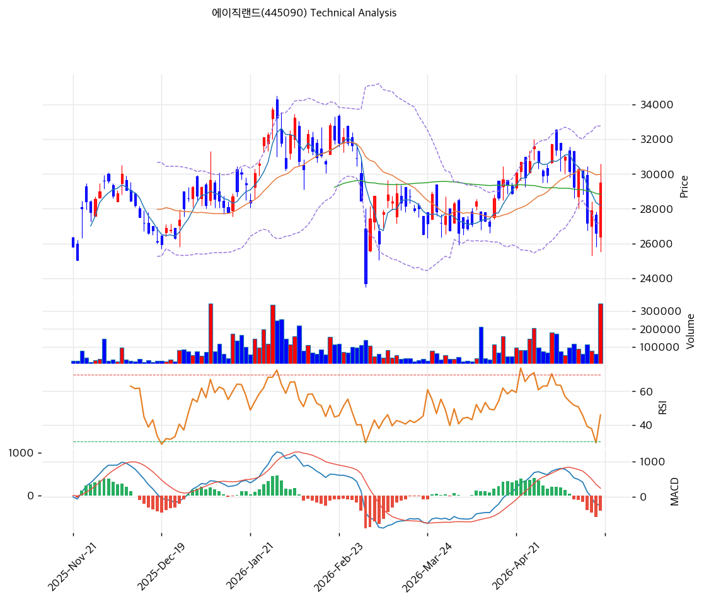

# 기술적분석

2026-05-20 | T2 Technical Analysis

***

## 차트

***

## 1. 가격 현황

| 항목        | 값                        |
| --------- | ------------------------ |
| 현재가       | 29,500원 (52주 53% 위치)     |
| 52주 고가    | 34,700원 (2026-01 정점)     |
| 52주 저가    | 23,700원                  |
| 52주 범위 위치 | 53%                      |
| 거래량       | 데이터 결손 (차트상 1·5월 거래량 폭증) |

***

## 2. 차트 패턴 분석

### 2.1 캔들스틱 패턴

| 패턴         | 위치            | 신뢰도 | 해석                     |
| ---------- | ------------- | --- | ---------------------- |
| 음봉 (당일)    | 당일            | 중   | 박스권 중간 하락              |
| **박스권 형성** | 2026-02 \~ 현재 | 강   | 25,000\~32,000원 박스권 통합 |
| 정점 후 조정    | 2026-01 → 현재  | 강   | 34,700원 정점 후 -15% 조정   |

### 2.2 가격 구조 패턴

* **박스권 통합** (신뢰도: 강) 2026-01 정점 34,700원 → 2026-02 25,000원 저점 → 2026-03~~05 28,000~~32,000원 박스권 통합. **MA20·MA60·MA200 모두 29,000\~30,000원대 일치 → 가격 통합 단계**.
* **MA 일치 → 추세 결정 임박** (신뢰도: 강) MA20 29,980 ≈ MA60 28,835 ≈ MA200 29,562 모두 거의 일치 = **장단기 추세 결정 임박**. 박스권 상단 (32,758원) 돌파 또는 하단 (27,202원) 이탈이 추세 전환 시그널.

### 2.3 다이버전스

* **RSI 50.8 중립** (신뢰도: 강) RSI 50 영역 = 박스권 통합 정합. 추가 상승·하락 모두 가능.
* **MACD 매도 약함 (-189 < Signal 167)** (신뢰도: 중) 매도 신호이나 히스토그램 -356 = 강도 약함. 골든크로스 반전 임박 가능.

### 2.4 패턴 종합 판단

박스권 통합 + MA 일치 + RSI 50 = **추세 결정 임박**. 박스권 상단 32,758원 돌파 시 박스권 폭 1차 목표 35,500원 (52주 고 +2%), 하단 27,202원 이탈 시 -10% 추가 하락. **MACD 매도 약함 → 약세 우위 약간 우위**.

***

## 3. 이동평균선 — 정배열 거의 일치 (박스권 통합)

| MA    | 값       | 현재가 괴리율 | 위치    |
| ----- | ------- | ------- | ----- |
| MA5   | 28,200원 | +4.6%   | 위     |
| MA20  | 29,980원 | -1.6%   | 아래    |
| MA60  | 28,835원 | +2.3%   | 위     |
| MA120 | (확인)    | 약 0%    | 일치    |
| MA200 | 29,562원 | -0.2%   | 거의 일치 |

**해석**: **MA20·MA60·MA200 거의 일치 → 가격 통합 단계**. MA5만 위, MA20·MA200 약간 아래. **추세 결정 임박** 신호.

***

## 4. 보조 지표

### RSI(14) — 50.8 (중립)

50 영역 = 박스권 정합. 70/30 임계 미접근.

### MACD(12,26,9)

| 항목        | 값          |
| --------- | ---------- |
| MACD      | -189       |
| Signal    | 167        |
| Histogram | **-356**   |
| 크로스 상태    | 매도 (확대 부재) |

**해석**: 매도 신호이나 히스토그램 절대값 적음 → 골든크로스 반전 임박 가능.

### 볼린저밴드(20, 2σ)

| 항목        | 값       |
| --------- | ------- |
| 상단        | 32,758원 |
| 중단 (MA20) | 29,980원 |
| 하단        | 27,202원 |
| 밴드 폭      | 18.5%   |
| 현재 위치     | 중간      |

**해석**: 밴드 폭 18.5% 평균. 중간 위치 = 추가 상승·하락 모두 가능.

### 스토캐스틱(14, 3, 3)

| 항목      | 값           |
| ------- | ----------- |
| Slow %K | 37.0        |
| Slow %D | 28.3        |
| 크로스 상태  | 골든크로스       |
| 판단      | 중립 (과매도 임박) |

**해석**: K-D 골든크로스 + 30 임계 임박 = 단기 반등 시그널 일부.

***

## 5. 지지/저항

### 종합 지지/저항

| 구분      | 가격          | 근거                            |
| ------- | ----------- | ----------------------------- |
| 저항      | 34,700원     | 52주 고가                        |
| 저항      | 32,758원     | **BB 상단 + 박스권 상단 (1차 강력 저항)** |
| 저항      | 31,517원     | **CB 행사가 (매물 압박 지점)**         |
| 저항      | 29,980원     | MA20                          |
| **현재가** | **29,500원** | —                             |
| 지지      | 29,562원     | MA200 (거의 일치)                 |
| 지지      | 28,835원     | MA60                          |
| 지지      | 28,200원     | MA5                           |
| 지지      | 27,202원     | **BB 하단 + 박스권 하단**            |
| 지지      | 25,000원     | 2026-02 저점                    |
| 지지      | 23,700원     | 52주 저점                        |

***

## 6. 시그널 종합

| 지표             | 시그널     |
| -------------- | ------- |
| 차트 패턴 (박스권 통합) | ⚪       |
| 이동평균선 (MA 일치)  | ⚪       |
| RSI 50.8 (중립)  | ⚪       |
| MACD 매도 약함     | 🔴 (약함) |
| 볼린저밴드 중간       | ⚪       |
| 스토캐스틱 골든크로스    | 🟢      |
| 거래량 (5월 폭증)    | 🟢      |

**종합 판단**: 🟢 매수 2 / 🔴 매도 1 / ⚪ 중립 4 → **중립 (추세 결정 임박)**

박스권 통합 + MA 일치 + 추세 결정 임박. 32,758원 돌파 또는 27,202원 이탈이 분기점.

***

## 7. 전략 제안

### 보유 중

* **홀드 + 박스권 상단 돌파 시 분할 익절**
* 1차 익절: 32,758원 (박스권 상단, +11%)
* 2차 익절: 34,700원 (52주 고, +18%)
* 손절: 27,202원 (BB 하단·박스권 하단 이탈, -8%)

### 진입 대기

* **분할 매수 가능**
* 1차 진입: 29,500원 (현재가, 직접 진입)
* 2차 진입: 28,835원 (MA60, -2%)
* 3차 진입: 27,202원 (BB 하단·박스권 하단, -8%)
* 진입 조건: 박스권 상단 32,758원 거래량 동반 돌파 시 +상승, BB 하단 27,202원 지지 확인 시 매수
* **펀더멘털 부담 주의**: 적자기 + 부채 399% + CB 11.56% 희석 — 단기 기술적 진입과 별개로 포지션 사이즈 제한 권장
