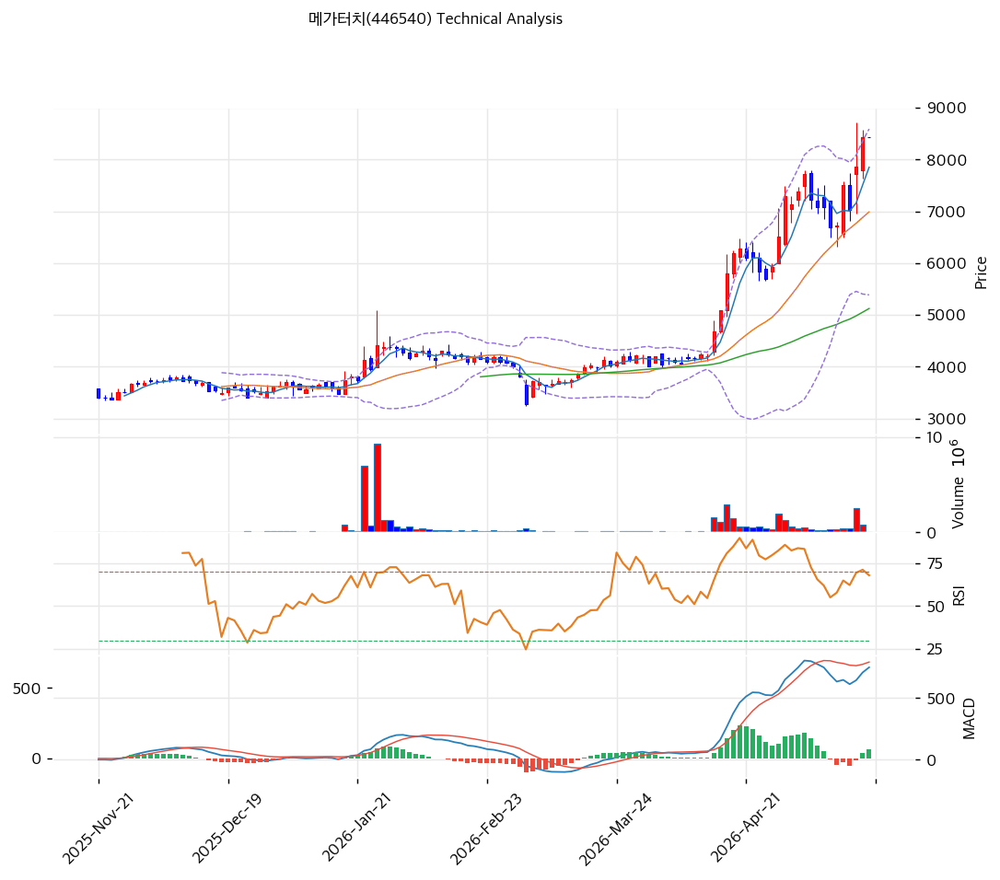

# 메가터치(446540) 기술적 분석

2026-05-20 | T2 Technical Analysis

---

## 차트

---

## 1. 가격 현황

| 항목 | 값 |
|------|-----|
| 현재가 | 8,430원 (52주 신고가) |
| 52주 고가 | 8,430원 (당일) |
| 52주 저가 | 3,285원 |
| 52주 범위 위치 | 100.0% |
| 거래량 | 데이터 결손 (차트상 3월 폭증 + 5월 재가속) |

---

## 2. 차트 패턴 분석

### 2.1 캔들스틱 패턴

| 패턴 | 위치 | 신뢰도 | 해석 |
|------|------|--------|------|
| **장대양봉 (당일)** | 당일 | 강 | 7,500→8,430원 거래량 동반 신고가 |
| 적삼병 | 최근 5~7일 | 중 | 양봉 누적 |
| **박스권 돌파** | 2026-03 | 강 | 3,500~4,500원 박스 → 거래량 폭증 + 5,000원 돌파 후 가속 |

### 2.2 가격 구조 패턴

- **장기 박스권 돌파 + 포물선 가속** (신뢰도: 강)
  2025-11~2026-03 박스권 (3,200~4,500원) → 2026-03 거래량 폭증 + 5,000원 돌파 → 2026-04~05 5,500→8,430원 포물선 가속. **MA200 +96% 극단 이격은 포물선 후반부 평균회귀 임박 시그널**.

- **52주 신고가 + 5,000원 → 8,430원 +69% 단기 폭등** (신뢰도: 강)
  최근 1.5개월간 +69% 가속 = 포물선 후반부.

### 2.3 다이버전스

- **RSI 71.3 과매수 임계 돌파** (신뢰도: 중)
  RSI 70 임계 돌파. 단기 평균회귀 압력.

- **MACD 매수 + 히스토그램 확대** (신뢰도: 중)
  MACD 748 > Signal 684, 히스토그램 +64. 매수 추세 유지이나 모멘텀 약화 신호.

### 2.4 패턴 종합 판단

박스권 돌파 + 포물선 가속 + 신고가 강세. 다만 RSI 71 + MA200 +96% + BB 폭 45.8% = **포물선 후반부 평균회귀 임박**. 단기 -15~-25% 조정 후 재상승이 합리적.

---

## 3. 이동평균선 — 정배열 (극단)

| MA | 값 | 현재가 괴리율 | 위치 |
|----|-----|--------------|------|
| MA5 | 7,852원 | +7.4% | 위 |
| MA20 | 6,990원 | +20.6% | 위 |
| MA60 | 5,125원 | +64.5% | 위 |
| MA120 | (확인) | 약 +80% | 위 |
| MA200 | 4,304원 | **+95.9%** | 위 |

**해석**: 정배열 극단. MA200 +95.9% = 통계적 평균회귀 임박 (상위 1%). MA20 (6,990원)을 1차 지지로 인식.

---

## 4. 보조 지표

### RSI(14) — 71.3 (🔴 과매수)

70 임계 돌파. 단기 평균회귀 압력.

### MACD(12,26,9)

| 항목 | 값 |
|------|-----|
| MACD | 748 |
| Signal | 684 |
| Histogram | +64 |
| 크로스 상태 | 매수 (확대 중) |

### 볼린저밴드(20, 2σ)

| 항목 | 값 |
|------|-----|
| 상단 | 8,592원 |
| 중단 (MA20) | 6,990원 |
| 하단 | 5,388원 |
| 밴드 폭 | 45.8% |
| 현재 위치 | 상단 근접 |

**해석**: 밴드 폭 45.8% 확장 — 변동성 큼. 상단 근접 = 단기 조정 가능.

### 스토캐스틱(14, 3, 3)

| 항목 | 값 |
|------|-----|
| Slow %K | 82.9 |
| Slow %D | 77.3 |
| 크로스 상태 | 골든크로스 |
| 판단 | 🔴 과매수 |

---

## 5. 지지/저항

### 종합 지지/저항

| 구분 | 가격 | 근거 |
|------|------|------|
| 저항 | 10,000원 | 심리적 라운드넘버 |
| 저항 | 8,592원 | BB 상단 |
| **현재가** | **8,430원** | 52주 신고가 |
| 지지 | 7,852원 | MA5 |
| 지지 | 6,990원 | **MA20 + BB 중단 (1차 강력)** |
| 지지 | 5,388원 | BB 하단 |
| 지지 | 5,125원 | MA60 |
| 지지 | 4,304원 | MA200 (장기 추세 마지노선) |
| 지지 | 3,285원 | 52주 저점 |

---

## 6. 시그널 종합

| 지표 | 시그널 |
|------|--------|
| 차트 패턴 (포물선 가속) | 🟢 / 🔴 |
| 이동평균선 (정배열 극단) | 🟢 / 🔴 |
| RSI 71.3 (과매수) | 🔴 |
| MACD 매수 | 🟢 |
| 볼린저밴드 상단 근접 | 🔴 |
| 스토캐스틱 82.9 🔴 | 🔴 |
| 거래량 (3월·5월 폭증) | 🟢 |

**종합 판단**: 🟢 매수 2 / 🔴 매도 3 / ⚪ 중립 2 → **매도우위 (과열 경고)**

추세 강세이나 RSI/Stoch 80+ + MA200 +96% 극단 과열 = 단기 -15~-25% 평균회귀 압력 강력.

---

## 7. 전략 제안

### 보유 중
- **즉시 50% 분할 익절 + 잔량 홀드**
- 1차 익절: 8,592원 (BB 상단, +2%)
- 2차 익절: 10,000원 (심리적, +19%)
- 손절: 6,990원 (MA20, -17%)

### 진입 대기
- **평균회귀 대기 강력 권장**
- 1차 진입: 6,990원 (MA20, -17%)
- 2차 진입: 5,388원 (BB 하단, -36%)
- 진입 조건: MA20 도달 + RSI 50 이하 + 양봉 + 거래량 회복
- **펀더멘털**: PBR 4.2x + 적자기 + 단기 극단 과열 — 신규 진입 매우 신중
