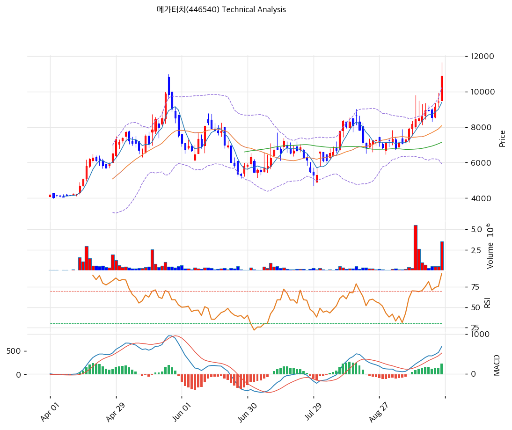

# 메가터치(446540) 기술적 분석

2026-09-24 | T2 Technical Analysis

---

## 차트

---

## 가격 현황

| 항목 | 값 |
|------|-----|
| 현재가 | 10,890원 (+15.36%) |
| 52주 고가 | 11,660원 (9/24 장중, KIS) / 10,890원 (종가 기준, pykrx) |
| 52주 저가 | 3,285원 (pykrx) |
| 52주 범위 위치 | 100.0% (종가 기준 신고가) |
| 거래량 | 20일 평균 대비 5.03x (3,520,445주) |

---

## 차트 패턴 분석

### 캔들스틱 패턴

| 패턴 | 위치 | 신뢰도 | 해석 |
|------|------|--------|------|
| 장대양봉 + 긴 윗꼬리 | 9/24 | 중 | 장중 11,660원까지 올랐다가 10,890원에 마감. 윗꼬리가 770원(고가 대비 -6.6%)으로 신고가 부근 매도 물량이 확인됐다 |
| 거래량 급증 양봉 | 9/10 전후 | 중 | 거래량 약 500만 주 급증과 함께 8,000원대 박스를 상향 돌파. 이후 조정 없이 계단식 상승 |
| 적삼병형 연속 양봉 | 9/19\~9/24 | 중 | MA5 위에서 양봉이 이어지며 볼린저 상단을 타고 올라가는 밴드 워킹 |

※ 주요 캔들 패턴: 망치형, 역망치형, 장악형(상승/하락), 도지, 샛별/석별, 적삼병/흑삼병, 하라미, 유성형, 교수형 등

### 가격 구조 패턴

- **5월 고점 재시험 (이중천정 경계)** (신뢰도: 중)
  5월 하순 장중 약 11,000원 고점 이후 7월 말 4,700원대까지 57% 가까이 밀렸다가 4개월 만에 고점 영역으로 복귀했다. 9/24 장중 11,660원으로 5월 고점을 넘었지만 종가는 10,890원으로 돌파 확정이 아니다. 종가 기준 11,000원대 안착이 없으면 이중천정 가능성을 열어 둬야 한다.

- **상승 채널** (신뢰도: 강)
  지지 추세선(현재 5,944원)과 저항 추세선(현재 10,388원) 모두 우상향이며 각각 6개 포인트로 검증됐다. 현재가는 저항 추세선을 4.8% 상회해 채널 상단 이탈(오버슈팅) 상태다.

- **8,000원대 박스 돌파** (신뢰도: 중)
  8월 말\~9월 초 6,700\~8,000원 박스를 9월 중순 거래량을 동반해 상향 돌파했다. 박스 상단 8,000원 부근(MA20 8,078원)이 1차 되돌림 지지대다.

※ 주요 구조 패턴: 이중천정/바닥, 헤드앤숄더(정/역), 삼각수렴(대칭/상승/하락), 쐐기형(상승/하락), 깃발형, 페넌트, 컵앤핸들, 박스권 등

### 다이버전스

- **MACD 하락 다이버전스** (신뢰도: 약)
  가격은 5월 고점 수준을 회복했지만 MACD(687)는 5월 고점 당시(약 900)보다 낮다. 추세 강도가 5월보다 약하다는 신호다. 다만 히스토그램이 확대 중이라 확정 신호는 아니다.

- **RSI 다이버전스 없음** (신뢰도: 약)
  RSI 77.6은 5월 고점 당시 수준(70대 초반)보다 높아 가격과 같은 방향이다. 약세 다이버전스는 나타나지 않았다.

※ RSI·MACD 기반 | 상승 다이버전스 = 가격↓ 지표↑ (반등 시사), 하락 다이버전스 = 가격↑ 지표↓ (하락 시사), 히든 다이버전스 = 기존 추세 지속 시사

### 패턴 종합 판단

추세는 상승 채널과 박스 돌파로 분명한 상승이다. 그러나 9/24 긴 윗꼬리, 저항 추세선 상단 이탈, MACD 약세 다이버전스가 동시에 나타나 단기 과열 신호가 겹쳤다. 방향은 위, 속도는 과하다는 판단이다.

---

## 이동평균선: 정배열 (강세)

| MA | 값 | 현재가 괴리율 | 위치 |
|----|-----|--------------|------|
| MA5 | 9,390원 | +16.0% | 위 |
| MA20 | 8,078원 | +34.8% | 위 |
| MA60 | 7,146원 | +52.4% | 위 |
| MA120 | 6,871원 | +58.5% | 위 |
| MA200 | 5,672원 | +92.0% | 위 |

**해석**: MA5 > MA20 > MA60 > MA120 > MA200 완전 정배열이다. MA20 괴리율 +34.8%는 20% 과열 기준을 크게 넘는 극단적 과열 수준이다. 추세 추종 관점의 1차 지지는 MA5(9,390원), 의미 있는 지지는 MA20(8,078원)이다.

---

## 보조 지표

### RSI(14): 77.6 (🔴과매수)

RSI는 70을 넘은 과매수 구간이며 9/24 급등으로 기울기가 가팔라졌다.

### MACD(12,26,9)

| 항목 | 값 |
|------|-----|
| MACD | 687 |
| Signal | 453 |
| Histogram | +234 |
| 크로스 상태 | 매수 구간 (확대 중) |

**해석**: 시그널선 위에서 히스토그램이 커지고 있어 상승 모멘텀은 살아 있다.

### 볼린저밴드(20, 2σ)

| 항목 | 값 |
|------|-----|
| 상단 | 10,230원 |
| 중단 (MA20) | 8,078원 |
| 하단 | 5,926원 |
| 밴드 폭 | 53.3% |
| 현재 위치 | 상단 돌파 (+6.5%) |

**해석**: 밴드 폭 53.3%로 변동성이 확장된 상태에서 종가가 상단을 6.5% 넘었다. 상단 밴드 워킹이 이어질 수 있지만 상단 밖 종가는 통계적으로 밴드 안으로 되돌아오는 경우가 많다.

### 스토캐스틱(14, 3, 3)

| 항목 | 값 |
|------|-----|
| Slow %K | 82.5 |
| Slow %D | 75.8 |
| 크로스 상태 | 골든크로스 |
| 판단 | 과매수 |

---

## 지지/저항: 추세선 · 피보나치 · PRZ 통합

### 피보나치 되돌림/확장

| 구분 | 비율 | 가격 | 현재가 대비 |
|------|------|------|-----------|
| Swing High | — | 11,660원 | +7.1% |
| 되돌림 | 0.236 | 9,674원 | -11.2% |
| 되돌림 | 0.382 | 8,445원 | -22.5% |
| 되돌림 | 0.5 | 7,452원 | -31.6% |
| 되돌림 | 0.618 | 6,460원 | -40.7% |
| 되돌림 | 0.786 | 5,046원 | -53.7% |
| Swing Low | — | 3,245원 | -70.2% |
| 확장 | 1.272 | 13,949원 | +28.1% |
| 확장 | 1.382 | 14,875원 | +36.6% |
| 확장 | 1.618 | 16,860원 | +54.8% |
| 확장 | 2.0 | 20,075원 | +84.3% |

※ 피보나치 기준: 상승 추세 (Swing Low 3,245원 → Swing High 11,660원)
※ 되돌림 = 직전 추세에서 되돌아온 비율, 확장 = 추세 방향 목표가

### 추세선

| 추세선 | 방향 | 현재 교차가 | 포인트 수 | 해석 |
|--------|------|-----------|---------|------|
| 지지선 | 상승 | 5,944원 | 6개 | 중기 상승 추세의 하단. 현재가와 거리가 멀어(-45.4%) 단기 지지로는 의미가 약함 |
| 저항선 | 상승 | 10,388원 | 6개 | 현재가가 4.8% 상회. 종가가 이 선 위에서 유지되면 추세 가속, 재이탈 시 채널 복귀 |

### PRZ (Potential Reversal Zone)

| 방향 | 가격 범위 | 신뢰도 | 근거 |
|------|---------|--------|------|
| 지지 | 9,674\~9,693원 | 약 | 피보나치 0.236(9,674) + 피봇 S1(9,693) |
| 지지 | 8,445\~8,497원 | 약 | 피보나치 0.382(8,445) + 피봇 S2(8,497) |

※ PRZ = 추세선 · 피보나치 · 피봇 · MA 등 복수 지표가 겹치는 가격 구간. 겹치는 소스가 많을수록 반전 확률 상승.

### 종합 지지/저항 테이블

| 구분 | 가격 | 근거 |
|------|------|------|
| 저항 | 11,873원 | 피봇 R1 |
| 저항 | 11,660원 | 52주 고가 (9/24 장중), Swing High |
| **현재가** | **10,890원** | — |
| 지지 | 10,388원 | 저항 추세선 (돌파 후 지지 전환 여부) |
| 지지 | 9,674\~9,693원 | PRZ (피보나치 0.236 + 피봇 S1), MA5 9,390원 인접 |
| 지지 | 8,078\~8,497원 | MA20 + PRZ (피보나치 0.382 + 피봇 S2) |

---

## 시그널 종합

| 지표 | 내용 | 시그널 |
|------|------|--------|
| **차트 패턴** | 상승 채널·박스 돌파 vs 긴 윗꼬리·MACD 약세 다이버전스 | ⚪ |
| 이동평균선 | 완전 정배열, MA20 괴리 +34.8% | 🟢 |
| RSI | 77.6, 과매수 | 🔴 |
| MACD | 매수 구간, 히스토그램 확대 | 🟢 |
| 볼린저밴드 | 상단 +6.5% 이탈 | 🔴 |
| 스토캐스틱 | K 82.5 / D 75.8 골든크로스, 과매수 | 🔴 |
| 거래량 | 5.03x, 강력 | 🟢 |

**종합 판단**: 🟢 매수 3개 / 🔴 매도 3개 / ⚪ 중립 1개 → **중립 (과열 경고)**

추세 지표(이동평균, MACD, 거래량)는 모두 상승을 가리키고 오실레이터(RSI, 스토캐스틱, 볼린저)는 모두 과열을 가리킨다. 중기 추세는 강세지만 단기로는 9,400\~9,700원대까지 되돌림이 나와도 추세가 훼손되지 않는 구조다. 2Q26 실적 발표(8/14)와 9/11 IR 이후 재료가 주가에 반영되는 중이라 3Q26 실적 확인 전까지 변동성이 클 수 있다.

---

## 전략 제안

### 보유 중인 경우
- **홀드 (일부 차익실현 병행)**
- 익절 라인: 11,108원 (시스템 산출 익절가, 9/24 장중 고가 11,660원 아래 매물대)
- 손절 라인: 8,497원 (피봇 S2, PRZ 하단)
- 리스크/리워드: 1:0.09 (익절 +2.0% / 손절 -22.0%). 손익비가 불리하므로 MA5(9,390원) 이탈 시 추적 손절로 대응

### 진입 대기인 경우
- **관망**
- 1차 진입가: 9,693원 (피봇 S1 + 피보나치 0.236 PRZ)
- 2차 진입가: 8,078원 (MA20, 8,000원 박스 상단)
- 진입 조건: RSI 70 아래로 식은 뒤 지지 구간에서 거래량 감소 조정 확인. 또는 종가 11,660원 돌파 시 거래량 동반 여부 확인 후 추격
