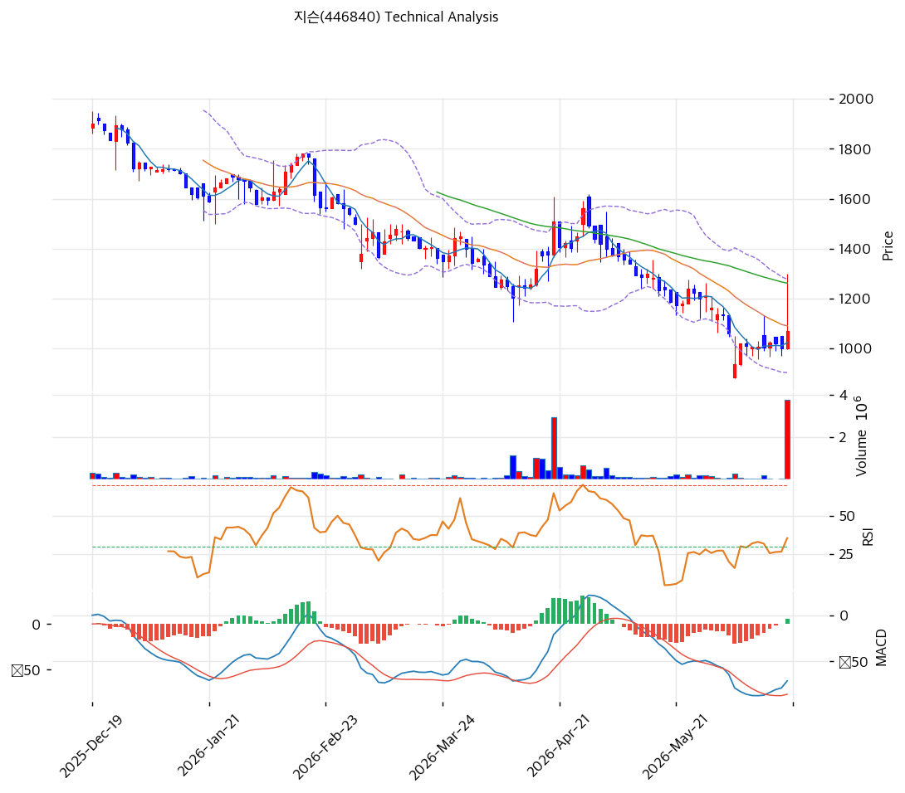

# 지슨(446840) 기술적 분석

2026-06-20 | T2 Technical Analysis

---

## 차트

---

## 1. 가격 현황

| 항목 | 값 |
|------|-----|
| 현재가 | 1,069원 (+6.90%) |
| 52주 고가 | 2,300원 |
| 52주 저가 | 936원 |
| 52주 범위 위치 | 9.8% (저점권) |
| 거래량비 | **28.73x** (폭증) |
| RSI | 43.1 (중립) |

> 52주 고가(2,300)에서 -54% 하락해 저점권(936\~1,069)에 머물다, 6/19 키움 데이터센터 보안 리포트로 장중 상한가(\~1,300)·거래량 28.7x 폭증하며 반등. 현재 단기선(MA5 1,023) 위·중장기선(MA20 1,091·MA60 1,262·MA200 1,579) 아래로 **하락 추세 내 바닥 반등 시도** 국면. RSI 43.1 중립으로 과매도 해소 초기.

---

## 2. 차트 패턴 분석

### 2.1 캔들스틱 패턴

| 패턴 | 위치 | 신뢰도 | 해석 |
|------|------|--------|------|
| 거래량 폭증 반등 | 1,069원 | 중상 | 턴어라운드 매수 유입 |
| 52주 저점 바닥 시험 | 936\~1,069 | 중 | 저점 지지 형성 시도 |
| MA20 저항 시험 | 1,069 ≈ MA20 1,091 | 중 | 추세 전환 1차 관문 |

※ 주요 캔들 패턴: 망치형, 역망치형, 장악형, 도지, 샛별/석별, 적삼병/흑삼병, 하라미, 유성형, 교수형 등

### 2.2 가격 구조 패턴

- **하락 추세 + 바닥 반등 시도** (신뢰도: 중상)
  2,300→936 하락 후 저점권에서 분석 리포트發 반등(거래량 28.7x). MA20(1,091)·MA60(1,262) 돌파 시 추세 전환, 실패 시 저점 재시험.

- **저점권 매집·과매도 해소** (신뢰도: 중)
  RSI 43.1·스토캐 골든크로스로 과매도 해소. 턴어라운드 기대가 저점 매수를 유발.

※ 주요 구조 패턴: 이중천정/바닥, 삼각수렴, 쐐기형, 깃발형, 페넌트, 컵앤핸들, 박스권 등

### 2.3 다이버전스

- **바닥 반등 모멘텀** (신뢰도: 중상)
  MACD 매수 전환(히스토그램 + 전환)·스토캐 골든크로스(K=37.5). 가격 저점·지표 반등으로 단기 상승 모멘텀 형성. 단 영선 아래라 추세 전환 초기.

※ RSI·MACD 기반 | 상승 다이버전스 = 가격↓ 지표↑, 하락 다이버전스 = 가격↑ 지표↓

### 2.4 패턴 종합 판단

52주 고가(2,300) 대비 -54% 하락해 저점권(936)에 머물다, 6/19 키움 데이터센터 보안 리포트(턴어라운드·흑자전환 기대)로 거래량 28.7x 폭증·장중 상한가를 치며 반등한 **바닥 반등 시도** 국면이다. MACD 매수 전환·스토캐 골든크로스로 과매도가 해소되고 모멘텀이 살아났으나, 여전히 **MA20(1,091)·MA60(1,262)·MA200(1,579) 아래**로 큰 하락 추세 내에 있다. MA20 돌파·안착이 추세 전환의 1차 관문이며, 돌파 시 MA60(1,262)·전고점(1,300)·BB상단(1,278) 방향, 실패 시 52주 저점(936) 재시험. 저유동(Beta 0.07)·소형주라 분석 리포트·수주 뉴스에 급변동하며, 턴어라운드 실적 확인 전까지 변동성이 크다.

---

## 3. 이동평균선 — 하락 추세·바닥 반등

| MA | 값 | 현재가 괴리율 | 위치 |
|----|-----|--------------|------|
| MA5 | 1,023 | +4.5% | 위 |
| MA20 | 1,091 | -2.0% | 아래 |
| MA60 | 1,262 | -15.3% | 아래 |
| MA120 | 1,444 | -26.0% | 아래 |
| MA200 | 1,579 | -32.3% | 아래 |

**해석**: 현재가가 단기선(MA5) 위로 막 반등했으나 중장기선(MA20·MA60·MA120·MA200) 아래로 **하락 추세 지속**(정배열 아님). MA200 대비 -32%로 깊은 조정. MA20(1,091) 돌파가 1차 관문, MA60(1,262)이 다음 저항. 추세 전환은 MA60 회복 확인 필요.

---

## 4. 보조 지표

### RSI(14) — 43.1 (중립)

과매도(30)에서 회복한 중립권. 추가 상승 여력 있으나 추세 전환은 미확정.

### MACD(12,26,9)

| 항목 | 값 |
|------|-----|
| MACD | ~-71 |
| Signal | ~-77 |
| Histogram | ~+6 |
| 크로스 상태 | 매수 전환(확산) |

**해석**: MACD가 Signal 상향 돌파(매수 전환), 히스토그램 양(+) 전환으로 하락 모멘텀 소멸·반등 시작. 단 영선(0) 아래라 추세 전환 초기 단계.

### 볼린저밴드(20, 2σ)

| 항목 | 값 |
|------|-----|
| 상단 | 1,278 |
| 중단 (MA20) | 1,091 |
| 하단 | 904 |
| 밴드 폭 | 34.3% (고변동) |
| 현재 위치 | 중간 |

**해석**: 현재가 1,069원은 중단(1,091)과 하단(904) 사이. 중단 돌파 시 반등 가속, 하단(904) 이탈 시 추가 하락. 밴드폭 34.3% 변동성 큼.

### 스토캐스틱(14, 3, 3)

| 항목 | 값 |
|------|-----|
| Slow %K | 37.5 |
| Slow %D | 35.7 |
| 크로스 상태 | 골든크로스 |
| 판단 | 중립(상승) |

**해석**: K=37.5 중립권 상향, 골든크로스로 단기 반등 모멘텀. 저점권에서의 골든크로스라 바닥 반등 신호.

---

## 5. 지지/저항

### 5.1 종합 지지/저항 테이블

| 구분 | 가격 | 근거 |
|------|------|------|
| 저항 | 2,300 | 52주 고가 |
| 저항 | 1,579 | MA200 |
| 저항 | 1,444 | MA120 |
| 저항 | 1,300 | 6/19 장중 고점 |
| 저항 | 1,278 | 볼린저 상단 |
| 저항 | 1,262 | MA60 |
| 저항 | 1,091 | MA20·볼린저 중단(1차 관문) |
| **현재가** | **1,069** | 바닥 반등 |
| 지지 | 1,023 | MA5 |
| 지지 | 1,000 | 심리적 지지 |
| 지지 | 936 | 52주 저점 |
| 지지 | 904 | 볼린저 하단 |

---

## 6. 시그널 종합

| 지표 | 내용 | 시그널 |
|------|------|--------|
| 차트 패턴 | 하락 추세·바닥 반등 시도 | ⚪ |
| 이동평균선 | 중장기선 아래(추세 미전환) | 🔴 |
| RSI | 43.1 — 중립 | ⚪ |
| MACD | 매수 전환(확산) | 🟢 |
| 볼린저밴드 | 중간, 밴드폭 34% | ⚪ |
| 스토캐스틱 | 골든크로스, K=37.5 | 🟢 |
| 거래량 | 28.73x 폭증 | 🟢 |

**종합 판단**: 🟢 매수 3개 / 🔴 매도 1개 / ⚪ 중립 3개 → **매수 우위 (바닥 반등 초기)**

52주 저점권에서 키움 리포트發 거래량 28.7x 폭증·장중 상한가로 반등을 시작했다. MACD 매수 전환·스토캐 골든크로스로 과매도가 해소되고 바닥 반등 신호가 켜졌으나, 여전히 **MA20(1,091)·MA60(1,262) 아래**로 추세는 미전환이다. **MA20 돌파·안착이 1차 관문**이며, 돌파 시 MA60·전고점(1,300), 실패 시 52주 저점(936) 재시험. 저유동·소형주라 변동성이 크고, 턴어라운드 실적 확인이 추세 전환의 전제다.

---

## 7. 전략 제안

### 보유 중인 경우
- **홀드 (MA20 돌파 주시)**
- 익절: 1,262(MA60)·1,300(전고점)·1,444(MA120) 단계 분할
- 손절: 936원(52주 저점) 이탈
- 리스크/리워드: 저유동·고변동, 분할 대응

### 진입 대기인 경우
- **턴어라운드 확인 후 분할**
- 1차 진입가: 1,000\~1,069 (저점권·MA5)
- 2차 진입가: 936\~960 (52주 저점 지지 확인 시)
- 진입 조건: 바닥 반등 초기로 MA20(1,091) 돌파·안착 시 추세 전환 신뢰도↑. 2026 상반기 흑자전환·백도어 수주 확인이 핵심. 저유동·B2G 변동성 감안 분할·소액. MA20 회복 실패 시 저점 재시험 관망.
