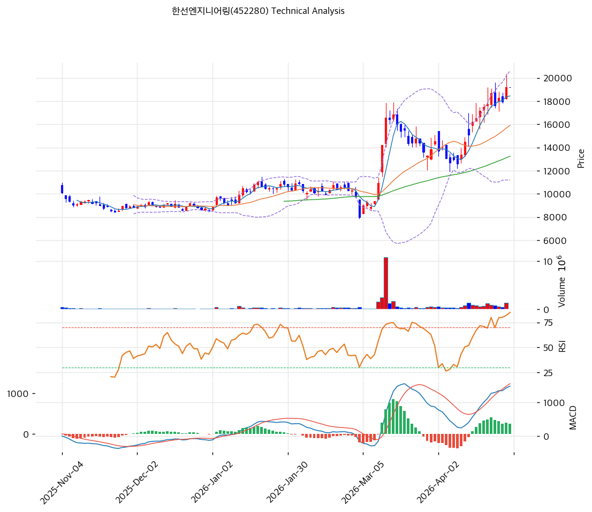

# 한선엔지니어링(452280) 기술적 분석

2026-04-29 | T2 Technical Analysis

---

## 차트

---

## 1. 가격 현황

| 항목 | 값 |
|------|-----|
| 현재가 | 19,190원 (+0.00%) |
| 52주 고가 | 19,190원 |
| 52주 저가 | 6,640원 |
| 52주 범위 위치 | 100.0% |
| 거래량 | 20일 평균 대비 0.0x (데이터 부재) |

---

## 2. 차트 패턴 분석

### 2.1 캔들스틱 패턴

| 패턴 | 위치 | 신뢰도 | 해석 |
|------|------|--------|------|
| 장기 상승 추세 지속 | 52주 전 구간 | 강 | 6,640원 저점에서 19,190원까지 약 189% 상승 — 강한 상승 모멘텀 |
| 52주 신고가 도달 | 최근 | 강 | 신고가 갱신 구간으로 저항이 사라진 상태 — 매수 심리 우위 |
| 고점권 장대 양봉 가능성 | 최근 | 중 | 대폭 상승 후 조정없이 신고가 도달 — 피로도 누적 가능성 |

※ 차트 이미지 기준 최근 캔들 추세를 반영

### 2.2 가격 구조 패턴

- **강세 추세선 (신뢰도: 강)**
  6,640원 저점 → 지속 상승 → 19,190원 신고가. 추세선 지지선(10,590원)과 현재가 괴리가 크며, 단기 조정 시 17,505원 추세선 저항(신 지지)이 1차 방어선. 52주 상승률 189%로 추세 강도는 강력하나 과열 구간 진입.

- **박스권 저항 부재 (신뢰도: 강)**
  현재가가 52주 신고가와 일치하여 기술적 저항이 없는 상태. 단, 상단 저항 부재는 곧 돌파 기준이 없음을 의미하며 목표가 설정이 어려운 구간.

- **가격 피로도 누적 (신뢰도: 중)**
  MA20 대비 괴리율 +20.6%, MA60 대비 +44.8%, MA200 대비 +85.7%로 단기~장기 이동평균 모두에서 극단적으로 이격된 상태. 평균 회귀(Mean Reversion) 압력이 상당히 높다.

### 2.3 다이버전스

- **MACD 히든 불리시 다이버전스 없음 (신뢰도: 중)**
  MACD 1,488 / Signal 1,232 / Histogram +256으로 매수 구간이나 히스토그램 수축 중(expand: False). 추세 지속보다 단기 모멘텀 둔화 시사.

- **RSI 중립 (신뢰도: 중)**
  RSI 70.0으로 과매수 경계선 직전. 다이버전스는 감지되지 않았으나 70 이상 진입 시 과매수 신호로 전환 — 추세 지속 시 RSI 70+ 유지 여부 확인 필요.

### 2.4 패턴 종합 판단

차트 구조는 명확한 강세 추세를 유지하고 있으며 52주 신고가 돌파라는 긍정적 시그널이 존재한다. 그러나 MA20 대비 +20.6%, MA60 대비 +44.8%의 극단적 이격, RSI 70 경계, MACD 히스토그램 수축이 단기 과열을 강하게 시사한다. 기술적으로 상충하는 시그널: 중장기 상승 추세(매수)↔단기 과열/피로 누적(중립~매도). 추세 추종자에게는 홀드이나 신규 진입은 조정 대기가 유리하다.

---

## 3. 이동평균선 — 정배열 (강세)

| MA | 값 | 현재가 괴리율 | 위치 |
|----|-----|--------------|------|
| MA5 | 18,452원 | +4.0% | 위 |
| MA20 | 15,908원 | +20.6% | 위 |
| MA60 | 13,249원 | +44.8% | 위 |
| MA120 | 11,308원 | +69.7% | 위 |
| MA200 | 10,335원 | +85.7% | 위 |

**해석**: 5·20·60·120·200일 이동평균 완전 정배열. 모든 MA 위에 현재가가 위치하여 추세 강도는 극도로 강하다. 단, MA200 대비 +85.7% 이격은 역사적으로 보기 드문 과열 구간으로, 강한 트리거 없이는 평균 회귀 가능성이 높다. MA20(15,908원)이 단기 핵심 지지선.

---

## 4. 보조 지표

### RSI(14) — 70.0 (중립/과매수 경계)

RSI 70.0으로 과매수 경계선에 정확히 위치. 70 이상 돌파 시 과매수 신호로 전환되며 단기 조정 압력이 높아진다. 현재는 70선을 터치한 수준으로 추세 지속 가능성과 조정 가능성이 반반.

### MACD(12,26,9)

| 항목 | 값 |
|------|-----|
| MACD | 1,488 |
| Signal | 1,232 |
| Histogram | +256 |
| 크로스 상태 | 매수 구간 (수축 중) |

**해석**: MACD가 Signal 위에 있어 매수 구간이나 히스토그램이 수축(+256) 중으로 상승 모멘텀이 약해지고 있음. 히스토그램이 0선을 하향 이탈하면 추세 전환 신호.

### 볼린저밴드(20, 2σ)

| 항목 | 값 |
|------|-----|
| 상단 | 20,616원 |
| 중단 (MA20) | 15,908원 |
| 하단 | 11,199원 |
| 밴드 폭 | 59.2% |
| 현재 위치 | 중간 (상단 근접) |

**해석**: 밴드 폭 59.2%로 변동성이 매우 크게 확장된 상태. 현재가 19,190원은 상단(20,616원)에 근접하여 상단 저항 압력이 있다. 상단 이탈 시 추가 상승이나 반전, 중단(MA20 15,908원) 회귀가 단기 시나리오.

### 스토캐스틱(14, 3, 3)

| 항목 | 값 |
|------|-----|
| Slow %K | 82.7 |
| Slow %D | 80.9 |
| 크로스 상태 | 골든크로스 |
| 판단 | 과매수 |

---

## 5. 지지/저항 — 추세선 · 피보나치 · PRZ 통합

### 5.1 피보나치 되돌림/확장

| 구분 | 비율 | 가격 | 현재가 대비 |
|------|------|------|-----------|
| Swing High | — | 19,190원 | — |
| 되돌림 | 0.236 | 13,616원 | -29.0% |
| 되돌림 | 0.382 | 14,232원 | -25.8% |
| 되돌림 | 0.5 | 14,730원 | -23.2% |
| 되돌림 | 0.618 | 15,228원 | -20.6% |
| 되돌림 | 0.786 | 15,937원 | -16.9% |
| Swing Low | — | 6,640원 | — |
| 확장 | 1.272 | — | — |
| 확장 | 1.618 | — | — |

※ 피보나치 기준: 상승 추세 (Swing Low 6,640원 → Swing High 19,190원)
※ 신고가 구간이므로 확장 레벨 없음. 되돌림 레벨이 주요 지지 구간.

### 5.2 추세선

| 추세선 | 방향 | 현재 교차가 | 포인트 수 | 해석 |
|--------|------|-----------|---------|------|
| 지지선 | 상승 | 10,590원 | 다수 | 장기 상승 추세 지지선 — 현재와 크게 이격 |
| 저항선 (新 지지) | 상승 | 17,505원 | 다수 | 단기 조정 시 주요 지지대 |

### 5.3 PRZ (Potential Reversal Zone)

| 방향 | 가격 범위 | 신뢰도 | 근거 |
|------|---------|--------|------|
| 저항 | 19,190~20,616원 | 강 | 52주 신고가 + 피봇 R1·R2 + BB 상단 |
| 지지 | 15,900~16,000원 | 중 | MA20 + 피보나치 0.786 되돌림 |

### 5.4 종합 지지/저항 테이블

| 구분 | 가격 | 근거 |
|------|------|------|
| 저항 | 20,616원 | BB 상단 |
| 저항 | 19,190원 | 52주 신고가 / 피봇 R1 |
| **현재가** | **19,190원** | — |
| 지지 | 17,505원 | 추세선 저항→지지 전환 |
| 지지 | 15,937원 | 피보나치 0.786 / MA20 근접 |
| 지지 | 15,908원 | MA20 |
| 지지 | 13,249원 | MA60 |

---

## 6. 시그널 종합

| 지표 | 내용 | 시그널 |
|------|------|--------|
| **차트 패턴** | 강세 추세 + 신고가 / 단기 과열 수반 | ⚪ |
| 이동평균선 | 완전 정배열 — 강세 | 🟢 |
| RSI | 70.0 — 과매수 경계 | ⚪ |
| MACD | 매수 구간, 히스토그램 수축 중 | 🔴 |
| 볼린저밴드 | BB 상단 근접, 고변동성 | 🔴 |
| 스토캐스틱 | 82.7/80.9 — 과매수 | 🔴 |
| 거래량 | 데이터 부재 | ⚪ |

**종합 판단**: 🟢 매수 1개 / 🔴 매도 3개 / ⚪ 중립 3개 → **매도우위**

정배열 구조는 중장기 강세를 확인하나 RSI 70, 스토캐스틱 82/80, MACD 수축, BB 상단 근접이 동시에 단기 과열을 경고하고 있다. 52주 신고가 갱신으로 상방 저항은 없으나 평균 회귀 압력이 매우 높은 국면. 추세 추종 홀드는 가능하나 신규 매수는 조정 대기 전략이 합리적이다.

---

## 7. 전략 제안

### 보유 중인 경우
- **홀드 / 단기 비중 부분 축소 검토**
- 익절 라인: 20,616원 (BB 상단 — 단기 목표)
- 손절 라인: 17,505원 (추세선 지지 이탈 시)
- 리스크/리워드: 1차 목표 +7.4% / 손절 -8.8% ≈ 0.8:1 (불리)

### 진입 대기인 경우
- **관망 — 조정 후 진입 대기**
- 1차 진입가: 17,505원 (추세선 지지 + 조정 후 반등 확인)
- 2차 진입가: 15,908원 (MA20 + 피보나치 0.786)
- 진입 조건: MA20 회귀 후 거래량 동반 반등 캔들 확인, 또는 RSI 50 이하 복귀 후 반등
