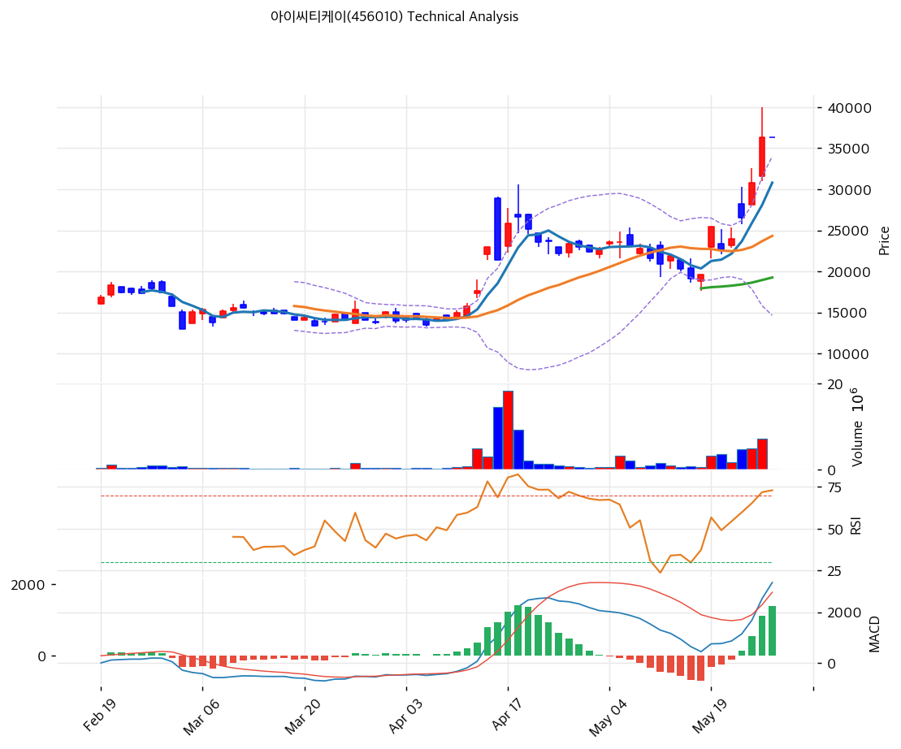

# 기술적분석

***

## 가격 위치

현재가 **36,350원** (0.00%, 상한가 직전 매물 동결) — **52주 고가 + 사상 최고가** 갱신. 1년 +228% (11,100→36,350원), 52주 위치 **100%**. **외국인 20일 +375,625주 폭매수** (시총의 2.7%) + 기관 -79,724 매도 — 외국인 단독 매수세 폭발. 1년 KOSDAQ 상위 모멘텀 종목.

## 이동평균선 / 모멘텀

MA5 30,800 / MA20 24,324 / MA60 19,260 / MA120 17,663 / MA200 16,312 — **MA5 < MA20 < MA60 < MA120 < MA200 완전 정배열 True**. MA200 대비 **+122.8%**, MA20 대비 +49.4% 극단 이격. 모든 이평선이 우상향 가속, 5월 들어 기울기 폭발 (20→36k 단월 +80%).

**RSI 75.5 (과매수 🔴)** — 70 안정적 과매수 영역, 80 도달 임박. MACD 3,172 / 시그널 1,776 / 히스토 1,397 = **매수 시그널 + 확장 진행 True** = 강한 매수 모멘텀. 스토캐 K=85.2 / D=81.9 골든크로스 **과매수 영역**. 볼륨비 0.0x (거래 정지 상태) — 신고가 동결.

## 시그널 종합 / S\&R

매수 2 / 매도 3 / 중립 2 → **매도우위(약)**. 추세 자체는 강하지만 단기 과열 신호.

* 저항: **36,350원(52주 고가 = 사상 최고가 = PRZ 강)** / 다음 저항 추정 40,000\~42,000원 (피보 확장)
* 지지: **32,990원(피보 0.236)** / 28,685원(피보 0.382) / 25,205원(피보 0.5) / **24,324원(MA20)** / 19,260원(MA60)
* 깊은 조정 지지: 17,663원(MA120) / 16,312원(MA200) — 50% 깊은 조정 시 진입 가능 영역

전략: **HOLD(비중축소) — TP 37,077원 / SL 36,350원** (5% 단위 손절 권고). 추격 매수 비추, **MA20 24,324원 \~ MA60 19,260원 분할 매수 영역**. 52주 신고가 36,350원 명확 돌파 시 40\~42k 추가 모멘텀, 단기 -20\~30% 조정 후 재진입 권고. CB 행사가 17,533원 = 깊은 ITM, 매물 출회 가능성 상존.
