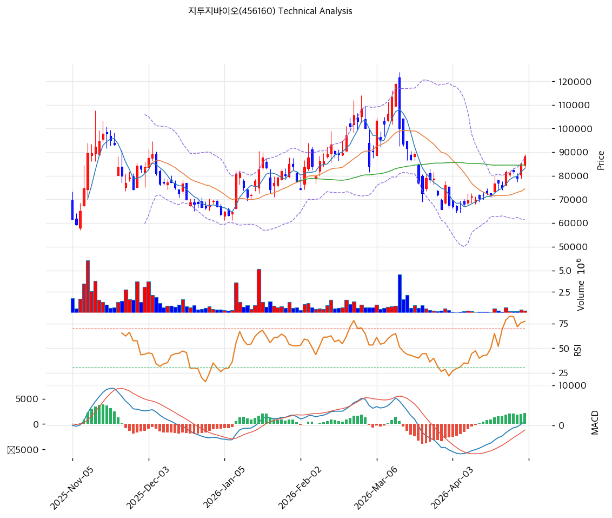

# 지투지바이오(456160) 기술적 분석

2026-04-29 | T2 Technical Analysis

---

## 차트

---

## 1. 가격 현황

| 항목 | 값 |
|------|-----|
| 현재가 | 88,200원 (+3.89%) |
| 52주 고가 | 118,800원 |
| 52주 저가 | 31,283원 |
| 52주 범위 위치 | 65.0% |
| 거래량 | 20일 평균 대비 1.15x |

---

## 2. 차트 패턴 분석

### 2.1 캔들스틱 패턴

| 패턴 | 위치 | 신뢰도 | 해석 |
|------|------|--------|------|
| 강세 장악형(Bullish Engulfing) 추정 | 최근 2~3일 | 중 | 단기 하락 후 양봉이 전일 음봉 몸통을 장악 — 단기 매수 시그널이나 오버행 구간에서 신뢰도 제한 |
| 도지(Doji) | 직전 세션 | 약 | 매수·매도 힘의 균형 — 방향 전환 경계 |

※ 차트상 31,283원 저점에서 118,800원 고점까지 급등 후 현재 고점 대비 25.8% 하락 구간에서 반등 시도 중.

### 2.2 가격 구조 패턴

- **하락 후 반등 구간 (신뢰도: 중)**
  118,800원(52주 고가)에서 65,500원(피보나치 기준 스윙로우) 급락 후 현재 88,200원에서 반등 중. 스윙로우 대비 약 34.6% 상승했으며, 피보나치 0.382(85,861원)~0.5(92,150원) 밴드에 위치. 이 구간 돌파 여부가 단기 방향성 핵심.

- **박스권 저항 구간 (신뢰도: 중)**
  90,000~92,700원(피봇 R1~R2, 피보나치 0.5) 구간이 직전 이중천정형 저항대로 작용. 이 구간 돌파 시 98,000~100,000원 시도 가능.

### 2.3 다이버전스

- **RSI 상승 다이버전스** (신뢰도: 중)
  65,500원 저점 구간에서 RSI 저점이 이전 저점 대비 상승 — 가격 하락에도 매도 모멘텀 약화 시사. 현재 반등의 기술적 배경.

- **MACD 히스토그램 확대** (신뢰도: 중)
  MACD(1,082) > Signal(-1,151), 히스토그램(+2,233)이 확대 중 — 단기 매수 모멘텀 지속. 다이버전스보다는 추세 전환 초기 시그널로 해석.

### 2.4 패턴 종합 판단

캔들스틱 패턴(강세 장악형), MACD 골든크로스 및 히스토그램 확대는 단기 매수 모멘텀을 지지한다. 그러나 볼린저밴드 상단(87,612원) 돌파 후 상단 밀착 상태이며, 스토캐스틱 K(88.4)가 과매수 구간에 진입해 있어 단기 조정 압력이 공존한다. 피보나치 0.382~0.5 되돌림 구간(85,861~92,150원)이 핵심 변수 — 이 구간 안착 여부가 중기 추세를 결정한다.

---

## 3. 이동평균선 — 비정배열 (단기 강세)

| MA | 값 | 현재가 괴리율 | 위치 |
|----|-----|--------------|------|
| MA5 | 83,060원 | +6.2% | 아래 |
| MA20 | 74,455원 | +18.5% | 아래 |
| MA60 | 84,630원 | +4.2% | 아래 |
| MA120 | 81,180원 | +8.6% | 아래 |
| MA200 | — | — | 데이터 없음 |

**해석**: 현재가가 MA5·MA20·MA60·MA120 전체 위에 위치하나 정배열(MA5>MA20>MA60>MA120) 순서가 아닌 비정배열 상태. MA20이 74,455원으로 현재가 대비 +18.5% 갭은 단기 과열 경고 수준. MA60(84,630원)과 MA5(83,060원)가 강한 지지대로 작동 중.

---

## 4. 보조 지표

### RSI(14) — 61.5 (중립)

RSI 61.5는 과매수(70) 미달의 중립 상단 구간. 추가 상승 여력이 있으나 70 근접 시 단기 차익실현 압박 예상. 저점에서의 상승 다이버전스 이후 회복 국면.

### MACD(12,26,9)

| 항목 | 값 |
|------|-----|
| MACD | 1,082 |
| Signal | -1,151 |
| Histogram | +2,233 |
| 크로스 상태 | 매수 구간 (확대 중) |

**해석**: MACD가 시그널을 상향 돌파한 골든크로스 상태이며 히스토그램이 빠르게 확대 중 — 단기 모멘텀 가장 강한 기술적 시그널. 다만 절대값 수준이 아직 0선 미달이어서 중기 추세 전환 확인은 추가 관찰 필요.

### 볼린저밴드(20, 2σ)

| 항목 | 값 |
|------|-----|
| 상단 | 87,612원 |
| 중단 (MA20) | 74,455원 |
| 하단 | 61,298원 |
| 밴드 폭 | 35.3% |
| 현재 위치 | 상단 근접 (돌파) |

**해석**: 현재가(88,200원)가 상단(87,612원)을 소폭 상회. 밴드 폭 35.3%은 확장 국면으로 변동성 증가 중. 상단 이탈 상태는 단기 강세이나 되돌림 가능성도 내포. 중단(MA20, 74,455원)이 중기 지지선.

### 스토캐스틱(14, 3, 3)

| 항목 | 값 |
|------|-----|
| Slow %K | 88.4 |
| Slow %D | 87.3 |
| 크로스 상태 | 골든크로스 |
| 판단 | 과매수 |

---

## 5. 지지/저항 — 추세선 · 피보나치 · PRZ 통합

### 5.1 피보나치 되돌림/확장

| 구분 | 비율 | 가격 | 현재가 대비 |
|------|------|------|-----------|
| Swing High | — | 118,800원 | — |
| 되돌림 | 0.236 | 78,079원 | -11.5% |
| 되돌림 | 0.382 | 85,861원 | -2.7% |
| 되돌림 | 0.5 | 92,150원 | +4.5% |
| 되돌림 | 0.618 | 98,439원 | +11.6% |
| 되돌림 | 0.786 | 107,394원 | +21.8% |
| Swing Low | — | 65,500원 | — |
| 확장 | 1.272 | 51,002원 | -42.2% |
| 확장 | 1.382 | 45,139원 | -48.8% |
| 확장 | 1.618 | 32,561원 | -63.1% |

※ 피보나치 기준: 하락 추세 (Swing High 118,800원 → Swing Low 65,500원)
※ 되돌림 = 하락에서 되돌아온 비율 (현재 약 42.6% 되돌림)

### 5.2 추세선

| 추세선 | 방향 | 현재 교차가 | 포인트 수 | 해석 |
|--------|------|-----------|---------|------|
| 지지선 | 상승 | 74,399원 | 6개 | 저점 연결 상승 추세선 — 중기 지지대 |
| 저항선 | 상승 | 132,748원 | 6개 | 고점 연결 상승 추세선 — 멀리 위치, 단기 관련성 낮음 |

### 5.3 PRZ (Potential Reversal Zone)

| 방향 | 가격 범위 | 신뢰도 | 근거 |
|------|---------|--------|------|
| 저항 | 90,433~92,667원 | 중 | 피봇 R1, 피보나치 0.5, 피봇 R2 |
| 지지 | 83,060~85,861원 | 강 | MA5, MA60, 피봇 S1, 피보나치 0.382 |
| 지지 | 81,180~81,267원 | 약 | MA120, 피봇 S2 |
| 지지 | 74,399~74,455원 | 약 | 추세선 지지, MA20 |

### 5.4 종합 지지/저항 테이블

| 구분 | 가격 | 근거 |
|------|------|------|
| 저항 | 118,800원 | 52주 고가 |
| 저항 | 90,433~92,667원 | PRZ(중) — 피봇 R1+R2, 피보나치 0.5 |
| **현재가** | **88,200원** | — |
| 지지 | 83,060~85,861원 | PRZ(강) — MA5, MA60, 피봇 S1, 피보나치 0.382 |
| 지지 | 81,180원 | MA120, 피봇 S2 |
| 지지 | 74,399~74,455원 | 추세선 지지, MA20 |

---

## 6. 시그널 종합

| 지표 | 내용 | 시그널 |
|------|------|--------|
| **차트 패턴** | 강세 장악형 + MACD 골든크로스, 스토캐스틱 과매수 혼재 | ⚪ |
| 이동평균선 | 비정배열, MA20 +18.5% | ⚪ |
| RSI | 61.5 — 중립 | ⚪ |
| MACD | 골든크로스, 히스토그램 확대 중 | 🟢 |
| 볼린저밴드 | 상단 밀착·돌파, 밴드 폭 확장 | ⚪ |
| 스토캐스틱 | 골든크로스이나 K=88.4 과매수 | 🔴 |
| 거래량 | 1.15x — 약함 | ⚪ |

**종합 판단**: 🟢 매수 1개 / 🔴 매도 1개 / ⚪ 중립 5개 → **중립**

단기적으로 MACD 골든크로스와 볼린저밴드 상단 돌파가 모멘텀을 지지하나, 스토캐스틱 과매수(88.4)와 MA20 과열(+18.5%)이 단기 조정 신호를 보내고 있다. 현재 피보나치 0.382(85,861원)~0.5(92,150원) 구간에 위치하며, 90,000원 저항대 돌파 여부가 단기 방향성의 핵심. 중기 추세는 65,500원 저점 이후 상승 전환 국면이나 거래량이 평균 수준에 불과해 추세 지속성은 미확인 상태.

---

## 7. 전략 제안

### 보유 중인 경우
- **홀드**
- 익절 라인: 92,150원 (피보나치 0.5 저항, PRZ 중단부)
- 손절 라인: 81,267원 (피봇 S2, MA120 지지선 이탈 시)
- 리스크/리워드: 약 1 : 2.1 (현재가 88,200원 기준)

### 진입 대기인 경우
- **관망 (단기 조정 대기)**
- 1차 진입가: 84,733원 (피봇 S1, PRZ 강 지지 하단)
- 2차 진입가: 74,455원 (MA20, 추세선 지지)
- 진입 조건: 90,000원 저항 돌파 시 거래량 동반 확인 후 추격 매수 또는 84,000원대 지지 확인 후 1차 진입
