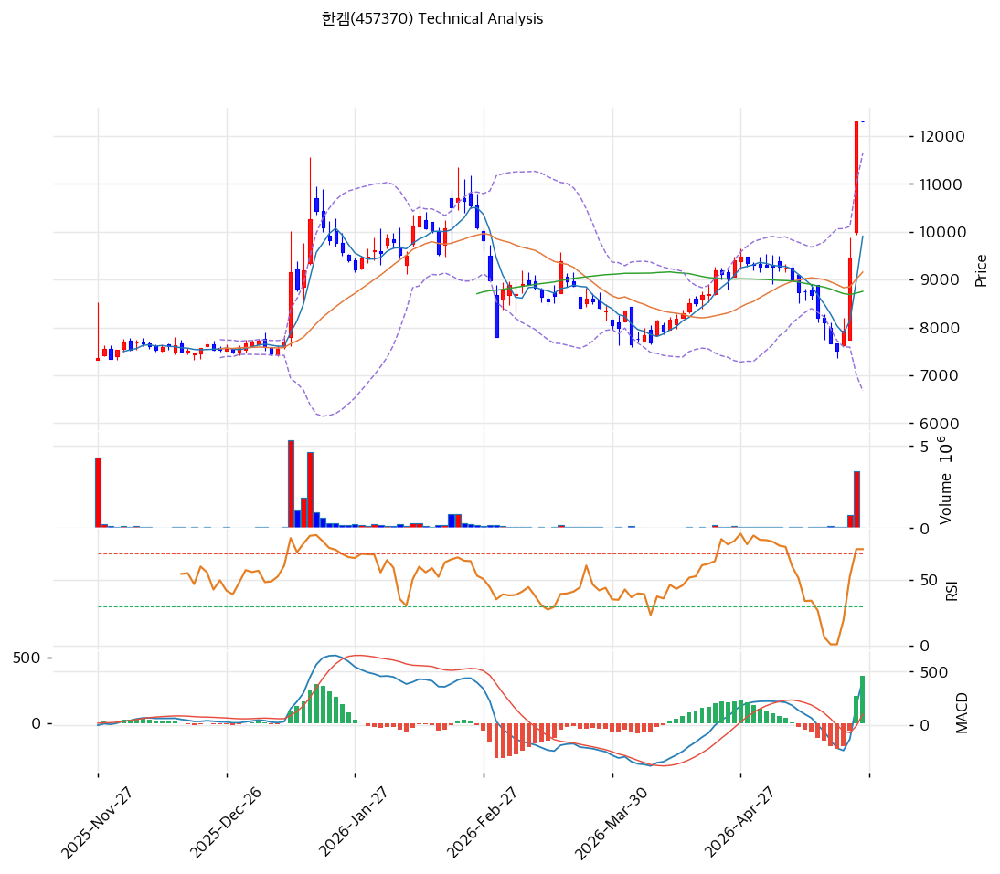

# 기술적분석

2026-05-27 | T2 Technical Analysis

## 1. 가격 현황

| 항목        | 값                            |
| --------- | ---------------------------- |
| 현재가       | 12,310원 (+0.00%)             |
| 52주 고가/저가 | 12,310원 / 7,120원 (위치 100.0%) |
| 1년 수익률    | +73% (7,120→12,310)          |
| 거래량       | 20일 평균 대비 0.0x (당일 미반영)      |

## 2. 차트 패턴 분석

### 2.1 캔들스틱

| 패턴       | 위치       | 신뢰도 | 해석                                                      |
| -------- | -------- | --- | ------------------------------------------------------- |
| 갭상승 장대양봉 | 최근 1\~2일 | 강   | 매수 — 4\~5월 8,500\~9,500원 박스를 거래량 동반 갭으로 돌파, 신고가 +30% 점프 |
| 적삼병(추정)  | 최근 3일    | 중   | 매수 — 박스 상단 돌파 후 연속 양봉, 마지막 봉 윗꼬리로 단기 차익실현 압력 가시         |

### 2.2 가격 구조

* **박스권 돌파(강)**: 2\~5월 8,000\~9,500원 박스 3개월 횡보 후 5월 하순 상단 돌파, 측정폭 1,500원을 초과 달성한 오버슈팅. 박스 상단 9,500원이 1차 지지 전환.
* **W + 신고가 돌파(중)**: 3월(7,500) / 4월(8,000) 이중바닥 후 1월 고점 11,200원을 거래량 동반 상향 돌파 → 중기 상승 추세 재개.

### 2.3 다이버전스

* **RSI 약 하락 조짐(약)**: 1월 고점 RSI \~75 vs 현재 77.9 동조이나 가격 상승폭 대비 RSI 여력 제한.
* **MACD 동행 확장(강)**: 428/68/+360 히스토그램 확장으로 직전 4개월 침체 완전 반전.

### 2.4 종합 판단

박스권 돌파·갭상승·W자 후 신고가 강세 일치 + MACD 확장으로 단기 상승 확정. 다만 RSI 77.9·스토캐 K94.4·볼린저 상단 상회의 과매수 3종 동시 점등 → **시그널: 🔴 매도(단기 과열, 조정 후 진입)**

## 3. 이동평균선 — 정배열 False (단기 급등형)

| MA5            | MA20           | MA60           | MA120          | MA200          |
| -------------- | -------------- | -------------- | -------------- | -------------- |
| 9,908 (+24.2%) | 9,158 (+34.4%) | 8,755 (+40.6%) | 8,730 (+41.0%) | 8,873 (+38.7%) |

모든 MA가 현재가 아래이나 MA60 > MA120, MA200 > MA120으로 완벽 정배열 미성립. MA들이 좁은 8,700\~9,900원 밴드에 응집한 상태에서 가격만 12,310원으로 폭주 → 평균 회귀 압력 강. MA20(9,158) 1차 지지, MA60·MA120 응집대 8,730\~8,755원이 2차 강지지.

## 4. 보조 지표

* **RSI 77.9 🔴 과매수** — 70 상회 단기 과열, 80\~85 도달 시 단기 조정 빈발
* **MACD 428 / 68 / +360** — 매수 확장, 1월 고점 대비 절대값은 다소 낮음
* **볼린저(20,2σ)** 상단 11,641 / 중단 9,158 / 하단 6,676, 폭 54.2% — 익스팬션 진행, 현재가 상단 +5.7% 상회 → 워킹더밴드/반락 분기
* **스토캐스틱 K=94.4 / D=67.6** — 골든크로스, 과매수 깊숙이 진입(K-D 갭 26.8pt)

## 5. 지지/저항

| 구분     | 가격      | 근거                             |
| ------ | ------- | ------------------------------ |
| 저항/현재가 | 12,310원 | 52주 고가 + 피봇 R1 PRZ(강)          |
| 지지1    | 11,320원 | 피보 2.0 확장                      |
| 지지2    | 10,024원 | MA5 + 피보 1.272/1.382 PRZ(중)    |
| 지지3    | 9,158원  | MA20 + 볼린저 중단                  |
| 지지4    | 8,890원  | MA60 + MA120 + 피보 0.382 PRZ(강) |

## 6. 시그널 종합

| 차트 | MA | RSI | MACD | 볼린저 | 스토캐 | 거래량 |
| -- | -- | --- | ---- | --- | --- | --- |
| 🟢 | ⚪  | 🔴  | 🟢   | 🔴  | 🔴  | ⚪   |

**🟢 매수 1 / 🔴 매도 3 / ⚪ 중립 3 → 매도우위(단기 과열)**

차트 패턴은 강세이나 모멘텀 3종(RSI·스토캐·볼린저) 모두 과매수 동시 점등으로 단기 조정 가능성 높음. T1 보호예수 해제 임박(2025.10 / 2026.10) 오버행 리스크와 결합 시 신규 추격 매수 비추.

## 7. 전략

**보유**: 비중축소 — TP 12,556원, SL 12,310원 하향 이탈. 일중 윗꼬리·음봉 출현 시 1/3 정리, 11,320원 이탈 시 추가 정리, 9,158원(MA20) 이탈 시 잔량 정리.

**대기**: 관망(추격 비추, R/R 불리). 1차 진입 10,024원(MA5·피보 PRZ), 2차 진입 9,158원(MA20·볼린저 중단). 조건: ① 양봉+거래량 20일 평균 1.2배↑ ② RSI 60 이하 후퇴 ③ MA20 이탈 없을 것.
