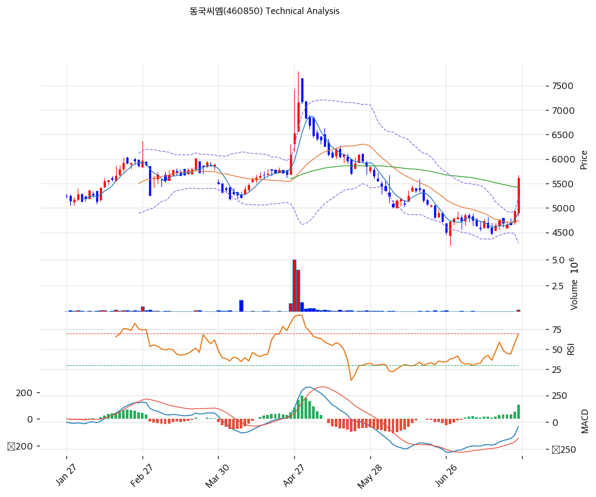

# 동국씨엠(460850) 기술적 분석

2026-07-24 | T2 Technical Analysis

---

## 차트

---

## 1. 가격 현황

| 항목 | 값 |
|------|-----|
| 현재가 | 5,540원 (+12.15% — 장중 기준, KIS 스냅숏 5,390원 +9.1%) |
| 52주 고가 | 7,180원 |
| 52주 저가 | 4,480원 |
| 52주 범위 위치 | 39.3% |
| 거래량 | 20일 평균 대비 3.64x — 강력 동반 |

---

## 2. 차트 패턴 분석

### 2.1 캔들스틱 패턴

| 패턴 | 위치 | 신뢰도 | 해석 |
|------|------|--------|------|
| 장대양봉 (이평 클러스터 돌파) | 금일 | 강 | +12% 대량 거래로 MA60·120·200 밀집대(5,420\~5,510원)를 일괄 관통 — 국면 전환급 캔들 |
| 저점 높이는 소양봉 연속 | 7월 초~중순 | 중 | 4,480원 저점 이후 완만한 바닥 다지기 선행 |

### 2.2 가격 구조 패턴

- **이중바닥 반등** (신뢰도: 중)
  6월 저점 4,480원 → 7월 초 재시험(4,700원대) 후 저점 미이탈 — 오늘 돌파로 넥라인(5,030원, 피봇 S1) 위 안착 시 패턴 완성.

- **4월 갭 매물대 (5,950\~6,700원)** (신뢰도: 강)
  4월 말 급등(7,500원 스파이크, 대량 거래) 후 급락하며 남긴 두꺼운 매물대 — 상방의 실질 저항 벽. 피보나치 되돌림(0.618=5,950원, 0.5=6,185원)과 겹친다.

- **장기 이평 밀집 → 돌파** (신뢰도: 강)
  MA60(5,422)·MA120(5,510)·MA200(5,435)이 90원 폭에 수렴한 상태에서의 상향 돌파 — 밀집 돌파는 추세 전환 신호 중 가장 신뢰도 높은 유형이다.

### 2.3 다이버전스

- **MACD 상승 다이버전스 (완성)** (신뢰도: 중)
  6\~7월 가격 저점 재시험 구간에서 MACD 저점이 높아졌고, 오늘 히스토그램 +101로 확대 — 하락 모멘텀 소진 후 전환 확인.

- **RSI 동행** (신뢰도: —)
  66.7로 가격과 동행 상승 — 과매수(70) 직전.

### 2.4 패턴 종합 판단

이중바닥 + 이평 밀집 돌파 + MACD 다이버전스 완성 + 거래량 3.6x — 하락 추세 종료를 가리키는 신호가 한 번에 정렬됐다. 펀더멘털 재료(반덤핑 판가 회복·Q1 흑자 전환)가 뒷받침되는 돌파라는 점도 4월 스파이크(뉴스 단발)와 다르다. 다만 머리 위 5,950\~6,700원의 갭 매물대가 두꺼워, 돌파 이후의 경로는 '단숨에'가 아니라 '매물 소화하며 계단식'이 기본 시나리오다.

---

## 3. 이동평균선 — 비정배열 (밀집 돌파 직후)

| MA | 값 | 현재가 괴리율 | 위치 |
|----|-----|--------------|------|
| MA5 | 4,898원 | +13.1% | 위 |
| MA20 | 4,744원 | +16.8% | 위 |
| MA60 | 5,422원 | +2.2% | 위 |
| MA120 | 5,510원 | +0.5% | 위 |
| MA200 | 5,435원 | +1.9% | 위 |

**해석**: 오늘 하루로 5개 이평을 전부 위로 뒤집었다 — 특히 장기 이평 3개(5,422\~5,510원)를 소폭 위에서 마감해 이 클러스터가 지지대로 전환되는지가 향후 며칠의 핵심 관찰점이다. MA20 괴리 +16.8%는 과열 경계선(20%) 부근 — 급등 직후 되돌림이 나와도 5,420\~5,510원에서 멈추면 건강한 그림.

---

## 4. 보조 지표

### RSI(14) — 66.7 (중립 상단)

과매수 직전 — 돌파일의 자연스러운 수준. 70 돌파 후 유지되면 추세 전환 강화 신호.

### MACD(12,26,9)

| 항목 | 값 |
|------|-----|
| MACD | -47.0 |
| Signal | -148.0 |
| Histogram | +101.0 |
| 크로스 상태 | 매수 구간 (음수 영역 골든크로스) |

**해석**: 깊은 음수 영역에서의 골든크로스 + 히스토그램 급확대 — 하락 추세 종료의 초기 신호. MACD 0선 회복이 다음 확인점.

### 볼린저밴드(20, 2σ)

| 항목 | 값 |
|------|-----|
| 상단 | 5,179원 |
| 중단 (MA20) | 4,744원 |
| 하단 | 4,308원 |
| 밴드 폭 | 18.4% |
| 현재 위치 | 상단 돌파 |

**해석**: 수축돼 있던 밴드(폭 18.4%)를 상단 밖으로 이탈 — 스퀴즈 후 분출의 전형. 확장 초기라 밴드 워킹(상단을 타는 상승) 여지.

### 스토캐스틱(14, 3, 3)

| 항목 | 값 |
|------|-----|
| Slow %K | 79.5 |
| Slow %D | 63.5 |
| 크로스 상태 | 골든크로스 |
| 판단 | 중립 (과매수 접근) |

---

## 5. 지지/저항 — 추세선 · 피보나치 · PRZ 통합

### 5.1 피보나치 되돌림/확장

| 구분 | 비율 | 가격 | 현재가 대비 |
|------|------|------|-----------|
| Swing High | — | 7,180원 | +29.6% |
| 되돌림 | 0.236 | 6,710원 | +21.1% |
| 되돌림 | 0.382 | 6,420원 | +15.9% |
| 되돌림 | 0.5 | 6,185원 | +11.6% |
| 되돌림 | 0.618 | 5,950원 | +7.4% |
| 되돌림 | 0.786 | 5,616원 | +1.4% |
| Swing Low | — | 5,190원 | -6.3% |

※ 피보나치 기준: 4월 스윙(5,190→7,180원) — 되돌림 레벨이 상방 저항 사다리로 작동

### 5.2 추세선

| 추세선 | 방향 | 현재 교차가 | 포인트 수 | 해석 |
|--------|------|-----------|---------|------|
| 지지선 | 하락 | 4,447원 | 6개 | 저점 연결선 — 6\~7월 바닥권의 마지노선 |
| 저항선 | 상승 | 7,657원 | 6개 | 고점 연결 장기 상단 (원거리) |

### 5.3 PRZ (Potential Reversal Zone)

| 방향 | 가격 범위 | 신뢰도 | 근거 |
|------|---------|--------|------|
| 지지 | 5,422\~5,616원 | **강** | MA60 + MA120 + MA200 + 피보나치 0.786 — 금일 돌파한 클러스터의 지지 전환 여부가 핵심 |
| 저항 | 5,850\~5,950원 | 약 | 피봇 R1 + 피보나치 0.618 — 갭 매물대 하단 |
| 저항 | 6,160\~6,185원 | 약 | 피봇 R2 + 피보나치 0.5 |
| 지지 | 4,447\~4,520원 | 약 | 추세선 + 피봇 S2 — 저점권 |

※ PRZ = 추세선 · 피보나치 · 피봇 · MA 등 복수 지표가 겹치는 가격 구간

### 5.4 종합 지지/저항 테이블

| 구분 | 가격 | 근거 |
|------|------|------|
| 저항 | 6,710원 | 피보나치 0.236 + 갭 매물대 상단 |
| 저항 | 6,160\~6,185원 | PRZ(약) — 피봇 R2 + 피보나치 0.5 |
| 저항 | 5,850\~5,950원 | PRZ(약) — 피봇 R1 + 피보나치 0.618 (갭 매물대 하단) |
| **현재가** | **5,540원** | 이평 클러스터 직상방 |
| 지지 | 5,422\~5,510원 | PRZ(강) — MA60·120·200 클러스터 (지지 전환 시험대) |
| 지지 | 5,030원 | 피봇 S1 (이중바닥 넥라인) |
| 지지 | 4,744원 | MA20 |
| 지지 | 4,447\~4,520원 | PRZ(약) — 추세선 + 피봇 S2 + 52주 저가권 |

---

## 6. 시그널 종합

| 지표 | 내용 | 시그널 |
|------|------|--------|
| **차트 패턴** | 이중바닥 + 이평 밀집 돌파 장대양봉 | 🟢 |
| 이동평균선 | 비정배열 → 전 이평 상회 전환, MA20 +16.8% | ⚪ |
| RSI | 66.7 — 중립 상단 | ⚪ |
| MACD | 음수 영역 골든크로스, 히스토그램 급확대 | 🟢 |
| 볼린저밴드 | 상단 돌파, 확장 개시 | ⚪ |
| 스토캐스틱 | 골든크로스, K=79.5 | ⚪ |
| 거래량 | 3.64x — 강력 동반 | 🟢 |

**종합 판단**: 🟢 매수 2개 / 🔴 매도 0개 / ⚪ 중립 4개 → **매수우위 (하락 추세 종료 신호 정렬)**

기술적으로 '바닥 확인 → 추세 전환 1단계'가 오늘 완성됐다. 남은 관문은 두 개 — ① 돌파한 이평 클러스터(5,420\~5,510원)의 지지 전환 확인, ② 갭 매물대 하단(5,850\~5,950원)의 소화. 펀더멘털(반덤핑 판가·Q1 흑자)이 동행하는 만큼 되돌림은 매수 접근이 유효하며, 5,030원(넥라인) 이탈 시에만 전환 논리를 폐기한다.

---

## 7. 전략 제안

### 보유 중인 경우
- **홀드 (전환 추세 추종)**
- 익절 라인: 5,950원 1차 (갭 매물대 하단·피보나치 0.618), 6,700원 2차 (매물대 상단)
- 손절 라인: 5,020원 (이중바닥 넥라인 이탈 = 돌파 무효화)
- 리스크/리워드: 약 2.2 (1차 목표 기준 +410 / -520 → 2차 목표 반영 시 개선)

### 진입 대기인 경우
- **되돌림 매수 우선 (갭 추격 자제)**
- 1차 진입가: 5,420\~5,510원 (돌파한 이평 클러스터의 지지 확인)
- 2차 진입가: 5,030\~5,100원 (넥라인 재시험 — 거래량 감소 동반 시)
- 진입 조건: 클러스터 위 2\~3일 안착 + 거래량 유지. 8월 반기 실적(2분기 OP 흑자 지속 여부)이 펀더멘털 확인 이벤트 — 실적 확인 후 5,850원 돌파 추종도 유효
