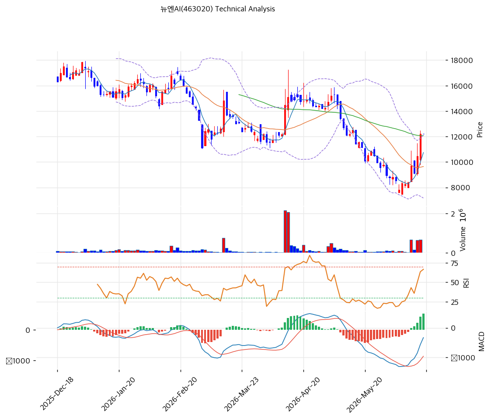

# 뉴엔AI(463020) 기술적 분석

2026-06-18 | T2 Technical Analysis

> ⚠️ 2025-07 신규 상장주로 IPO 후 -73% 폭락. 거래 이력이 짧고 변동성이 커 기술 신호 신뢰도가 제한된다.

---

## 차트

---

## 1. 가격 현황

| 항목 | 값 |
|------|-----|
| 현재가 | 12,210원 |
| 52주 고가 | 45,100원 (상장 첫날) |
| 52주 저가 | 7,820원 |
| 52주 범위 위치 | 11.8% (저점권) |
| 거래량 | (당일 데이터 미반영) |

> 상장 첫날 고점(45,100원)에서 **-73% 폭락**해 저점(7,820원)권. 현재 12,210원으로 저점 대비 소폭 반등. IPO 거품 소화 후 바닥 다지기 국면.

---

## 2. 차트 패턴 분석

### 2.1 캔들스틱 패턴

| 패턴 | 위치 | 신뢰도 | 해석 |
|------|------|--------|------|
| IPO 후 -73% 폭락·바닥 반등 | 45,100 → 12,210 | 중 | 거품 소화 후 반등 |
| MA20·MA60 상회 | 12,210 > 9,640·12,062 | 중 | 단기 반등 |
| MA120·MA200 하회 | < 13,676·17,085 | 중 | 중장기 하락추세 |

※ 주요 캔들 패턴: 망치형, 역망치형, 장악형, 도지, 샛별/석별, 적삼병/흑삼병, 하라미, 유성형, 교수형 등

### 2.2 가격 구조 패턴

- **IPO 거품 폭락 후 바닥 다지기** (신뢰도: 중)
  상장 첫날 45,100원 후 -73% 폭락, 7,820\~12,210원 저점권. 단기 반등으로 MA20·MA60 회복했으나 MA120·MA200(13,676\~17,085원)은 하회.

- **중장기 하락추세 내 단기 반등** (신뢰도: 중)
  MA200(17,085원) 하회로 중장기 약세. 단기 MACD 매수 전환·스토캐스틱 과매수의 반등 시도.

※ 주요 구조 패턴: 이중천정/바닥, 헤드앤숄더, 삼각수렴, 쐐기형, 깃발형, 페넌트, 컵앤핸들, 박스권 등

### 2.3 다이버전스

- **단기 반등 — 중장기 약세** (신뢰도: 중)
  RSI 61.3·MACD 매수 전환·스토캐스틱 88(과매수)로 단기 반등. 다만 MA120·MA200 하회로 추세 전환은 미확인. 과매수권 단기 과열.

※ RSI·MACD 기반 | 상승 다이버전스 = 가격↓ 지표↑, 하락 다이버전스 = 가격↑ 지표↓

### 2.4 패턴 종합 판단

IPO 거품(45,100원)을 -73% 소화한 뒤 저점권에서 **단기 반등** 중인 국면이다. MA20·MA60은 회복했으나 MA120·MA200(13,676\~17,085원)을 하회해 중장기 하락추세가 잔존한다. 스토캐스틱 88의 단기 과매수. 신규주 변동성·소형주 특성상 펀더멘털(흑전·구독 성장)·수급이 차트를 좌우한다. MA120(13,676원) 회복이 추세 전환 분기점.

---

## 3. 이동평균선 — 단기 반등(중장기 하락)

| MA | 값 | 현재가 괴리율 | 위치 |
|----|-----|--------------|------|
| MA5 | 10,738원 | +13.7% | 위 |
| MA20 | 9,640원 | +26.7% | 위 |
| MA60 | 12,062원 | +1.2% | 위(근접) |
| MA120 | 13,676원 | -10.7% | 아래 |
| MA200 | 17,085원 | -28.5% | 아래 |

**해석**: 현재가가 MA5·MA20 위, MA60 근접, MA120·MA200 아래의 **단기 반등·중장기 하락** 구조. IPO 후 우하향한 MA120·MA200(13,676\~17,085원)이 상단 저항. 단기 급반등으로 MA20(9,640원)과 +26.7% 괴리(단기 과열). MA60(12,062원)·MA120(13,676원) 돌파가 추세 전환 관건.

---

## 4. 보조 지표

### RSI(14) — 61.3 (중립)

단기 반등으로 중립 상단. 과매수(70) 미도달이나 저점 반등 후 상승.

### MACD(12,26,9)

| 항목 | 값 |
|------|-----|
| MACD | -334 |
| Signal | -858 |
| Histogram | +524 |
| 크로스 상태 | 매수 전환 (0선 아래) |

**해석**: MACD가 Signal 상향 돌파한 매수 전환이나 아직 0선 아래(중장기 약세 잔존). 히스토그램 확대로 단기 반등 모멘텀.

### 볼린저밴드(20, 2σ)

| 항목 | 값 |
|------|-----|
| 상단 | 12,113원 |
| 중단 (MA20) | 9,640원 |
| 하단 | 7,168원 |
| 밴드 폭 | 51.3% |
| 현재 위치 | 상단 돌파 |

**해석**: 현재가 12,210원이 밴드 상단(12,113원) 상회 — 단기 급반등. 밴드 폭 51%의 큰 변동성. 되돌림 시 중단(MA20 9,640원) 여지.

### 스토캐스틱(14, 3, 3)

| 항목 | 값 |
|------|-----|
| Slow %K | 88.0 |
| Slow %D | 72.8 |
| 크로스 상태 | 골든크로스 |
| 판단 | 과매수권 |

---

## 5. 지지/저항 — 추세선 · 피보나치 · PRZ 통합

### 5.1 종합 지지/저항 테이블

| 구분 | 가격 | 근거 |
|------|------|------|
| 저항 | 17,085원 | MA200 |
| 저항 | 15,524원 | 추세선 저항 |
| 저항 | 13,676원 | MA120 |
| 저항 | 12,113원 | 볼린저 상단 |
| **현재가** | **12,210원** | MA60 부근 |
| 지지 | 12,062\~12,180원 | MA60·피봇 (PRZ 강) |
| 지지 | 9,640원 | MA20 |
| 지지 | 7,820원 | 52주 저가 |
| 지지 | 7,168원 | 볼린저 하단 |

---

## 6. 시그널 종합

| 지표 | 내용 | 시그널 |
|------|------|--------|
| 차트 패턴 | IPO 폭락 후 바닥 반등 | ⚪ |
| 이동평균선 | 단기 반등·중장기 하락(MA120·200 하회) | 🔴 |
| RSI | 61.3 — 중립 | ⚪ |
| MACD | 매수 전환(0선 아래) | 🟢 |
| 볼린저밴드 | 상단 돌파, 밴드폭 51% | ⚪ |
| 스토캐스틱 | 과매수(88), 골든크로스 | 🔴 |
| 거래량 | 데이터 미반영 | ⚪ |

**종합 판단**: 🟢 매수 1개 / 🔴 매도 2개 / ⚪ 중립 4개 → **매도우위 (중장기 하락 내 단기 반등)**

IPO 거품을 -73% 소화한 뒤 저점권 단기 반등 국면이나, MA120·MA200 하회로 중장기 하락추세가 잔존하고 스토캐스틱 88의 단기 과매수다. 신규주·소형주 변동성이 크다. 펀더멘털(2026E 흑전·구독 성장)이 받쳐야 추세 전환. MA60(12,062원) 지지·MA120(13,676원) 돌파가 분기점.

---

## 7. 전략 제안

### 보유 중인 경우
- **반등 활용·MA120 돌파 주시**
- 익절 라인: 13,676원(MA120)·15,524원(추세선 저항)
- 손절 라인: 9,640원(MA20) 이탈
- 리스크/리워드: 중장기 하락 잔존·신규주 변동으로 단기 대응

### 진입 대기인 경우
- **추세 전환 확인·눌림목 대기**
- 1차 진입가: 9,640원 (MA20) / 12,062원 (MA60 PRZ)
- 2차 진입가: 7,820원 (52주 저가)
- 진입 조건: 신규주 급반등 추격은 위험. MA120(13,676원) 돌파로 추세 전환 확인 또는 MA20·MA60 눌림목에서 분할. 펀더멘털(2026E 흑전·구독 ARR 성장) 확인 동반. 차트보다 T1·T4 펀더멘털 근거.
