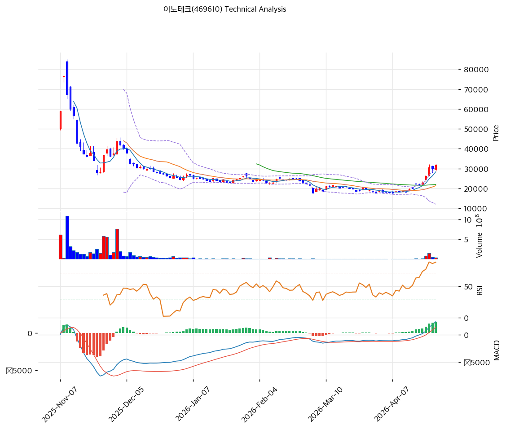

# 이노테크(469610) 기술적 분석

2026-04-24 | T2 Technical Analysis

---

## 차트

---

## 1. 가격 현황

| 항목 | 값 |
|------|-----|
| 현재가 | 32,000원 (+6.31%) |
| 52주 고가 | 76,400원 |
| 52주 저가 | 17,620원 |
| 52주 범위 위치 | 24.5% |
| 거래량 | 20일 평균 대비 2.31x |

---

## 2. 차트 패턴 분석

### 2.1 캔들스틱 패턴

| 패턴 | 위치 | 신뢰도 | 해석 |
|------|------|--------|------|
| 장대 양봉 | 2026-04-24 (당일) | 강 | +6.31% 강세 캔들. 거래량 2.31배 동반으로 단기 매수세 유입 확인. 단기 저항 돌파 시도 |
| 전저점 대비 상승 전환 | 직전 5거래일 | 중 | 17,620원 저점 형성 후 반등 구간 진입 중. 저점 다지기 패턴 |

※ 차트상 특이 캔들 패턴(망치형·도지·역망치)은 단기 횡보 구간에서 확인 필요.

### 2.2 가격 구조 패턴

- **하락 추세선 내 반등 시도** (신뢰도: 중)
  52주 고가 76,400원에서 17,620원까지 하락 추세가 지속된 후, 현재 32,000원에서 단기 반등 국면. 추세선 저항(현재 교차가 11,953원 수준)은 이미 상방에 있어 추세선 돌파 상태. 단, 52주 고가 대비 여전히 -58% 위치로 중기 하락 추세 속 기술적 반등 성격.

- **피봇 R1 근접 저항 구간** (신뢰도: 중)
  피봇 R1(33,167원) 및 피보나치 0.236 되돌림(33,430원)이 33,167~33,430원에 PRZ 형성. 현재가 32,000원에서 약 4~5% 상방에 위치. 이 구간 돌파 여부가 단기 추세 분기점.

### 2.3 다이버전스

- **MACD 상승 다이버전스** (신뢰도: 중)
  저점 구간에서 MACD 히스토그램이 확대(1,540) 중이며 매수 크로스 유지. 가격이 저점에서 반등하는 구간에서 MACD가 양호한 모멘텀을 보여 단기 추가 상승 가능성 시사.

- **RSI 하락 다이버전스 경계** (신뢰도: 중)
  RSI 78.4로 이미 과매수 구간 진입. 가격 상승 지속 시 RSI가 상승 멈추는 하락 다이버전스 발생 가능. 단기 모멘텀 소진 위험 신호로 해석.

### 2.4 패턴 종합 판단

단기적으로는 장대 양봉 + 거래량 급증 + MACD 매수 크로스라는 상승 시그널이 확인되나, RSI 78.4 과매수 + 볼린저밴드 상단 근접 + 33,000~33,500원 구간의 복합 저항이 맞서고 있다. 당일 급등(+6.31%)은 단기 모멘텀 이벤트로, 추가 상승 지속을 위해서는 R1 저항 돌파와 거래량 지속이 필요하다. 중기적으로는 52주 고가 대비 -58% 하락 추세 속 기술적 반등으로, 추세 전환보다는 단기 바운스로 해석하는 것이 타당하다.

---

## 3. 이동평균선 — 비정배열 (단기 과열)

| MA | 값 | 현재가 괴리율 | 위치 |
|----|-----|--------------|------|
| MA5 | 28,360원 | +12.8% | 위 |
| MA20 | 21,372원 | +49.7% | 위 |
| MA60 | 21,992원 | +45.5% | 위 |
| MA120 | N/A | N/A | — |
| MA200 | N/A | N/A | — |

**해석**: MA5·MA20·MA60 모두 현재가 아래에 위치하나, MA 정배열은 아직 미형성(MA5 > MA20 > MA60 순서 확인 필요). MA20 괴리율 +49.7%는 극단적 과열 수준으로, 단기 조정 압력이 상존한다. MA20(21,372원)이 핵심 지지선으로 기능하며, 하락 시 이 구간에서 1차 지지 예상.

---

## 4. 보조 지표

### RSI(14) — 78.4 (🔴과매수)

RSI 78.4로 과매수 임계치(70)를 크게 상회. 단기 급등에 따른 모멘텀 과열 상태로, 추가 상승보다는 단기 조정 또는 횡보 가능성이 높다. 다만 강세 추세 초입에서 RSI는 80~90 구간에서도 유지될 수 있어 즉각적 반전보다는 속도 조절로 해석.

### MACD(12,26,9)

| 항목 | 값 |
|------|-----|
| MACD | 2,351 |
| Signal | 810 |
| Histogram | +1,540 |
| 크로스 상태 | 매수 구간 (확대 중) |

**해석**: MACD가 Signal 선을 대폭 상회하며 히스토그램이 확대 중. 단기 상승 모멘텀이 살아있음을 확인. 다만 히스토그램 확대 속도가 둔화될 시 모멘텀 소진 경계.

### 볼린저밴드(20, 2σ)

| 항목 | 값 |
|------|-----|
| 상단 | 30,662원 |
| 중단 (MA20) | 21,372원 |
| 하단 | 12,083원 |
| 밴드 폭 | 86.9% |
| 현재 위치 | 상단 근접 (상단 돌파) |

**해석**: 현재가(32,000원)가 볼린저밴드 상단(30,662원)을 돌파한 상태. 밴드 폭 86.9%로 변동성이 매우 큰 상황. 상단 돌파 후 유지 시 강세 지속, 상단 이탈 후 회귀 시 단기 조정 신호. 현재는 상단 돌파 직후 구간으로 주의 요망.

### 스토캐스틱(14, 3, 3)

| 항목 | 값 |
|------|-----|
| Slow %K | 91.8 |
| Slow %D | 90.5 |
| 크로스 상태 | 골든크로스 |
| 판단 | 과매수 |

K=91.8, D=90.5로 과매수 구간. 골든크로스 상태이나 K·D 모두 90 이상에서는 고점 하향 돌파 시 매도 신호로 전환. 단기 모멘텀은 살아있으나 이탈 주의.

---

## 5. 지지/저항 — 추세선 · 피보나치 · PRZ 통합

### 5.1 피보나치 되돌림/확장

| 구분 | 비율 | 가격 | 현재가 대비 |
|------|------|------|-----------|
| Swing High | — | 85,000원 | — |
| 되돌림 | 0.236 | 33,430원 | +4.5% |
| 되돌림 | 0.382 | 43,285원 | +35.3% |
| 되돌림 | 0.5 | 51,250원 | +60.2% |
| 되돌림 | 0.618 | 59,215원 | +85.0% |
| 되돌림 | 0.786 | 70,555원 | +120.5% |
| Swing Low | — | 17,500원 | — |
| 확장 | 1.272 | 해당없음 | — |

※ 피보나치 기준: 하락 추세 (Swing High 85,000원 → Swing Low 17,500원). 되돌림 = 반등 목표가.

### 5.2 추세선

| 추세선 | 방향 | 현재 교차가 | 포인트 수 | 해석 |
|--------|------|-----------|---------|------|
| 지지선 | 하락 | 15,490원 | 6개 | 하락 추세 지지선이지만 현재가 위에 위치. 붕괴 이후 구간 |
| 저항선 | 하락 | 11,953원 | 6개 | 하락 추세 저항선도 현재가 아래. 기술적으로 추세선 쌍방 돌파 상태 |

### 5.3 PRZ (Potential Reversal Zone)

| 방향 | 가격 범위 | 신뢰도 | 근거 |
|------|---------|--------|------|
| 저항 | 33,167~33,430원 | 약 | 피봇 R1 + 피보나치 0.236 되돌림 — 2개 소스 중첩 |

### 5.4 종합 지지/저항 테이블

| 구분 | 가격 | 근거 |
|------|------|------|
| 저항 | 76,400원 | 52주 고가 |
| 저항 | 43,285원 | 피보나치 0.382 되돌림 |
| 저항 | 33,430원 | 피보나치 0.236 되돌림 |
| 저항 | 33,167원 | 피봇 R1 |
| 저항 | 33,298원 | PRZ (약) — 피봇 R1 + 피보나치 0.236 |
| **현재가** | **32,000원** | — |
| 지지 | 29,767원 | 피봇 S1 |
| 지지 | 27,533원 | 피봇 S2 |
| 지지 | 21,992원 | MA60 |
| 지지 | 21,372원 | MA20 |

---

## 6. 시그널 종합

| 지표 | 내용 | 시그널 |
|------|------|--------|
| **차트 패턴** | 하락 추세 속 기술적 반등. PRZ 33,000원대 저항 직전 | ⚪ |
| 이동평균선 | 비정배열. MA20 괴리 +49.7% 극단적 과열 | 🔴 |
| RSI | 78.4 — 과매수 | 🔴 |
| MACD | 매수 크로스, 히스토그램 확대 중 | 🟢 |
| 볼린저밴드 | 상단 돌파, 밴드 폭 86.9% 극단적 확장 | ⚪ |
| 스토캐스틱 | 골든크로스, K=91.8 과매수 | 🔴 |
| 거래량 | 2.31x — 강력 동반 | 🟢 |

**종합 판단**: 🟢 매수 2개 / 🔴 매도 3개 / ⚪ 중립 2개 → **매도우위 (과열 경고)**

당일 +6.31% 급등과 거래량 2.31배는 단기 모멘텀을 지지하나, RSI 78.4·MA20 괴리 +49.7%·볼린저밴드 상단 돌파가 중첩되어 단기 과열 경고가 뚜렷하다. 33,000~33,500원 PRZ 저항 구간에서 의미 있는 조정 또는 횡보 후 추가 방향성이 결정될 것으로 보인다.

---

## 7. 전략 제안

### 보유 중인 경우
- **비중축소** (과열 구간, 단기 차익 실현 고려)
- 익절 라인: 33,167원 (피봇 R1 / PRZ 저항 구간)
- 손절 라인: 27,533원 (피봇 S2 이탈 시)
- 리스크/리워드: 1차 익절(33,167원) 기준 R:R = 1:0.69로 불리 → 비중 축소 권장

### 진입 대기인 경우
- **관망** (현재 과열 구간 진입 자제)
- 1차 진입가: 29,767원 (피봇 S1 — 조정 후 지지 확인)
- 2차 진입가: 21,372원 (MA20 — 중기 지지선)
- 진입 조건: 거래량 동반 조정 후 저점 확인 + RSI 60 이하 복귀 + MACD 히스토그램 재상승 확인
