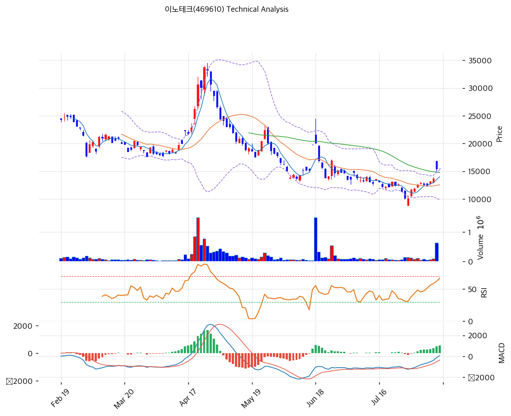

# 이노테크(469610) 기술적 분석

2026-08-13 | T2 Technical Analysis

---

## 차트

---

## 1. 가격 현황

| 항목 | 값 |
|------|-----|
| 현재가 | **15,440원 (+12.87%)** — 2026-08-12 종가 |
| 8/12 시가 / 고가 / 저가 | **16,840원 / 16,840원 / 14,950원** |
| 전일(8/11) 종가 | 13,680원 |
| 52주 고가 | **85,000원** (2025-11-11 장중) / 종가 최고 76,400원 |
| 52주 저가 | **8,760원** (2026-07-30 장중) / 종가 최저 10,040원 |
| 52주 범위 위치 | **8.8%** |
| 고점 대비 | **-81.8%** |
| 저점 대비 | **+76.3%** |
| 거래량 | **627,966주** — 직전 19거래일 평균 대비 **약 8.9x** |
| 상장일 | 2025-11-07 (거래일 187일차) |

> ⚠️ **데이터 수집 시점**: 데이터가 8/13 오전 8시 32분(장 시작 전)에 수집돼 `data.json`의 등락률·거래량이 **0**입니다. 본 보고서는 yfinance 일봉 원본으로 8/12 종가 기준 재계산했습니다.

> ⚠️ **KIS 52주 고/저 = 0**: KIS API가 52주 고/저를 모두 0으로 반환했습니다. 위 표는 yfinance 기준입니다. **8개 종목 연속** 이 필드에 오류가 발생했습니다.

> ℹ️ **MA200 산출 불가**: 2025-11-07 상장으로 거래일이 187일뿐이라 200일 이동평균이 존재하지 않습니다.

---

## 2. 차트 패턴 분석

### 2.1 캔들스틱 패턴

| 패턴 | 위치 | 신뢰도 | 해석 |
|------|------|--------|------|
| **갭상승 장대음봉** | **2026-08-12** | **강** | 시가 16,840원(전일 대비 +23.1% 갭상승)이 그대로 당일 고가. 종가 15,440원으로 **실체 -8.3%**. 위꼬리 없는 음봉에 거래량 8.9배 — **소진갭 경계 신호** |
| 쌍바닥 망치형 | 2026-07-29 / 07-30 | 강 | 7/29 저가 9,930원, 7/30 저가 8,760원. 7/30은 시가 8,870원에서 종가 10,040원으로 밀어올린 긴 아래꼬리 |
| 상승장악형 | 2026-07-31 | 중 | 7/30 캔들(8,870\~10,040)을 7/31 양봉(10,590\~11,730)이 상향 돌파 |
| 상승 적삼병 | 2026-08-03\~05 | 중 | 3거래일 연속 양봉(+1.4%, +5.7%, +2.1%) |
| 장대음봉 연속 | 2026-07-28\~29 | 강 | -9.5%, -11.0%. 이틀 만에 -19.5%. 투매 국면 |

**8월 12일 캔들이 이 차트의 핵심입니다.** 시가가 곧 고가인 갭상승 음봉은 두 가지 중 하나입니다 — 강한 재료에 시초가가 과열됐다가 차익 실현에 밀린 것(단기 조정 후 재상승 가능), 또는 마지막 매수세가 소진된 것(소진갭, 추세 종료). 거래량이 직전 평균의 **8.9배**로 폭증한 점, 그리고 당일 **외국인 -109,316주 / 기관 -96,586주 순매도, 개인 +202,083주 순매수**였다는 점은 후자 쪽 해석에 무게를 싣습니다.

### 2.2 가격 구조 패턴

- **쌍바닥(Double Bottom) — 8,760\~9,930원** (신뢰도: **중**)
  7월 29일 9,930원, 7월 30일 8,760원에서 이틀 연속 저점을 확인했습니다. 두 저점이 정확히 일치하지 않아(1,170원 차이) 전형적인 쌍바닥보다는 **V자 급반등**에 가깝습니다. 7/30 거래량 143,934주가 당시 최대였다는 점은 투매 소진 신호로 볼 수 있습니다.

- **하락 추세선 상향 돌파** (신뢰도: **중**)
  2025년 11월 10일 76,400원 이후 2026년 4월 30일 26,600원, 6월 30일 14,770원으로 이어진 하락 추세선의 현재 교차가는 약 25,800원입니다. 다만 이는 **현재가보다 위**에 있어, 엄밀히 말하면 장기 하락 채널은 아직 벗어나지 못했습니다. 돌파한 것은 7\~8월의 단기 하락선입니다.

- **-81.8% 하락 후 되돌림 초기** (신뢰도: **강**)
  85,000원 → 8,760원(**-89.7%**) → 15,440원. **낙폭의 8.8%만 되돌린 상태**입니다. 피보나치 0.236 되돌림(26,753원)까지도 +73.3%가 남아 있습니다. 상승 여지가 크다는 뜻이기도 하지만, 반대로 **8개월간 쌓인 매물대가 위쪽 전 구간에 깔려 있다**는 뜻이기도 합니다.

- **IPO 후 대량 매물대 — 22,800\~36,200원** (신뢰도: 강)
  월말 종가 기준 2025-11월 36,200원, 12월 24,550원, 2026-01월 24,950원, 02월 22,800원. 이 구간에서 상장 초기 거래가 집중됐습니다. 현재가에서 +47.7%~+134.5% 위에 손실 회복 매물이 계단식으로 대기합니다.

### 2.3 다이버전스

- **RSI 상승 다이버전스 (7월 말, 완성)** (신뢰도: 중)
  7월 28\~30일 가격이 저점을 낮추는 동안 하락 강도는 약해졌습니다(7/28 -9.5% → 7/29 -11.0% → 7/30 -1.1%). 7/30 거래량이 최대였음에도 낙폭이 크게 줄어든 것은 매도 소진 신호이며, 이후 8거래일간 +53.8% 반등의 기술적 근거가 됐습니다.

- **MACD 0선 상향 돌파** (신뢰도: **중강**)
  MACD **+58** / Signal **-497** / Histogram **+555**. 골든크로스에 더해 **MACD 본선이 0선 위로 막 올라섰습니다.** 앞서 다룬 일진전기(MACD -2,071로 0선 아래)와 달리, 이노테크는 중기 모멘텀 전환의 첫 조건을 충족했습니다. 다만 +58은 0선을 갓 넘은 수준이라 확정으로 보기엔 이릅니다.

- **스토캐스틱 데드크로스 — 유일한 명확한 매도 신호** (신뢰도: **중**)
  %K 86.7 / %D 90.5로 **%K가 %D를 하향 돌파**했습니다. 두 값 모두 과매수 구간(80 이상)에 있으며, 이 조합은 단기 조정을 예고합니다. 8/12 갭상승 음봉과 방향이 일치합니다.

### 2.4 패턴 종합 판단

**신호가 정면으로 갈립니다.**

**상승 근거**: 쌍바닥 완성, MACD 0선 돌파, 볼린저 상단 돌파, MA60 회복, 거래량 폭증.
**하락 근거**: 8/12 갭상승 음봉(실체 -8.3%), 스토캐스틱 과매수 데드크로스, MA20 대비 +23.9% 이격, 외국인·기관 대량 순매도.

**결정적인 것은 8/12 캔들의 성격입니다.** 거래량 8.9배가 실린 갭상승 음봉이 개인 매수·기관 매도로 채워졌다면, 이는 반등의 시작이 아니라 **반등의 정점**일 가능성이 있습니다. 다음 1\~2거래일에 16,840원(8/12 고가)을 종가로 회복하는지가 판단 기준입니다.

---

## 3. 이동평균선 — 역배열 잔존 (MA60 회복 단계)

| MA | 값 | 현재가 괴리율 | 위치 |
|----|-----|--------------|------|
| MA5 | 13,452원 | **+14.8%** | 위 |
| MA20 | 12,461원 | **+23.9%** | 위 |
| MA60 | 14,825원 | **+4.1%** | 위 |
| MA120 | 18,406원 | **-16.1%** | 아래 |
| MA200 | — | — | 산출 불가 (상장 187거래일) |

**정렬 상태**: MA120(18,406) > **현재가(15,440)** > MA60(14,825) > MA5(13,452) > MA20(12,461)

**해석**: 장기선(MA120)이 가장 위에 있는 **역배열**이지만, 세부 구조는 개선되고 있습니다.

1. **MA5(13,452)가 MA20(12,461) 위로 올라섰습니다** — 단기 골든크로스가 8월 초에 발생했습니다.
2. **현재가가 MA60(14,825)을 +4.1% 상회합니다.** 8/12에 회복한 선이며, 중기 추세 전환의 1차 관문을 통과했습니다. 다만 **여유가 4.1%뿐**이라 하루 조정으로 다시 이탈할 수 있습니다.
3. **MA120(18,406)이 -16.1% 위에 있습니다.** 이 종목의 다음 관문이며, 피보나치 확장 1.272(19,038원)와 함께 **18,400\~19,000원 저항대**를 형성합니다.
4. **MA20 대비 +23.9% 이격은 과열 구간입니다.** 8거래일 만에 +53.8% 오른 결과이며, 되돌림 시 MA5(13,452) → MA60(14,825) 순으로 지지를 시험하게 됩니다.

> ℹ️ `data.json`의 MA값(MA5 14,018 / MA20 12,554 / MA60 14,764 / MA120 18,335)은 수집 시점 차이로 위 표와 소폭 다릅니다. 위 표는 8/12 종가를 포함한 yfinance 재계산값입니다.

---

## 4. 보조 지표

### RSI(14) — 61.8 (중립)

8거래일간 +53.8% 상승했는데도 RSI가 61.8에 머물러 있습니다. 직전 하락폭(7/28\~30 사흘간 -19.5%)이 워낙 커서 14일 평균 하락폭이 높게 잡혀 있기 때문입니다. **과매수(70)까지 여유가 있어 기술적 추가 상승 여력은 남아 있습니다.** 50선을 회복한 것 자체는 긍정적 신호입니다.

### MACD(12,26,9)

| 항목 | 값 |
|------|-----|
| MACD | **+58** |
| Signal | -497 |
| Histogram | **+555** |
| 크로스 상태 | **매수 구간 (확대 중)** |

**해석**: 히스토그램이 +555로 확대 중이며, 무엇보다 **MACD 본선이 0선을 상향 돌파(+58)**했습니다. 이는 단순 반등을 넘어 중기 모멘텀이 전환되기 시작했음을 의미하는 신호입니다.

다만 +58은 0선을 갓 넘은 값이라 한두 번의 음봉으로 다시 마이너스로 내려갈 수 있습니다. **0선 위에서 며칠간 유지되는지**가 확인 포인트입니다.

### 볼린저밴드(20, 2σ)

| 항목 | 값 |
|------|-----|
| 상단 | 15,226원 |
| 중단 (MA20) | 12,554원 |
| 하단 | 9,881원 |
| 밴드 폭 | **42.6%** |
| 현재 위치 | **상단 돌파 (+1.4%)** |

**해석**: 현재가 15,440원이 상단(15,226원)을 1.4% 넘어섰습니다. 밴드 상단 돌파는 강한 모멘텀 신호이지만 **밴드 폭 42.6%는 극단적으로 넓은 수준**입니다.

밴드가 이렇게 벌어진 것은 7월 급락(-19.5%)과 8월 급등(+53.8%)이 20일 안에 모두 일어났기 때문입니다. **중단(12,554원)까지의 거리가 -18.7%**라는 사실이 이 변동성의 크기를 보여줍니다. 밴드 폭이 축소되기 시작할 때까지는 어느 방향으로도 큰 폭의 움직임이 가능합니다.

### 스토캐스틱(14, 3, 3)

| 항목 | 값 |
|------|-----|
| Slow %K | **86.7** |
| Slow %D | **90.5** |
| 크로스 상태 | **데드크로스** |
| 판단 | **🔴 과매수** |

**이 지표만 명확한 매도 신호를 냅니다.** %K(86.7)가 %D(90.5)를 하향 돌파했고 두 값 모두 과매수 기준선 80을 넘었습니다. 스토캐스틱은 RSI보다 빠르게 반응하므로 **단기 과열을 가장 먼저 경고**하는 지표이며, 8/12 갭상승 음봉과 신호가 일치합니다.

---

## 5. 지지/저항 — 추세선 · 피보나치 · PRZ 통합

### 5.1 피보나치 되돌림/확장

**[A] 장기 하락 스윙 되돌림** — 상장 후 전체 낙폭 기준

| 구분 | 비율 | 가격 | 현재가 대비 |
|------|------|------|-----------|
| Swing High | — | **85,000원** (2025-11-11) | +450.5% |
| 되돌림 | 0.786 | 68,685원 | +344.9% |
| 되돌림 | 0.618 | 55,876원 | +261.9% |
| 되돌림 | 0.5 | 46,880원 | +203.6% |
| 되돌림 | 0.382 | 37,884원 | +145.4% |
| **되돌림** | **0.236** | **26,753원** | **+73.3%** |
| Swing Low | — | **8,760원** (2026-07-30) | -43.3% |

※ 피보나치 기준: **하락 추세** (Swing High 85,000원 → Swing Low 8,760원, 낙폭 76,240원)
※ **현재가 15,440원은 낙폭의 8.8%만 되돌린 상태**입니다. 첫 관문인 0.236 되돌림(26,753원)까지 +73.3%가 남아 있습니다.
※ `data.json`의 확장값(1.272 = -11,977원 등)은 하락 추세 연장 산출이라 **모두 음수로 무의미**합니다. 아래 [B]로 대체합니다.

**[B] 단기 반등 스윙** — 현재 국면에 직접 적용되는 기준

| 구분 | 비율 | 가격 | 현재가 대비 | 성격 |
|------|------|------|-----------|------|
| 확장 | 2.0 | 24,920원 | +61.4% | 상승 목표 |
| 확장 | 1.618 | 21,833원 | +41.4% | 상승 목표 |
| 확장 | 1.382 | 19,927원 | +29.1% | 상승 목표 |
| **확장** | **1.272** | **19,038원** | **+23.3%** | **상승 목표 (MA120 근접)** |
| Swing High | — | **16,840원** (8/12 장중) | +9.1% | — |
| **되돌림** | **0.236** | **14,933원** | **-3.3%** | **★ 8/12 저가 14,950원이 여기서 지지** |
| 되돌림 | 0.382 | 13,753원 | -10.9% | 조정 지지 |
| 되돌림 | 0.5 | 12,800원 | -17.1% | 조정 지지 |
| 되돌림 | 0.618 | 11,847원 | -23.3% | 조정 지지 |
| Swing Low | — | 8,760원 (7/30 장중) | -43.3% | — |

※ 반등 스윙: 8,760원(7/30) → 16,840원(8/12), 반등폭 8,080원
**8월 12일 장중 저가 14,950원이 0.236 되돌림 14,933원과 17원 차이로 일치**합니다. 우연으로 보기 어려운 수준이며, 이 구간이 1차 지지선으로 작동하고 있음을 보여줍니다.

### 5.2 추세선

| 추세선 | 방향 | 현재 교차가 | 포인트 수 | 해석 |
|--------|------|-----------|---------|------|
| 장기 하락 저항선 | 하락 | **약 25,788원** | 6개 | **아직 돌파하지 못했습니다.** 현재가 대비 +67.0% 위. 상장 후 하락 채널의 상단 |
| 장기 하락 지지선 | 하락 | 약 8,749원 | 6개 | 7/30 저가 8,760원이 정확히 이 선에서 반등 |
| 단기 상승 지지선 | 상승 | **약 13,890원** | 3개 (7/30, 8/6, 8/7 저가) | 일당 약 +570원. 이 선 이탈 시 8월 반등 구조 무효 |

**주목할 점**: 7월 30일 저가 8,760원이 장기 하락 지지선(8,749원)과 11원 차이로 맞닿았습니다. **채널 하단에서 정확히 반등한 것**이며, 이것이 8월 반등의 기술적 출발점입니다. 반대로 채널 상단(25,788원)까지는 아직 멀었습니다.

### 5.3 PRZ (Potential Reversal Zone)

| 방향 | 가격 범위 | 신뢰도 | 근거 |
|------|---------|--------|------|
| **저항** | **16,536 ~ 16,840원** | **중** | 피봇 R1(16,536) + 8/12 장중 고가(16,840). 현재가 +7.1%~+9.1% |
| **저항** | **18,406 ~ 19,038원** | **강** | MA120(18,406) + 피보나치 확장 1.272(19,038). 현재가 +19.2%~+23.3% |
| 저항 | 21,833 ~ 22,800원 | 중 | 피보 확장 1.618(21,833) + 2026-02 매물대(22,800) |
| **저항** | **25,701 ~ 26,753원** | **강** | 장기 하락 추세선(25,788) + 피보 0.236 되돌림(26,753). **채널 상단** |
| **지지** | **14,825 ~ 14,950원** | **강** | MA60(14,825) + 반등 피보 0.236(14,933) + 8/12 저가(14,950). 현재가 -3.2%~-4.0% |
| **지지** | **13,452 ~ 13,890원** | **강** | MA5(13,452) + 8/11 종가(13,680) + 반등 피보 0.382(13,753) + 단기 상승선(13,890) |
| **지지** | **12,461 ~ 12,800원** | **강** | MA20/볼린저 중단(12,461\~12,554) + 반등 피보 0.5(12,800) |
| 지지 | 9,881 ~ 10,040원 | 강 | 볼린저 하단(9,881) + 7/30 종가(10,040) |

※ PRZ = 추세선 · 피보나치 · 피봇 · MA 등 복수 지표가 겹치는 가격 구간

**가장 중요한 두 구간**:
- **하방 14,825\~14,950원**: 지표 3개가 겹치며 현재가에서 불과 -3.2%입니다. **이 선을 종가로 지키는지가 8월 반등의 유효성을 결정합니다.**
- **상방 18,406\~19,038원**: MA120과 피보 확장이 겹칩니다. 여기를 뚫어야 IPO 매물대 진입이 가능합니다.

### 5.4 종합 지지/저항 테이블

| 구분 | 가격 | 근거 |
|------|------|------|
| 저항 | 85,000 / 76,400원 | 52주 고가(장중) / 종가 최고 (2025-11) |
| 저항 | 37,884원 | 피보나치 0.382 되돌림 |
| 저항 | 36,200원 | 2025-11 월말 종가 매물대 |
| 저항 | 26,753 / 25,788원 | 피보 0.236 되돌림 + **장기 하락 추세선 ★PRZ(강)** |
| 저항 | 24,550\~24,950원 | 2025-12 / 2026-01 월말 종가 매물대 |
| 저항 | 22,800원 | 2026-02 월말 종가 매물대 |
| 저항 | 21,833원 | 피보나치 확장 1.618 |
| **저항** | **19,038 / 18,406원** | **피보 확장 1.272 + MA120 ★PRZ(강)** |
| **저항** | **17,633원** | 피봇 R2 |
| **저항** | **16,840 / 16,536원** | **8/12 장중 고가 + 피봇 R1 ★1차 관문** |
| 저항 | 15,743원 | 일간 피봇 P |
| **현재가** | **15,440원** | 2026-08-12 종가 (+12.87%) |
| 지지 | 15,226원 | 볼린저 상단 (돌파 후 지지 전환 여부) |
| **지지** | **14,950 / 14,933 / 14,825원** | **8/12 저가 + 반등 피보 0.236 + MA60 ★PRZ(강)** |
| 지지 | 14,646원 | 피봇 S1 |
| **지지** | **13,890 / 13,753 / 13,680 / 13,452원** | **단기 상승선 + 반등 피보 0.382 + 8/11 종가 + MA5 ★PRZ(강)** |
| 지지 | 13,853원 | 피봇 S2 |
| **지지** | **12,800 / 12,554 / 12,461원** | **반등 피보 0.5 + 볼린저 중단 + MA20 ★PRZ(강)** |
| 지지 | 11,847원 | 반등 피보 0.618 |
| 지지 | 10,040 / 9,881원 | 7/30 종가 + 볼린저 하단 |
| 지지 | 8,760 / 8,749원 | **52주 저가 + 장기 하락 추세선 지지** |

> **일간 피봇 재산출**: 8/12(고 16,840 / 저 14,950 / 종 15,440) 기준 **P=15,743, R1=16,536, R2=17,633, S1=14,646, S2=13,853**. `data.json`의 피봇은 전부 15,440원으로 동일한데, 이는 장 시작 전 수집이라 고가=저가=종가로 계산됐기 때문입니다. 위 값을 사용하시기 바랍니다.

---

## 6. 시그널 종합

| 지표 | 내용 | 시그널 |
|------|------|--------|
| **차트 패턴** | 쌍바닥 + 단기 하락선 돌파. **단 8/12 갭상승 음봉(실체 -8.3%)** | ⚪ |
| 이동평균선 | 역배열 잔존(MA120 최상단), **MA60 회복 + MA5>MA20 골든크로스** | 🟢 |
| RSI | 61.8 — 중립, 과매수까지 여유 | ⚪ |
| MACD | 골든크로스 + **본선 0선 상향 돌파(+58)**, 히스토그램 +555 확대 | 🟢 |
| 볼린저밴드 | 상단 돌파(+1.4%), 밴드 폭 42.6% (극단적 확장) | ⚪ |
| 스토캐스틱 | **데드크로스, %K 86.7 / %D 90.5 — 과매수** | 🔴 |
| 거래량 | **8.9x 폭증** — 단 외국인·기관 순매도, 개인 순매수 | 🟢 |

**종합 판단**: 🟢 매수 3개 / 🔴 매도 1개 / ⚪ 중립 3개 → **매수우위 (단기 과열 경고)**

> ℹ️ `data.json`의 시그널 집계(매수 1 / 매도 2 / 중립 4 → **매도우위**)는 거래량을 0.0x로, 피봇을 전부 15,440원으로 계산한 장전 데이터 기반입니다. 8/12 종가 확정치로 재집계하면 위와 같이 매수우위로 바뀝니다.

**단기(1\~2주)로는 방향이 갈립니다.** MACD 0선 돌파와 MA60 회복은 실질적인 개선이지만, 스토캐스틱 과매수 데드크로스와 8/12 갭상승 음봉이 정반대를 가리킵니다. **14,825\~14,950원(MA60 + 반등 피보 0.236 + 8/12 저가)을 종가로 지키는지**가 첫 판단 기준입니다.

**중기(1\~3개월)로는 아직 반등 초기입니다.** 낙폭의 8.8%만 되돌렸고, 장기 하락 추세선(25,788원)은 +67.0% 위에 있으며, MA120(18,406원)도 뚫지 못했습니다. **18,406\~19,038원 PRZ를 거래량과 함께 돌파해야** 반등이 추세 전환으로 승격됩니다.

**가장 큰 경계 요인은 수급입니다.** 8/12 거래량 8.9배 폭증의 내용이 **외국인 -109,316주 / 기관 -96,586주 / 개인 +202,083주**였습니다. 기관과 외국인이 급등에 물량을 넘겼고 개인이 받았습니다. 이런 구조의 급등은 후속 매수세가 이어지지 않으면 되돌림이 빠릅니다.

---

## 7. 전략 제안

### 보유 중인 경우

- **부분 익절 후 홀드** — 8/12 갭상승 음봉과 스토캐스틱 데드크로스를 감안해 일부 차익 실현 권고
- **익절 라인 1차**: **16,536\~16,840원** (피봇 R1 + 8/12 장중 고가) — **+7.1%~+9.1%**. 8/12 고가를 종가로 회복하지 못하면 이 구간에서 비중 축소
- **익절 라인 2차**: **18,406\~19,038원** (MA120 + 피보 확장 1.272 PRZ) — **+19.2%~+23.3%**. 1차를 거래량 동반 돌파했을 때만 유효
- **익절 라인 3차**: 21,833\~22,800원 (피보 1.618 + 2026-02 매물대) — +41.4%~+47.7%
- **손절 라인**: **13,680원** (8/11 종가 + 반등 피보 0.382 PRZ) — **-11.4%**. 1차 경계선은 14,825원(MA60, -4.0%)이며, 이를 종가로 이탈하면 비중을 절반으로 줄이고 13,680원 이탈 시 전량 정리
- **리스크/리워드**: 2차 익절(19,038원, +23.3%) 대비 손절(13,680원, -11.4%) → **1:2.04**

### 진입 대기인 경우

- **관망 — 추격 매수 비권장**
- **1차 진입가**: **13,452\~13,890원** (MA5 + 8/11 종가 + 반등 피보 0.382 + 단기 상승선) — 현재가 대비 **-10.0%~-12.9%**
- **2차 진입가**: **12,461\~12,800원** (MA20 = 볼린저 중단 + 반등 피보 0.5) — **-17.1%~-19.3%**
- **3차 진입가**: 10,040\~9,881원 (7/30 종가 + 볼린저 하단) — -35.0%~-36.0%
- **진입 조건**:
  1. **8/12 고가 16,840원을 종가로 회복하는지** 먼저 확인 — 회복하면 갭이 살아있는 것, 못 하면 소진갭
  2. 14,825원(MA60)을 종가로 지키는지 확인. 이탈 시 1차 진입가까지 대기
  3. MACD 본선이 0선 위(+58)에서 며칠간 유지되는지 확인 — 다시 음수로 내려가면 반등 종료 신호
  4. **거래량 폭증일의 수급 방향 확인** — 8/12처럼 기관·외국인 순매도가 반복되면 진입 보류

**핵심**: 이 종목은 **8거래일 만에 +53.8% 오른 직후**이고, MA20 대비 +23.9% 이격 상태이며, 볼린저 밴드 폭이 42.6%입니다. 방향이 맞더라도 한 번의 조정 없이 직진할 가능성은 낮습니다. **분할 진입이 원칙이며, 8/12 갭이 메워지는지(13,680원 이탈 여부)를 확인한 뒤 판단하는 것이 안전합니다.**
