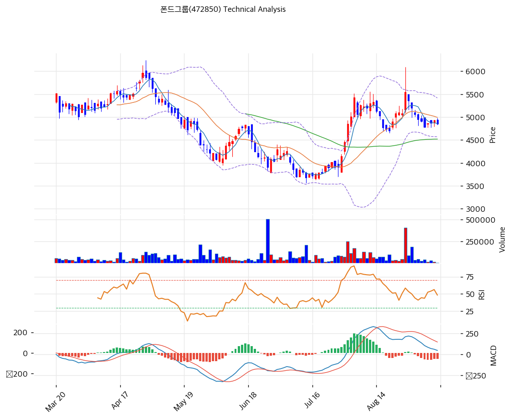

# 폰드그룹(472850) 기술적 분석

2026-09-11 | T2 Technical Analysis

---

## 차트

---

## 1. 가격 현황

| 항목 | 값 |
|------|-----|
| 현재가 | 4,850원 (-1.72%) |
| 52주 고가 | 7,180원 (종가 기준, 장중 7,250원) |
| 52주 저가 | 3,680원 (종가 기준, 장중 3,560원) |
| 52주 범위 위치 | 33.4% |
| 거래량 | 20일 평균 대비 0.09x (장중 수집 시점) |

---

## 2. 차트 패턴 분석

### 2.1 캔들스틱 패턴

| 패턴 | 위치 | 신뢰도 | 해석 |
|------|------|--------|------|
| 긴 위꼬리 양봉 | 2026-08-28 | 중 | 장중 6,090원까지 올랐다가 5,550원에 마감. 거래량 405,474주로 급증했지만 고점 대비 8.9% 밀려 위쪽 매물 출회를 확인한 봉이다(매도 시그널) |
| 팽이형 연속 | 2026-09-08\~09-11 | 약 | 4,775\~4,985원 좁은 범위에서 몸통이 짧은 봉 4개. 5거래일 하락 뒤 매도세가 약해진 신호지만 반전 확인은 아니다(중립) |

### 2.2 가격 구조 패턴

- **V자 반등 후 박스권** (신뢰도: 중)
  4월 말 6,200원대 고점에서 7월 14일 3,560원까지 하락한 뒤 8월 초 5,500원 부근까지 약 54% 반등했다. 이후 한 달 넘게 4,740\~5,400원 박스에 갇혀 있다. 8월 28일 박스 상단을 장중 돌파했지만 종가로 지키지 못해 박스가 유지됐다. 박스 상단 5,400원 종가 돌파 시 측정 목표는 박스 높이(약 660원)를 더한 6,060원, 하단 4,740원 이탈 시 4,080원이다.

- **하락 추세선 저항** (신뢰도: 중)
  연초 고점들을 잇는 하락 저항선이 현재 5,150원을 지나며 6개 포인트로 확인된다. 8월 반등 고점들이 이 선 부근에서 막혔다. 추세선 지지선은 3,704원으로 멀리 떨어져 있다.

### 2.3 다이버전스

- **RSI 정규 하락 다이버전스** (신뢰도: 중)
  8월 초 반등 때 RSI는 약 90까지 올랐지만, 장중 가격이 더 높았던 8월 28일(6,090원) RSI는 60 부근에 그쳤다. 가격 고점은 높아지고 RSI 고점은 낮아진 형태로, 8월 28일 이후 조정이 이 괴리를 해소하는 중이다.

- **MACD 정규 하락 다이버전스** (신뢰도: 중)
  MACD 선은 8월 중순 약 270에서 정점을 찍은 뒤 47까지 내려왔고, 같은 기간 가격은 8월 28일 새 장중 고점을 만들었다. 추세 모멘텀이 가격보다 먼저 약해졌다.

### 2.4 패턴 종합 판단

8월 28일 위꼬리 양봉과 RSI·MACD 하락 다이버전스가 겹쳐 단기 고점은 8월 말에 형성된 것으로 본다. 반면 MA60(4,519원)은 우상향으로 돌아섰고 스토캐스틱 %K 12.3의 과매도와 최근 팽이형 연속은 하락 속도가 줄었다는 신호다. 방향성은 박스(4,740\~5,400원) 이탈 전까지 중립이다. 시그널: ⚪중립

---

## 3. 이동평균선: 비정배열 (약세)

| MA | 값 | 현재가 괴리율 | 위치 |
|----|-----|--------------|------|
| MA5 | 4,861원 | -0.2% | 아래 |
| MA20 | 4,994원 | -2.9% | 아래 |
| MA60 | 4,519원 | +7.3% | 위 |
| MA120 | 4,797원 | +1.1% | 위 |
| MA200 | 5,052원 | -4.0% | 아래 |

**해석**: 주가는 MA60·MA120 위, MA5·MA20·MA200 아래에 끼어 있다. MA20(4,994원)과 MA200(5,052원)이 5,000원 부근에서 1차 저항대를 만든다. MA60은 7월 저점 이후 우상향으로 돌아 4,519원에서 중기 지지 역할을 한다. 과열도 침체도 아닌 수렴 구간이다.

---

## 4. 보조 지표

### RSI(14): 48.5 (중립)

8월 초 과매수(약 90)에서 식어 50선 바로 아래에 있다. 방향은 완만한 하락이다. 다이버전스 해석은 2.3 참조.

### MACD(12,26,9)

| 항목 | 값 |
|------|-----|
| MACD | 47 |
| Signal | 106 |
| Histogram | -59 |
| 크로스 상태 | 매도 구간 (수축 중) |

**해석**: MACD가 시그널 아래로 내려간 매도 구간이지만 0선 위에 있고 히스토그램 확대는 멈췄다. 다이버전스 해석은 2.3 참조.

### 볼린저밴드(20, 2σ)

| 항목 | 값 |
|------|-----|
| 상단 | 5,418원 |
| 중단 (MA20) | 4,994원 |
| 하단 | 4,570원 |
| 밴드 폭 | 17.0% |
| 현재 위치 | 중간 (중단과 하단 사이) |

**해석**: 8월 반등 때 30% 이상 벌어졌던 밴드가 17.0%로 좁혀지는 중이다. 중단 아래에서 머물러 단기 약세 쪽이며, 밴드 수축이 더 진행되면 박스 이탈 방향으로 변동성이 커질 가능성이 높다.

### 스토캐스틱(14, 3, 3)

| 항목 | 값 |
|------|-----|
| Slow %K | 12.3 |
| Slow %D | 13.4 |
| 크로스 상태 | 데드크로스 |
| 판단 | 과매도 |

---

## 5. 지지/저항: 추세선 · 피보나치 · PRZ 통합

### 5.1 피보나치 되돌림/확장

| 구분 | 비율 | 가격 | 현재가 대비 |
|------|------|------|-----------|
| Swing High | — | 7,250원 | — |
| 되돌림 | 0.236 | 4,431원 | -8.6% |
| 되돌림 | 0.382 | 4,970원 | +2.5% |
| 되돌림 | 0.5 | 5,405원 | +11.4% |
| 되돌림 | 0.618 | 5,840원 | +20.4% |
| 되돌림 | 0.786 | 6,460원 | +33.2% |
| Swing Low | — | 3,560원 | — |
| 확장 | 1.272 | 2,556원 | -47.3% |
| 확장 | 1.382 | 2,150원 | -55.7% |
| 확장 | 1.618 | 1,280원 | -73.6% |
| 확장 | 2.0 | 산출값 음수 | — |

※ 피보나치 기준: 하락 추세 (Swing High 7,250원 2026-02-12 → Swing Low 3,560원 2026-07-14)
※ 되돌림 = 하락폭 대비 반등 비율, 확장 = 하락 연장 시 목표가

### 5.2 추세선

| 추세선 | 방향 | 현재 교차가 | 포인트 수 | 해석 |
|--------|------|-----------|---------|------|
| 지지선 | 하락 | 3,704원 | 6개 | 현재가와 23.6% 떨어져 단기 의미는 낮다 |
| 저항선 | 하락 | 5,150원 | 6개 | 8월 반등 고점이 막힌 자리. 종가 돌파가 추세 전환의 첫 조건 |

### 5.3 PRZ (Potential Reversal Zone)

| 방향 | 가격 범위 | 신뢰도 | 근거 |
|------|---------|--------|------|
| 저항(현재가 포함) | 4,740\~5,052원 | 강 | 피봇 S2·S1·R1·R2, MA5·MA20·MA120·MA200, 피보나치 0.382 되돌림 |
| 지지 | 4,431\~4,519원 | 약 | 피보나치 0.236 되돌림, MA60 |

※ PRZ = 추세선 · 피보나치 · 피봇 · MA 등 복수 지표가 겹치는 가격 구간. 겹치는 소스가 많을수록 반전 확률 상승.

### 5.4 종합 지지/저항 테이블

| 구분 | 가격 | 근거 |
|------|------|------|
| 저항 | 5,405원 | 피보나치 0.5 되돌림, 박스 상단, BB 상단(5,418원) |
| 저항 | 5,150원 | 하락 추세선 저항 |
| 저항 | 4,994\~5,052원 | MA20, MA200, PRZ 상단 |
| **현재가** | **4,850원** | — |
| 지지 | 4,740\~4,795원 | 피봇 S2·S1, 박스 하단 |
| 지지 | 4,431\~4,519원 | MA60, 피보나치 0.236, PRZ(약) |
| 지지 | 3,704원 | 하락 추세선 지지 |

---

## 6. 시그널 종합

| 지표 | 내용 | 시그널 |
|------|------|--------|
| **차트 패턴** | 위꼬리 양봉·하락 다이버전스 vs 팽이형·MA60 우상향, 박스권 | ⚪ |
| 이동평균선 | 비정배열, MA20 -2.9% | ⚪ |
| RSI | 48.5, 중립 | ⚪ |
| MACD | 매도 구간, 히스토그램 -59 | 🔴 |
| 볼린저밴드 | 중단 아래, 밴드 폭 17.0% 수축 | ⚪ |
| 스토캐스틱 | %K 12.3 과매도 | 🟢 |
| 거래량 | 0.09x, 약함 (장중) | ⚪ |

**종합 판단**: 🟢 매수 1개 / 🔴 매도 1개 / ⚪ 중립 5개 → **중립**

8월 V자 반등의 모멘텀은 소진됐고 주가는 4,740\~5,400원 박스 하단 쪽으로 내려와 있다. 단기로는 과매도 스토캐스틱과 피봇 지지로 박스 하단 반등 여지가 있지만, 5,150원 추세선을 거래량과 함께 넘기 전까지 중기 추세 전환으로 보기 어렵다.

---

## 7. 전략 제안

### 보유 중인 경우
- **홀드**
- 익절 라인: 5,400원 (박스 상단, 피보나치 0.5 되돌림 5,405원)
- 손절 라인: 4,430원 (MA60·피보나치 0.236 동시 이탈, 종가 기준)
- 리스크/리워드: 1:1.3 (하방 -8.7% / 상방 +11.3%)

### 진입 대기인 경우
- **관망**
- 1차 진입가: 4,520원 (MA60 지지)
- 2차 진입가: 4,430원 (피보나치 0.236 되돌림)
- 진입 조건: 4,520원 부근에서 거래량 동반 양봉으로 지지 확인, 또는 5,150원 추세선 종가 돌파 시 추격
