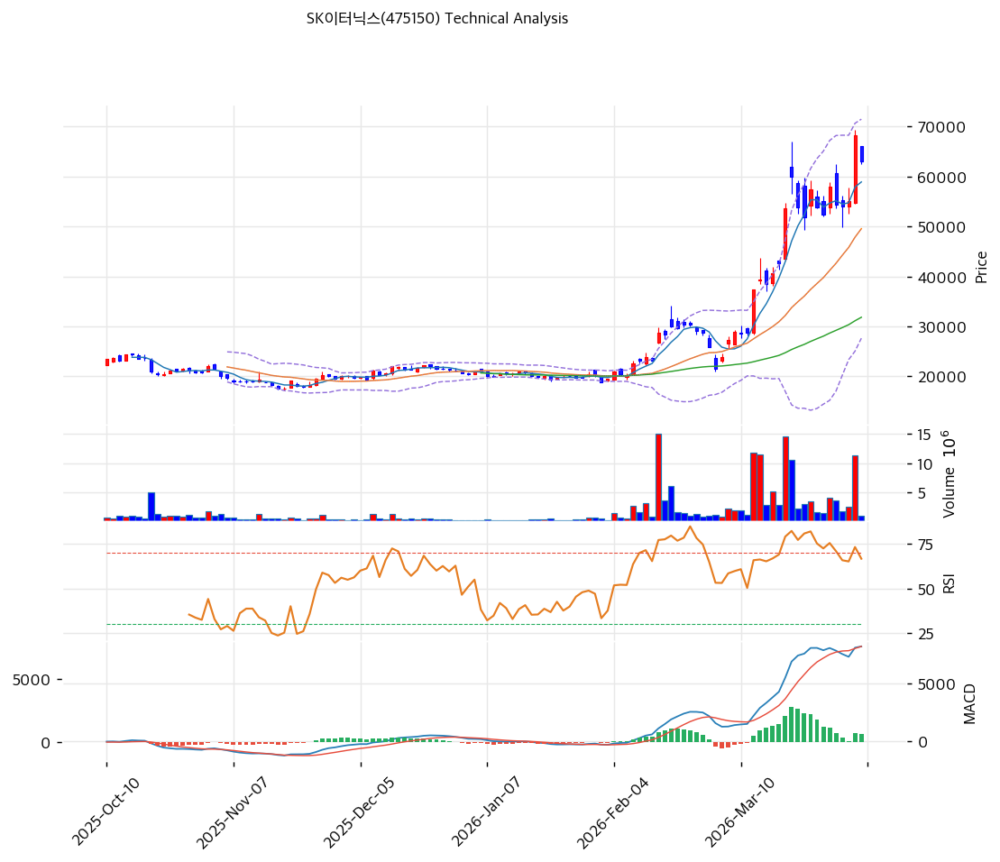

# SK이터닉스(475150) 기술적 분석

2026-04-06 | T2 Technical Analysis

---

## 차트

---

## 1. 가격 현황

| 항목 | 값 |
|------|-----|
| 현재가 | 63,100원 (-7.48%) |
| 52주 고가 | 68,200원 |
| 52주 저가 | 12,510원 |
| 52주 범위 위치 | 90.8% |
| 거래량 | 20일 평균 대비 0.20x |

---

## 2. 차트 패턴 분석

### 2.1 캔들스틱 패턴

| 패턴 | 위치 | 신뢰도 | 해석 |
|------|------|--------|------|
| 장대양봉 추세 지속 후 음봉 조정 | 최근 5거래일 | 중 | 급등 후 조정이 시작됐지만 추세 자체는 아직 훼손되지 않음 |
| 윗꼬리 음봉 | 최근 1~2거래일 | 중 | 68,200원 부근에서 단기 차익실현 압력 확인 |

### 2.2 가격 구조 패턴

- **신고가 돌파 후 되돌림** (신뢰도: 중)
  68,200원 신고가 형성 후 63,100원까지 조정받았습니다. 전형적인 추세 지속형 눌림일 수 있으나, 단기 과열 해소 과정으로도 볼 수 있습니다.

- **가속 상승 채널 유지** (신뢰도: 중)
  MA20과 MA60이 가파르게 우상향하고 있으며 중장기 정배열이 완성돼 있습니다. 다만 단기 조정이 추가로 진행될 경우 MA20 부근까지의 되돌림도 열려 있습니다.

### 2.3 다이버전스

- **RSI 하락 다이버전스 약하게 의심** (신뢰도: 약)
  가격이 신고가 영역에 진입했지만 RSI는 66.8 수준으로 폭발적 과열은 아닙니다. 강한 다이버전스는 아니나 상승 모멘텀 둔화는 일부 감지됩니다.

- **MACD 매수구간 유지** (신뢰도: 중)
  MACD는 매수구간이지만 히스토그램 확장은 멈춘 상태입니다. 추세는 유지되나 탄력은 이전보다 둔화된 모습입니다.

### 2.4 패턴 종합 판단

SK이터닉스 차트는 **강한 중장기 상승 추세 속 단기 조정 구간**으로 판단됩니다. 구조 자체는 아직 긍정적이지만, 직전 급등에 따른 과열 해소가 더 필요할 수 있습니다.

---

## 3. 이동평균선 — 정배열 (강세)

| MA | 값 | 현재가 괴리율 | 위치 |
|----|-----|--------------|------|
| MA5 | 58,920원 | +7.1% | 위 |
| MA20 | 49,552원 | +27.3% | 위 |
| MA60 | 31,830원 | +98.2% | 위 |
| MA120 | 26,258원 | +140.3% | 위 |
| MA200 | 25,033원 | +152.1% | 위 |

**해석**: 완전 정배열입니다. 중기 추세는 매우 강하지만, 특히 MA20·MA60 대비 괴리율이 높아 단기 조정 가능성도 큽니다.

---

## 4. 보조 지표

### RSI(14) — 66.8 (중립)

과매수 직전 수준입니다. 아직 극단은 아니지만, 추가 상승보다 단기 숨고르기 가능성을 함께 봐야 합니다.

### MACD(12,26,9)

| 항목 | 값 |
|------|-----|
| MACD | 8,200.0 |
| Signal | 7,543.0 |
| Histogram | +656.0 |
| 크로스 상태 | 매수 구간 (수축 가능성) |

**해석**: 매수구간은 유지되고 있지만 이전처럼 가속되는 국면은 아닙니다. 추세 지속과 단기 피로가 동시에 보입니다.

### 볼린저밴드(20, 2σ)

| 항목 | 값 |
|------|-----|
| 상단 | 71,479원 |
| 중단 (MA20) | 49,552원 |
| 하단 | 27,626원 |
| 밴드 폭 | 88.5% |
| 현재 위치 | 중간 |

**해석**: 밴드 폭이 매우 넓어 변동성이 큰 종목입니다. 과열에서 일부 이탈했지만 아직 밴드 자체는 확장 상태입니다.

### 스토캐스틱(14, 3, 3)

| 항목 | 값 |
|------|-----|
| Slow %K | 78.1 |
| Slow %D | 70.1 |
| 크로스 상태 | 골든크로스 |
| 판단 | 중립 |

---

## 5. 지지/저항

| 구분 | 가격 | 근거 |
|------|------|------|
| 저항 | 68,200원 | 52주 고가 |
| 저항 | 65,233원 | 피봇 R1 |
| **현재가** | **63,100원** | — |
| 지지 | 61,733원 | 피봇 S1 |
| 지지 | 60,367원 | 피봇 S2 |
| 지지 | 49,552원 | MA20 |

---

## 6. 시그널 종합

| 지표 | 내용 | 시그널 |
|------|------|--------|
| **차트 패턴** | 신고가 후 조정, 추세는 유지 | ⚪ |
| 이동평균선 | 정배열, 다만 MA20 +27.3% 과열 | ⚪ |
| RSI | 66.8 — 과열 직전 | ⚪ |
| MACD | 매수구간 유지 | ⚪ |
| 볼린저밴드 | 변동성 확장, 중간 위치 | ⚪ |
| 스토캐스틱 | 골든크로스, K=78.1 | ⚪ |
| 거래량 | 0.2x — 약함 | 🔴 |

**종합 판단**: 🟢 매수 0개 / 🔴 매도 1개 / ⚪ 중립 6개 → **중립**

SK이터닉스는 추세는 강하지만 이미 크게 오른 상태라, 현재 구간은 공격적 매수보다 조정 확인이 우선입니다. 기존 보유자는 추세를 보되 신규 진입은 기다리는 편이 낫습니다.

---

## 7. 전략 제안

### 보유 중인 경우
- **홀드**
- 익절 라인: 69,564원 (전략상 제시값, 신고가 갱신 구간)
- 손절 라인: 60,367원 (피봇 S2 이탈 시)
- 리스크/리워드: 보수적 1:1 내외

### 진입 대기인 경우
- **관망**
- 1차 진입가: 61,733원 (피봇 S1)
- 2차 진입가: 49,552원 (MA20)
- 진입 조건: 거래량 동반 반등 또는 조정 후 지지 확인
