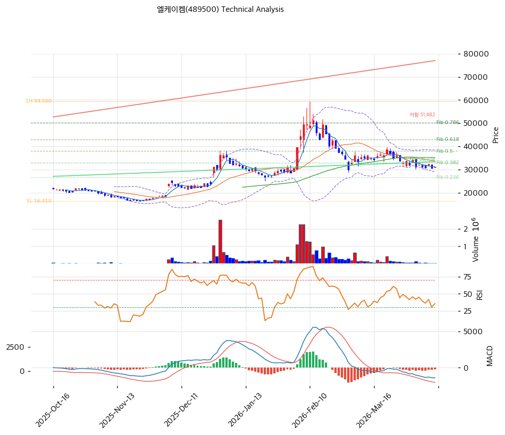

# 엘케이켐(489500) 기술적 분석

2026-04-10 | T2 Technical Analysis

---

## 차트

---

## 1. 가격 현황

| 항목 | 값 |
|------|-----|
| 현재가 | 31,050원 (+1.97%) |
| 52주 고가 | 59,500원 |
| 52주 저가 | 16,410원 |
| 52주 범위 위치 | 41.9% |
| 거래량 | 20일 평균 대비 0.38x |

---

## 2. 차트 패턴 분석

### 2.1 캔들스틱 패턴

| 패턴 | 위치 | 신뢰도 | 해석 |
|------|------|--------|------|
| 소형 양봉 연속 | 최근 2~3일 | 약 | 과매도 구간에서의 단기 반등 시도; 거래량 동반 미확인으로 신뢰도 낮음 |
| 도지/팽이형 | 직전 1~2주 | 약 | 매도세 소진 신호이나 추세 전환 확정 신호는 아님; 추가 확인 필요 |

※ 상장 후 6개월 내외 단기 가격 데이터로 장기 패턴 신뢰도 제한적

### 2.2 가격 구조 패턴

- **하락 후 박스권 형성** (신뢰도: 중)
  52주 고가 59,500원(고점)에서 저가 16,410원까지 급락한 후, 현재 30,000~32,000원대에서 박스권을 형성 중이다. IPO 공모가(21,000원) 상단에서 지지받으며 저점을 높여가는 구조이나, 하락 추세선(피보나치 0.382 되돌림 32,870원)을 아직 돌파하지 못한 상태다.

- **상승 추세선 상방 이탈 시도** (신뢰도: 약)
  장기 상승 추세선(현재 교차가 26,724원)은 저점을 연결하는 지지선으로 작동 중이다. 현재가(31,050원)는 이 추세선 위에 위치해 기술적으로 지지 구조는 유지되고 있으나, 단기 하락 압력(MA20·MA60 하방 위치)과 공존한다.

### 2.3 다이버전스

- **스토캐스틱 상승 다이버전스** (신뢰도: 중)
  스토캐스틱 K=13.5, D=13.2로 과매도 구간에서 골든크로스가 발생했다. 가격은 저점 수준인데 스토캐스틱이 반등을 시작하는 상승 다이버전스 구조로, 단기 반등 가능성을 시사한다.

- **MACD 하락 지속** (신뢰도: 중)
  MACD -1,401, Signal -1,147, Histogram -254(음수 유지)로 매도 구간이 지속 중이다. 히스토그램 확대세가 멈췄으나(hist_expanding: false) 아직 방향 전환 확정은 아님. RSI·스토캐스틱과 상충하는 시그널이다.

### 2.4 패턴 종합 판단

현재 차트는 단기 과매도 해소 시도(스토캐스틱 골든크로스, 도지형 캔들)와 중기 하락 추세 지속(MACD 매도 구간, MA20·MA60 하방) 사이에서 방향성이 불분명한 상황이다. 상승 추세선(26,724원) 위에서 지지를 받고 있어 하방 리스크는 제한적이나, 피보나치 0.382 되돌림(32,870원) 돌파 여부가 추세 전환의 핵심 확인 조건이다. 거래량이 평균 대비 0.38배에 불과해 방향성 확신이 낮고, 추가 거래량 동반이 반등의 신뢰도를 높이는 데 필수적이다.

---

## 3. 이동평균선 — 비정배열 (약세)

| MA | 값 | 현재가 괴리율 | 위치 |
|----|-----|--------------|------|
| MA5 | 31,160원 | -0.4% | 아래 |
| MA20 | 33,718원 | -7.9% | 아래 |
| MA60 | 35,138원 | -11.6% | 아래 |
| MA120 | 28,734원 | +8.1% | 위 |
| MA200 | 25,105원 | +23.7% | 위 |

**해석**: MA5~MA60은 현재가 상방에 위치해 단기~중기 이동평균 저항 구간을 형성한다. 반면 MA120·MA200은 현재가 하방에 위치해 중장기 지지선 역할을 한다. 전형적인 비정배열 구간으로, 단기 추세가 약세이나 장기 우상향 구조는 훼손되지 않았다. MA20(33,718원)이 1차 저항선이며 이를 돌파해야 정배열 전환 시도가 가능하다.

---

## 4. 보조 지표

### RSI(14) — 43.6 (중립)

RSI 43.6은 과매도 기준(30)을 상회하는 중립 구간으로, 추세적 하락 에너지는 약화됐으나 반등 모멘텀 형성도 미확정인 상태다.

### MACD(12,26,9)

| 항목 | 값 |
|------|-----|
| MACD | -1,401 |
| Signal | -1,147 |
| Histogram | -254 |
| 크로스 상태 | 매도 구간 (수축 중) |

**해석**: MACD가 Signal 하방에서 매도 구간을 유지 중이나, 히스토그램 절대값이 감소(수축) 방향이어서 하락 모멘텀이 둔화되고 있음을 시사한다. 골든크로스 발생 여부가 추세 전환 확인의 핵심 신호다.

### 볼린저밴드(20, 2σ)

| 항목 | 값 |
|------|-----|
| 상단 | 38,444원 |
| 중단 (MA20) | 33,718원 |
| 하단 | 28,991원 |
| 밴드 폭 | 28.0% |
| 현재 위치 | 중간 |

**해석**: 현재가(31,050원)는 밴드 하단(28,991원)과 중단(33,718원) 사이 중간 구간에 위치한다. 밴드 폭 28%는 비교적 넓은 상태로 변동성이 높은 구간임을 나타낸다. 하단 이탈은 발생하지 않아 극단적 과매도 상황은 아니다.

### 스토캐스틱(14, 3, 3)

| 항목 | 값 |
|------|-----|
| Slow %K | 13.5 |
| Slow %D | 13.2 |
| 크로스 상태 | 골든크로스 |
| 판단 | 과매도 |

---

## 5. 지지/저항 — 추세선 · 피보나치 · PRZ 통합

### 5.1 피보나치 되돌림/확장

| 구분 | 비율 | 가격 | 현재가 대비 |
|------|------|------|-----------|
| Swing High | — | 59,500원 | — |
| 되돌림 | 0.236 | 26,579원 | -14.4% |
| 되돌림 | 0.382 | 32,870원 | +5.9% |
| 되돌림 | 0.5 | 37,955원 | +22.2% |
| 되돌림 | 0.618 | 43,040원 | +38.6% |
| 되돌림 | 0.786 | 50,279원 | +61.9% |
| Swing Low | — | 16,410원 | — |
| 확장 | 1.272 | 4,690원 | -84.9% |
| 확장 | 1.382 | -50원 | — |
| 확장 | 1.618 | -10,220원 | — |
| 확장 | 2.0 | -26,680원 | — |

※ 피보나치 기준: 하락 추세 (Swing High 59,500원 → Swing Low 16,410원) 기준 되돌림
※ 되돌림 = 하락 추세에서 반등이 되돌아온 비율; 확장은 추가 하락 시 목표가 (현재 가격대 이하로 의미 제한적)

### 5.2 추세선

| 추세선 | 방향 | 현재 교차가 | 포인트 수 | 해석 |
|--------|------|-----------|---------|------|
| 지지선 | 상승 | 26,724원 | 6개 | 상장 이후 저점을 연결한 장기 상승 지지선; 현재가 대비 -13.9% 하방에 위치해 유효 지지 |
| 저항선 | 상승 | 51,482원 | 6개 | 고점을 연결한 상승 저항선; 현재가 대비 +65.8% 상방으로 단기 저항 의미 낮음 |

### 5.3 PRZ (Potential Reversal Zone)

| 방향 | 가격 범위 | 신뢰도 | 근거 |
|------|---------|--------|------|
| 저항 | 30,317~31,717원 | 강 | 피봇 S2(30,317) + 피봇 S1(30,683) + MA5(31,160) + 피봇 R1(31,383) + 피봇 R2(31,717) 5개 지표 밀집 |
| 지지 | 26,579~26,724원 | 약 | 피보나치 0.236 되돌림(26,579) + 추세선 지지(26,724) 2개 지표 겹침 |

※ 현재가(31,050원)가 강 PRZ(30,317~31,717원) 한가운데에 위치 — 단기 방향성 결정 구간

### 5.4 종합 지지/저항 테이블

| 구분 | 가격 | 근거 |
|------|------|------|
| 저항 | 59,500원 | 52주 고가 / Swing High |
| 저항 | 51,482원 | 추세선 저항 (상승, 6포인트) |
| 저항 | 50,279원 | 피보나치 0.786 되돌림 |
| 저항 | 43,040원 | 피보나치 0.618 되돌림 |
| 저항 | 37,955원 | 피보나치 0.5 되돌림 |
| 저항 | 35,138원 | MA60 |
| 저항 | 33,718원 | MA20 / 볼린저 중단 |
| 저항 | 32,870원 | 피보나치 0.382 되돌림 (1차 돌파 목표) |
| 저항 | 31,383~31,717원 | PRZ 강 상단 (피봇 R1·R2) |
| **현재가** | **31,050원** | — |
| 지지 | 30,683~30,317원 | PRZ 강 하단 (피봇 S1·S2) |
| 지지 | 28,991원 | 볼린저 하단 |
| 지지 | 28,734원 | MA120 |
| 지지 | 26,579~26,724원 | PRZ 약 — 피보나치 0.236 되돌림 + 추세선 지지 |
| 지지 | 25,105원 | MA200 |
| 지지 | 16,410원 | 52주 저가 / Swing Low |

---

## 6. 시그널 종합

| 지표 | 내용 | 시그널 |
|------|------|--------|
| **차트 패턴** | 비정배열 박스권; 추세선 지지 위 / 피보 0.382 미돌파 | ⚪ |
| 이동평균선 | 비정배열 — MA5~MA60 하방, MA120·200 상방 | 🔴 |
| RSI | 43.6 — 중립 (과매도 아님) | ⚪ |
| MACD | 매도 구간, 히스토그램 -254 (수축 중) | 🔴 |
| 볼린저밴드 | 중간 위치, 밴드폭 28% (변동성 유지) | ⚪ |
| 스토캐스틱 | 골든크로스, K=13.5 (과매도 반등 신호) | 🟢 |
| 거래량 | 0.38x — 극히 약함 | ⚪ |

**종합 판단**: 🟢 매수 1개 / 🔴 매도 2개 / ⚪ 중립 4개 → **매도우위 (중립 근접)**

현재 차트는 단기 과매도 구간에서의 기술적 반등 가능성(스토캐스틱 골든크로스)과 중기 하락 추세 잔존(MACD 매도, 비정배열) 사이의 교착 상태에 있다. 현재가가 강 PRZ(30,317~31,717원) 내에 위치해 방향성이 불분명하며, 피보나치 0.382 되돌림(32,870원) 돌파와 거래량 증가를 동반해야 추세 전환 신호로 볼 수 있다. 단기적으로는 26,579~26,724원 지지 구간까지의 하방 테스트 가능성을 염두에 두어야 한다.

---

## 7. 전략 제안

### 보유 중인 경우

- **홀드 (조건부)**
- 익절 라인: 32,870원 (피보나치 0.382 되돌림 돌파 확인 시) → 37,955원 (0.5 되돌림)
- 손절 라인: 30,317원 (PRZ 강 하단 / 피봇 S2 이탈 시)
- 리스크/리워드: 손절 -2.4% vs 1차 익절 +5.9% → R/R 약 1:2.5

### 진입 대기인 경우

- **관망 후 조건부 진입**
- 1차 진입가: 30,683원 (피봇 S1 — PRZ 강 하단 지지 확인 시)
- 2차 진입가: 26,652원 (PRZ 약 — 피보나치 0.236 + 추세선 지지 겹침 구간)
- 진입 조건: ① 스토캐스틱 골든크로스 유지 + 거래량 20일 평균 0.7배 이상 동반 반등, 또는 ② 32,870원 돌파 후 눌림목 확인 시 추격 매수
